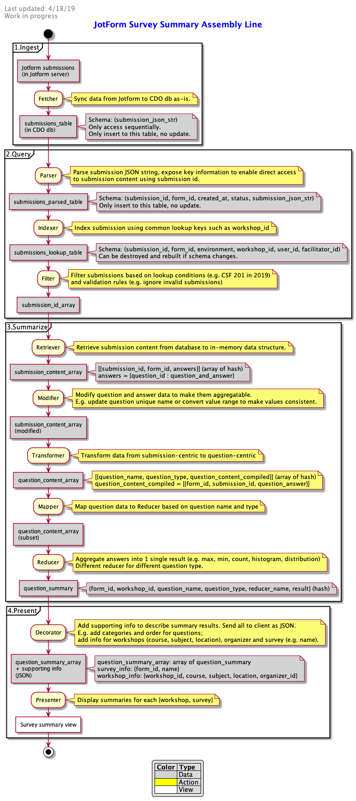

**Technical Design Proposal: Survey Summary Pipeline**

April 18, 2019

- [Summary](#summary)
- [Problem](#problem)
- [Motivation](#motivation)
- [Options](#options)
  - [1. Update current pipeline to support 2019 surveys](#1-update-current-pipeline-to-support-2019-surveys)
  - [2. Create survey report in JotForm](#2-create-survey-report-in-jotform)
  - [3. Build generic survey pipeline](#3-build-generic-survey-pipeline)
    - [Overview](#overview)
    - [Detail design](#detail-design)
    - [Building from the end](#building-from-the-end)
- [Recommendation](#recommendation)
  - [Rollout plan](#rollout-plan)
  - [5 components to build for 2019 surveys](#5-components-to-build-for-2019-surveys)

# Summary
This technical design doc explores 3 options we have to create and present summaries of JotForm surveys in workshop dashboard. Its purpose is to gather feedbacks from the team to decide what is the best option to invest in right now.

This design is not about embedding JotForm survey in our site or preparing survey data for analysis in Tableau.

# Problem
Currently it takes quite a lot of work to create and present summary for a new survey in our workshop dashboard.

The reason is that components in the processing pipeline are tightly coupled together. The current data models, controller actions, helpers and views are built for a few specific type of workshop surveys such as local-summer-workshop and post-course surveys. Adding support for a new survey means creating new model, controller, view, and a lot of tests.

In the case of new CSF Deep Dive surveys (pre and post-workshop), we try to reuse data model and UI view from local summer workshop, which already has pre-workshop, daily and post-workshop surveys. However, we cannot directly reuse the logic to create survey summary because of its tight coupling to context of summer workshop. We have 2 approaches to solve this which are discussed in Option 1 below. Both approaches are not cheap and not sustainable if we want to support more JotForm surveys in the future.

# Motivation
- How to reduce the engineering cost to support 100+ JotForm workshop surveys? (Right now I think we have about 5 to 10.)
- Can we build a generic pipeline to ingest survey submissions, summarize them, and present the result in workshop dashboard for any survey?
- How much of the current pipeline will still be relevant if we decide to switch to a different survey platform (Qualtrics, SurveyMonkey etc.) in the future?

# Options
We have 3 following options to create and present JotForm survey summaries in workshop dashboard.\
Specifically, we need to support at least 3 new surveys in 2019, CSF Deep Dive pre & post workshop surveys and CSF Intro survey.

## 1. Update current pipeline to support 2019 surveys
We will reuse the current pipeline as much as possible to support 3 new CSF surveys in 2019.

This option is based on `local_workshop_daily_survey_report` pipeline. We reuse its data model `WorkshopDailySurvey` and UI view `local_summer_workshop_daily_survey/results.jsx`. We will modify its logic in to retrieve and summarize survey results, which is currently tightly coupled to summer workshop context. This logic lives in `WorkshopSurveyReportController` and `WorkshopSurveyResultsHelper`.

2 approaches:
- Modify this logic to make it more generic with the risk of introducing regression (the code is complex).
- Create a new path separate from the existing one, which means adding substantial duplicated code.

**Pros:** Risk is small (if creating a new path). Amount of new code could is not small but manageable. We do just enough to support 3 new surveys in 2019.

**Cons:** Not scalable when we have more surveys. Could become thrown-away work if we decide to move to generic pipeline later.

**Cost Estimate:** 5 ± 1 days.

## 2. Create survey report in JotForm
JotForm support creating [Visual Report](https://www.jotform.com/help/187-How-to-Create-a-Visual-Report-with-Your-Form-Submissions) ([example](https://www.jotform.com/report/91067837377065)). We can then embed this report as an iframe into workshop dashboard. Authentication and authorization before showing report will be handled by our side.

**Pros:** The cheapest option in term of engineering cost to enable. Survey owners can create report themselves. Report is automatically updated (don't need to download data locally and upload to Tableau).

**Cons:** Can only do basic calculation and visualization (not the same level as Tableau or PowerBI). User can not interact with the report. Cannot pass parameter to personalize the report.

**Cost Estimate:** 3 ± 1 days.

## 3. Build generic survey pipeline
### Overview
Creating a generic pipeline that starts from ingesting survey data, making data searchable, summarizing data, to presenting result in our site.\
Key features of the new pipeline is the decoupling of code from specific survey or workshop context, and modular design that allows more flexibility to adapt to future requirements.

**Pros:** Minimize work to support new survey. Open for extensions, flexible to change such as adding/removing/updating components because of modular design. Enable new scenarios such as A/B testing in Survey.

**Cons:** Expensive. (This could be mitigated by building the pipeline from the end first as discussed below.)

**Cost Estimate:** 3-4 weeks for the complete pipeline. 7 ± 2 days to implement step 3 (Summarize) and the first component of step 4 (Present) first, enough to support CSF 2019 surveys.

### Detail design
The pipeline has 4 main actions
1. Ingest: Download data from JotForm server to CDO database.
2. Query: Find survey data that matches lookup conditions.
3. Summarize: Aggregate survey data.
4. Present: Display survey summaries in dashboard.

Some patterns this design follows
- _Open-Closed Principle_\
  The pipeline is open for extension such as adding new components or adding different implementation of a component. However, it avoids, as best as it could, modifying existing code which could introduce regression. Following Single Responsibility principle will help with this.
- _Single Responsibility Principle_\
  Each method, class, module should have only 1 clear purpose. In a stronger statement, each should have only one reason to change.
- _Dependency Inversion Principle_\
  High-level modules (complex logic) should not depend on low-level modules (primary operations). Both should depend on abstractions. This allows high-level modules to easily switch to different low-level modules implementation.
- _Template Method Pattern_\
  Define the skeleton of an algorithm, deferring some steps to other components. E.g. Query module (step 2) could use different implementations of Parser, Indexer and Filter depends on how data is stored in database. The specific implementations of those child components will be send to Query component as input parameters (dependency injection). Strategy pattern enables switching among implementations of the same component.
- _Strategy Pattern_\
  Define an interface common to a family of algorithms, e.g. survey result reducers, and make them interchangeable. This lets the algorithm vary independently from clients that use it.

### Building from the end
We don't have to start from step 1 (Ingest), we can start from step 3 (Summarize) and create adapters to connect it to the current pipeline.

Specifically for CSF survey work, we will create an input adapter to retrieve survey data from the current data model, and an output adapter to convert summary result to format that the current UI view understands. Looking at it from a different angle, these adapters are just concrete implementations of Retriever and Decorator.

# Recommendation
Option 3. Build a new generic survey pipeline, starting from step 3 (Summarize module) first and create adapters to plug it in the current pipeline. This approach allows us to support 2019 CSF survey sooner by taking advantage of the existing work. Then, gradually build out the rest of the pipeline later.

## Rollout plan
1. Build 5 components just enough to support 2019 surveys: Retriever (for current db), Transformer, Mapper, Reducer and Decorator (for current UI view). They are components in step 3 and 4 of the above diagram.
2. Build Fetcher (step 1) to download survey submissions from JotForm to our database.
3. Build Parser, Indexer and Filter (step 4) to allow quick submission search.
4. Build another implementation of Retriever (in step 3) which will read from the new db created in step 2 & 3.
5. Build Presenter (in step 4) that can display result from a single query (e.g. summary results of 1 JotForm survey of a specific workshop)
6. Build Decorator (in step 4) to provide enough information for the Presenter built in step 5.
7. Switch 2019 surveys to use the new pipeline. It should then be completely independent from the older pipeline.
8. All new surveys will use the new pipeline form this point forward.
9. Migrate surveys using older pipeline to newer one when we think it's worth to do so.

## 5 components to build for 2019 surveys

1. Retriever
  - Retrieve survey data from existing tables (`SurveyQuestion, WorkshopDailySurvey`) and convert data to `submission_content_array` format.
  - Estimate: TBA
2. Transformer
  - Convert survey data from submission centric to question centric. At high level: {submission_id, submission_data} --> {question_name, question_and_answer_data}.
  - Estimate: TBA
3. Mapper
  - Go through question data, send it to suited Reducer based on question name and type. E.g. text -> text collector, number -> histogram/count/avg reducers.
  - Estimate: TBA
4. Reducer(s)
  - Produce a summary result from list of input question data. E.g. text collector, histogram, avg, count, distribution reducers.
  - Estimate: TBA
5. Decorator
  - Compile minimum information needed for the current UI view (`local_summer_workshop_daily_survey/results.jsx`) to display summary results.
  - Estimate: TBA

Note, we skip Modifier component because it's an optional feature.