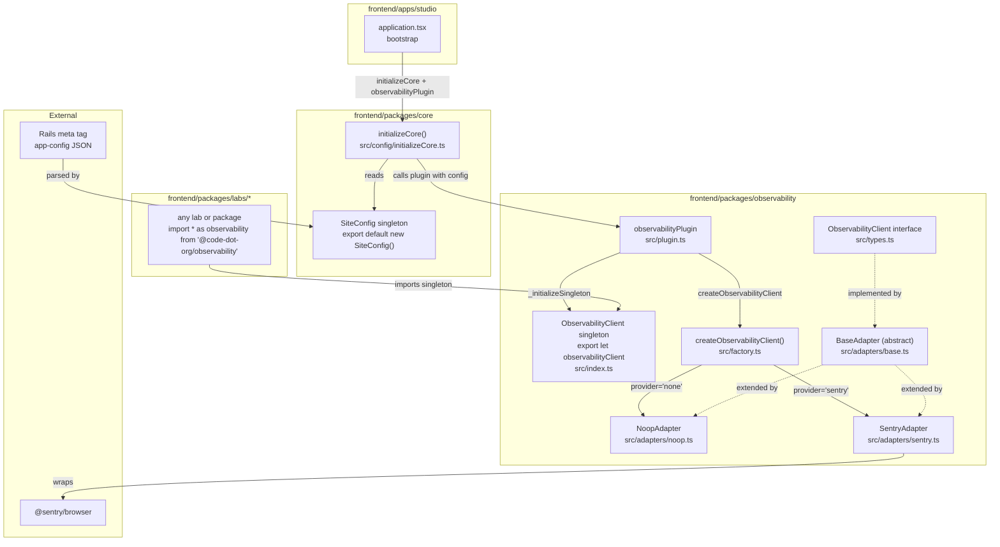

# Design Document: Frontend Observability

## Overview

This document describes the design for `@code-dot-org/observability`, a new shared package that provides a provider-agnostic frontend observability abstraction for the code.org monorepo.

The package exposes a single `ObservabilityClient` interface and a `createObservabilityClient` factory. Host applications call the factory at bootstrap time, passing a provider identifier and configuration sourced from the Rails-injected `<meta name="app-config">` tag. When no provider is configured the factory returns a no-op adapter that satisfies the interface and makes no external calls.

The initial implementation ships one real provider adapter — Sentry — and the no-op adapter. All sessions are anonymous by default; user-session linkage requires an explicit `setConsented(userId)` call.

### Key Design Goals

- **Privacy by default**: no PII or user identifiers are transmitted without explicit consent.
- **Tree-shakeable**: each provider adapter is a separate package entry point so only the selected provider's SDK ends up in the host bundle.
- **Zero-config safe**: importing the package without calling the factory has no side effects.
- **Extensible**: adding a new provider requires only a new adapter module and a new entry point; existing host applications need no changes beyond passing the new provider identifier.

---

## Architecture



### Module-Level API Pattern

The observability client singleton lives entirely within `@code-dot-org/observability` — core has no knowledge of it. The package exposes a module-level API that mirrors the `ObservabilityClient` interface, following the same pattern as `import * as Sentry from '@sentry/browser'`.

The singleton is a module-level variable (`observabilityClient`) that starts as a `NoopAdapter` and is reassigned by `_initializeSingleton` when the plugin initializes. Rather than exposing the singleton directly as a default export (which would be a stale snapshot), the package exports stable delegating functions and objects that always forward to the current singleton:

```ts
// packages/observability/src/index.ts
import {NoopAdapter} from './adapters/noop';

// Module-level singleton — starts as no-op, reassigned by _initializeSingleton
export let observabilityClient: ObservabilityClient = new NoopAdapter();

/** @internal — called only by observabilityPlugin */
export function _initializeSingleton(client: ObservabilityClient): void {
  observabilityClient = client;
}

// Module-level delegating API — always forwards to the live singleton
export function recordError(
  error: unknown,
  context?: Record<string, unknown>,
): void {
  observabilityClient.recordError(error, context);
}

export const logger: ObservabilityLogger = {
  info: (message, attributes) =>
    observabilityClient.logger.info(message, attributes),
  // ... other levels
};

export const metrics: ObservabilityMetrics = {
  count: (name, value, attributes) =>
    observabilityClient.metrics.count(name, value, attributes),
  // ... other instruments
};
// ... init, setConsented, isConsented, shutdown
```

Consumers use the namespace import pattern — identical to how `@sentry/browser` is used:

```ts
import * as observability from '@code-dot-org/observability';
observability.logger.info('User loaded level', {lab: 'music'});
observability.recordError(err, {lab: 'music'});
observability.metrics.count('music_lab.notes_played');
```

The `logger` and `metrics` objects are stable references (created once at module load) whose methods close over `observabilityClient`. When `_initializeSingleton` replaces the singleton, all subsequent calls through `observability.logger.*` and `observability.metrics.*` automatically reach the new adapter — no proxy class, no stale snapshot.

The named `observabilityClient` export is also available for consumers that need to pass the full client object:

```ts
import {observabilityClient} from '@code-dot-org/observability';
```

### Plugin Pattern

`@code-dot-org/core` knows nothing about observability. Instead, `@code-dot-org/observability` exports an `observabilityPlugin` — a plain object that conforms to a `CorePlugin` interface defined in `@code-dot-org/core`. The host app passes it to `initializeCore()`:

```ts
// packages/core/src/config/initializeCore.ts
export interface CorePlugin {
  /** Called by initializeCore with the full SiteConfig after core is ready */
  onCoreReady(config: SiteConfig): void;
}

export function initializeCore(plugins: CorePlugin[] = []): void {
  if (!window.__CODE_STUDIO__) {
    window.__CODE_STUDIO__ = CodeStudioConfig;
  }
  for (const plugin of plugins) {
    plugin.onCoreReady(CodeStudioConfig);
  }
}
```

```ts
// packages/observability/src/plugin.ts
export const observabilityPlugin: CorePlugin = {
  onCoreReady(config) {
    const obs = config.observability;
    if (obs.provider === 'none') return;
    const client = createObservabilityClient(obs.provider, obs);
    client.init(obs);
    _initializeSingleton(client);
  },
};
```

Studio bootstrap:

```ts
// apps/studio/entrypoints/application.tsx
import {initializeCore} from '@code-dot-org/core';
import {observabilityPlugin} from '@code-dot-org/observability/plugin';

initializeCore([observabilityPlugin]);
// ... mount React app
```

Apps that don't depend on `@code-dot-org/observability` simply call `initializeCore()` with no plugins — the observability package is never bundled.

### `initializeCore` (replaces `initializeCodeStudioConfig`)

`initializeCore` is the single bootstrap function for `@code-dot-org/core`. It registers `SiteConfig` on `window` and calls `onCoreReady` on each supplied plugin. The old `initializeCodeStudioConfig` is retained as a deprecated re-export alias for backward compatibility.

### Entry Points

`@code-dot-org/observability` exposes four entry points:

| Export path                          | Contents                                                                                                                                                                                                                             |
| ------------------------------------ | ------------------------------------------------------------------------------------------------------------------------------------------------------------------------------------------------------------------------------------ |
| `@code-dot-org/observability`        | `observabilityClient` singleton, module-level `logger`/`metrics`/`recordError`/`init`/`setConsented`/`isConsented`/`shutdown` functions, `ObservabilityClient` type, `ObservabilityConfig` type, `createObservabilityClient` factory |
| `@code-dot-org/observability/plugin` | `observabilityPlugin` — the `CorePlugin` implementation for use with `initializeCore`                                                                                                                                                |
| `@code-dot-org/observability/sentry` | `SentryAdapter` (imports `@sentry/browser`)                                                                                                                                                                                          |
| `@code-dot-org/observability/noop`   | `NoopAdapter`                                                                                                                                                                                                                        |

The factory dynamically imports the adapter module at runtime so the provider SDK is only loaded when actually selected.

---

## Components and Interfaces

### `ObservabilityClient` Interface

```typescript
/** Structured log attributes — searchable key-value pairs. */
type LogAttributes = Record<string, unknown>;

/** OTel-aligned logger with six severity levels. */
interface ObservabilityLogger {
  trace(message: string, attributes?: LogAttributes): void;
  debug(message: string, attributes?: LogAttributes): void;
  info(message: string, attributes?: LogAttributes): void;
  warn(message: string, attributes?: LogAttributes): void;
  error(message: string, attributes?: LogAttributes): void;
  fatal(message: string, attributes?: LogAttributes): void;
}

/** OTel-aligned metric instrument types. */
interface ObservabilityMetrics {
  /** Monotonic counter — events, clicks, API calls. value defaults to 1. */
  count(name: string, value?: number, attributes?: LogAttributes): void;
  /** Current-value gauge — queue depth, active connections. */
  gauge(name: string, value: number, attributes?: LogAttributes): void;
  /** Value distribution — response times, payload sizes. */
  distribution(name: string, value: number, attributes?: LogAttributes): void;
}

export interface ObservabilityClient {
  /**
   * Initialize the provider SDK. Must be called before any other method.
   * Safe to call in SSR environments — guards on typeof window.
   */
  init(config: ObservabilityConfig): void;

  /**
   * Record an error with optional context metadata.
   * Never throws — SDK errors are caught and logged as console warnings.
   */
  recordError(error: unknown, context?: Record<string, unknown>): void;

  /**
   * Structured, leveled logger aligned with OTel severity levels and Sentry's logger namespace.
   * Delegates directly to the provider SDK — sampling is resolved once at init time via enableLogs.
   * No-op when logSampleRate is 0 or the session is not sampled.
   */
  logger: ObservabilityLogger;

  /**
   * OTel-aligned metrics instruments (counter, gauge, distribution).
   * Delegates directly to the provider SDK — sampling is resolved once at init time via enableMetrics.
   * No-op when metricsSampleRate is 0 or the session is not sampled.
   */
  metrics: ObservabilityMetrics;

  /**
   * Associate the current session with a user ID (requires explicit consent).
   * If called before init(), the association is queued and applied on init.
   * Passing null or empty string removes any existing user association.
   */
  setConsented(userId: string | null): void;

  /**
   * Returns true if a user ID is currently associated with the session.
   */
  isConsented(): boolean;

  /**
   * Tear down the provider SDK and flush any pending events.
   */
  shutdown(): Promise<void>;
}
```

### `ObservabilityConfig` Type

```typescript
export interface SamplingConfig {
  /** Fraction of errors sent to the provider. Range [0, 1]. Default: 1.0 */
  errorSampleRate?: number;
  /** Fraction of traces/spans sent to the provider. Range [0, 1]. Default: 0 (disabled) */
  tracesSampleRate?: number;
  /** Fraction of log events sent to the provider. Range [0, 1]. Default: 0 (disabled) */
  logSampleRate?: number;
  /** Fraction of metric events sent to the provider. Range [0, 1]. Default: 0 (disabled) */
  metricsSampleRate?: number;
}
```

#### Session ID-Based Sampling for Logs and Metrics

`logSampleRate` and `metricsSampleRate` use **session ID hashing** rather than per-event random sampling. This guarantees that all log and metric events within a session are either all included or all excluded — preventing partial session data that would be difficult to interpret. It also supports anonymous users since no user ID or consent is required.

**Why consent is not required:** The session ID is used purely as a local sampling key — a deterministic input to a hash function that produces an include/exclude decision entirely within the client. The session ID is never transmitted to the provider. The log and metric events that are emitted as a result of this decision contain no personally identifiable information; they are anonymous telemetry data. Consent governs whether a user's identity is _linked_ to a session in the provider (via `setConsented`), which is a separate concern from whether anonymous telemetry is collected at all.

**Observability-owned session ID:** The sampling key is a UUID generated and owned by the observability package itself, stored in `sessionStorage` under the key `__cdo_observability_session_id__`. On `init`, the adapter attempts to read this value from `sessionStorage`. If absent, it generates a new UUID via the `uuid` npm package (`v4`), writes it to `sessionStorage`, then uses it. Using `sessionStorage` means the ID is scoped to the browser tab and survives page refreshes within the session, but is discarded when the tab is closed. This avoids any dependency on Rails session IDs (which would introduce a security risk by exposing server-side session identifiers to frontend code) or Sentry's internal session tracking.

If `sessionStorage` throws at any point (e.g. private browsing restrictions, storage quota exceeded), the adapter logs a single `console.warn` and sets a `sessionStorageUnavailable` flag in `AdapterState`. All subsequent sampling decisions that require the session ID short-circuit immediately and return `false` (not sampled), without attempting `sessionStorage` again.

The algorithm:

1. On `init`, read or generate the observability session ID from `sessionStorage`.
2. Hash the session ID to a float in `[0, 1)` using a deterministic, uniformly-distributed hash function (e.g. FNV-1a).
3. Include the session if `hash(sessionId) < sampleRate`.

Because the hash is deterministic, the same session always produces the same inclusion decision. Because it is uniformly distributed, the full `[0, 1]` float range is meaningful — a rate of `0.00001` (0.001%) will include approximately 1 in 100,000 sessions.

If `sessionStorage` throws at any point, the adapter logs a single `console.warn` and sets a `sessionStorageUnavailable` flag — all subsequent sampling decisions short-circuit to `false` without retrying `sessionStorage`.

export interface ObservabilityConfig {
/** Provider identifier. Defaults to 'none'. \*/
provider: 'sentry' | 'none';
/** Sentry-specific configuration. Required when provider is 'sentry'. _/
sentry?: {
dsn: string;
};
/\*\* Sampling rates. Provider SDK defaults apply when not set. _/
sampling?: SamplingConfig;
/\*\*

- URLs/patterns that should receive W3C traceparent headers.
- Defaults to same-origin only when not set.
  \*/
  tracePropagationTargets?: Array<string | RegExp>;
  }

````

### `createObservabilityClient` Factory

```typescript
export function createObservabilityClient(
  provider?: 'sentry' | 'none',
  config?: Omit<ObservabilityConfig, 'provider'>,
): ObservabilityClient;
````

- When `provider` is `undefined` or `'none'`, returns a `NoopAdapter` synchronously (no dynamic import needed).
- When `provider` is `'sentry'`, dynamically imports `@code-dot-org/observability/sentry` and returns a `SentryAdapter`.
- When `provider` is any other string, throws `new Error(\`Unsupported observability provider: "${provider}"\`)`.

Because the factory may need to return synchronously (before the dynamic import resolves), the adapter is constructed eagerly but `init()` defers the actual SDK initialization. The factory always returns a fully-constructed `ObservabilityClient` immediately.

### `BaseAdapter` (abstract)

All provider adapters extend `BaseAdapter`, which owns every concern that is provider-agnostic:

- **Consent queue** — `setConsented` called before `init` is stored as `pendingConsent` and applied automatically once `initProvider` succeeds.
- **`isConsented()`** — reflects the queued value before init and the applied value after.
- **Session ID state** — on `init`, calls `getOrCreateObservabilitySessionId()` from `src/sampling.ts`; stores the result and a `sessionStorageUnavailable` flag.
- **`isLogSampled(rate)` / `isMetricsSampled(rate)`** — delegate to `isSampled(sessionId, rate)`, short-circuiting to `false` when sessionStorage is unavailable.
- **`logger` default** — a no-op `ObservabilityLogger` object. Subclasses override this property after `initProvider` succeeds to provide a real implementation that gates each method on `isLogSampled(config.sampling?.logSampleRate)`.
- **`metrics` default** — a no-op `ObservabilityMetrics` object. Subclasses override this property after `initProvider` succeeds to provide a real implementation that gates each method on `isMetricsSampled(config.sampling?.metricsSampleRate)`.
- **`init(config)` lifecycle** — SSR guard (`typeof window === 'undefined'`), resolves session ID via `getOrCreateObservabilitySessionId()` _first_ (so `isLogSampled`/`isMetricsSampled` are available to `initProvider`), then calls abstract `initProvider(config)`, applies queued consent. Wraps everything in try/catch; on failure logs a warning and leaves `initialized = false` (no-op degradation). The `logger` and `metrics` properties are set directly by `initProvider` — no separate `initLogger`/`initMetrics` hooks needed.

Subclasses implement:

- `initProvider(config)` — provider-specific SDK initialization; must throw on failure. May call `isLogSampled()`/`isMetricsSampled()` to make sampling decisions before calling the provider SDK. **Preferred pattern**: if the provider SDK supports disabling log/metrics ingestion at init time (e.g. Sentry's `enableLogs`/`enableMetrics`), use that — it is more efficient than per-call gating. **Fallback pattern**: if the provider does not support SDK-level feature flags, gate each `logger.*`/`metrics.*` call on `isLogSampled()`/`isMetricsSampled()` at call time.
- `applyConsentToProvider(userId)` — called when consent is applied; default is a no-op.
- `recordError(error, context)` — provider-specific error capture.
- `shutdown()` — provider-specific teardown.

### `NoopAdapter`

Extends `BaseAdapter`. `initProvider` and `recordError` are empty. `shutdown()` returns `Promise.resolve()`. Because it inherits `BaseAdapter`, `isConsented()` correctly reflects any `setConsented` calls, and `isLogSampled()`/`isMetricsSampled()` work correctly. The `logger` and `metrics` objects remain the `BaseAdapter` no-op defaults — all methods are silent no-ops with no console output and no external calls.

### `SentryAdapter`

Extends `BaseAdapter`. Implements `initProvider`, `applyConsentToProvider`, `recordError`, and `shutdown`. Key behaviors:

- **`initProvider(config)`**: Called after the session ID is already resolved by `BaseAdapter.init`. Calls `Sentry.init()` with:
  - `dsn` from `config.sentry.dsn`
  - `environment: CodeStudioConfig.environment`
  - `sendDefaultPii: false` (anonymous mode)
  - `integrations: [Sentry.browserTracingIntegration(), ...consoleIntegration]` — `consoleLoggingIntegration({ levels: ['error'] })` is added only when log ingestion is enabled (Req 15.3, 15.4)
  - `sampleRate: config.sampling?.errorSampleRate ?? 1.0`
  - `tracesSampleRate: config.sampling?.tracesSampleRate ?? 0`
  - `enableLogs: this.isLogSampled(config.sampling?.logSampleRate)` — sampling decision made once at init using the already-resolved session ID; enables Sentry log ingestion for the entire session if sampled (Req 9.3)
  - `enableMetrics: this.isMetricsSampled(config.sampling?.metricsSampleRate)` — sampling decision made once at init; enables Sentry metrics collection for the entire session if sampled (Req 10.3)
  - `tracePropagationTargets: config.tracePropagationTargets ?? [getAllowedTracingUrls()]`
  - After `Sentry.init`, sets `this.logger` to an object that delegates directly to `Sentry.logger.*` (no per-call sampling check needed — SDK handles it via `enableLogs`). Each method wraps in try/catch.
  - After `Sentry.init`, sets `this.metrics` to an object that delegates directly to `Sentry.metrics.*` (no per-call sampling check needed — SDK handles it via `enableMetrics`). Each method wraps in try/catch.
  - Must throw on failure (caught by `BaseAdapter.init`'s try/catch).
- **`applyConsentToProvider(userId)`**: Calls `Sentry.setUser(userId ? { id: userId } : null)`.
- **`recordError(error, context)`**: Calls `Sentry.captureException(error, { extra: context })`. Wrapped in try/catch; on failure logs a console warning.
- **`shutdown()`**: Calls `Sentry.close()`.
- **`getAllowedTracingUrls()`**: Returns environment-aware default tracing target — CDN regex for adhoc, dashboard API URL for all other environments.

### `SiteConfig` Update (`@code-dot-org/core`)

The existing `SiteConfig` uses `rumProvider: RumProvider` where `RumProvider = 'newrelic' | 'datadog' | 'sentry' | 'none'`. The requirements use `provider: 'sentry' | 'none'`.

#### Module Augmentation for Optional Typing

`SiteConfig` in `@code-dot-org/core` exposes an empty `SiteConfigExtensions` interface. The `observability` field is NOT present on `SiteConfig` by default — it only appears in TypeScript when `@code-dot-org/observability` (or its plugin) is imported, via module augmentation:

```ts
// packages/core/src/config/SiteConfig.ts

/**
 * Empty interface that plugins augment to extend SiteConfig's type.
 * Importing a plugin package causes its module augmentation to merge here.
 */
export interface SiteConfigExtensions {}

export class SiteConfig {
  // ... existing fields (host, brand, environment, dashboardApiUrl, appVersion)
  // observability is NOT declared here — it's added by SiteConfigExtensions augmentation

  constructor() {
    // reads meta tag and populates all fields including the observability slice
    // at runtime, the data is always parsed regardless of which plugins are loaded
  }
}
```

```ts
// packages/observability/src/plugin.ts

// Augment SiteConfig to expose the observability field when this package is imported
declare module '@code-dot-org/core' {
  interface SiteConfigExtensions {
    observability: ObservabilityConfig;
  }
}
```

The `SiteConfig` class uses `SiteConfigExtensions` via intersection to expose the augmented fields:

```ts
// The singleton export merges extensions into the type
export default new SiteConfig() as SiteConfig & SiteConfigExtensions;
```

This means:

- Without importing `@code-dot-org/observability`, `CodeStudioConfig.observability` is a **type error** — the field doesn't exist in TypeScript.
- After importing `@code-dot-org/observability/plugin`, `CodeStudioConfig.observability` is fully typed as `ObservabilityConfig`.
- At runtime, `SiteConfig` always parses the `observability` slice from the meta tag (it's just data, no SDK loaded), so the field is always present on the object — the augmentation is purely a type-level gate.

#### Other SiteConfig changes

1. Rename `rumProvider` → `provider` and narrow the type to `'sentry' | 'none'` within `ObservabilityConfig`.
2. Remove the `datadog` and `newRelic` fields (out of scope for this feature).
3. Update `RuntimeConfig.observability` to use the new shape.
4. Update the `SiteConfig` constructor to read `runtime.observability?.provider ?? 'none'`.

The existing `RumProvider`, `DatadogConfig`, and `NewRelicConfig` types can be retained for backward compatibility but should be marked `@deprecated`.

---

## Data Models

### Runtime Config (Rails → Browser)

Rails renders the `<meta name="app-config">` tag in `dashboard/app/views/app/index.html.haml`. The JSON content shape relevant to observability:

```json
{
  "appVersion": "abc123",
  "observability": {
    "provider": "sentry",
    "sentry": {"dsn": "https://..."},
    "sampling": {
      "errorSampleRate": 1.0,
      "tracesSampleRate": 0.1
    },
    "tracePropagationTargets": ["https://studio.code.org/api"]
  }
}
```

The DSN values are sourced from separate CDO config keys per frontend target:

- `CDO.dashboard_sentry_dsn` — Rails backend Sentry project
- `CDO.frontend_studio_sentry_dsn` — Code Studio (Vite) Sentry project
- `CDO.frontend_apps_sentry_dsn` — apps/ webpack bundle Sentry project

The Vite development `frontend/apps/studio/index.html` includes a stub meta tag with `{"observability":{"provider":"none"}}` so the app degrades gracefully without Rails.

When the tag is absent or `observability` is omitted, `SiteConfig` defaults `provider` to `'none'` and `createObservabilityClient` returns the no-op adapter.

### Shared Adapter State (`BaseAdapter`)

All provider adapters inherit state from `BaseAdapter`:

```typescript
// private to BaseAdapter — accessed only via protected methods
interface BaseAdapterState {
  initialized: boolean;
  consentedUserId: string | null | undefined; // undefined = never called
  pendingConsent: string | null | undefined; // queued before init
  sessionStorageUnavailable: boolean;
  observabilitySessionId: string | undefined;
}
```

`isConsented()` returns `consentedUserId !== null && consentedUserId !== undefined && consentedUserId !== ''` (or the pending value before init).

### Package File Layout

```
frontend/packages/observability/
├── src/
│   ├── index.ts              # main entry: singleton default export + factory + types
│   ├── plugin.ts             # observabilityPlugin (CorePlugin implementation)
│   ├── types.ts              # ObservabilityClient, ObservabilityConfig, SamplingConfig
│   ├── sampling.ts           # getOrCreateObservabilitySessionId, hashSessionId, isSampled
│   ├── adapters/
│   │   ├── base.ts           # BaseAdapter (abstract) — consent queue, session ID, sampling gates
│   │   ├── noop.ts           # NoopAdapter extends BaseAdapter
│   │   └── sentry.ts         # SentryAdapter extends BaseAdapter
│   └── __tests__/
│       ├── factory.test.ts
│       ├── noop.test.ts
│       ├── plugin.test.ts
│       ├── sampling.test.ts
│       └── sentry.test.ts
├── package.json
├── vite.config.ts
├── tsconfig.json
├── eslint.config.mjs
├── vitest.config.ts
├── README.md
└── CONTRIBUTING.md
```

Changes to `@code-dot-org/core`:

```
frontend/packages/core/src/
└── config/
    ├── initializeCore.ts             # NEW — replaces initializeCodeStudioConfig; accepts CorePlugin[]
    ├── initializeCodeStudioConfig.ts  # kept as deprecated re-export alias
    └── SiteConfig.ts                 # updated: rumProvider → provider: 'sentry' | 'none'
```

Note: the `observability/` directory previously proposed inside `@code-dot-org/core` is removed — the singleton now lives in `@code-dot-org/observability` itself. The `./observability` entry point on `@code-dot-org/core` is no longer needed.

New entry points added to `@code-dot-org/observability`'s `package.json` exports:

```json
".": { "types": "./dist/index.d.ts", "import": "./dist/index.mjs", "require": "./dist/index.cjs" },
"./plugin": { "types": "./dist/plugin.d.ts", "import": "./dist/plugin.mjs", "require": "./dist/plugin.cjs" },
"./sentry": { "types": "./dist/adapters/sentry.d.ts", "import": "./dist/adapters/sentry.mjs", "require": "./dist/adapters/sentry.cjs" },
"./noop": { "types": "./dist/adapters/noop.d.ts", "import": "./dist/adapters/noop.mjs", "require": "./dist/adapters/noop.cjs" }
```

---

## Correctness Properties

_A property is a characteristic or behavior that should hold true across all valid executions of a system — essentially, a formal statement about what the system should do. Properties serve as the bridge between human-readable specifications and machine-verifiable correctness guarantees._

### Property 1: Factory returns a valid client for all valid providers and configs

_For any_ valid provider identifier (`'sentry'` or `'none'`) and any valid `ObservabilityConfig` (including configs with arbitrary `sampling` and `tracePropagationTargets` values), `createObservabilityClient` SHALL return an object that implements the `ObservabilityClient` interface — i.e., has callable `init`, `recordError`, `logger` (with `trace`/`debug`/`info`/`warn`/`error`/`fatal`), `metrics` (with `count`/`gauge`/`distribution`), `setConsented`, `isConsented`, and `shutdown` methods.

**Validates: Requirements 2.1, 8.1, 9.1, 13.1, 14.1**

### Property 2: Unrecognized provider throws a descriptive error

_For any_ string value that is not `'sentry'` or `'none'`, calling `createObservabilityClient` with that value SHALL throw an `Error` whose message contains the unrecognized value.

**Validates: Requirements 2.3**

### Property 3: recordError forwards errors to the provider

_For any_ error value and optional context object, calling `recordError(error, context)` on an initialized `SentryAdapter` SHALL result in the underlying Sentry SDK receiving that error and context. The method SHALL NOT throw regardless of the error value passed.

**Validates: Requirements 3.1**

### Property 4: Provider SDK errors during recordError are swallowed

_For any_ error thrown by the provider SDK during `captureException`, calling `recordError` on the adapter SHALL NOT propagate the exception to the caller. The adapter SHALL log a console warning and continue operating normally.

**Validates: Requirements 3.4**

### Property 5: Consent round-trip — setConsented/isConsented accurately reflect state

_For any_ sequence of `setConsented` and `init` calls: (a) `isConsented()` returns `true` if and only if `setConsented` was called with a non-null, non-empty string; (b) calling `setConsented(null)` or `setConsented('')` after a prior consent call causes `isConsented()` to return `false`; (c) calling `setConsented` before `init` queues the association and `isConsented()` reflects the queued value correctly after `init` completes.

**Validates: Requirements 4.3, 5.1, 5.2 (edge-case), 5.4, 5.5**

### Property 6: Config values are passed through to the provider SDK unchanged

_When_ `tracePropagationTargets` is explicitly provided in the config, along with any valid `sampling.errorSampleRate` and `sampling.tracesSampleRate` values, the `SentryAdapter` SHALL pass those exact values to `Sentry.init` without modification. The adapter SHALL NOT apply its own sampling logic on top of the SDK's. When `tracePropagationTargets` is not provided, the adapter uses the environment-derived default from `getAllowedTracingUrls()` rather than passing through the config value.

**Validates: Requirements 8.4, 9.2**

### Property 7: No-op adapter accepts any config and performs no external calls

_For any_ `ObservabilityConfig` (including arbitrary `sampling` and `tracePropagationTargets` values), the `NoopAdapter` SHALL accept the config without throwing, and calling any method on it SHALL produce no observable side effects (no network calls, no console output, no global state mutations). Note: `isConsented()` and `isLogSampled()`/`isMetricsSampled()` correctly reflect internal state inherited from `BaseAdapter` — this is intentional, not a side effect.

**Validates: Requirements 2.2, 8.6, 9.6**

### Property 8: Init failure falls back gracefully without propagating

_For any_ `SentryAdapter` where `Sentry.init` throws (e.g., SDK blocked by ad blocker), calling `init(config)` SHALL NOT propagate the exception to the caller. After the failure, all subsequent `recordError` calls SHALL also be no-ops (the adapter degrades to no-op behavior), and `isConsented()` SHALL return `false`.

**Validates: Requirements 6.4**

### Property 9: Session ID sampling is deterministic and uniformly distributed

_For any_ session ID string and sample rate in `[0, 1]`: (a) the same session ID and rate always produce the same `isSampled` result; (b) `isSampled(undefined, rate)` always returns `false`; (c) `isSampled(id, 0)` always returns `false`; (d) `isSampled(id, 1)` always returns `true`.

**Validates: Requirements 11.2, 11.4**

### Property 10: logger/metrics enabled iff session is sampled at init

_For any_ `SentryAdapter` initialized with `logSampleRate > 0`: `enableLogs` passed to `Sentry.init` SHALL be `true` if and only if `isLogSampled(logSampleRate)` returns `true` at init time. When `enableLogs` is `false`, `Sentry.logger.*` calls are silently dropped by the SDK. The same applies to `enableMetrics` and `isMetricsSampled(metricsSampleRate)`.

**Validates: Requirements 9.3, 10.3, 13.2, 14.2**

### Property 11: console.error is captured iff log ingestion is enabled

_For any_ `SentryAdapter` where `enableLogs` is `true`, `consoleLoggingIntegration({ levels: ['error'] })` SHALL be included in the Sentry integrations. When `enableLogs` is `false`, no console integration SHALL be added.

**Validates: Requirements 15.1, 15.4**

---

| Scenario                                                 | Behavior                                                                                                |
| -------------------------------------------------------- | ------------------------------------------------------------------------------------------------------- |
| `createObservabilityClient` called with unknown provider | Throws `Error` with descriptive message including the bad value                                         |
| `Sentry.init` throws (e.g., ad blocker, bad DSN)         | Caught; console warning logged; adapter degrades to no-op; `logger`/`metrics` remain no-ops             |
| `Sentry.captureException` throws                         | Caught; console warning logged; `recordError` returns normally                                          |
| `Sentry.logger.*` throws                                 | Caught; console warning logged; `logger.*` returns normally                                             |
| `Sentry.metrics.*` throws                                | Caught; console warning logged; `metrics.*` returns normally                                            |
| Session not sampled for logs (`enableLogs: false`)       | SDK drops all `Sentry.logger.*` calls and console.error capture silently; no network traffic            |
| Session not sampled for metrics (`enableMetrics: false`) | SDK drops all `Sentry.metrics.*` calls silently; no network traffic                                     |
| `setConsented` called before `init`                      | Association queued; applied on `init`                                                                   |
| `setConsented(null)` or `setConsented('')`               | Clears user association; `isConsented()` returns `false`                                                |
| Meta tag absent or malformed JSON                        | `SiteConfig` returns `{}` for runtime config; `provider` defaults to `'none'`; singleton stays as no-op |
| `typeof window === 'undefined'` (SSR)                    | `init` is a no-op; no SDK initialization attempted                                                      |
| Package/lab calls singleton before `initializeCore`      | Singleton is no-op; calls are silently dropped — safe by design                                         |
| `initializeCore` called without `observabilityPlugin`    | Observability package never bundled; singleton never swapped from no-op                                 |

---

## Testing Strategy

### Dual Testing Approach

Both unit tests and property-based tests are required. Unit tests cover specific examples, integration points, and error conditions. Property-based tests verify universal behaviors across generated inputs.

### Property-Based Testing

The property-based testing library for this package is **[fast-check](https://fast-check.dev/)** (TypeScript-native, Vitest-compatible).

Each property test MUST run a minimum of **100 iterations** (fast-check default is 100; do not lower it).

Each property test MUST include a comment referencing the design property it validates:

```
// Feature: observability, Property N: <property text>
```

**Property test mapping:**

| Design Property                                         | Test file          | fast-check arbitraries                                                                          |
| ------------------------------------------------------- | ------------------ | ----------------------------------------------------------------------------------------------- |
| P1: Factory returns valid client                        | `factory.test.ts`  | `fc.constantFrom('sentry', 'none')`, `fc.record({sampling: ..., tracePropagationTargets: ...})` |
| P2: Unknown provider throws                             | `factory.test.ts`  | `fc.string()` filtered to exclude valid values                                                  |
| P3: recordError forwards errors                         | `sentry.test.ts`   | `fc.anything()` for error, `fc.record(...)` for context                                         |
| P4: SDK errors swallowed                                | `sentry.test.ts`   | `fc.anything()` for thrown value                                                                |
| P5: Consent round-trip                                  | `sentry.test.ts`   | `fc.string()` for userId, `fc.boolean()` for call ordering                                      |
| P6: Config pass-through                                 | `sentry.test.ts`   | `fc.float({min:0,max:1})` for rates, `fc.array(fc.string())` for targets                        |
| P7: No-op accepts any config                            | `noop.test.ts`     | `fc.record({provider: ..., sampling: ..., tracePropagationTargets: ...})`                       |
| P8: Init failure degrades gracefully                    | `sentry.test.ts`   | `fc.anything()` for thrown error                                                                |
| P9: Session ID sampling is deterministic                | `sampling.test.ts` | `fc.string({minLength:1})` for session ID, `fc.float({min:0,max:1})` for rate                   |
| P10: enableLogs/enableMetrics reflect sampling decision | `sentry.test.ts`   | `fc.float({min:0,max:1})` for rates, session ID hash determines expected boolean                |
| P11: console.error captured iff enableLogs is true      | `sentry.test.ts`   | unit test — check `consoleLoggingIntegration` presence in integrations                          |

### Unit Tests

Unit tests (in the same `__tests__/` files) cover:

- `factory.test.ts`: `createObservabilityClient()` with no args returns no-op; `createObservabilityClient('none')` returns no-op; returned object has all required methods.
- `sentry.test.ts`: `init` configures Sentry with `sendDefaultPii: false` (Req 4.2, 4.4); `init` registers global error/rejection handlers (Req 3.2, 3.3); `setConsented` before `init` is applied after `init` (Req 5.4); `init` is a no-op when `typeof window === 'undefined'` (Req 6.2); `tracesSampleRate` defaults to `0` when not set (Req 8.2); `tracePropagationTargets` defaults to dashboard API URL for standard environments and CDN pattern for adhoc when not set (Req 9.4, 9.5); `tracePropagationTargets` is passed through unchanged when explicitly provided even when `tracesSampleRate` is `0` (Req 9.3).
- `noop.test.ts`: all methods callable without error; `isConsented()` returns `false`; `shutdown()` resolves.

### Vitest Configuration

```typescript
// vitest.config.ts
import {defineConfig} from 'vitest/config';
export default defineConfig({
  test: {
    globals: true,
    environment: 'jsdom', // required for window/document access in adapter tests
  },
});
```

### Running Tests

```bash
# from frontend/
yarn workspace @code-dot-org/observability test

# or from frontend/packages/observability/
yarn test
```
