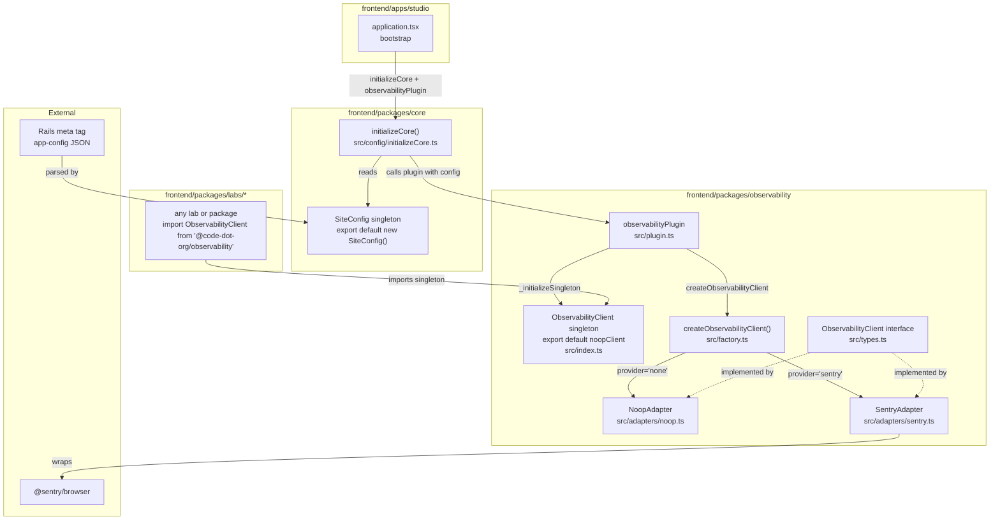

# Design Document: Frontend Observability

## Overview

This document describes the design for `@code-dot-org/observability`, a new shared package that provides a provider-agnostic frontend observability abstraction for the code.org monorepo.

The package exposes a single `ObservabilityClient` interface and a `createObservabilityClient` factory. Host applications call the factory at bootstrap time, passing a provider identifier and configuration sourced from the Rails-injected `<meta name="app-config">` tag. When no provider is configured the factory returns a no-op adapter that satisfies the interface and makes no external calls.

The initial implementation ships one real provider adapter — Sentry — and the no-op adapter. All sessions are anonymous by default; user-session linkage requires an explicit `setConsented(userId)` call.

### Key Design Goals

- **Privacy by default**: no PII or user identifiers are transmitted without explicit consent.
- **Tree-shakeable**: each provider adapter is a separate package entry point so only the selected provider's SDK ends up in the host bundle.
- **Zero-config safe**: importing the package without calling the factory has no side effects.
- **Extensible**: adding a new provider requires only a new adapter module and a new entry point; existing host applications need no changes beyond passing the new provider identifier.

---

## Architecture



### Singleton Pattern

The observability client singleton lives entirely within `@code-dot-org/observability` — core has no knowledge of it. The package exports a module-level no-op singleton as its default export, following the same ES module caching pattern as `SiteConfig` in `@code-dot-org/core`.

The singleton is a simple module-level variable. ES module consumers (including webpack-compiled `import` statements) hold a live binding to the exported namespace, so reassigning the variable after `_initializeSingleton` is called is visible to all consumers — no proxy or mutation needed:

```ts
// packages/observability/src/index.ts
import {NoopAdapter} from './adapters/noop';

// Module-level singleton — starts as no-op, reassigned by _initializeSingleton
export let singleton: ObservabilityClient = new NoopAdapter();

/** @internal — called only by observabilityPlugin */
export function _initializeSingleton(client: ObservabilityClient): void {
  singleton = client;
}

export default singleton;
```

This works correctly for all ES module consumers. Raw `require()` with a cached default reference is not a supported usage pattern.

Any lab or package consumes observability without knowing which provider is active:

```ts
import ObservabilityClient from '@code-dot-org/observability';
ObservabilityClient.captureException(err, {lab: 'music'});
```

### Plugin Pattern

`@code-dot-org/core` knows nothing about observability. Instead, `@code-dot-org/observability` exports an `observabilityPlugin` — a plain object that conforms to a `CorePlugin` interface defined in `@code-dot-org/core`. The host app passes it to `initializeCore()`:

```ts
// packages/core/src/config/initializeCore.ts
export interface CorePlugin {
  /** Called by initializeCore with the full SiteConfig after core is ready */
  onCoreReady(config: SiteConfig): void;
}

export function initializeCore(plugins: CorePlugin[] = []): void {
  if (!window.__CODE_STUDIO__) {
    window.__CODE_STUDIO__ = CodeStudioConfig;
  }
  for (const plugin of plugins) {
    plugin.onCoreReady(CodeStudioConfig);
  }
}
```

```ts
// packages/observability/src/plugin.ts
export const observabilityPlugin: CorePlugin = {
  onCoreReady(config) {
    const obs = config.observability;
    if (obs.provider === 'none') return;
    const client = createObservabilityClient(obs.provider, obs);
    client.init(obs);
    _initializeSingleton(client);
  },
};
```

Studio bootstrap:

```ts
// apps/studio/entrypoints/application.tsx
import {initializeCore} from '@code-dot-org/core';
import {observabilityPlugin} from '@code-dot-org/observability/plugin';

initializeCore([observabilityPlugin]);
// ... mount React app
```

Apps that don't depend on `@code-dot-org/observability` simply call `initializeCore()` with no plugins — the observability package is never bundled.

### `initializeCore` (replaces `initializeCodeStudioConfig`)

`initializeCore` is the single bootstrap function for `@code-dot-org/core`. It registers `SiteConfig` on `window` and calls `onCoreReady` on each supplied plugin. The old `initializeCodeStudioConfig` is retained as a deprecated re-export alias for backward compatibility.

### Entry Points

`@code-dot-org/observability` exposes four entry points:

| Export path                          | Contents                                                                                                                                      |
| ------------------------------------ | --------------------------------------------------------------------------------------------------------------------------------------------- |
| `@code-dot-org/observability`        | `ObservabilityClient` singleton (default export), `ObservabilityClient` type, `ObservabilityConfig` type, `createObservabilityClient` factory |
| `@code-dot-org/observability/plugin` | `observabilityPlugin` — the `CorePlugin` implementation for use with `initializeCore`                                                         |
| `@code-dot-org/observability/sentry` | `SentryAdapter` (imports `@sentry/browser`)                                                                                                   |
| `@code-dot-org/observability/noop`   | `NoopAdapter`                                                                                                                                 |

The factory dynamically imports the adapter module at runtime so the provider SDK is only loaded when actually selected.

---

## Components and Interfaces

### `ObservabilityClient` Interface

```typescript
export interface ObservabilityClient {
  /**
   * Initialize the provider SDK. Must be called before any other method.
   * Safe to call in SSR environments — guards on typeof window.
   */
  init(config: ObservabilityConfig): void;

  /**
   * Record an error with optional context metadata.
   * Never throws — SDK errors are caught and logged as console warnings.
   */
  recordError(error: unknown, context?: Record<string, unknown>): void;

  /**
   * Associate the current session with a user ID (requires explicit consent).
   * If called before init(), the association is queued and applied on init.
   * Passing null or empty string removes any existing user association.
   */
  setConsented(userId: string | null): void;

  /**
   * Returns true if a user ID is currently associated with the session.
   */
  isConsented(): boolean;

  /**
   * Tear down the provider SDK and flush any pending events.
   */
  shutdown(): Promise<void>;
}
```

### `ObservabilityConfig` Type

```typescript
export interface SamplingConfig {
  /** Fraction of errors sent to the provider. Range [0, 1]. Default: 1.0 */
  errorSampleRate?: number;
  /** Fraction of traces/spans sent to the provider. Range [0, 1]. Default: 0 (disabled) */
  tracesSampleRate?: number;
}

export interface ObservabilityConfig {
  /** Provider identifier. Defaults to 'none'. */
  provider: 'sentry' | 'none';
  /** Sentry-specific configuration. Required when provider is 'sentry'. */
  sentry?: {
    dsn: string;
  };
  /** Sampling rates. Provider SDK defaults apply when not set. */
  sampling?: SamplingConfig;
  /**
   * URLs/patterns that should receive W3C traceparent headers.
   * Defaults to same-origin only when not set.
   */
  tracePropagationTargets?: Array<string | RegExp>;
}
```

### `createObservabilityClient` Factory

```typescript
export function createObservabilityClient(
  provider?: 'sentry' | 'none',
  config?: Omit<ObservabilityConfig, 'provider'>,
): ObservabilityClient;
```

- When `provider` is `undefined` or `'none'`, returns a `NoopAdapter` synchronously (no dynamic import needed).
- When `provider` is `'sentry'`, dynamically imports `@code-dot-org/observability/sentry` and returns a `SentryAdapter`.
- When `provider` is any other string, throws `new Error(\`Unsupported observability provider: "${provider}"\`)`.

Because the factory may need to return synchronously (before the dynamic import resolves), the adapter is constructed eagerly but `init()` defers the actual SDK initialization. The factory always returns a fully-constructed `ObservabilityClient` immediately.

### `NoopAdapter`

Implements `ObservabilityClient` with empty method bodies. All methods are no-ops. `isConsented()` returns `false`. `shutdown()` returns `Promise.resolve()`. Accepts any config without error.

### `SentryAdapter`

Wraps `@sentry/browser`. Key behaviors:

- **`init(config)`**: Calls `Sentry.init()` with:
  - `dsn` from `config.sentry.dsn`
  - `sendDefaultPii: false` (anonymous mode)
  - `sampleRate: config.sampling?.errorSampleRate ?? 1.0`
  - `tracesSampleRate: config.sampling?.tracesSampleRate ?? 0`
  - `tracePropagationTargets: config.tracePropagationTargets ?? [/^\/(?!\/)/]` (same-origin default: paths starting with `/` but not `//`)
  - Registers `window.addEventListener('error', ...)` and `window.addEventListener('unhandledrejection', ...)` for automatic capture (Sentry does this internally via `integrations` — the adapter relies on Sentry's default `GlobalHandlers` integration).
  - Applies any queued `setConsented` call.
  - Wrapped in try/catch; on failure logs a console warning and transitions to no-op behavior.
- **`recordError(error, context)`**: Calls `Sentry.captureException(error, { extra: context })`. Wrapped in try/catch; on failure logs a console warning.
- **`setConsented(userId)`**: If `init` has not been called, queues the call. Otherwise calls `Sentry.setUser(userId ? { id: userId } : null)`.
- **`isConsented()`**: Returns `true` if a non-null userId is currently set.
- **`shutdown()`**: Calls `Sentry.close()`.

### `SiteConfig` Update (`@code-dot-org/core`)

The existing `SiteConfig` uses `rumProvider: RumProvider` where `RumProvider = 'newrelic' | 'datadog' | 'sentry' | 'none'`. The requirements use `provider: 'sentry' | 'none'`.

#### Module Augmentation for Optional Typing

`SiteConfig` in `@code-dot-org/core` exposes an empty `SiteConfigExtensions` interface. The `observability` field is NOT present on `SiteConfig` by default — it only appears in TypeScript when `@code-dot-org/observability` (or its plugin) is imported, via module augmentation:

```ts
// packages/core/src/config/SiteConfig.ts

/**
 * Empty interface that plugins augment to extend SiteConfig's type.
 * Importing a plugin package causes its module augmentation to merge here.
 */
export interface SiteConfigExtensions {}

export class SiteConfig {
  // ... existing fields (host, brand, environment, dashboardApiUrl, appVersion)
  // observability is NOT declared here — it's added by SiteConfigExtensions augmentation

  constructor() {
    // reads meta tag and populates all fields including the observability slice
    // at runtime, the data is always parsed regardless of which plugins are loaded
  }
}
```

```ts
// packages/observability/src/plugin.ts

// Augment SiteConfig to expose the observability field when this package is imported
declare module '@code-dot-org/core' {
  interface SiteConfigExtensions {
    observability: ObservabilityConfig;
  }
}
```

The `SiteConfig` class uses `SiteConfigExtensions` via intersection to expose the augmented fields:

```ts
// The singleton export merges extensions into the type
export default new SiteConfig() as SiteConfig & SiteConfigExtensions;
```

This means:

- Without importing `@code-dot-org/observability`, `CodeStudioConfig.observability` is a **type error** — the field doesn't exist in TypeScript.
- After importing `@code-dot-org/observability/plugin`, `CodeStudioConfig.observability` is fully typed as `ObservabilityConfig`.
- At runtime, `SiteConfig` always parses the `observability` slice from the meta tag (it's just data, no SDK loaded), so the field is always present on the object — the augmentation is purely a type-level gate.

#### Other SiteConfig changes

1. Rename `rumProvider` → `provider` and narrow the type to `'sentry' | 'none'` within `ObservabilityConfig`.
2. Remove the `datadog` and `newRelic` fields (out of scope for this feature).
3. Update `RuntimeConfig.observability` to use the new shape.
4. Update the `SiteConfig` constructor to read `runtime.observability?.provider ?? 'none'`.

The existing `RumProvider`, `DatadogConfig`, and `NewRelicConfig` types can be retained for backward compatibility but should be marked `@deprecated`.

---

## Data Models

### Runtime Config (Rails → Browser)

Rails renders the `<meta name="app-config">` tag in `dashboard/app/views/app/index.html.haml`. The JSON content shape relevant to observability:

```json
{
  "appVersion": "abc123",
  "observability": {
    "provider": "sentry",
    "sentry": {"dsn": "https://..."},
    "sampling": {
      "errorSampleRate": 1.0,
      "tracesSampleRate": 0.1
    },
    "tracePropagationTargets": ["https://studio.code.org/api"]
  }
}
```

When the tag is absent or `observability` is omitted, `SiteConfig` defaults `provider` to `'none'` and `createObservabilityClient` returns the no-op adapter.

### Consent Queue

The `SentryAdapter` maintains internal state:

```typescript
interface AdapterState {
  initialized: boolean;
  consentedUserId: string | null | undefined; // undefined = not yet called
  pendingConsent: string | null | undefined; // queued before init
}
```

`isConsented()` returns `consentedUserId !== null && consentedUserId !== undefined && consentedUserId !== ''`.

### Package File Layout

```
frontend/packages/observability/
├── src/
│   ├── index.ts              # main entry: singleton default export + factory + types
│   ├── plugin.ts             # observabilityPlugin (CorePlugin implementation)
│   ├── types.ts              # ObservabilityClient, ObservabilityConfig
│   ├── adapters/
│   │   ├── noop.ts           # NoopAdapter
│   │   └── sentry.ts         # SentryAdapter
│   └── __tests__/
│       ├── factory.test.ts
│       ├── noop.test.ts
│       ├── plugin.test.ts
│       └── sentry.test.ts
├── package.json
├── vite.config.ts
├── tsconfig.json
├── eslint.config.mjs
├── vitest.config.ts
├── README.md
└── CONTRIBUTING.md
```

Changes to `@code-dot-org/core`:

```
frontend/packages/core/src/
└── config/
    ├── initializeCore.ts             # NEW — replaces initializeCodeStudioConfig; accepts CorePlugin[]
    ├── initializeCodeStudioConfig.ts  # kept as deprecated re-export alias
    └── SiteConfig.ts                 # updated: rumProvider → provider: 'sentry' | 'none'
```

Note: the `observability/` directory previously proposed inside `@code-dot-org/core` is removed — the singleton now lives in `@code-dot-org/observability` itself. The `./observability` entry point on `@code-dot-org/core` is no longer needed.

New entry points added to `@code-dot-org/observability`'s `package.json` exports:

```json
".": { "types": "./dist/index.d.ts", "import": "./dist/index.mjs", "require": "./dist/index.cjs" },
"./plugin": { "types": "./dist/plugin.d.ts", "import": "./dist/plugin.mjs", "require": "./dist/plugin.cjs" },
"./sentry": { "types": "./dist/adapters/sentry.d.ts", "import": "./dist/adapters/sentry.mjs", "require": "./dist/adapters/sentry.cjs" },
"./noop": { "types": "./dist/adapters/noop.d.ts", "import": "./dist/adapters/noop.mjs", "require": "./dist/adapters/noop.cjs" }
```

---

## Correctness Properties

_A property is a characteristic or behavior that should hold true across all valid executions of a system — essentially, a formal statement about what the system should do. Properties serve as the bridge between human-readable specifications and machine-verifiable correctness guarantees._

### Property 1: Factory returns a valid client for all valid providers and configs

_For any_ valid provider identifier (`'sentry'` or `'none'`) and any valid `ObservabilityConfig` (including configs with arbitrary `sampling` and `tracePropagationTargets` values), `createObservabilityClient` SHALL return an object that implements the `ObservabilityClient` interface — i.e., has callable `init`, `recordError`, `setConsented`, `isConsented`, and `shutdown` methods.

**Validates: Requirements 2.1, 8.1, 9.1**

### Property 2: Unrecognized provider throws a descriptive error

_For any_ string value that is not `'sentry'` or `'none'`, calling `createObservabilityClient` with that value SHALL throw an `Error` whose message contains the unrecognized value.

**Validates: Requirements 2.3**

### Property 3: recordError forwards errors to the provider

_For any_ error value and optional context object, calling `recordError(error, context)` on an initialized `SentryAdapter` SHALL result in the underlying Sentry SDK receiving that error and context. The method SHALL NOT throw regardless of the error value passed.

**Validates: Requirements 3.1**

### Property 4: Provider SDK errors during recordError are swallowed

_For any_ error thrown by the provider SDK during `captureException`, calling `recordError` on the adapter SHALL NOT propagate the exception to the caller. The adapter SHALL log a console warning and continue operating normally.

**Validates: Requirements 3.4**

### Property 5: Consent round-trip — setConsented/isConsented accurately reflect state

_For any_ sequence of `setConsented` and `init` calls: (a) `isConsented()` returns `true` if and only if `setConsented` was called with a non-null, non-empty string; (b) calling `setConsented(null)` or `setConsented('')` after a prior consent call causes `isConsented()` to return `false`; (c) calling `setConsented` before `init` queues the association and `isConsented()` reflects the queued value correctly after `init` completes.

**Validates: Requirements 4.3, 5.1, 5.2 (edge-case), 5.4, 5.5**

### Property 6: Config values are passed through to the provider SDK unchanged

_For any_ valid `sampling.errorSampleRate`, `sampling.tracesSampleRate`, and `tracePropagationTargets` values supplied to `init`, the `SentryAdapter` SHALL pass those exact values to `Sentry.init` without modification. The adapter SHALL NOT apply its own sampling logic on top of the SDK's.

**Validates: Requirements 8.4, 9.2**

### Property 7: No-op adapter accepts any config and performs no external calls

_For any_ `ObservabilityConfig` (including arbitrary `sampling` and `tracePropagationTargets` values), the `NoopAdapter` SHALL accept the config without throwing, and calling any method on it SHALL produce no observable side effects (no network calls, no console output, no global state mutations).

**Validates: Requirements 2.2, 8.6, 9.6**

### Property 8: Init failure falls back gracefully without propagating

_For any_ `SentryAdapter` where `Sentry.init` throws (e.g., SDK blocked by ad blocker), calling `init(config)` SHALL NOT propagate the exception to the caller. After the failure, all subsequent `recordError` calls SHALL also be no-ops (the adapter degrades to no-op behavior), and `isConsented()` SHALL return `false`.

**Validates: Requirements 6.4**

---

## Error Handling

| Scenario                                                 | Behavior                                                                                                |
| -------------------------------------------------------- | ------------------------------------------------------------------------------------------------------- |
| `createObservabilityClient` called with unknown provider | Throws `Error` with descriptive message including the bad value                                         |
| `Sentry.init` throws (e.g., ad blocker, bad DSN)         | Caught; console warning logged; adapter degrades to no-op                                               |
| `Sentry.captureException` throws                         | Caught; console warning logged; `recordError` returns normally                                          |
| `setConsented` called before `init`                      | Association queued; applied on `init`                                                                   |
| `setConsented(null)` or `setConsented('')`               | Clears user association; `isConsented()` returns `false`                                                |
| Meta tag absent or malformed JSON                        | `SiteConfig` returns `{}` for runtime config; `provider` defaults to `'none'`; singleton stays as no-op |
| `typeof window === 'undefined'` (SSR)                    | `init` is a no-op; no SDK initialization attempted                                                      |
| Package/lab calls singleton before `initializeCore`      | Singleton is no-op; calls are silently dropped — safe by design                                         |
| `initializeCore` called without `observabilityPlugin`    | Observability package never bundled; singleton never swapped from no-op                                 |

---

## Testing Strategy

### Dual Testing Approach

Both unit tests and property-based tests are required. Unit tests cover specific examples, integration points, and error conditions. Property-based tests verify universal behaviors across generated inputs.

### Property-Based Testing

The property-based testing library for this package is **[fast-check](https://fast-check.dev/)** (TypeScript-native, Vitest-compatible).

Each property test MUST run a minimum of **100 iterations** (fast-check default is 100; do not lower it).

Each property test MUST include a comment referencing the design property it validates:

```
// Feature: observability, Property N: <property text>
```

**Property test mapping:**

| Design Property                      | Test file         | fast-check arbitraries                                                                          |
| ------------------------------------ | ----------------- | ----------------------------------------------------------------------------------------------- |
| P1: Factory returns valid client     | `factory.test.ts` | `fc.constantFrom('sentry', 'none')`, `fc.record({sampling: ..., tracePropagationTargets: ...})` |
| P2: Unknown provider throws          | `factory.test.ts` | `fc.string()` filtered to exclude valid values                                                  |
| P3: recordError forwards errors      | `sentry.test.ts`  | `fc.anything()` for error, `fc.record(...)` for context                                         |
| P4: SDK errors swallowed             | `sentry.test.ts`  | `fc.anything()` for thrown value                                                                |
| P5: Consent round-trip               | `sentry.test.ts`  | `fc.string()` for userId, `fc.boolean()` for call ordering                                      |
| P6: Config pass-through              | `sentry.test.ts`  | `fc.float({min:0,max:1})` for rates, `fc.array(fc.string())` for targets                        |
| P7: No-op accepts any config         | `noop.test.ts`    | `fc.record({provider: ..., sampling: ..., tracePropagationTargets: ...})`                       |
| P8: Init failure degrades gracefully | `sentry.test.ts`  | `fc.anything()` for thrown error                                                                |

### Unit Tests

Unit tests (in the same `__tests__/` files) cover:

- `factory.test.ts`: `createObservabilityClient()` with no args returns no-op; `createObservabilityClient('none')` returns no-op; returned object has all required methods.
- `sentry.test.ts`: `init` configures Sentry with `sendDefaultPii: false` (Req 4.2, 4.4); `init` registers global error/rejection handlers (Req 3.2, 3.3); `setConsented` before `init` is applied after `init` (Req 5.4); `init` is a no-op when `typeof window === 'undefined'` (Req 6.2); `tracesSampleRate` defaults to `0` when not set (Req 8.2); `tracePropagationTargets` defaults to same-origin pattern when not set (Req 9.5); `tracePropagationTargets` is passed through even when `tracesSampleRate` is `0` (Req 9.3).
- `noop.test.ts`: all methods callable without error; `isConsented()` returns `false`; `shutdown()` resolves.

### Vitest Configuration

```typescript
// vitest.config.ts
import {defineConfig} from 'vitest/config';
export default defineConfig({
  test: {
    globals: true,
    environment: 'jsdom', // required for window/document access in adapter tests
  },
});
```

### Running Tests

```bash
# from frontend/
yarn workspace @code-dot-org/observability test

# or from frontend/packages/observability/
yarn test
```
