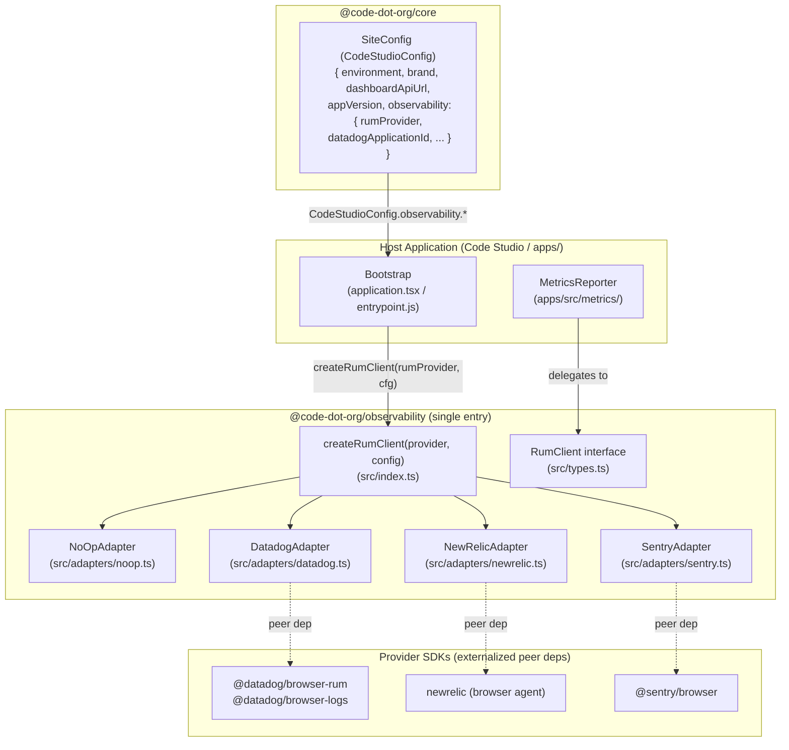

# Design Document: Observability Package

## Overview

The `@code-dot-org/observability` package provides a provider-agnostic Real User Monitoring (RUM) abstraction for all frontend applications in the monorepo. It defines a single `RumClient` interface and a `createRumClient(provider, config)` factory that returns the appropriate Provider Adapter at runtime. Host applications select their RUM provider once at bootstrap; the rest of the application code only ever calls `RumClient` methods.

The package ships as **a single Vite library entry point** (`src/index.ts`) that includes all Provider Adapters. Provider SDKs are externalized peer dependencies — the host's own bundler (webpack or Vite) tree-shakes away any SDK the host does not install.

The package follows all conventions in the [Frontend Package Conventions spec](../frontend-package-conventions/requirements.md).

### Goals

- Single, typed abstraction over New Relic, Datadog, Sentry, and a no-op fallback.
- One import path: `@code-dot-org/observability`.
- Anonymous sessions by default; no user-session linkage in scope.
- Resilient initialization: ad-blocker or SDK failures fall back to no-op silently.
- SSR-safe: all adapters guard against non-browser environments.

### Non-Goals

- Per-provider tree-shaking via separate entry points (host bundler handles this via peer deps).
- Opt-in user-session linkage (out of scope at this time).
- User interaction replays, DOM snapshots, or network request payload capture.
- Server-side RUM (Node.js / Rails).
- Producing a standalone IIFE bundle — the Host Application owns its own entry point bundle.

---

## Architecture



The factory is the only coupling point between the host and the package. Once a `RumClient` is returned, the host holds only the interface.

---

## Components and Interfaces

### Package Directory Structure

```
frontend/packages/observability/
├── src/
│   ├── index.ts                  # Public API: RumClient, createRumClient, types
│   ├── types.ts                  # RumClient interface, config types, provider union
│   ├── adapters/
│   │   ├── noop.ts
│   │   ├── datadog.ts
│   │   ├── newrelic.ts
│   │   └── sentry.ts
│   └── internal/
│       └── ssrGuard.ts           # isBrowser() helper
├── package.json
├── vite.config.ts
├── tsconfig.json
├── tsconfig.app.json
├── tsconfig.node.json
├── eslint.config.mjs
├── vitest.config.ts
├── .lintstagedrc.mjs
├── .gitignore
├── README.md
└── CONTRIBUTING.md
```

### `SiteConfig` Extension in `@code-dot-org/core`

`SiteConfig` is extended to read the `<meta name="app-config">` tag during construction, merging Rails-injected runtime values with its existing hostname-derived fields. This keeps a single config object for the whole app.

The meta tag content is typed as `RuntimeConfig` — a plain interface that makes the Rails-injected shape explicit and swappable:

```typescript
// frontend/packages/core/src/config/SiteConfig.ts (extended)

export type RumProvider = 'newrelic' | 'datadog' | 'sentry' | 'none';

export interface DatadogConfig {
  applicationId: string;
  clientToken: string;
}

export interface NewRelicConfig {
  licenseKey: string;
  applicationId: string;
}

export interface SentryConfig {
  dsn: string;
}

export interface ObservabilityConfig {
  rumProvider: RumProvider;
  datadog?: DatadogConfig;
  newRelic?: NewRelicConfig;
  sentry?: SentryConfig;
}

/** Shape of the <meta name="app-config"> content attribute rendered by Rails */
export interface RuntimeConfig {
  appVersion?: string;
  observability?: Partial<ObservabilityConfig>;
}

export class SiteConfig {
  public readonly host: ReturnType<typeof parse>;
  public readonly brand: Brand;
  public readonly environment: Environment;
  public readonly dashboardApiUrl: string;
  // Rails-injected fields
  public readonly appVersion?: string;
  public readonly observability: ObservabilityConfig;

  constructor() {
    this.host = parse(window.location.hostname);
    this.brand = getBrandFromHostname(this.host);
    this.environment = getEnvironmentFromHostname();
    this.dashboardApiUrl = getDashboardApiUrl(this.environment);

    const runtime = SiteConfig.readRuntimeConfig();
    this.appVersion = runtime.appVersion;
    this.observability = {
      rumProvider: runtime.observability?.rumProvider ?? 'none',
      datadog: runtime.observability?.datadog,
      newRelic: runtime.observability?.newRelic,
      sentry: runtime.observability?.sentry,
    };
  }

  private static readRuntimeConfig(): RuntimeConfig {
    try {
      const meta = document.querySelector<HTMLMetaElement>('meta[name="app-config"]');
      if (!meta?.content) return {};
      return JSON.parse(meta.content) as RuntimeConfig;
    } catch {
      return {};
    }
  }
}
```

The existing `CodeStudioConfig` singleton (`export default new SiteConfig()`) is unchanged — consumers already import it and will automatically get the new fields.

### `RumClient` Interface

```typescript
// src/types.ts

export type RumProvider = 'newrelic' | 'datadog' | 'sentry' | 'none';

export interface RumClientConfig {
  /** Application name reported to the provider */
  applicationName: string;
  /** Environment tag (e.g. 'production', 'staging') */
  environment: string;
  /** Application version / release string */
  version?: string;
  /** Provider-specific options passed through verbatim */
  providerOptions?: Record<string, unknown>;
}

/**
 * Common interface implemented by every Provider Adapter.
 * All methods are synchronous from the caller's perspective;
 * any async provider calls are fire-and-forget inside the adapter.
 */
export interface RumClient {
  /**
   * Initialize the RUM provider. Must be called once, in a browser
   * environment, before any other method. Safe to call multiple times
   * (subsequent calls are no-ops).
   */
  init(config: RumClientConfig): void;

  /**
   * Forward a structured log entry to the active RUM provider.
   */
  recordLog(
    level: 'info' | 'warn' | 'error',
    message: string,
    context?: Record<string, unknown>
  ): void;

  /**
   * Forward a named numeric metric to the active RUM provider.
   */
  recordMetric(
    name: string,
    value: number,
    options?: {unit?: string; dimensions?: Record<string, string>}
  ): void;

  /**
   * Convenience wrapper: calls recordMetric with value 1 and unit 'count'.
   */
  incrementCounter(name: string, dimensions?: Record<string, string>): void;

  /**
   * Flush pending events and tear down the provider SDK.
   * Called on application unload.
   */
  shutdown(): void;
}
```

### `createRumClient` Factory

```typescript
// src/index.ts

export type {RumClient, RumClientConfig, RumProvider} from './types';

import {NoOpAdapter} from './adapters/noop';
import {DatadogAdapter} from './adapters/datadog';
import {NewRelicAdapter} from './adapters/newrelic';
import {SentryAdapter} from './adapters/sentry';

export function createRumClient(
  provider: RumProvider,
  config: RumClientConfig
): RumClient {
  switch (provider) {
    case 'none':
      return new NoOpAdapter();
    case 'datadog':
      return new DatadogAdapter(config);
    case 'newrelic':
      return new NewRelicAdapter(config);
    case 'sentry':
      return new SentryAdapter(config);
    default: {
      const _exhaustive: never = provider;
      throw new Error(
        `Unsupported RUM provider: "${String(_exhaustive)}". ` +
          'Valid values are: newrelic, datadog, sentry, none.'
      );
    }
  }
}
```

---

## Build Configuration

```typescript
// vite.config.ts
import path from 'path';
import {defineConfig} from 'vite';
import react from '@vitejs/plugin-react';
import dts from 'vite-plugin-dts';
import {externalizeDeps} from 'vite-plugin-externalize-deps';

function getRollupOutputConfig(format: 'es' | 'cjs') {
  return {
    format,
    exports: 'auto' as const,
    entryFileNames: format === 'es' ? '[name].mjs' : '[name].cjs',
    preserveModules: true,
    preserveModulesRoot: 'src',
  };
}

export default defineConfig({
  plugins: [
    react(),
    dts({
      tsconfigPath: './tsconfig.app.json',
      rollupTypes: false,
      entryRoot: 'src',
      insertTypesEntry: false,
      exclude: ['**/__tests__/**', '**/*.test.ts'],
    }),
    externalizeDeps(),
  ],
  resolve: {
    alias: {'@': path.resolve(__dirname, './src')},
  },
  build: {
    sourcemap: true,
    cssCodeSplit: true,
    lib: {entry: 'src/index.ts', name: 'observability'},
    rollupOptions: {
      output: [getRollupOutputConfig('es'), getRollupOutputConfig('cjs')],
    },
  },
});
```

---

## Data Models

### Configuration Flow

```mermaid
sequenceDiagram
    participant Rails as Rails Template
    participant Meta as &lt;meta name="app-config"&gt;
    participant SC as SiteConfig constructor
    participant Bootstrap as App Bootstrap
    participant Factory as createRumClient
    participant Adapter as ProviderAdapter
    participant SDK as Provider SDK
    participant MR as MetricsReporter

    Rails->>Meta: renders JSON RuntimeConfig (observability.rumProvider, etc.)
    Bootstrap->>SC: new SiteConfig() / CodeStudioConfig singleton
    SC->>Meta: querySelector meta[name="app-config"], JSON.parse
    SC-->>Bootstrap: SiteConfig { environment, observability: { rumProvider, ... } }
    Bootstrap->>Factory: createRumClient(CodeStudioConfig.observability.rumProvider, cfg)
    Factory->>Adapter: new ProviderAdapter()
    Bootstrap->>Adapter: .init(rumConfig)
    Adapter->>Adapter: isBrowser() check
    Adapter->>SDK: sdk.init({ ...anonymousConfig })
    SDK-->>Adapter: initialized (or throws → degraded)
    Bootstrap->>MR: metricsReporter.setRumClient(client)
```

### Internal Adapter State

```typescript
interface AdapterState {
  initialized: boolean;
  degraded: boolean;  // true when init failed (ad-blocker / SDK error)
}
```

---

## Provider Adapter Designs

### No-Op Adapter

```typescript
export class NoOpAdapter implements RumClient {
  init(_config: RumClientConfig): void {}
  recordLog(_level: 'info' | 'warn' | 'error', _message: string, _context?: Record<string, unknown>): void {}
  recordMetric(_name: string, _value: number, _options?: {unit?: string; dimensions?: Record<string, string>}): void {}
  incrementCounter(_name: string, _dimensions?: Record<string, string>): void {}
  shutdown(): void {}
}
```

### Datadog Adapter

Compliance-related SDK options are grouped in a named constant so they are clearly separated from general init options and cannot be accidentally removed:

```typescript
// Compliance settings required by privacy policy — do not remove without legal review
const DATADOG_PRIVACY_COMPLIANCE = {
  trackUserInteractions: false,
  trackResources: false,
  trackLongTasks: false,
  defaultPrivacyLevel: 'mask-user-input',
} as const;
```

| `RumClient` method | Datadog SDK call |
|---|---|
| `init(config)` | `datadogRum.init({ applicationId, clientToken, site, service: config.applicationName, env: config.environment, version: config.version, ...DATADOG_PRIVACY_COMPLIANCE, ...config.providerOptions })` |
| `recordLog('info', msg, ctx)` | `datadogLogs.logger.info(msg, ctx)` |
| `recordLog('warn', msg, ctx)` | `datadogLogs.logger.warn(msg, ctx)` |
| `recordLog('error', msg, ctx)` | `datadogLogs.logger.error(msg, ctx)` |
| `recordMetric(name, value, opts)` | `datadogRum.addAction(name, { value, unit: opts?.unit, ...opts?.dimensions })` |
| `incrementCounter(name, dims)` | `recordMetric(name, 1, { unit: 'count', dimensions: dims })` |
| `shutdown()` | `datadogRum.stopSession()` |

`DATADOG_PRIVACY_COMPLIANCE` is spread into the `datadogRum.init` call before `config.providerOptions` so that host-supplied options cannot silently override compliance settings.

### New Relic Adapter

New Relic browser agent does not auto-collect user IDs, so the compliance constant documents that intent explicitly:

```typescript
// Compliance settings required by privacy policy — do not remove without legal review
const NEWRELIC_PRIVACY_COMPLIANCE = {
  // New Relic browser agent does not expose a PII suppression init flag;
  // compliance is maintained by never calling setUserId or setCustomAttribute
  // with user-identifying values.
} as const;
```

| `RumClient` method | New Relic SDK call |
|---|---|
| `init(config)` | `newrelic.setApplicationVersion(config.version)`, `newrelic.setCustomAttribute('environment', config.environment)` |
| `recordLog(level, msg, ctx)` | `newrelic.log(msg, { level, customAttributes: ctx })` |
| `recordMetric(name, value, opts)` | `newrelic.recordCustomEvent(name, { value, unit: opts?.unit, ...opts?.dimensions })` |
| `incrementCounter(name, dims)` | `recordMetric(name, 1, { unit: 'count', dimensions: dims })` |
| `shutdown()` | no-op (no shutdown API) |

Anonymous mode: the adapter never calls `setUserId`. `NEWRELIC_PRIVACY_COMPLIANCE` documents this as an intentional compliance decision.

### Sentry Adapter

```typescript
// Compliance settings required by privacy policy — do not remove without legal review
const SENTRY_PRIVACY_COMPLIANCE = {
  sendDefaultPii: false,
} as const;
```

| `RumClient` method | Sentry SDK call |
|---|---|
| `init(config)` | `Sentry.init({ dsn, environment: config.environment, release: config.version, ...SENTRY_PRIVACY_COMPLIANCE, ...config.providerOptions })` |
| `recordLog(level, msg, ctx)` | `Sentry.addBreadcrumb({ level, message: msg, data: ctx })` |
| `recordMetric(name, value, opts)` | `Sentry.metrics.distribution(name, value, { unit: opts?.unit, tags: opts?.dimensions })` |
| `incrementCounter(name, dims)` | `Sentry.metrics.increment(name, 1, { tags: dims })` |
| `shutdown()` | `Sentry.close()` |

`SENTRY_PRIVACY_COMPLIANCE` is spread before `config.providerOptions` so host-supplied options cannot silently override `sendDefaultPii`.

---

## SSR Guard Pattern

```typescript
// src/internal/ssrGuard.ts
export function isBrowser(): boolean {
  return typeof window !== 'undefined';
}
```

Every adapter's `init` checks `isBrowser()` first.

---

## Ad-Blocker / Init Failure Fallback

```typescript
init(config: RumClientConfig): void {
  if (!isBrowser()) return;
  try {
    this.state.initialized = true;
    // provider SDK init
  } catch (err) {
    console.warn('[observability] RUM provider init failed, falling back to no-op.', err);
    this.state.degraded = true;
  }
}

recordLog(level: 'info' | 'warn' | 'error', message: string, context?: Record<string, unknown>): void {
  if (this.state.degraded || !this.state.initialized) return;
  try {
    // provider SDK call
  } catch (err) {
    console.warn('[observability] recordLog failed.', err);
  }
}
```

---

## MetricsReporter Integration

```typescript
import type {RumClient} from '@code-dot-org/observability';

class MetricsReporter {
  private rumClient: RumClient | null = null;

  setRumClient(client: RumClient): void {
    this.rumClient = client;
  }

  logInfo(message: string | object) {
    this.rumClient?.recordLog('info', typeof message === 'string' ? message : JSON.stringify(message));
    // existing server-side path unchanged
  }

  logWarning(message: string | object) {
    this.rumClient?.recordLog('warn', typeof message === 'string' ? message : JSON.stringify(message));
  }

  logError(message: string | object) {
    this.rumClient?.recordLog('error', typeof message === 'string' ? message : JSON.stringify(message));
  }

  publishMetric(name: string, value: number, unit: MetricUnit, dimensions: MetricDimension[] = []) {
    this.rumClient?.recordMetric(name, value, {
      unit,
      dimensions: Object.fromEntries(dimensions.map(d => [d.name, d.value])),
    });
    // existing server-side path unchanged
  }
}
```

---

## Code Studio Bootstrap Integration

`SiteConfig` (via the `CodeStudioConfig` singleton from `@code-dot-org/core`) is the single config object. RUM values are read from `CodeStudioConfig.observability`. No separate config reader module is needed in the Studio App:

```typescript
// frontend/apps/studio/src/entrypoints/application.tsx

import CodeStudioConfig from '@code-dot-org/core';
import {createRumClient} from '@code-dot-org/observability';
import metricsReporter from '@cdo/apps/metrics/MetricsReporter';

const {rumProvider, datadog, newRelic, sentry} = CodeStudioConfig.observability;

const rumClient = createRumClient(rumProvider, {
  applicationName: 'studio',
  environment: CodeStudioConfig.environment,
  version: CodeStudioConfig.appVersion,
  providerOptions: {
    // Datadog
    applicationId: datadog?.applicationId,
    clientToken: datadog?.clientToken,
    site: 'datadoghq.com',
    // New Relic
    licenseKey: newRelic?.licenseKey,
    applicationID: newRelic?.applicationId,
    // Sentry
    dsn: sentry?.dsn,
  },
});

rumClient.init({
  applicationName: 'studio',
  environment: CodeStudioConfig.environment,
  version: CodeStudioConfig.appVersion,
});

metricsReporter.setRumClient(rumClient);
```

For `apps/` (webpack), the same pattern applies using the existing Rails-rendered config mechanism (e.g., the `CDO` JavaScript object).

---

## Error Handling

| Scenario | Behavior |
|---|---|
| `init` called in SSR (no `window`) | Returns immediately, no SDK call, no error |
| `init` called when SDK blocked by ad-blocker | Catches exception, `console.warn`, sets `degraded = true` |
| `init` called multiple times | Second call is a no-op (guarded by `initialized` flag) |
| `recordLog` / `recordMetric` called before `init` | No-op |
| `recordLog` / `recordMetric` called after degraded init | No-op |
| Provider SDK throws inside `recordLog` / `recordMetric` | Caught, `console.warn`, no re-throw |
| `createRumClient` called with unknown provider | Throws `Error` with descriptive message |
| `<meta name="app-config">` absent or invalid JSON | `SiteConfig` uses safe defaults (`rumProvider: 'none'`) |

---

## Correctness Properties

### Property 1: Factory returns a complete `RumClient` for every valid provider

For any valid provider identifier and any config object, `createRumClient` returns an object implementing all required `RumClient` methods.

**Validates: Requirements 1.1, 2.1**

### Property 2: Unknown provider values always throw

For any string not in `{'newrelic', 'datadog', 'sentry', 'none'}`, `createRumClient` throws an `Error` whose message identifies the unsupported value.

**Validates: Requirement 2.3**

### Property 3: `recordLog` is forwarded to the provider

For any log level, message string, and context object, calling `recordLog` on an initialized adapter results in the provider SDK receiving that exact level, message, and context.

**Validates: Requirement 3.1**

### Property 4: `recordMetric` is forwarded to the provider

For any metric name, numeric value, and options, calling `recordMetric` on an initialized adapter results in the provider SDK receiving those exact values.

**Validates: Requirement 3.2**

### Property 5: `incrementCounter` is equivalent to `recordMetric` with value 1 and unit 'count'

For any counter name and dimensions, `incrementCounter(name, dims)` produces the same provider SDK call as `recordMetric(name, 1, { unit: 'count', dimensions: dims })`.

**Validates: Requirement 3.3**

### Property 6: No user identity transmitted by default

For any adapter, after `init` and before any other call, the provider SDK has received no user ID or PII.

**Validates: Requirement 4.1, 4.2**

### Property 7: Provider SDK failures do not propagate

For any adapter whose provider SDK throws during `init` or any `RumClient` method call, the method does not re-throw; it logs a warning and continues in degraded/no-op mode.

**Validates: Requirement 3.4, 5.4**

### Property 8: No-Op Adapter is always safe

For any sequence of `RumClient` method calls on a `NoOpAdapter`, no exception is thrown and no external call is made.

**Validates: Requirement 2.2**

---

## Testing Strategy

### Unit Tests

- `createRumClient('none', config)` returns a `NoOpAdapter` with all required methods.
- `createRumClient` with an unknown provider string throws with a message containing the value.
- `NoOpAdapter` — all methods callable without throwing.
- Each adapter: `init` with `typeof window === 'undefined'` does not call the provider SDK.
- Each adapter: provider SDK throwing during `init` sets `degraded = true`; subsequent calls are no-ops.
- `SiteConfig` with absent/invalid meta tag returns `observability.rumProvider === 'none'`.
- `MetricsReporter.setRumClient` — `logInfo`/`logWarning`/`logError`/`publishMetric` delegate to `RumClient` methods.

### Property-Based Tests

Using [fast-check](https://fast-check.dev/) with `{numRuns: 100}` minimum. Provider SDK calls intercepted via `vi.mock` or constructor injection.

```
// Feature: observability, Property 1: Factory returns a complete RumClient for every valid provider
// Feature: observability, Property 2: Unknown provider values always throw
// Feature: observability, Property 3: recordLog is forwarded to the provider
// Feature: observability, Property 4: recordMetric is forwarded to the provider
// Feature: observability, Property 5: incrementCounter is equivalent to recordMetric with value 1 and unit 'count'
// Feature: observability, Property 6: No user identity transmitted by default
// Feature: observability, Property 7: Provider SDK failures do not propagate
// Feature: observability, Property 8: No-Op Adapter is always safe
```

### Test Configuration

```typescript
// vitest.config.ts
import {defineConfig} from 'vitest/config';
export default defineConfig({
  test: {globals: true, environment: 'jsdom'},
});
```
