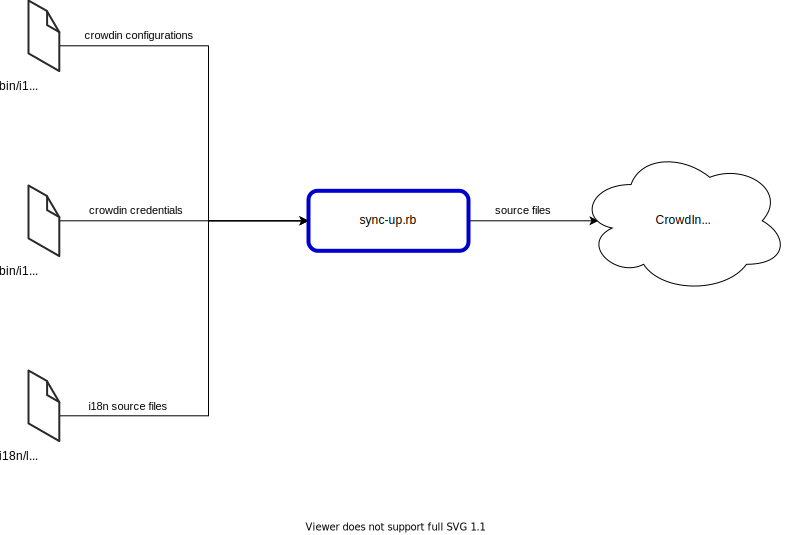

# i18n Pipeline Diagrams

+ [i18n Pipeline Diagrams](#i18n-pipeline-diagrams)
  + [i18n level 0](#i18n-level-0)
  + [i18n level 1](#i18n-level-1)
  + [i18n sync-in level 0](#i18n-sync-in-level-0)
  + [i18n sync-in level 1](#i18n-sync-in-level-1)
  + [i18n sync-up](#i18n-sync-up)
  + [i18n sync-down](#i18n-sync-down)
  + [i18n sync-down and sync-out connection](#i18n-sync-down-and-sync-out-connection)
  + [i18n sync-out level 0](#i18n-sync-out-level-0)
  + [i18n sync-out level 1](#i18n-sync-out-level-1)

## i18n level 0

## i18n level 1

## i18n sync-in level 0

+ [Return to the TOC](#i18n-pipeline-diagrams)

## i18n sync-in level 1

+ [Return to the TOC](#i18n-pipeline-diagrams)

## i18n sync-up

+ [Return to the TOC](#i18n-pipeline-diagrams)

## i18n sync-down

+ [Return to the TOC](#i18n-pipeline-diagrams)

## i18n sync-down and sync-out connection

+ [Return to the TOC](#i18n-pipeline-diagrams)

## i18n sync-out level 0

+ [Return to the TOC](#i18n-pipeline-diagrams)

## i18n sync-out level 1

+ [Return to the TOC](#i18n-pipeline-diagrams)

