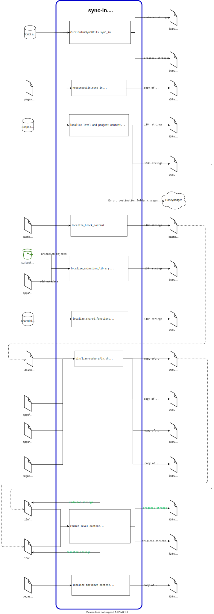
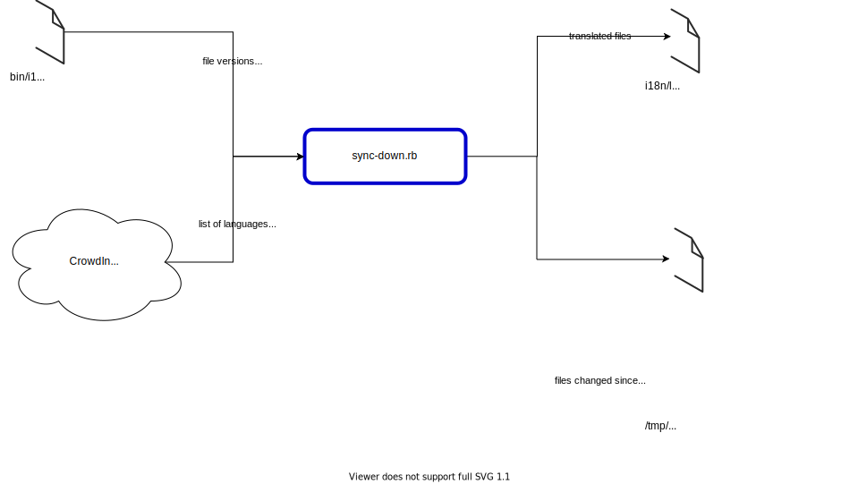
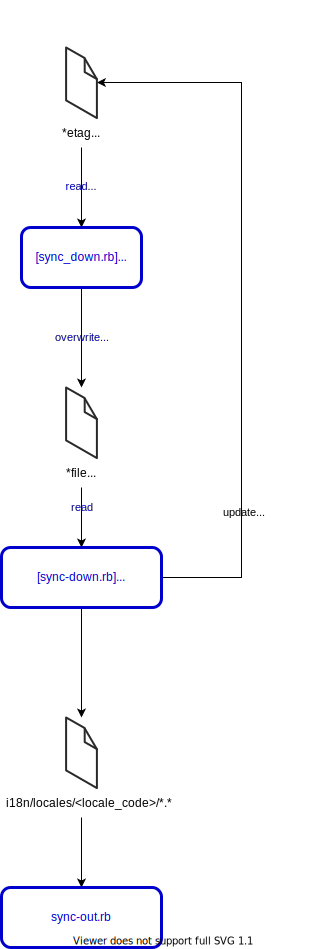
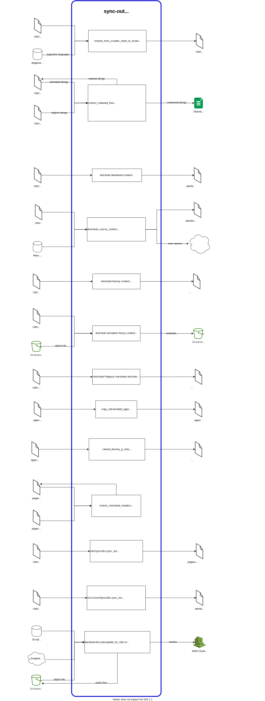

# I18n Pipeline Diagrams

+ [I18n Pipeline Diagrams](#i18n-pipeline-diagrams)
  + [Introduction](#introduction)
  + [Overview - Level 0](#overview---level-0)
  + [Overview - Level 1](#overview---level-1)
  + [Sync-In](#sync-in)
  + [Sync-In - Detailed](#sync-in---detailed)
  + [Sync-Up](#sync-up)
  + [Sync-Down](#sync-down)
  + [Sync-Down and Sync-Out Connection](#sync-down-and-sync-out-connection)
  + [Sync-Out](#sync-out)
  + [Sync-Out - Detailed](#sync-out---detailed)

## Introduction
This document visualizes the entire I18n pipeline using data-flow diagrams.

It starts with a high-level view of the pipeline (Level 0 and Level 1 diagram), then drills down to each of the pipeline's 4 main components (`sync-in`, `sync-up`, `sync-down`, and `sync-out`). The detailed diagrams capture the inputs and outputs of those components and their sub-components. They show how data flows through our system and 3rd-party services.

**Tips**:
- The text in SVG file is searchable. Most SVG-viewer apps, including browsers, support searching. On Github, select the "Raw" file option to let your browser displays the SVG file.
- The diagrams are created using _draw.io_ (also known as _diagrams.net_). The main diagram file is at `./i18n/diagrams/i18n_pipeline.drawio`. You can use either the [online version](https://app.diagrams.net/) or [offline version](https://www.diagrams.net/) of _draw.io_ to edit the diagram file.

## Overview - Level 0

## Overview - Level 1

## Sync-In

+ [Return to the TOC](#i18n-pipeline-diagrams)

## Sync-In - Detailed

+ [Return to the TOC](#i18n-pipeline-diagrams)

- Note: The content of [pegasus/cache/i18n/en-US.yml](https://github.com/code-dot-org/code-dot-org/blob/staging/pegasus/cache/i18n/en-US.yml) is populated from [Pegasus/Data/i18n.gsheet](https://docs.google.com/spreadsheets/d/1Tq7VqZALgRA0wYk0HDfEOTyRI0TM2Dir2rloXIPGCgU/edit ) by [pegasus/rake/i18n.rake](https://github.com/code-dot-org/code-dot-org/blob/staging/pegasus/rake/i18n.rake)

## Sync-Up

+ [Return to the TOC](#i18n-pipeline-diagrams)

## Sync-Down

+ [Return to the TOC](#i18n-pipeline-diagrams)

## Sync-Down and Sync-Out Connection

+ [Return to the TOC](#i18n-pipeline-diagrams)

## Sync-Out

+ [Return to the TOC](#i18n-pipeline-diagrams)

## Sync-Out - Detailed

+ [Return to the TOC](#i18n-pipeline-diagrams)

