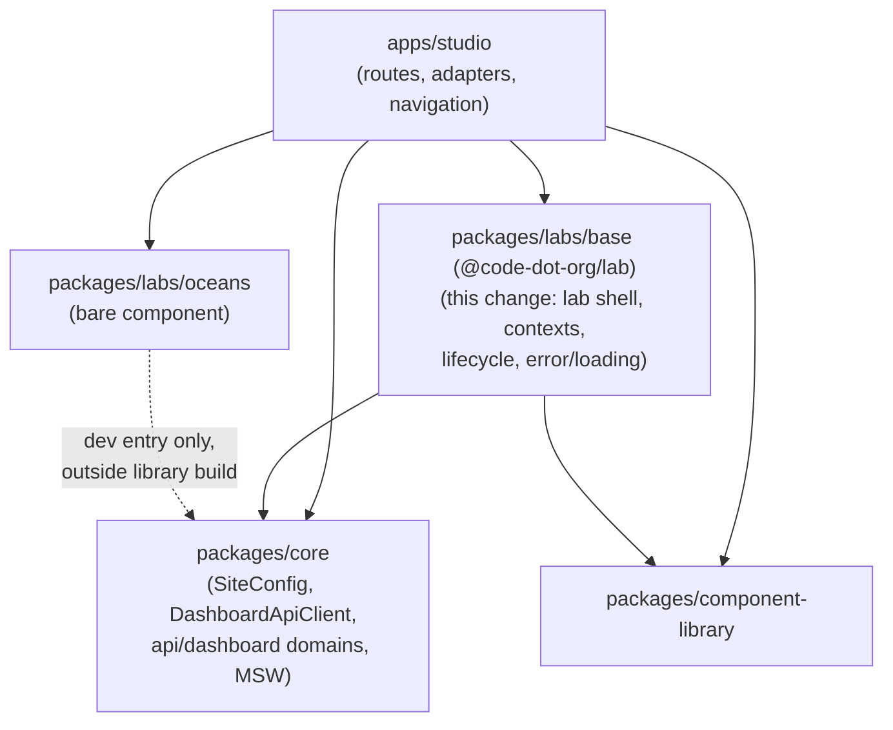
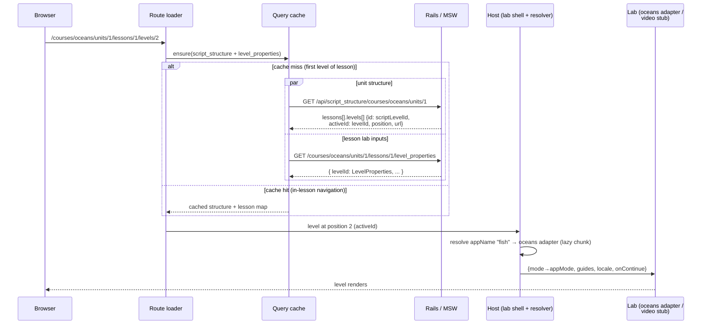

# Design: Lab2 host/loader in Studio

## Context

Studio (`frontend/apps/studio`) is a TanStack Router SPA served
under `/frontend-studio/`, with a single lab route
(`/projects/$labType/$channelId/edit`). The Lab2 framework role —
load level properties, resolve the lab from
`levelProperties.appName`, navigate a lesson, report completion —
exists only in the legacy webpack bundle (`apps/src/lab2`), coupled
to the legacy global redux store, `window.appOptions`, and the
code-studio header. The Rails APIs and level definitions are the
shared contract; the legacy coupling is what Studio replaces with
routes and its own state.

### Port source: the ngfp prototype branches

The `origin/ngfp/*` branches contain a prior reimplementation of the
framework as workspace packages. The API domain layer from that work
is already merged to staging (`core/src/api/dashboard/*`). Merge-base
with staging is 4f650e4298 (2026-05-12), so ports apply with modest
conflict surface.

- `origin/ngfp/music-lab` carries
  `frontend/packages/labs/base` (npm name `@code-dot-org/lab`): the
  legacy lab2 framework as a library, in two layers — a host slice
  (lab shell and wrappers, level-properties context, lifecycle
  notifier, registry, metrics, error/loading UI) and a lab-facing
  toolkit (instructions/validation/predict UI, resource panel with
  version history, dialogs, layout panels, JS interpreter, redux
  slices). On that branch the package is consumed by the lab
  packages themselves (music: 26 files, maze: 8; studio: 1;
  oceans: 0). This change ports the host slice only.
- Also on the branch, all deferred from this change:
  `frontend/packages/platform` (progress, projects, user),
  `frontend/packages/core/src/redux` (slice-injection store), and
  `frontend/packages/labs/standalone-video` (reference for an
  eventual real video lab).
- Source commits for attribution: 940265d3f24 (platform pkg),
  76833865743 (courses API), 84210111482 (levels/channels/projects
  APIs), 198b0887026 (tanstack-query routines), f78b02f99e8
  (standalone-video).
- No prototype branch built course/lesson/level routes; that part
  is new work.

### The AI for Oceans course

One lesson ("AI for Oceans"), eight levels, script name `oceans`
(single-unit course, `dashboard/config/courses/oceans.course`):

| pos | level                              | appName          | mode                |
|-----|------------------------------------|------------------|---------------------|
| 1   | Oceans_Video_Machine_Learning      | standalone_video | —                   |
| 2   | Oceans_FishVTrash                  | fish             | fishvtrash          |
| 3   | Oceans_CreaturesVTrashDemo         | fish             | creaturesvtrashdemo |
| 4   | Oceans_CreaturesVTrash             | fish             | creaturesvtrash     |
| 5   | Oceans_Video_Training_Data         | standalone_video | —                   |
| 6   | Oceans_Short                       | fish             | short               |
| 7   | Oceans_Video_Societal_Implications | standalone_video | —                   |
| 8   | Oceans_Long                        | fish             | long                |

The course uses no channels, no sources, and no validations;
completion is a single continue event per level. This is why oceans
is the first course: it exercises level loading, lab resolution,
navigation, and completion reporting while deferring the entire
persistence and validation stack.

### Verified facts

Verified against local Rails (rails runner + routes.rb):

- `Lesson#summarize_for_lab2_properties` returns all eight oceans
  levels with no level-type filter. Fish levels carry
  `appName: "fish"` and `mode`; StandaloneVideo levels carry
  `appName: "standalone_video"` and `levelData`; every level carries
  `finishUrl`. `scriptLevelId` is not in the payload.
- The milestone endpoint is
  `POST /milestone/:user_id/:script_level_id/:level_id`
  (`activities#milestone`); `user_id` is `0` for anonymous users.
- The `courses.api.ts` client already on staging targets
  `/api/v1/courses/...` endpoints that do not exist in Rails (no
  route, no controller, no MSW handler).
- `GET /api/script_structure/courses/:course/units/:pos` (existing)
  returns lessons with per-level `id` (the script_level id),
  `activeId` (the level id), explicit `position`, the canonical
  `/courses/...` level URL, and script and lesson names.
- `GET /api/user_progress/:script` returns per-level progress for
  signed-in users; `{signedIn: false}` otherwise.
- Core transports attach `X-CSRF-Token` from the `csrf-token` meta
  tag; Rails POSTs work in Vite Rails mode without extra wiring.
- Studio already depends on `@tanstack/react-query`.
- Staging core has no `/metrics` module; the observability plugin
  (`@code-dot-org/core/plugins/observability`) is the telemetry
  path. The prototype's metrics reporter extends a `core/metrics`
  module that exists only on the ngfp branches.
- Studio's root route already provides the MUI theme provider.
- The prototype's `labs/base` ships no tests.

## Goals / Non-Goals

**Goals:**

- AI for Oceans runs end-to-end in Studio at
  `/frontend-studio/courses/oceans/units/1/lessons/1/levels/1..8`,
  in MSW mode (backend-free) and in Vite Rails mode.
- A reusable `packages/labs/base` (`@code-dot-org/lab`) framework
  package that subsequent courses and course-native labs build on.
- Completion recorded for anonymous and signed-in users.
- The `oceans-lab` published artifact is unchanged.

**Non-Goals:**

- Project persistence (channels/sources), the validation framework,
  a client state store, Blockly labs (see "Deferred scope").
- The bubble progress bar and completion display, including
  `user_progress` reads and anonymous completion display (see
  "Progression display deferred").
- Real video playback (player, captions, fallback sources).
- A rich error page (illustration, reload action) — a simple error
  state ships; revisit later.
- `/s/...` URL aliases; production rollout (Studio is
  pre-production); teacher views (view-as-student, sections).

## Decisions

### Framework package at `packages/labs/base`

The framework ports as a workspace package, keeping the prototype's
path and npm name (`@code-dot-org/lab`). Its contents fall into
three categories: shared non-UI (types, lifecycle notifier,
registry, metrics, utils), shared UI (dialogs, resource panel,
instructions, layout), and framework (loading, rendering,
orchestration). Labs consume the first two; only the host consumes
the third. One package, not three: the categories share a spine
(a context module is framework on the provider side and shared
non-UI on the hook side), and the prototype's subpath exports
(`./dialogs`, `./contexts`, `./instructions`, `./interpreter`,
`./components`, `./resourcePanel`, `./hooks`) already encode
boundaries fine enough to split later, or to enforce with a lint
rule, without consumer churn. Keeping the prototype's name and path
also keeps `cherry-pick -x` viable for the port.

This change ports the host slice only: lab shell, level-properties
context, lifecycle notifier, registry, metrics reporter (bound to
the observability plugin), error boundary, loading UI. The error
boundary's fallback is a deliberately simple error state; the
prototype's full error page (illustration, reload action) is
deferred for a later revisit. The
lab-facing toolkit (instructions, resource panel, dialogs,
interpreter, redux slices, Blockly wrappers) arrives with
course-native labs (see "Deferred scope").

Alternatives considered:

- A studio-internal module — rejected: the package's intended
  consumers are lab packages, and apps are not importable, so a
  studio module would force a full extraction the moment the first
  course-native lab lands.
- Three packages along the category boundaries — rejected as
  premature: only the host slice is being ported, and the shared
  spine would force cross-package cycles or duplication.

Package dependencies (arrows point from consumer to dependency):



### Per-lab dependency rule

Embeddable labs stay bare: `oceans-lab` keeps zero framework
dependencies (preserving its external iframe-embedding use), and
all of its host wiring — level properties to props, completion
reporting, locale — lives in Studio-side adapters. Course-native
labs added in later changes import `@code-dot-org/lab` as their
toolkit, which is the package's intended consumption pattern. The
rule is per-lab and deliberate.

The rule is enforced deterministically, not by convention: an
ESLint import restriction in the embeddable lab's lint config
forbids `@code-dot-org/lab`, developed TDD style — a test asserts
the config rejects a violating import before the restriction is
added. The equivalent restriction for course-native labs (framework
subpaths only) is deferred until such a lab exists.

Alternatives considered: a blanket prohibition on labs importing
the framework package — contradicts the package's purpose and the
toolkit consumption pattern; blanket adoption — would couple
embeddable labs to the framework and break standalone embedding.

### URL drives level state; no client store

`/levels/$levelPosition` is the single source of truth for the
current level. The level-properties provider receives the level id
derived from the route, so no client state store is needed for
level switching. The prototype's progress slice exists because its
labs had no router; porting it would duplicate route state into a
store. The slice-injection store ports later for lab-owned state
only (see "Deferred scope").

### Lab resolution by appName

The course route resolves `levelProperties.appName` to a
lazy-loaded entrypoint: `fish` → the oceans adapter,
`standalone_video` → the video stub. An unrecognized appName
renders an unsupported-level state. The existing URL-keyed
`$labType` map continues to serve `/projects/...` routes.

### Video levels stubbed

The three video positions render a placeholder — level title plus a
continue affordance wired to the same completion flow as lab
levels. A real player (embed, captions, fallback sources,
localization) is its own scope; the prototype's standalone-video
package is the reference when that work is scheduled. The stub
keeps the eight-level progression and completion semantics intact.

### Route loader owns data

The route loader fetches two existing course-scoped endpoints in
parallel and caches both, so in-lesson navigation refetches nothing
and the shell does not remount:

- `/api/script_structure/courses/:course/units/:pos` — lesson
  structure, explicit positions, script_level ids, script and
  lesson names.
- `/courses/:course/units/:pos/lessons/:pos/level_properties` —
  per-level lab inputs.

The two payloads join on level id (structure `activeId` ↔
level_properties map key). The `/api/v1/courses` client on staging
stays unused. When completion display lands (see "Progression
display deferred"), `GET /api/user_progress/:script` serves
signed-in state, with the script name taken from the structure
payload.

Alternatives considered: the `/api/v1/courses` endpoints — do not
exist in Rails; level_properties alone — lacks script_level ids and
explicit ordering, forcing reliance on JSON key order.



### Host-owned milestone reporting

A new `activities` domain in `core/api/dashboard` posts
`{result, testResult}` to
`/milestone/{userId|0}/{scriptLevelId}/{levelId}`. The
`scriptLevelId` comes from the structure payload. Studio adapters
trigger the report on the lab's completion callback; lab packages
never report. No Rails changes.

Alternatives considered: adding `scriptLevelId` to the
level-properties serializer — unnecessary, an existing endpoint
already serves it; parsing ids out of `finishUrl` — fragile.

```mermaid
sequenceDiagram
    participant L as Lab
    participant A as Studio adapter
    participant ACT as activities domain
    participant API as Rails / MSW
    participant R as Router

    L->>A: onContinue()
    A->>ACT: reportMilestone(scriptLevelId, levelId, passed)
    ACT->>API: POST /milestone/{userId|0}/{scriptLevelId}/{levelId}
    API-->>ACT: ok (Rails: UserLevel row; MSW: scenario store)
    alt not last level
        A->>R: navigate to next position
    else last level
        A->>R: full-page navigation to finishUrl
    end
```

### MSW course scenarios

The existing fixture mechanism keys scenarios off the URL's
`channelId` slot, which course URLs lack. Course fixtures register
keyed by course name: a course URL in MSW mode activates that
course's scenario, serving the structure and level-properties
fixtures. The milestone handler writes completions to the scenario
store so `user_progress` reads reflect them.

### Progression display deferred

The site header is being rebuilt on the `stephen/rebrand` branch,
and the in-lesson progress bar must visually belong to that system.
To decouple the workstreams, this change ships prev/next links and
a "Level x of y" indicator only. The bubble bar, `user_progress`
reads, and anonymous completion display land with the header
follow-up. Progress recording (milestones, MSW scenario store) is
unaffected; only display is deferred.

### Deferred scope

Project persistence (`platform/projects`), the validation framework
(`platform/progress`), the slice-injection store, and the
Blockly/toolkit layers port in a follow-up change, gated on the
first course that needs them (a sources-backed lab such as music).
Oceans needs none of them; porting early adds review surface with
no exercised code path.

### Test strategy

TDD against the spec scenarios, shaped as a pyramid:

- **Unit (most)** — Vitest per package/module, written before the
  implementation: labs/base components, core/api queries and
  schemas, the structure↔lesson-map join, adapter prop mapping,
  position navigation logic.
- **Integration (some)** — studio route-level tests
  (testing-library + MSW + the real route tree): lab resolution
  from fixtures, in-lesson navigation reusing cache without shell
  remount, unsupported-appName and not-found states, milestone POST
  on continue.
- **E2E (few)** — one MSW-mode run-through of the eight-level
  course, if the e2e harness can serve Studio standalone; otherwise
  the integration layer covers the flow.

Each spec scenario maps to at least one test. Verification gates
per task batch: typecheck, package tests, lint, release dry-run.

**Accessibility gate:** all net-new UI (level navigation, video
stub, unsupported-appName state, loading/error fallbacks) passes
a11y-architect review for WCAG 2.2 before its PR is complete.

### Design-system UI

Net-new UI in this change — the level navigation (prev/next +
position indicator), the video stub, the unsupported-appName state,
and the simple error state — is built from design-system
components: MUI for Typography, Button, and IconButton (theme
overrides apply via the app-level theme provider), DSCO
`@code-dot-org/component-library` components otherwise. Styling
uses SCSS modules with semantic color variables. The ported
`Loading` overlay keeps its component-library spinner and semantic
variables. No bespoke one-off components unless no design-system
equivalent exists.

### Attribution

`git cherry-pick -x` where prototype commits apply cleanly (the
same-name port makes this viable for much of the package); where
trims diverge, commits carry a `Co-authored-by` trailer crediting
the prototype author plus the source commit hash in the message
body.

## Risks / Trade-offs

- [Structure and level_properties payloads disagree (`activeId` ↔
  map key)] → both derive from the same script_levels association;
  the loader fails with an error naming the level id. Positions are
  explicit in the structure payload, so no reliance on JSON key
  ordering.
- [The oceans lab may not support prop changes after mount
  (imperative init internally)] → the adapter remounts the lab per
  level; only the shell must survive navigation.
- [Anonymous progress semantics differ from legacy, which mirrors
  progress to localStorage] → milestone POSTs still fire for
  anonymous users, matching legacy server-side behavior; client
  display is deferred with the header. Revisit before broader
  rollout if anonymous-to-signed-in migration matters.
- [Serializer fields unused by the host (`useRestrictedSongs`,
  `isAssessment`, …)] → schemas stay permissive (passthrough) so
  unknown fields never fail validation.

## Migration Plan

PR sequence: (1) labs/base package; (2) course routes + navigation
+ fixtures; (3) adapters + video stub + milestone; (4) Rails-mode
verification. Each PR is independently green and revertable; there
is no data migration. No production exposure: Studio returns 404 in
production today and nothing in this change alters that.

## Open Questions

- Lesson-complete destination: the last level's `finishUrl` points
  at `/api/hour/finish/oceans` (certificate flow). The design
  navigates there with a full-page exit from the SPA; confirm
  during PR 3 review.
- Locale source for the oceans adapter's text-to-speech: the
  localization plugin locale vs a user preference endpoint. Default
  is the localization plugin.
