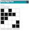

# Computer Science Principles #

## What is CS Principles?
The College Board has proposed a new course called AP® Computer Science Principles.  This  course is designed to be far more than a traditional introduction to programming - it is a rigorous, engaging, and approachable course that explores many of the big, foundational ideas of computing so that all students understand how these concepts are transforming the world we live in. The official AP® exam is set to go live in the 2016-17 school year with an exam and performance-based assessments.

Find more information about the College Board CS Principles project at: [http://apcsprinciples.org/](http://apcsprinciples.org/)

## Code.org's CS Principles Curriculum
Code.org is creating a complete curriculum consisting of daily lesson plans, videos, tutorials, tools, and assessments that covers the learning objectives from the [CS Principles Curriculum Framework](http://media.collegeboard.com/digitalServices/pdf/ap/comp-sci-principles-draft-cf-final.pdf). Check back often as batches of lessons will be released on a rolling basis from now until Summer 2015 when the entire curriculum will be publicly available. The resources will be distributed under a [Creative Commons License](http://creativecommons.org/licenses/by-nc-sa/3.0/).

<iframe width="560" height="315" src="//www.youtube.com/embed/mjMLCpXz3eo" frameborder="0" allowfullscreen></iframe>

### Features

- Access the world of web applications using a block to text JavaScript programming environment
- Build problem solving skills through the use of computational widgets
- Experience a blend of online, guided tutorials and open-ended, project-based learning
- Learn from a diverse cast of role models, from well-known tech celebrities to social innovators who are using CS to tackle society's problems
- Engage all students in constructing their own understanding of computer science concepts through equitable teaching practices and inquiry-based instructional strategies
- Prepare for the AP® CS Principles exam through a curriculum intentionally designed around the latest developments in the College Board framework, including built-in preparation for the performance tasks  
- Use, share, and customize the resources, as they are distributed under a [Creative Commons License](http://creativecommons.org/licenses/by-nc-sa/3.0/).

### Watch a preview of CS Principles

<iframe width="560" height="315" src="https://www.youtube.com/embed/15aqFQQVBWU" frameborder="0" allowfullscreen></iframe>

### Overview

Several documents describe the overarching themes and direction of the course.

- CS Principles [Curriculum Overview 2015](/files/CSPCurriculumOverview2015.pdf) (rev. Feb. 2015)
- An [image of the curriculum](/files/CSPCurriculumMap2015.png)
- [Unit Coverage of the CSP Framework](/files/CSPFrameworkCoverage.png)

 

## Lessons

| Link| Unit Description |
| :------------------:|-----------|
|   [Unit 1](/educate/csp/unit1) | **Digital Information** What can be represented with a single bit and how do we get a single bit of information from one place to another? This unit explores the technical challenges and questions that arise from the need to represent digital information in computers and transfer it between people and computational devices. Topics include: the digital representation of information - numbers, text, images, and communication protocols |
|*Coming Soon*| **The Internet** Students continue to work together to invent solutions and protocols to many of the problems that arise in the structure and function of the Internet. Topics include the Internet Protocol, DNS, TCP/IP, cryptography and other security and hacking concerns. Topics include: encryption, security, computationally hard problems, and internet protocols|
|*Coming Soon*| **Programming** Students learn the fundamentals programming constructs of javascript by solving problems with “turtle graphics.”  Then move on to programming simple event driven apps.  An emphasis is placed on enabling students to solve problems and write code in teams. |
|*Coming Soon*| **Data** Students continue programming and building web apps, now with a view towards data: processing it with algorithms, and the implications of storing data collected from and by others on the web.  Students explore “big data” by making queries against a data analysis api.|
|*Coming Soon*| **Explore and Create** Class time devoted to preparation and execution of the AP® Performance Tasks: Explore and Create.|

 

## Frequently Asked Questions

 

#### When will lessons be published?

Code.org’s CS Principles curriculum will be released publicly on a rolling basis as engineering and field testing of lessons permit. Batches of lessons may be released on a rolling basis from now until Summer 2015.  In Summer of 2015 the full curriculum will be available for viewing.  We will be making ongoing modifications (mostly adding supports) during the 2015-16 school year based on feedback from pilot instructors.
 

#### Can I test lessons and give feedback?

Yes, please!  As lessons are published on the website we invite anyone to try them out - both the lessons and any new tools or software - and let us know how it went.  Our desire is that the curriculum will be a living document and not something set in stone. We are open to changes or alternatives to lessons so please send us your feedback by providing comments in the documents themselves.

 

#### How/Where can I get professional development for this course?

In-person professional development for the Code.org CSP course will be available in select partner districts starting in summer 2015. After one year of piloting and refining the PD program we will make all of our PD agendas, schedules, and other materials available to the public. This includes all of our online and in-person PD programs.

 

#### How can I learn more about the progress of the curriculum?

We're now sending out a monthly status email for members of the Computer Science education community who are interested in peeking under the hood as we actively work to develop the curriculum and tools for the course. [Sign up for future emails](http://code.org/educate/csp/CSPStatus_Signup).

 

AP® is a registered trademark of the College Board.
