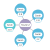
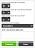

# Computer Science Principles #

## What is CS Principles?

[col-50]

In fall 2016, the College Board will launch its newest AP&reg; course, AP Computer Science Principles. The course introduces students to the foundational concepts of computer science and challenges them to explore how computing and technology can impact the world. The AP Program designed AP Computer Science Principles with the goal of creating leaders in computer science fields and attracting and engaging those who are traditionally underrepresented with essential computing tools and multidisciplinary opportunities.

For more information, visit [http://collegeboard.org/APCSP](http://collegeboard.org/APCSP).

[/col-50]

[col-50]

<%=view :display_video_thumbnail, id: "intro_csp", video_code: "jQm0z894CG0", play_button: 'center' %>

[/col-50]

## Code.org's AP CS Principles Curriculum

 Starting in the 2016-17 school year Code.org is recognized by the College Board as an endorsed provider of curriculum and professional development for AP® Computer Science Principles (AP CSP). This endorsement affirms that all components of Code.org CSP’s offerings are aligned to the AP Curriculum Framework standards and the AP CSP assessment. Using an endorsed provider affords schools access to resources including an AP CSP syllabus pre-approved by the College Board’s AP Course Audit, and officially recognized professional development that prepares teachers to teach AP CSP.

 * [Code.org 2016-17 AP CSP Endorsed Syllabus ID #1648108v1](/files/CSPSyllabusApril2016.pdf)
 * [Instructions: How to add our authorized syllabus to your AP Course Audit](https://docs.google.com/document/export?format=pdf&id=12VOTkJv9R_Db-YDvNjNYkhZ5nnAw8eqFkmwscM8W16M)

 [<button>View Curriculum</button>](#lessons)

### Features

- Access to daily lesson plans, covering roughly 150 hours of material with linked activity guides and assessment support
- Build problem solving skills through the use of computational widgets such as the [pixelation](/pixelation) and [text compression](/textcompression) widgets
- Rapidly develop shareable web applications using [App Lab](/educate/applab): Code.org's online, block to text, JavaScript programming environment
- Experience a blend of online, guided tutorials and open-ended, project-based learning
- Learn from a diverse cast of role models, from well-known tech celebrities to social innovators who are using CS to tackle society's problems
- Engage all students in constructing their own understanding of computer science concepts through equitable teaching practices and inquiry-based instructional strategies
- Prepare for the AP® CS Principles exam through a curriculum intentionally designed around the latest developments in the College Board framework, including built-in preparation for the performance tasks  
- Use, share, and customize the resources, as they are distributed under a Creative Commons Attribution NonCommerical ShareAlike License see our [Terms of Service](https://code.org/tos). If you are interested in licensing Code.org materials for commercial purposes, [contact us](https://code.org/contact).

[<button>See App Lab in action</button>](/educate/applab) &nbsp;&nbsp; [<button>Apply for professional learning</button>](/educate/professional-learning/cs-principles)

### Watch a video from the [CS Principles Video Library](https://www.youtube.com/playlist?list=PLzdnOPI1iJNfV5ljCxR8BZWJRT_m_6CpB)

	<%=view :display_video_thumbnail, id: "images_pixels", video_code: "15aqFQQVBWU", play_button: 'center' %>

	<%=view :display_video_thumbnail, id: "digital_compression", video_code: "By30SCp-Tsw", play_button: 'center' %>

	<%=view :display_video_thumbnail, id: "the_internet", video_code: "ZhEf7e4kopM", play_button: 'center' %>

## Overview

Several documents describe the overarching themes and direction of the course.

- [One-pager](/files/programs/CSP_1-pager_final.pdf)
- **New** [2016 AP Endorsed Syllabus and Overview](/files/CSPSyllabusApril2016.pdf)
- [Professional development overview](/files/CSPPDoverview.pdf)

## Lessons

### Archive of the '15-'16 version of the curriculum
*All of the '15-'16 units are still available to use from the [2015-2016 version of the course](/educate/csp/archive/summary). Learn more about the updates [here](https://docs.google.com/document/export?format=pdf&id=1ElvZenQSCigqBXKEHnXYRruck7umCJd699aippGCfLQ).*

### 2016 - 2017 Lessons
*In response to feedback from our 2015-2016 pilot teachers, we are reordering, condensing, and clarifying lesson content. We will be re-releasing each unit here as soon as it is ready.*

| Link | Unit Description |
| :------------------:|-----------|
|   [Unit 1](https://curriculum.code.org/csp/unit1/)  | **The Internet:** This unit begins exploring the technical challenges and questions that arise from the need to represent digital information in computers and transfer it between people and computational devices. In the second half of the unit, students solve problems similar ones that had to be solved to build the real Internet. Students design their own versions of protocols, each one layered on the previous one, in a process that mimics the layered sets of protocols on the real Internet. Topics include: the digital representation of numbers and text, Internet Protocol, DNS, and TCP/IP. |
|    [Unit 2](https://curriculum.code.org/csp/unit2/)   | **Digital Information:** This unit further explores the ways that digital information is encoded, represented and manipulated. In this unit students will look at and generate data, clean it, manipulate it, and create and use visualizations to identify patterns and trends.|
|  Unit 3 - Coming Soon| **Algorithms and Programming:** This unit introduces students to programming in the JavaScript language and creating small applications (apps) that live on the web. This introduction places a heavy emphasis on understanding general principles of computer programming and revealing those things that are universally applicable to any programming language.    *'16-'17 content coming soon:* Unit 3 will be comprised primarily of content from Lessons 1 - 8 from the '15 - '16 version of the [Programming Unit](/educate/csp/archive/unit3) |
|  Unit 4 - Coming Soon| **Big Data and Privacy:** The data rich world we live in also introduces many complex questions related to public policy, law, ethics and societal impact. In many ways this unit acts as a unit on current events. It is highly likely that there will be something related to big data, privacy and security going on in the news at any point in time. The major goals of the unit are 1) for students to develop a well­rounded and balanced view about data in the world around them and both the positive and negative effects of it and 2) to understand the basics of how and why modern encryption works.   *'16-'17 content coming soon:* Unit 4 will be comprised primarily of content from lessons 10 - 14 from the '15 - '16 version of the [Data Unit](/educate/csp/archive/unit4), which cover the implications of big data, and lessons 13 - 19 from the '15 - '16 version of the [Internet Unit](/educate/csp/archive/unit2), which build up to how modern asymmetric encryption works. |
|  Unit 5 - Coming Soon| **Building Apps:** This unit continues to develop students’ ability to program in the JavaScript language, using Code.org’s App Lab environment to create a series of small applications (apps) that live on the web, each highlighting a core concept of programming. In this unit students transition to creating event­-driven apps. The unit assumes that students have learned the concepts and skills from Unit 3, namely: writing and using functions, using simple repeat loops, being able to read documentation, collaborating, and using the Code Studio environment with App Lab.   *'16-'17 content coming soon:* Unit 5 will be comprised primarily of content from Lessons 9 - 29 from the '15 - '16 version of the [Programming Unit](/educate/csp/archive/unit3) |
|  Unit 6 - Coming Soon| **Create and Explore PT:** Class time devoted to preparation and execution of the AP® Performance Tasks: Explore and Create.   *'16-'17 content coming soon:* Unit 6 will be the same content as '15 - '16 version of the [Performance Task Unit](/educate/csp/archive/unit5), with the suggested modification to complete the Create Performance Task before the Explore Performance Tasks.  |

### Chat about CSP in the CSP forum
We have forums for educators to discuss and trade ideas about CSP and talk about the curriculum.  Code.org forums are used for all of our courses K-12 and can be found at [forum.code.org](http://forum.code.org).  For CSP there are two forums that are most useful:

* [General CSP forum](http://forum.code.org/c/csp)
* [Unit 1 Lesson-Specific Forums](http://forum.code.org/c/csp-unit1)
* [Unit 2 Lesson-Specific Forums](http://forum.code.org/c/csp-unit2)
* [Unit 3 Lesson-Specific Forums](http://forum.code.org/c/csp-unit3)
* [Unit 4 Lesson-Specific Forums](http://forum.code.org/c/csp-unit4)
* [Unit 5 Lesson-Specific Forums](http://forum.code.org/c/csp-unit5)
* [Post-AP Stage-Specific Forums](http://forum.code.org/c/csp-post-ap)

**_Note_** _that the forums still correspond to the '15-'16 curriculum, as our pilot group is still actively working through the materials_

## Frequently Asked Questions

#### How can I access answer keys? 
Any teacher can apply for Code Studio access to protected teacher-only materials (answer keys, etc) through <strong><a href = "https://docs.google.com/forms/d/1f5QPKi3F_3nBDR8q9BcXCqixzY7SCQd7Seob0-JYizU/viewform" target="_blank">this form</a></strong>.

 

#### How can I communicate with other teachers who are using the curriculum? 
Check out our forum at <a href ="forum.code.org" target=_blank>http://forum.code.org</a>. There you'll find a space for general CSP discussion as well as unit- and lesson-specific threads.

 

#### Where did all the lessons go?
For the '16-'17 school year, we are revising the '15-'16 version of the curriculum (see a summary of the changes [here.](https://docs.google.com/document/export?format=pdf&id=1ElvZenQSCigqBXKEHnXYRruck7umCJd699aippGCfLQ)) We will re-release each unit as soon as it is ready. You can still access all of the ['15-'16 archived materials](/educate/csp/archive/summary). 

 
#### Can I give feedback on the lessons?

Yes, please! Our desire is that the curriculum will be a living document and not something set in stone. We are open to changes or alternatives to lessons so please send us your feedback by using the CSP forum.

 

#### How/Where can I get professional development for this course?

In-person professional development for the Code.org CSP course will be available in select partner districts starting in Summer 2015. After one year of piloting and refining the PD program we will make all of our PD agendas, schedules, and other materials available to the public. This includes all of our online and in-person PD programs.

 

#### How can I learn about what's new or changing with the curriculum?

We send out monthly updates! [Sign up for future emails](http://code.org/educate/csp/CSPStatus_Signup).

 

AP® is a registered trademark of the College Board.
