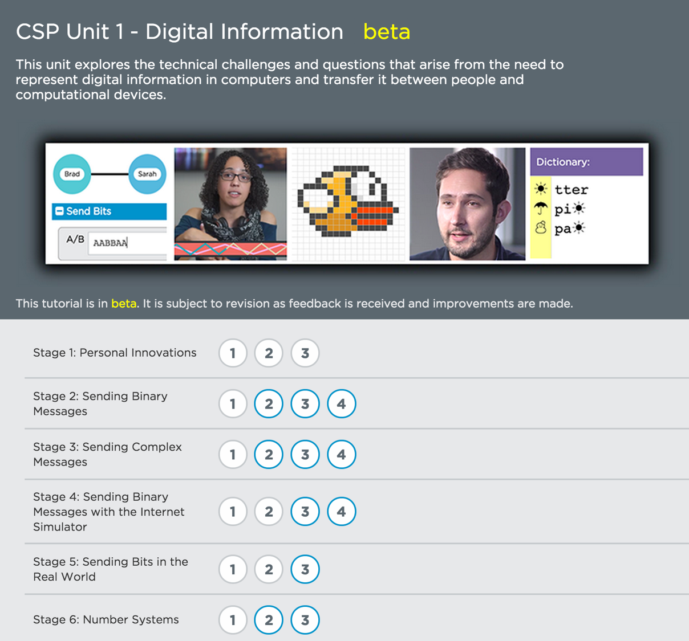

# Computer Science Principles Lessons #

## Unit 1

### Quick Links

[General CSP Forum](http://forum.code.org/c/csp) | [Unit 1 Discussion Forum](http://forum.code.org/c/csp-unit1) |  [CSP Unit 1 in Code Studio](https://studio.code.org/s/cspunit1)  | [Writing Team](team) 

<table>
	<tr>
		<td width=66% style="padding: 3px; border-color: white">
		<h3>Important notes about lessons and digital tools</h3>
		<ul>
				<li>To use the tools in this course and be able to see your students' progress, first <a href="/teacher-dashboard#/sections">create a new section</a> in the teacher dashboard. The recommended Login Type is 'Email' and the Course is 'cspunit1'. <i>Note:</i> Students must be part of the same section to use the Internet Simulator together.</li> 
				
				<li> When you go to <a href="https://studio.code.org/s/cspunit1">Unit 1 in Code Studio</a> each "stage" number corresponds to the lesson number.</li> 

				<li> Unlike other Code.org courses, lessons for CSP on Code Studio are <strong>not self-guided</strong>. They require specific structure and context provided by the classroom teacher through the lesson plan. 

				<li>  When exploring the curriculum, or preparing for a lesson, <strong>start with the lesson plan</strong>, which contains all of the necessary details and links for how and when to use the online tools.

				<li>The course on Code Studio is in beta, so it is subject to revision as feedback is received and improvements are made.
				</ul>
		</td>
		<td style="padding: 3px; border-color: white" align=center>
			<a href="https://studio.code.org/s/cspunit1">
			https://studio.code.org/s/cspunit1</a>
		</td>
</tr>
</table>

 
### Resources

<ul>
<li> You can view all of the lessons in Unit 1 through <strong><a href = "http://bit.ly/csp-unit1" target="_blank">this Google Drive folder</a></strong></li>
<li> If you're a teacher, you can apply for Code Studio access to protected, teacher-only materials (answer keys, etc) through <strong><a href = "https://docs.google.com/forms/d/1f5QPKi3F_3nBDR8q9BcXCqixzY7SCQd7Seob0-JYizU/viewform" target="_blank">this form</a></strong> </li>
</ul>

  

| Lesson Description| Lesson Plan | 
| ------------------|:-----------:|
| **Lesson 01 - Impact of Innovation** Students are asked to consider the impact of technological innovation on their lives and multiple generations of their family.  e.g. “What technological innovation would your grandparent say affect them the most?”|  |
| **Lesson 02 - Sending Binary messages** Students are asked to consider messages that have binary states (which we call state ‘A’ and ‘B’ for the time being) and what can be communicated with a single bit.  Students use household materials to build a physical device to send a single binary message to a friend some number of feet away and out of their line of sight. | |
| **Lesson 03 - More complex messages** Students are asked to send more complex messages without changing their bit-sending device.  What can be represented with sequences of A/B state messages?  Develop a protocol for sending a message to a friend that has at least 4 possibilities.| |
| **Lesson 04 - Bit Sending Widget** Recognizing that since every bit-sending device made in the class sends binary messages, we lose the physical bit sending devices (they are cumbersome) and replace with an abstraction - the bit sending widget which simulates a simplex wire that can hold a state until the next state is set.  Students invent a call-response protocol and use the bit sending widget to send the bits - coordination, speed and timing become an issue.|  |
| **Lesson 05 - Sending Bits in the Real World** In groups, students research the various mediums over which bits are sent in the real world.  Focus on electricity, fiber optic, radio waves (WiFi, satellite), sound.  Connection: if we can find a way for a medium to reliably represent two states, we can use it to send any digital information.|  |
| **Lesson 06 - Number Systems** Known as the “circle, triangle, square” activity, students effectively invent a base-3 number system but using circles, triangles and squares as the symbols instead of arabic numerals.  Objective is to understand that a you can represent any number, with any agreed-upon set of symbols that appear in an agreed-upon order.  Use this to connect to the binary number system and hex. |  |
| **Lesson 07 - Binary numbers** A little practice with binary numbers (finally using symbols “0” and “1”) and their properties (powers of 2, counting, etc.) since some facility is helpful.  Students make a “Binary flippy-do” to help practice.|  | 
| **Lesson 08 - Sending numbers** Students return to the sending bits widget - this version uses 0s and 1s, and also automatically sends/recvs bits at the bit-rate set by the user.  Student challenge is to invent a protocol for sending the cartesian coordinates for a line-drawing image that has at least 5 points.|  | 
| **Lesson 09 - Encoding Numbers in the Real World** Another mini-research project about number systems used around the world.  This lesson might get deprecated, or combined with text in the real world lesson.1|  |
| **Lesson 10 - Encoding and Sending Text Text** Students invent their own binary encoding for the text in order to send a text message to a friend on the bit-sending widget.  Students create their own system, but are shown ASCII at the end of the lesson.|  | 
| **Lesson 11 - Sending formatted Text** Students must invent a way to, using only ASCII text, send formatted text (font size, color, position, etc.) to a friend.  Students effectively invent some version of HTML.|  | 
| **Lesson 12 - Bytes and File Sizes** Students learning about Bytes (kilo, mega, giga, etc.) and are asked to look into the sizes of various files on their computer.  Connect to HTML - sending of formatted text.|  | 
| **Lesson 13 - Text Compression** Students consider how they might send more information in less time if they can’t improve the transmission rate - compression!  Students use a widget to effectively do a version of LZW compression by hand. Connecting threads about algorithms, efficiency, privacy, abstraction and procedural abstraction in programming.|  | 
| **Lesson 14 - Encoding B&W images** Students invent a way to encode B&W images in binary.  Two important points come out: 1. the need for meta data in the information representation (width/height of the image) 2. That computer screens emit light and therefore “1” means turn the light on (white) and “0” means turn it off (black) -- This is important for standard color representations later.| | 
| **Lesson 15 - Encoding Color images** Students learn about RGB (the physics) and have to choose how many bits will be needed to represent each pixel and how many colors are possible. Metadata conveying width, height, and now the number of bits used to represent each pixel must be included in the image encoding, along with the pixel data for the picture to be represented properly.  Knowing Hex becomes an asset here if you want many colors.| |
| **Mini Project - Personal Favicon assignment** This is the small project that comes out of lesson 15. Students use the pixelation widget to encode the bits for 16x16 image that represents them somehow. | | 
|**Lesson 16 - Lossy Compression and File Formats** This lesson is an investigation of different kinds of file formats that exist in the real world.  The lesson begins with students exploring a mock “lossy” text compression scheme as a way to learn about “lossy” compression. Pairs of student research a real image, text, or sound encoding file format and to determine what kind of compression it uses and the theory behind it. |  |

 

| Unit 1 Assessment | Lesson Plan | Student Project Guide |
| ------------------|:-----------:| :-----------:|
| **Practice performance task -  Encode a complex piece of information** Students must consider a complex type of information that has not been considered in class and invent a way to encode it in binary.  Students must present their file encoding protocol and respond to reflection prompts in writing.  |   |  |
