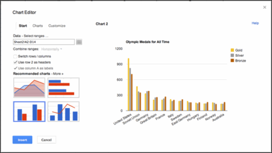
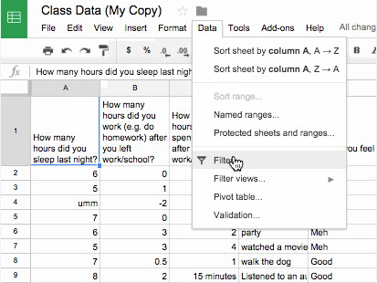
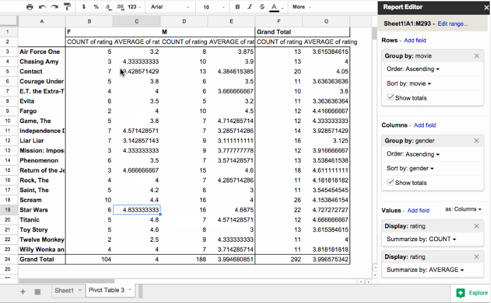

# CS Principles - Data Tools

The second chapter of Unit 2 of the CS Principles curriculum incorporates data tools to teach students about data collection and visuzalization. The following table provides resources which provide additional support for different tools.

* For general help on **Microsoft Excel**, visit <a href="https://support.office.com/en-us/excel" target="_blank">this support page</a>.
* For general help on **Google Sheets**, visit <a href="https://support.google.com/docs/?hl=en#topic=2811806" target="_blank">this support page</a>.

<table cellpadding="10">
	<colgroup>
		<col width="24%" style="border:1px solid #999999;">
		<col width="38%" style="border:1px solid #999999;">
		<col width="38%" style="border:1px solid #999999;">
	</colgroup>
	<thead>
		<tr>
			<th class="centertext">Lesson</th>
			<th class="centertext">Microsoft Resources</th>
			<th class="centertext">Google Resources</th>
		</tr>
	</thead>
	<tbody>
		<tr>
			<td>
				Lesson 7 - Introduction to Data 
				<a href="hhttps://curriculum.code.org/csp/unit2/7" target="_blank">Lesson Plan</a> | 
				<a href="https://studio.code.org/s/csp2-2019/stage/7/puzzle/1" target="_blank">Code Studio</a>
			</td>
			<td>
				<ul>
					<li>
						<a href="https://support.office.com/en-us/article/Surveys-in-Excel-hosted-online-5fafd054-19f8-474c-97ec-b606fcda0ff9" target="_blank">
							Creating an Excel survey in OneDrive
						</a>
					</li>
					<li>
						<a href="https://support.office.com/en-us/article/Create-a-survey-ea52a787-822e-4f7e-b5ed-77bb14df3aba" target="_blank">
							Creating and planning a survey
						</a>
					</li>
				</ul>
				
			</td>
			<td>
				<ul>
					<li>
						<a href="https://support.google.com/docs/topic/6063584?hl=en&ref_topic=1360904" target="_blank">
							General help with Google Forms
						</a>
					</li>
				</ul>
				
			</td>
		</tr>
		<tr>
			<td>
				Lesson 11 - Making Data Visualization 
				<a href="https://curriculum.code.org/csp/unit2/11/" target="_blank">Lesson Plan</a> | 
				<a href="https://studio.code.org/s/csp2-2019/stage/11/puzzle/1" target="_blank">Code Studio</a>
			</td>
			<td>
				<ul>
					<li>
						<a href="https://support.office.com/en-us/article/Create-a-chart-in-Excel-2016-for-Windows-cd131b77-79c7-4537-a438-8db20cea84c0" target="_blank">
							Create a chart in Excel
						</a>
					</li>
					<li>
						<a href="https://support.office.com/en-us/article/Available-chart-types-in-Office-2016-for-Windows-009130aa-04ce-498f-a934-b8917f2365b3" target="_blank">
							Available chart types in Excel
						</a>
					</li>
				</ul>
				
			</td>
			<td>
				<ul>
					<li>
						<a href="https://support.google.com/docs/topic/1361474?hl=en&ref_topic=2811806" target="_blank">
							Create and edit charts
						</a>
					</li>
				</ul>
				
			</td>
		</tr>
		<tr>
			<td>
				Lesson 13 - Cleaning Data 
				<a href="https://curriculum.code.org/csp/unit2/13" target="_blank">Lesson Plan</a> | 
				<a href="https://studio.code.org/s/csp2-2019/stage/13/puzzle/1" target="_blank">Code Studio</a>
			</td>
			<td>
				<ul>
					<li>
						<a href="https://support.office.com/en-us/article/Filter-data-in-an-Excel-table-7D8E9739-2898-4BFE-9D0F-C6204E6E5C8A" target="_blank">
							Filter data in an Excel table
						</a>
					</li>
					<li>
						<a href="https://support.office.com/en-us/article/Sort-data-in-a-range-or-table-F92F26C6-470D-4B09-A0E9-E5C3B60A8A7A" target="_blank">
							Sort data in a table
						</a>
					</li>
					<li>
						<a href="https://support.office.com/en-us/article/Sort-and-filter-data-FFB9FCB0-B9CB-48BF-A15C-8BEC9FD3A472" target="_blank">
							MS Excel Video: Sort and filter data
						</a>
					</li>
				</ul>
				
			</td>
			<td>
				<ul>
					<li>
						<a href="https://support.google.com/docs/answer/3540681?hl=en&ref_topic=1361472" target="_blank">
							Filter your data in Google Sheets
						</a>
					</li>
				</ul>
				
			</td>
		</tr>
		<tr>
			<td>
				Lesson 14 - Creating Summary Tables 
				<a href="https://curriculum.code.org/csp/unit2/14" target="_blank">Lesson Plan</a> | 
				<a href="https://studio.code.org/s/csp2-2019/stage/14/puzzle/1" target="_blank">Code Studio</a>
			</td>
			<td>
				<ul>
					<li>
						<a href="https://support.office.com/en-us/article/Create-a-PivotTable-in-Excel-2016-to-analyze-worksheet-data-c875f798-78cf-49a2-9f79-c842dcdd2869" target="_blank">
							Create a PivotTable in Excel to analyze worksheet data
						</a>
					</li>
				</ul>
				
			</td>
			<td>
				<ul>
					<li>
						<a href="https://support.google.com/docs/answer/1272898?hl=en&ref_topic=1258755&rd=1">
							Creating and editing pivot table reports in Google Sheets
						</a>
					</li>
				</ul>
				
			</td>
		</tr>
	</tbody>
</table>
