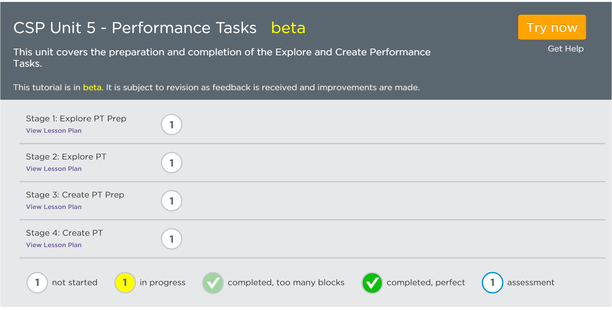

# Computer Science Principles Lessons #

## Unit 5

### Quick Links

[General CSP Forum](http://forum.code.org/c/csp) | [Unit 5 Discussion Forum](http://forum.code.org/c/csp-unit5) | [CSP Unit 5 in Code Studio](https://studio.code.org/s/cspunit5)  | [Writing Team](team) 

<table>
	<tr>
		<td width=66% style="padding: 3px; border-color: white">
		<h3>Important notes about lessons and digital tools</h3>
		<ul>
				<li>To use the tools in this course and be able to see your students' progress, you will continue to use the section you set up for Units 1 - 4. When moving on to Unit 5, from the <a href="/teacher-dashboard#/sections">sections list</a> of the teacher dashboard, you can simply click the 'Edit' button for your section and toggle the Course dropdown to 'cspunit5'. You and your students will still be able to access their work from the previous unit.
				
				<li> When you go to <a href="https://studio.code.org/s/cspunit5">Unit 5 in Code Studio</a> each "stage" number corresponds to the lesson number.</li> 

				<li> Unlike other Code.org courses, lessons for CSP on Code Studio are <strong>not self-guided</strong>. They require specific structure and context provided by the classroom teacher through the lesson plan. 

				<li>  When exploring the curriculum, or preparing for a lesson, <strong>start with the lesson plan</strong>, which contains all of the necessary details and links for how and when to use the online tools.

				<li>The course on Code Studio is in beta, so it is subject to revision as feedback is received and improvements are made.
				</ul>
		</td>
		<td style="padding: 3px; border-color: white" align=center>
			<a href="https://studio.code.org/s/cspunit5">
			https://studio.code.org/s/cspunit5</a>
		</td>
</tr>
</table>
### Resources

<ul>
	
	<li> If you're a teacher, you can apply for Code Studio access to protected, teacher-only materials (answer keys, etc) through <strong><a href = "https://docs.google.com/forms/d/1f5QPKi3F_3nBDR8q9BcXCqixzY7SCQd7Seob0-JYizU/viewform" target="_blank">this form</a></strong>. Note that you only need to request access once, and you will have access to answers across all units.
	</li>
</ul>

  

| Lesson Description| Lesson Plan | 
| ------------------|:-----------:|
| **Lesson 01 - Preparing for the Explore PT** This is the last lesson before students start working individually on their projects without teacher support.  As such the lesson is meant to give students a way to answer any final questions they have about the Explore Performance Task. In addition students will review good research practices so they are fresh in their minds when they start the PT the next day. |  |

|Performance Task 1 of 2 | Lesson Plan | Student Guide |
| ------------------|:-----------:| :-----------:|
| **Lesson 02 - Explore Performance Task** For 8 days, students work individually on their projects without teacher support. At the end of the 8th day, each student will submit his or her computational artifact and written responses to the teacher. |  |  |

| Lesson Description| Lesson Plan | 
| ------------------|:-----------:|
| **Lesson 03 - Preparing for the Create PT** This is the last lesson before students start working individually on their projects without teacher support.  As such, the lesson is meant to give students a way to answer any final questions they have about the Create Performance Task. In addition, students will review good collaborative programming practices so they are fresh in their minds when they start the PT the next day. |  | 

| Performance Task 2 of 2 | Lesson Plan | Student Guide |
| ------------------|:-----------:| :-----------:|
|  **Lesson 04 - Create Performance Task** For 12 days, students should work on their projects without teacher support. Every student will need a collaborative partner with whom they will give and receive feedback. At the end of the 12th day, each student will submit his or her video and written responses to the teacher.|  |  |
