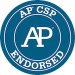

<link href="/shared/css/course-blocks.css", type="text/css", rel="stylesheet"></link>

# Computer Science Principles

## What is CS Principles?

In 2016, the College Board launched AP&reg;  Computer Science Principles. The course introduces students to the foundational concepts of computer science and challenges them to explore how computing and technology can impact the world. The AP Program designed AP Computer Science Principles with the goal of creating leaders in computer science fields and attracting and engaging those who are traditionally underrepresented with essential computing tools and multidisciplinary opportunities. 

For more information, visit [http://collegeboard.org/APCSP](http://collegeboard.org/APCSP).

<%=view :display_video_thumbnail, id: "intro_csp", video_code: "jQm0z894CG0", play_button: 'center', letterbox: 'false' %>

[col-50]

<%= view :course_wide_block, cta_link: CDO.studio_url('/courses/csp'), cta_text: 'View course', lesson_plans: 'https://curriculum.code.org/csp', img: CDO.code_org_url('/shared/images/banners/small-purple-icons.png'), title: 'Computer Science Principles', ages: 'Recommended for Grades 9-12', description: 'Computer Science Principles is a course designed to prepare students (and teachers) who are new to computer science for the AP CS Principles exam. The course covers many topics including the Internet, Big Data and Privacy, and Programming and Algorithms.'%>

[/col-50]

## Professional Learning

Our middle and high school programs offer year-round support. The program kicks off with a 5-day summer workshop where you'll have an opportunity to work hands-on with the curriculum and meet other teachers from your area. Throughout the year, we offer online support for upcoming units, forum support, and 1-day quarterly workshops. You don't need any prior computer science experience to get started. And teachers love it! 90% rank it the best professional development ever.

**General applications for the 2018-19 CS Principles Professional Learning Program will open in January, 2018.** 

If you are interested in joining in 2018-19, sign up below to be added to our contact list. 

[<button>Tell me when applications open!</button>](https://studio.code.org/pd/regional_partner_contact/new) [<button>Learn more</button>](/educate/professional-learning/cs-principles)

## Code.org's AP CS Principles Curriculum

Code.org is recognized by the College Board as an endorsed provider of curriculum and professional development for AP® Computer Science Principles. This endorsement affirms that all components of Code.org CS Principles’s offerings are aligned to the AP Curriculum Framework standards and the AP CS Principles assessment. Using an endorsed provider affords schools access to resources including an AP CS Principles syllabus pre-approved by the College Board’s AP Course Audit, and officially recognized professional development that prepares teachers to teach AP CS Principles. Our curriculum is available at no cost for anyone, anywhere to teach.

 * [Code.org 2017-18 AP CS Principles Endorsed Syllabus](/files/CSPSyllabusMay2017.pdf)
 * [Instructions: How to add our authorized syllabus to your AP Course Audit](https://drive.google.com/open?id=0B21d4g64Z62YSVptX3JKcWdiVWlKWVc5MWlXQldkUmVxLXFZ)

## Curriculum Resources and Features

- [2017 AP Endorsed Syllabus and Overview](/files/CSPSyllabusMay2017.pdf)
- [Course Materials List](#materials)
- [CS Principles Video Library](https://www.youtube.com/playlist?list=PLzdnOPI1iJNfV5ljCxR8BZWJRT_m_6CpB)

[col-33]

[
](/files/CSP_CurriculumGuide_2017_forWeb.pdf)

The <a href="/files/CSP_CurriculumGuide_2017_forWeb.pdf">Curriculum Guide</a> contains details on the classroom and student practices that flow throughout the course, overviews of each unit, and implementation considerations.

[/col-33]

[col-33]

[
](https://curriculum.code.org/csp)

<a href="https://curriculum.code.org/csp">Daily lesson plans</a> come with detailed instructions, activity guides, assessments, standards mappings, and more

[/col-33]

[col-33]

[
](https://studio.code.org/home)

Create and manage your classroom sections, as well as check student progress, administer assessments, and integrate with your Google or Clever classroom, all from your <a href="https://studio.code.org/home">Teacher Dashboard</a>.

[/col-33]

&nbsp;

 

[col-33]

[
](/files/CSPSyllabusMay2017.pdf)

This <a href="/files/CSPSyllabusMay2017.pdf">2017 AP Endorsed Syllabus</a> is a place-holder for something colorful!

[/col-33]

[col-33]

Students get hands on with concepts like binary and pixels through <a href="/educate/csp/widgets">computational widgets</a>

[/col-33]

[col-33]

 Quickly create shareable apps with <a href="/educate/applab">Code.org's App Lab</a> - an online block to text, JavaScript programming environment. 

[/col-33]

&nbsp;

## Unit Overview

<%= view :course_wide_block, cta_link: CDO.studio_url('/s/csp1'), cta_text: 'View unit', lesson_plans: 'https://curriculum.code.org/csp/unit1/', img: CDO.code_org_url('/shared/images/banners/small-purple-icons.png'), title: 'Unit 1', ages: 'The Internet', description: "Students learn how the multi-layered systems of the Internet function as they collaboratively solve problems and puzzles about encoding and transmitting data, both 'unplugged' and using Code.org's Internet Simulator."%>

[col-50]

<%= view :course_wide_block, cta_link: CDO.studio_url('/s/csp2'), cta_text: 'View unit', lesson_plans: 'https://curriculum.code.org/csp/unit2/', img: CDO.code_org_url('/shared/images/banners/small-purple-icons.png'), title: 'Unit 2', ages: 'Digital Information', description: 'Using a variety of tools, students look at, generate, clean, and manipulate data to explore the relationship between information and data. Students also create and use visualizations to identify patterns and trends.'%>

[/col-50]

<%= view :course_wide_block, cta_link: CDO.studio_url('/s/csp3'), cta_text: 'View unit', lesson_plans: 'https://curriculum.code.org/csp/unit3/', img: CDO.code_org_url('/shared/images/banners/small-purple-icons.png'), title: 'Unit 3', ages: 'Algorithms and Programming', description: "In this unit, students learn the JavaScript language with turtle programming in Code.org's App Lab. Students are introduced the general principles of algorithms and program design that are applicapble to any programming language."%>

[col-50]

<%= view :course_wide_block, cta_link: CDO.studio_url('/s/csp4'), cta_text: 'View unit', lesson_plans: 'https://curriculum.code.org/csp/unit4/', img: CDO.code_org_url('/shared/images/banners/small-purple-icons.png'), title: 'Unit 4', ages: 'Big Data and Privacy', description: 'Students research current events around the complex questions related to public policy, law, ethics, and societal impact. Students are also introduced to the basics of how and why modern encryption works.'%>

[/col-50]

<%= view :course_wide_block, cta_link: CDO.studio_url('/s/csp5'), cta_text: 'View unit', lesson_plans: 'https://curriculum.code.org/csp/unit5/', img: CDO.code_org_url('/shared/images/banners/small-purple-icons.png'), title: 'Unit 5', ages: 'Building Apps', description: "Students continue learning how to program in the JavaScript language. Using Code.org's App Lab environment, students create a series of applications that live on the web. Each app highlights a core concept of programming."%>

[col-50]

[/col-50]

<%= view :course_wide_block, cta_link: CDO.studio_url('/s/csp-ap'), cta_text: 'View unit', lesson_plans: 'https://curriculum.code.org/csp/csp-ap/', img: CDO.code_org_url('/shared/images/banners/small-teal-icons.png'), title: 'AP Tasks', ages: 'Explore and Performance Tasks', description: 'Students design a project plan, then work on and complete their AP Performance Task projects for submission to the College Board.'%>

[col-50]

<%= view :course_wide_block, cta_link: CDO.studio_url('/s/csp-postap'), cta_text: 'View unit', img: CDO.code_org_url('/shared/images/banners/small-teal-icons.png'), title: 'Post-AP', ages: 'Making Data-backed Apps', description: "After the AP Test, students learn how to use App Lab's database capabilities to make apps that sotre data in the cloud so that it can be retrieved later."%>

[/col-50]

*Use, share, and customize the resources, as they are distributed under a Creative Commons Attribution Non-Commerical ShareAlike License see our [Terms of Service](https://code.org/tos). If you are interested in licensing Code.org materials for commercial purposes, [contact us](https://code.org/contact).*

## Keep up with CS Principles

<h4>Let us know how we're doing!</h4>

We are always looking for ways to improve our courses. If something's not quite working, or you have ideas about features that you'd like to see, we'd love to hear from you! 
  

<a href="mailto:support@code.org"><button>Give feedback</button></a>

<h4> Subscribe for the latest news </h4>

Sign up for our monthly emails, which contain the latest news about tools, videos, and other important updates for CS Principles.

  

<a href="/educate/csp/CSPStatus_Signup"> <button>Sign up</button> </a>

## Spread the word about CS Principles

### Hand out these fliers around your school and consider sending home to parents.

### Hang these posters in your classroom and around your school:

### Watch a video from the [CS Principles Video Library](https://www.youtube.com/playlist?list=PLzdnOPI1iJNfV5ljCxR8BZWJRT_m_6CpB)

	<%=view :display_video_thumbnail, id: "images_pixels", video_code: "15aqFQQVBWU", play_button: 'center' %>

	<%=view :display_video_thumbnail, id: "digital_compression", video_code: "By30SCp-Tsw", play_button: 'center' %>

	<%=view :display_video_thumbnail, id: "the_internet", video_code: "ZhEf7e4kopM", play_button: 'center' %>

### Chat about CS Principles in the forum
We have forums for educators to discuss and trade ideas about CS Principles and talk about the curriculum.  Code.org forums are used for all of our courses K-12 and can be found at [forum.code.org](http://forum.code.org).  For CS Principles there are two forums that are most useful:

* [General CS Principles forum](http://forum.code.org/c/csp)
* [Unit 1 Lesson-Specific Forums](http://forum.code.org/c/csp1)
* [Unit 2 Lesson-Specific Forums](http://forum.code.org/c/csp2)
* [Unit 3 Lesson-Specific Forums](http://forum.code.org/c/csp3)
* [Unit 4 Lesson-Specific Forums](http://forum.code.org/c/csp4)
* [Unit 5 Lesson-Specific Forums](http://forum.code.org/c/csp5)

## Frequently Asked Questions

#### What materials do I need for this course?
**Required Materials:**

This course requires students have access to computers with a modern web browser. For more details, check out Code.org's technology requirements, [here](/educate/it). 

Many lessons have handouts that are designed to guide students through activities. While these handouts are not required, we highly recommend their use. In addition to handouts, you will need the following: 

- Unit 1 Lesson 2 requires some craft materials for constructing physical devices. The lesson recommends items like cups, string/yarn, construction paper, flashlights, slinkies, noise makers, markers, and glue. 

**Optional Materials**

The following items are called for in lessons, but alternatives are offered below:

- (Unit 3, Lesson 1) A handful of legos per 2-3 students. Alternatives: post-it notes, construction paper
- (Unit 3, Lesson 2 - 3) Playing cards (1 deck per 6 students). Alternatives: write numbers of post-it notes. 
- (Unit 4, Lesson 8) Clear dixie cups with beans. Alternatives: Any clear container (ziplock bag, empty water bottle, etc) with any small item (beads, raisins, coffee beans, etc) 

The following supplies are completely optional but will be useful to have on hand for various lessons:

- Graph paper
- Chart paper 
- Markers
- Post-it notes

#### How can I access answer keys? 
With an approved teacher account you can find answer keys in a blue "Teacher Only" panel that shows in the online lessons and activities.

For teachers in our professional learning program will automatically be approved to view answer keys.  If you need an approved teacher account, any teacher can apply for Code Studio access to protected teacher-only materials (answer keys, etc) through <strong><a href = "https://docs.google.com/forms/d/1f5QPKi3F_3nBDR8q9BcXCqixzY7SCQd7Seob0-JYizU/viewform" target="_blank">this form</a></strong>.

 

#### How can I communicate with other teachers who are using the curriculum? 
Check out our forum at <a href ="forum.code.org" target=_blank>http://forum.code.org</a>. There you'll find a space for general CS Principles discussion as well as unit- and lesson-specific threads.

 
#### Can I give feedback on the lessons?

Yes, please! Our desire is that the curriculum will be a living document and not something set in stone. We are open to changes or alternatives to lessons so please send us your feedback by using the CS Principles forum.

 

#### How/Where can I get professional development for this course?
We have an in-person professional learning program...
[click here](/educate/professional-learning/cs-principles) to learn more! 

 Already interested? [Join our contact list](https://docs.google.com/a/code.org/forms/d/e/1FAIpQLSd-fZMKFQNioPK98aGJ4dCt1tMWTEb6yvy_Qie4YTo-hp7q4w/viewform?c=0&w=1) and we'll be in touch when applications are open.

 

#### How can I learn about what's new or changing with the curriculum?

We send out monthly updates! [Sign up for future emails](http://code.org/educate/csp/CSPStatus_Signup).

 

### Ideas and Inspirations
Please see this page about [CS Principles Inspirations](/educate/csp/inspirations) to read about the influential works in computer science education that form some of the course's philosophical underpinnings.

AP® is a registered trademark of the College Board.
