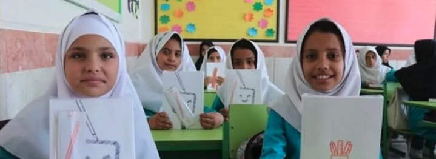

Code.org in Farsi (Persian)
===============

A letter from Hadi Partovi, Code.org CEO

For years, I've been asked "What is Code.org doing for Iran's children?"  Throughout Code.org’s history, the honest answer has sadly been "Nothing, yet."  Code.org is primarily funded by US donors, and I couldn’t prioritize spending their gifts on Iran.

I finally have an idea that could change this. The idea involves recruiting support (financial support, and volunteer support) from the Iranian diaspora, particularly Iranian Americans, to create Code.org in Farsi. 

**The objectives of this project would be:**

1. Translate Code.org to Farsi (Persian)— Including 	voice-overs for videos, which could also help 	Iranian American children retain their Farsi.

2. Reach out to schools and universities in Iran to 	build awareness of Code.org in Farsi for 	incorporation into primary and secondary 	curriculum.

3. Coordinate with global Afghan refugee groups, to 	make Code.org in Farsi available to Dari-fluent 	Afghan refugee children who have not yet been 	enrolled in schools. 

There are over 15 million Farsi-speaking students living in Iran and neighboring countries. Code.org in Farsi would enable these students the same access that is already available to students in all the other major languages of the world. Talent is everywhere, but opportunity is not. Code.org in Farsi would open a door to opportunity that would otherwise be closed.

**Why now?** Three reasons: (1) The Afghan refugee crisis creates a unique need for a large population of children. (2) Code.org recently did the software engineering to support right-to-left languages properly. (3) And lastly, because we finally have a big enough team that we could do this without hiring dedicated staff — in other words, it’s finally affordable! 

**How can you help?**

The project would require both volunteer support, as well as financial support, especially to translate the content in Code.org. 

1. **Volunteer to translate:** Any volunteer can help us with translation, just visit [code.org/translate](code.org/translate). Or, if you live in Seattle, [sign up](https://docs.google.com/forms/d/e/1FAIpQLSfa2fCZPDBtv7NpgrjcUGwhRr1JDjz3wNPbfMYOW3x9Q_nljQ/viewform) for our in-person translation party on June 26 (and enjoy free Chelo Kabab with Hadi and members of the Code.org team!)

2. **Donate:** The financial support would cover professional translation (including voice-over for videos), as well as administrative costs + travel to enable the rest of the work. The budget for the entire project is $300,000. If you compare that to the potential to support 15 million students, a $100 gift = 5,000 students who gain access. To donate, [click here](https://donate.code.org/give/410070/#!/donation/checkout).

3. **Spread the word:** Share this page on social media, or among your Iranian friends and family.

4. **Help teach Code.org in Farsi!**  [Sign up](http://go.pardot.com/l/153401/2022-05-31/pq1716) to be the first to hear when we have completed the translation work. Don’t worry, we won’t send you lots of emails.
