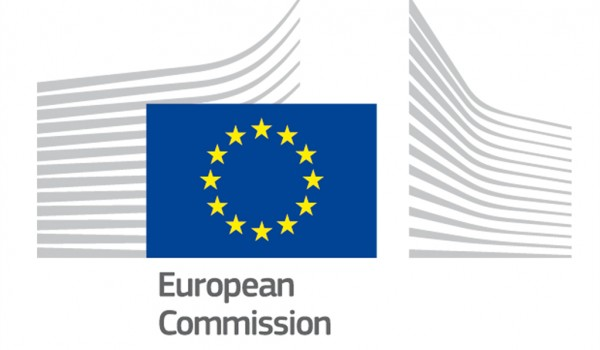
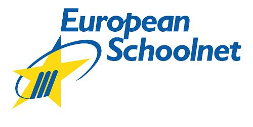

# About Us

Code.org is a non-profit dedicated to expanding participation in computer science education by making it available in more schools, and increasing participation by women and underrepresented students of color. Our vision is that every student in every school should have the opportunity to learn computer programming. We believe computer science should be part of the core curriculum in education, alongside other science, technology, engineering, and mathematics (STEM) courses, such as biology, physics, chemistry and algebra.

## EU Hour of Code
With the EU Hour of Code, Code.org aims to help demystify that coding is difficult and enable parents, teachers and students across the nation get a fun introduction to coding.

The EU Hour of Code is led by the European Commission and European Schoolnet.

## Follow us
Follow Code.org on social media:

- [on Facebook](http://facebook.com/Code.org)
- [on Twitter](http://twitter.com/codeorg)
- [on Google Plus](https://plus.google.com/113408212816493509628)
- [on LinkedIn](http://www.linkedin.com/company/code-org)