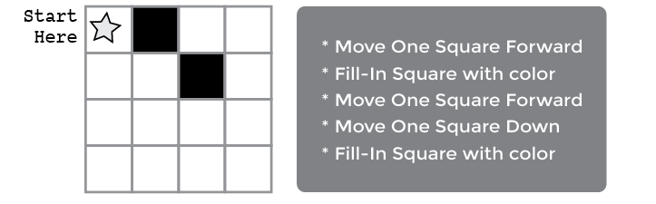
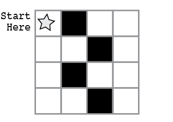

<!--
live preview (once saved to dropbox) is at http://staging.code.org/curriculum/2-3/1/Teacher.  don't share this URL!
-->

<%= partial('curriculum_header', :unitnumber=>1, :unittitle=>'Grades 2-3', :lesson=>1, :title=> 'Graph Paper Programming', :time=>50, :days=>1) %>

[content]

## Lesson Overview
By "programming" one another to draw pictures, students will begin to understand what programming is really about. The class will begin by having students instructing each other to color squares in on graph paper in an effort to reproduce an existing picture.  If there’s time, the lesson can conclude with images that the students create themselves.

[summary]
## Teaching Summary 

### **Getting Started** - 15 minutes

1) [Vocabulary](#Vocab)  
2) [Introduce Graph Paper Programming](#GetStarted)  
3) [Practice Together](#Practice)

### **Activity: Graph Paper Programming** - 20  minutes  

4) [Four by Fours](#Activity1)

### **Wrap-up** - 5  minutes 

5) [Flash Chat: What did we learn?](#FlashChat) 
6) [Vocab-Shmocab](#Shmocab)

### **Assessment** - 10  minutes 

7) [Graph Paper Programming Assessment](#Assessment)

[/summary]

## Lesson Objectives 

Students will:

- Understand the difficulty of translating real problems into programs  
- Learn that ideas may feel clear and yet still be misinterpreted by a computer  
- Practice communicating ideas through codes and symbols

# Teaching Guide
## Materials, Resources and Prep

### For the Student

- [Four-by-Fours Activity Worksheet](https://drive.google.com/file/d/0B_6_OvabUXVJM0pNSno4NkxsMUk/edit?usp=sharing)
- [Graph Paper Programming Assessment](https://drive.google.com/file/d/0B_6_OvabUXVJRVZxb2h3VHYxYkk/edit?usp=sharing)
- 4x4 Squares of Graph Paper  
- Blank paper or index cards for programs
- Markers, pens, or pencils

### For the Teacher

- Print out one Activity Worksheet for each group  
- Print one Assessment for each student  
- Supply each group with several drawing grids, paper, and pens/pencils

## Getting Started (15 min) 

### 1) Vocabulary
This lesson has two new and important words: 

[centerIt]

[/centerIt]

**Algorithm** - Say it with me: Al-go-ri-thm  
An algorithm is a list of steps that you can follow to finish a task. 

**Program** - Say it with me: Pro-gram  
A program is an algorithm that has been coded into something that can be run by a machine.

 

### 2) Introduce Graph Paper Programming 
In this activity, we are going to guide each other toward making drawings, without letting the other people in our group see the original image. 

For this exercise, we will use sheets of 4x4 graph paper.  Starting at the upper left-hand corner, we’ll guide our teammate’s pencils with simple instructions.  Those instructions include:

- Move One Square Forward
- Move One Square Backward
- Move One Square Up
- Move One Square Down
- Fill-In Square with color

For example, here’s how we would write an algorithm to instruct a friend (who is pretending to be a drawing machine) to color their blank grid so that it looks like the image below: 

[centerIt]

[/centerIt]

That’s simple enough, but it would take a lot of writing to provide instructions for a square like this: 

[centerIt]

[/centerIt]

With one little substitution, we can do this much easier!  Instead of having to write out an entire phrase for each instruction, we can use arrows.  

[centerIt]

[/centerIt]

In this instance, the arrow symbols are the “program” code and the words are the “algorithm” piece. This means that we could write the algorithm:

>“Move one square forward, Move one square forward, Fill-in square with color” 

and that would correspond to the program:

>

Using arrows, we can redo the code from the previous image much more easily!

[centerIt]

[/centerIt]

### 3) Practice Together

Start your class off in the world of programming by drawing or projecting the provided key onto the board. 

[centerIt]

[/centerIt]

Select a simple drawing, such as this one to use as an example.

[centerIt]

[/centerIt]

This is a good way to introduce all of the symbols in the key.  To begin, fill in the graph for the class -- square by square -- then ask them to help describe what you’ve just done. First, you can speak the algorithm out loud, then you can turn your verbal instructions into a program.

A sample algorithm:

>“Move Forward, Fill-In Square, Move Forward, Move Down 
Fill-In Square, Move Backward, Move Backward, Fill-In Square 
Move Down, Move Forward, Fill-In Square, Move Forward”

Some of your class may notice that there is an unnecessary step, but hold them off until after the programming stage.   
Walk the class through translating the algorithm into the program:

>

The classroom may be buzzing with suggestions by this point.  If the class gets the jist of the exercise, this may be a good place to discuss alternate ways of filling out the same grid.  If there is still confusion, save that piece for another day and work with another example.

>

If the class can shout out the algorithm and define the correct symbols to use for each step, they’re ready to move on.  Depending on your class and their age, you can either try doing a more complicated gird together or skip straight to having them work in groups on their [Four-by-Fours Activity Worksheet](https://drive.google.com/file/d/0B_6_OvabUXVJM0pNSno4NkxsMUk/edit?usp=sharing).
 

[tip]

# Teaching Tip
Have the class imagine that your arm is an automatic drawing machine. It brings the idea of "algorithms" and "programs" to life even further if they feel like they're actually in control of your movements.

[/tip]

## Activity: Graph Paper Programming (20 min)
### 4) [Four-by-Fours Activity Worksheet](https://drive.google.com/file/d/0B_6_OvabUXVJM0pNSno4NkxsMUk/edit?usp=sharing)

1. Divide students into pairs.
2. Have each pair choose an image from the worksheet.  
3. Discuss the algorithm to draw that image with partner.  
4. Convert algorithm into a program using symbols.  
5. Trade programs with another pair and draw one another's image. 
6. Choose another image and go again!  

 

[centerIt]

[/centerIt]

## Wrap-up (5 min)
### 5) Flash Chat: What did we learn? 

- What did we learn today?
- What if we used the same arrows, but replaced "Fill-In Square" with "Lay Brick"? What might we be able to do?
- What else could we program if we just changed what the arrows meant?

### 6) Vocab Shmocab
- Which one of these definitions did we learn a word for today?
> "A large tropical parrot with a very long tail and beautiful feathers" 
> "A list of steps that you can follow to finish a task" 
> "An incredibly stinky flower that blooms only once a year" 
>> ...and what is the word that we learned?

- Which one of these is the *most* like a "program"?
> *A shoebox full of pretty rocks 
> *Twelve pink flowers in a vase 
> *Sheet music for your favorite song 
>> Explain why you chose your answer.

## Assessment (10 min)
### 8) [Graph Paper Programming Assessment](https://drive.google.com/file/d/0B_6_OvabUXVJRVZxb2h3VHYxYkk/edit?usp=sharing)   

## Extended Learning 
Use these activities to enhance student learning. They can be used as outside of class activities or other enrichment.

### Better and Better 

- Have your class try making up their own images.  
- Can they figure out how to program the images that they create?

### Class Challenge 

- As the teacher, draw an image on a 5x5 grid.  
- Can the class code that up along with you?

## Connections and Background Information

### ISTE Standards (formerly NETS) Satisfied by this Lesson Include:

- 1.c - Use models and simulation to explore complex systems and issues  
- 2.d - Contribute to project teams to solve problems

### The activities in this lesson support CSTA K-12 Computer Science Standards:
 
- CPP.L1:3.04 - Construct a set of statements to be acted out to accomplish a simple task  
- CPP.L1:3.06 - Gather and organize information using concept mapping tools
- CT.L1:6.01 - Understand and use the basic steps in algorithmic problem-solving  
- CT.L1:6.02 - Develop a simple understanding of an algorithm using computer-free exercises  

### Other standards, including the NGSS, and Common Core Math & Language Arts

- CCLA-K:SL.2 - Confirm understanding of a text by asking or answering questions
- CCLA-1:SL.2 - Ask and answer questions about key details in a text

[/together]

[/content]

<link rel="stylesheet" type="text/css" href="morestyle.css"/>