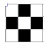
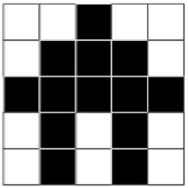

<!--
live preview (once saved to dropbox) is at http://staging.code.org/curriculum/2-3/1/Teacher.  don't share this URL!
-->

<%= partial('curriculum_header', :unitnumber=>1, :unittitle=>'Grades 2-3', :lesson=>1, :title=> 'Graph Paper Programming', :time=>60, :days=>1) %>

[content]

## Lesson Overview
By "programming" one another to draw pictures, students will begin to understand what programming is really about. The class will begin by having students instructing each other to color squares in on graph paper in an effort to reproduce an existing picture.  If there’s time, the lesson can conclude with images that the students create themselves.

[summary]
## Teaching Summary 

### **Getting Started** - 15 minutes

1) Introduce Graph Paper Programming  
2) Vocabulary

### **Activity: Graph Paper Programming** - 20  minutes  

3) [Four by Fours](https://drive.google.com/file/d/0B_6_OvabUXVJSHoxZHNhLU9fanc/edit?usp=sharing)

### **Wrap-up** - 5  minutes 

4) Flash Chat: What did we learn? 
5) Vocab-Shmocab

### **Assessment** - 10  minutes 

6) [Graph Paper Programming Assessment](https://drive.google.com/file/d/0B_6_OvabUXVJRVZxb2h3VHYxYkk/edit?usp=sharing)

[/summary]

## Lesson Objectives 

Students will:

- Understand the difficulty of translating real problems into programs  
- Learn that ideas may feel clear and yet still be misinterpreted by a computer  
- Realize the need for formal programming structures like loops and functions

# Teaching Guide
## Materials, Resources and Prep

### For the Student

- Sample Drawings/Algorithms Kit  
- Programming Instructions Card  
- Large grid graph paper  
- Markers, pens, or pencils

### For the Teacher

- Print out one Drawings/Algorithms Kit for each group  
- Print one Programming Instructions Card for each group  
- Supply each group with several drawing grids

## Getting Started (15 min) 

### 1) Introduce Graph Paper Programming 
Start by asking the class if anyone has heard of robotics. What is a robot? Does a robot really “understand” what people say? The answer to the last question is:

>“Not the same way that a person does.”

Robots operate off of “instructions,” specific sets of things that they have been preprogrammed to do. In order to accomplish a task, a robot needs to have a series of instructions (sometimes called an algorithm) that it can run. 

To get more familiar with the concept of an algorithm, it is helpful to have something to compare it to. For this exercise, we will introduce a programming language made of lines and arrows.

 
<figure>
  
  <figcaption>**Programming Key**</figcaption>

</figure>
 

In this instance, the symbols on the left are the “program” and the words on the right are the “algorithm” piece. This means that we could write the algorithm:

>“Move one square forward, Move one square forward, Fill-in square with color” 

and that would correspond to the program:

>

Now it’s time to get a little more practice.  Start your class off in the world of programming by drawing or projecting the provided key onto the board.

Select a simple drawing, such as this one to use as an example.
> 

This is a good way to introduce all of the symbols in the key.  To begin, you can show them the least confusing way to code an image, which is to return to the left of the image whenever you drop to the next line.  Fill in the graph for the class, then ask them to help describe what you’ve just done. First, you can put it into words with an algorithm, then you can program what you’ve laid out.

A sample algorithm:

>“step forward, fill-in, step forward, next row,  
back, back,  
fill-in, step forward, step forward, fill-in, next row,  
back, back,  
step forward, fill-in, step forward”

Some of your class may notice that there are some unnecessary steps, but hold them off until after the programming stage.  Walk the class through programming the image:

>

The classroom may be buzzing with suggestions by this point.  If the class gets the point of the exercise, this may be a good place to entertain those.

It is true that there is a bit of redundancy above, but it can be extremely confusing to code without it.  Sometimes, until a programmer is experienced, it is helpful to code in the most understandable way to make sure it works, then remove unneeded steps later.

Work through the example again, first removing unneeded steps from the original program, then by coding from scratch without using any unnecessary symbols in the first place.

If the class seems lost or confused, try another graph 
but skip the “simplification” step.  Just let it be right to left, then back again.
> 

If the class can shout out the algorithm, then define the correct symbols to use for each step, they’re ready to move on.  Depending on your class and their age, you can try doing a more complicated one together or skip straight to having them work in groups.

Give each group an image pack and suggest they choose one of the “mini one-color” images.  Have them first write the algorithm, then convert it to symbols.  Once they’ve done one or two, have them switch algorithms with another group and draw what the others programmed.
> 

If there’s time, it is possible to introduce the need for functions and parameters. This is best accomplished with larger, more complicated drawings.

After doing a few of these, it becomes obvious that an image of this size is pretty hefty.  Let’s look at just two lines from this one.
> 

**Algorithm**:
>“Step forward, fill-in, step forward, step forward, step forward, fill-in, step forward, next line.  
Back, back, back, back, back, back.  
Fill-in, Step forward, fill-in, step forward, fill-in, step forward, step forward, fill-in, Step forward, fill-in, Step forward, fill-in, next line.  
Back, back, back, back, back, back.”

Challenge the class to look for things that repeat often. Take some suggestions, but certainly one of the most helpful things to combine is the “Back, back, back, back, back, back.”  Open the floor for suggestions of how you could turn this into a single symbol.

The class might arrive at something like this: 
**← 6**
In fact, they may have already done something similar with the last batch of images.  Are there any other combinations that can be made? What about skipping three squares in series? Coloring three squares in series? Coloring seven squares in series?

You are likely to have ended up with lots of symbols that contain various numbers.  Hopefully by now the class understands what they are and why they’re helpful.

Now comes the magic!  You get to reveal that the class just discovered functions!  They have created a simple representation for a complex grouping of actions.  That is exactly what functions are meant to do.  How about the number?  It has a name also.  That number is called a parameter. In the case of the example above, the parameter lets the function know how many times to move backward.

Look at these “functions”.  What do you suppose they do?

>  
> **Answers**:  
1. Move forward six spaces  
2. Color 6 blocks in a row  
3. Color a diagonal line

Are there any other combinations that could be helpful?

Armed with this new method, challenge the class to choose one of the hardest images that they can handle. Do these symbols help the process go more quickly? 

When the groups have finished their latest task, have them exchange their program (complete with functions and parameters) with another group and try to draw what the others have coded. 

[tip]

# Teaching Tip
K-2: Try doing exercise as a class instead of small groups. Using transparencies with the features printed on them (eyes, ears, nose) will make this much more manageable.

3-5: Give students help when it comes to breaking down the problem and abstracting out details. It may be necessary to do a sample with them.

6-8: Allow students to struggle for a while before offering suggestions.  Let them “fail” a few times and let those failures provide the feedback they need to get it working.  This age will likely enjoy the activity more if they are drawing the features, versus overlaying transparencies.

[/tip]

## Activity: Graph Paper Programming (30 min)
### 3) Steps
1. Choose image from image pack.  
2. Write out algorithm to draw that image.  
3. Convert algorithm into a program using symbols.  
4. Trade programs with another team and draw their image.  
5. Add “functions” to make programs more simple.  
6. Write programs for more complex images.  
7. Trade your complex programs and draw again.  

>   

> 

  

> 

## Wrap-up (5 min)
### 6) Reflection 

## Extended Learning 

## Vocabulary

**Algorithm** - A series of instructions on how to accomplish a task  

**Coding** - Transforming actions into a symbolic language  

**Debugging** - Finding and fixing problems in code  

**Function** - A piece of code that can be called over and over  

**Parameters** - Extra bits of information that you can pass into a function to customize it

[/content]

<link rel="stylesheet" type="text/css" href="morestyle.css"/>