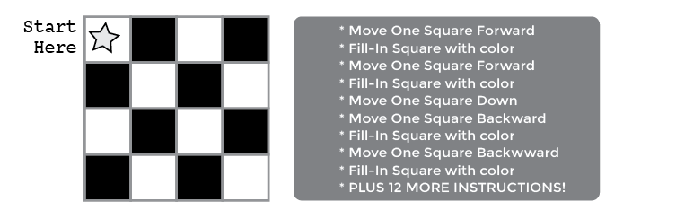

<!--
live preview (once saved to dropbox) is at http://staging.code.org/curriculum/4-5/1/Teacher.  don't share this URL!
-->

<%= partial('curriculum_header', :unitnumber=>1, :unittitle=>'Grades 4-5', :lesson=>1, :title=> 'Relay Programming', :time=>60, :days=>1) %>

[content]

## Lesson Overview
By "programming" one another to draw pictures, students will begin to understand what programming is really about. The class will begin by teaching students algorithms to color squares on graph paper in an effort to reproduce an existing picture.  It will quickly move to a race against the clock, as students break into teams and work together to create a program, one instruction at a time.

[summary]
## Teaching Summary 

### **Getting Started** - 20 minutes

1) [Vocabulary](#Vocab)  
2) [Introduce Graph Paper Programming](#GetStarted)  
3) [Practice Together](#Practice)

### **Activity: Graph Paper Programming** - 20  minutes  

4) [Relay Programming](#Activity1)

### **Wrap-up** - 10  minutes 

5) [Flash Chat: What did we learn?](#FlashChat) 
6) [Vocab-Shmocab](#Shmocab)

### **Assessment** - 10  minutes 

7) [Graph Paper Programming Assessment](#Assessment)

[/summary]

## Lesson Objectives 

Students will:

- Understand the difficulty of translating real problems into programs  
- Learn that ideas may feel clear and yet still be misinterpreted by a computer  
- Practice communicating ideas through codes and symbols
- Use teamwork to complete a task
- Verify the work of their teammates to ensure a successful outcome

# Teaching Guide
## Materials, Resources and Prep

### For the Student

- Blank Paper or Index Cards for programs  
- Sheets of 4x4 paper grids for the students to use as practice
- Markers, pens, or pencils
- [Relay Programming Assessment](https://drive.google.com/file/d/0B_6_OvabUXVJbEVUaGJ3UmZSZVU/edit?usp=sharing)

### For the Teacher

- Locate a wide open space for this activity, such as the gym or outdoor field
- Print out one [Relay Activity Packet](https://drive.google.com/file/d/0B_6_OvabUXVJTFl0QVYzQnBlRGc/edit?usp=sharing) for each group  
- Print one Assessment for each student  
- Supply each group with plenty of paper and pens/pencils

## Getting Started (20 min) 

### 1) Vocabulary
This lesson has two new and important words: 

[centerIt]

[/centerIt]

**Algorithm** - Say it with me: Al-go-ri-thm  
An algorithm is a list of steps that you can follow to finish a task. 

**Program** - Say it with me: Pro-gram  
A program is an algorithm that has been coded into something that can be run by a machine.

 

### 2) Introduce Graph Paper Programming 
Tell the class that they are going to learn how to take a real image, and program it into something that your Automatic Realization Machine (ARM) can reproduce. The first step will be to put into words what we are trying to do.

Start with sheets of 4x4 graph paper.  Beginning at the upper left-hand corner, have the class guide your automatic realization machine with simple instructions.  Those instructions include:

- Move One Square Forward
- Move One Square Backward
- Move One Square Up
- Move One Square Down
- Fill-In Square with color

For example, here’s how we would write an algorithm to instruct your arm to color a blank grid so that it looks like the image below: 

[centerIt]

[/centerIt]

That’s simple enough, but it would take a lot more writing to provide instructions for a square like this: 

[centerIt]

[/centerIt]

With one little substitution, we can make it much easier!  Instead of writing out an entire phrase for each instruction, we can use arrows.  

[centerIt]

[/centerIt]

In this instance, the arrow symbols are the “program” code and the words are the “algorithm” piece. This means that we could write the algorithm:

>“Move one square forward, Move one square forward, Fill-in square with color” 

and that would correspond to the program:

>

Using arrows, we can redo the code from the previous image much more easily!

[centerIt]

[/centerIt]

### 3) Practice Together

Start your class off in the world of programming by drawing or projecting the provided key onto the board. 

[centerIt]

[/centerIt]

Select a simple drawing, such as this one to use as an example.

[centerIt]

[/centerIt]

This is a good way to introduce all of the symbols in the key.  To begin, fill in the graph for the class -- square by square -- then ask them to help describe what you’ve just done. First, you can speak the algorithm out loud, then you can turn your verbal instructions into a program.

A sample algorithm:

>“Move Forward, Fill-In Square, Move Forward, Move Down 
Fill-In Square, Move Backward, Move Backward, Fill-In Square 
Move Down, Move Forward, Fill-In Square, Move Forward”

Some of your class may notice that there is an unnecessary step, but hold them off until after the programming stage.   
Walk the class through translating the algorithm into the program:

>

The classroom may be buzzing with suggestions by this point.  If the class gets the jist of the exercise, this may be a good place to discuss alternate ways of filling out the same grid.  If there is still confusion, save that piece for another day and work with another example.

>

If the class can shout out the algorithm and define the correct symbols to use for each step, they’re ready to move on.  

[tip]

# Teaching Tip
Try giving the students a full sheet of graph paper and having them draw blocks of 4x4 squares inside it. This will let them easily create their own grids and feel like the exercise is reproducible at home.

Writing their programs on graph paper will also give them an easy way to keep their arrows legible. They can simply stick one instruction in each square.

[/tip]

## Activity: Relay Programming (20 min)
### 4) [Relay Programming Worksheet](https://drive.google.com/file/d/0B_6_OvabUXVJTFl0QVYzQnBlRGc/edit?usp=sharing)
The practice lesson was easy enough, let's add some action!  We're going to do the same type of thing (create a program describing an image) but now we're going to do it in relay teams, one symbol at a time.

The rules of this game are simple:

1. Divide students into groups of 3-5.
2. Have each group queue up relay-style.  
3. Place an identical image at the other side of the room/gym/field from each team.  
4. Have the first student in line dash over to the image, review it, and write down the first symbol in the program to reproduce that image.  
5. The first student then runs back and tags the next person in line, then goes to the back of the queue. 
6. The next person in line dashes to the image, reviews the image, reviews the program that has already been written, then either crosses out an incorrect symbol, or adds a new one.
7. That student then dashes back to tag the next person, and the process continues until one group has finished their program.  
8. First group to finish is the winner! 
 

[tip]

# Clarifications

 Here are some clarifications that need to be shared from time to time:

-  Only one person from each group can be at the image at one time.
-  It *is* okay to discuss algorithms with the rest of the group in line, even up to the point of planning who is going to write what when they get to the image.
-  When a student crosses out an incorrect instruction, they must also cross out the rest of the program after that.  This counts as their entire turn.  The next player is allowed to continue from the last *correct* instruction.

[/tip]

## Wrap-up (5 min)
### 5) Flash Chat: What did we learn? 

- What did we learn today?
- What if we used the same arrows, but replaced "Fill-In Square" with "Lay Brick"? What might we be able to do?
- What else could we program if we just changed what the arrows meant?

### 6) Vocab Shmocab
- Which one of these definitions did we learn a word for today?
> "A sour yellow fruit" 
> "The area of an insects body between an insects head and abdomen" 
> "An algorithm that has been coded into something that can be run by a machine" 
>> ...and what is the word that we learned?

- Which one of these is the *most* like an "algorithm"?
> *A new pair of shoes 
> *A Cookie Recipie 
> *A swing set at school 
>> Explain why you chose your answer.

## Assessment (10 min)
### 8) [Relay Programming Assessment](https://drive.google.com/file/d/0B_6_OvabUXVJbEVUaGJ3UmZSZVU/edit?usp=sharing)   

## Extended Learning 
Use these activities to enhance student learning. They can be used as outside of class activities or other enrichment.

### Better and Better 

- Have your class try making up their own images.  
- Can they figure out how to program the images that they create?

### Class Challenge 

- As the teacher, draw an image on a 5x5 grid.  
- Can the class code that up along with you?

## Connections and Background Information

### ISTE Standards (formerly NETS) Satisfied by this Lesson Include:

- 1.c - Use models and simulation to explore complex systems and issues  
- 2.d - Contribute to project teams to solve problems

### The activities in this lesson support CSTA K-12 Computer Science Standards:
 
- CT.L1:6.01 - Understand and use the basic steps in algorithmic problem-solving  
- CT.L1:6.02 - Develop a simple understanding of an algorithm using computer-free exercises  

### Other standards, including the NGSS, and Common Core Math & Language Arts

[/together]

[/content]

<link rel="stylesheet" type="text/css" href="morestyle.css"/>