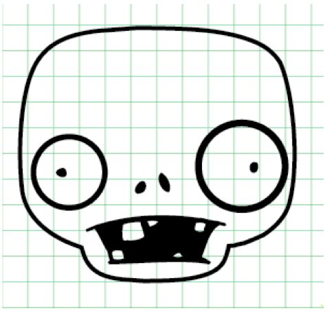

<!--
live preview (once saved to dropbox) is at http://staging.code.org/curriculum/4-5/2/Teacher.  don't share this URL!
-->

<%= partial('curriculum_header', :unitnumber=>1, :unittitle=>'A Bit of Everything', :lesson=>2, :title=> 'Computational Thinking', :time=>60, :days=>1) %>

[content]

## K-1 Lesson Overview (Discovery, New Learning, Guided Practice, Creative, Assessment -pick one)
With nothing but paper and markers, students will learn the four steps of computational thinking.  After a brief introduction, students should be split into groups where they will have to create directions for other students to draw a specific monster (from a catalog of pre-selected monsters). The entire task must be decomposed, then teams will analyze all monsters in the catalog for patterns, abstract similar details from the monsters, then use that information to create an algorithm (directions) for another team to draw a certain monster. 

Teams will then switch algorithms with another group and draw the monster based on what that algorithm indicates. Is the drawing what the original team intended?

[summary]
## Teaching Summary
Introduce the “Computational Thinking” model as a way of preparing real-world problems for digital representation.

### **Getting Started** - 15 minutes

1) Review  
2) Introduce Computational Thinking

### **Activity: Making a Monster** - 30  minutes  

3) Categorizing Monsters  
4) Steps  
5) Rules

### **Wrap-up** - 5  minutes 
6) Reflection

[/summary]

## Lesson Objectives 

Students will:

- Learn the four steps of computational thinking
- Use teamwork to solve complex problems

# Teaching Guide
## Materials, Resources and Prep

- Monster Catalog (1 per group)
- Blank pieces of paper (3 per person)
- Markers, pens, or pencils (1 pack per group)
- Scissors

### For the Teacher

- Print monster images for each group.
  - Monster faces should be on traditional paper, while monster “parts” are printed on transparencies (Or students can trace monster parts on tracing paper. Or monster parts can be printed on traditional paper and then cut out.)
- Gather monster images, scissors & markers for each group.
- Write vocabulary words on the board or project them with document camera.

## Getting Started (15 min)
### 1)Review 
This review segment is intended to get the class thinking back to the last lesson.  If you are covering these activities out of order, please substitute your own review subjects here.

> **Class Participation Questions**:  
 - What does it mean to “repeat” a “block” of code?  
 - When might you use an “if” block?

> **Elbow Partner Discussion**:  
 - Can you think of a reason that you would want an if/else  block, instead of just the “if”? 

### 2) Introduce Computational Thinking
Today, our class will become a group of elite teams of computer scientists. We will each complete a real-world mission to come up with an “algorithm” that we can use to “program” our solution.  Here is a brief overview of your mission (should you choose to accept it):

We have been selected to help identify some monsters found on the planet Zuron.  We need to describe these things based on descriptions that we already have of certain eye-witness accounts. There are quite a few monsters to describe, and it may seem challenging, but I’m going to give you some tools to help you out.

To be successful in this operation, we will practice a method called Computational Thinking.  Computational thinking uses four steps to help solve lots of different kinds of problems. Many people believe that computational thinking is all about getting solutions ready to run on a machine.  That’s true, but it also helps make light work of difficult problems.

Computer scientists often find that they’re in charge of programming solutions to things that people have only ever dreamt of -- things that have never been created before.  Facing a problem that has never been solved can be scary, but with these simple tools, anything is possible.

> **Step 1 - Decompose**  
We’re not just talking about zombies here. Instead, we’re talking about breaking a big, bad problem down into something much more simple.  Often, big problems are just lots of little problems stuck together. 
  
> **Step 2 - Patterns**  
Sometimes, when a problem has lots of little pieces, you will notice that the pieces have something in common.  If they don’t, then they may at least have some striking similarities to some pieces of another problem that has been solved before.  If you can spot these patterns, understanding your pieces gets much easier.
  
> **Step 3 - Abstraction**  
Once you recognize a pattern, you can “abstract out” (ignore) the details that make things different and use the general framework to find a solution that works for more than one problem.
  
> **Step 4 - Algorithms**  
When your solution is complete, you can write it up in a way that allows it to be processed step by step, so that the results are easy to achieve. 

[tip]

# Teaching Tip
K-2: Try doing exercise as a class instead of small groups. Using transparencies with the features printed on them (eyes, ears, nose) will make this much more manageable.

3-5: Give students help when it comes to breaking down the problem and abstracting out details. It may be necessary to do a sample with them.

6-8: Allow students to struggle for a while before offering suggestions.  Let them “fail” a few times and let those failures provide the feedback they need to get it working.  This age will likely enjoy the activity more if they are drawing the features, versus overlaying transparencies.

[/tip]

## Activity: Make a Monster (30 min)
### 3) Categorizing Monsters
 Each group gets a Monster Catalog. Each monster needs to be categorized based on the information that they are given in their Catalog.  First, students will look at the monsters to see what they all have in common, then they will abstract out the differences to create a list of instructions that anyone can use to re-create one of the monsters from the packet...without knowing ahead of time which one they are making!

Getting someone to draw these monsters without seeing them can be quite challenging. And if you look at the whole task, it may seem impossible.  That makes this the perfect project for computational thinking. 

**Decompose** - What needs to be done to make the monster?

Depending on the monster, it may already look like it’s decomposing, but now we need to “decompose” this task!  Let’s break it up into smaller tasks, each will seem a little easier on its own.  You may want to do this as a class together to get everyone on the same page.  
> Example: 
- Sort monsters by face shape  
- Look for similarities in those monsters  
- Make a list of features to identify  
- Use identified features to create a new monster  
- Describe your new monster to your teammates in a step-by-step way and let them try to put it together

**Patterns** - What do those monsters have in common?

What are some things that all of the monsters have?  What are things that are similar between monsters of certain groups?  
> Example:  
- All monsters have heads  
- Zombus Vegitas has a Vegitas mouth

**Abstraction** - What’s different? Take it out.

One monster may have Wackus Eyes, while another has Spritem Eyes, but they both have eyes.  That means we could say that  “This monster has __________ eyes” and later we would be able to fill in the blank based on whatever monster we’ll be drawing.

> Example: Create a list of all the different features that the monsters with the details abstracted out of the sentence.  
- The monster has a \_\_\_\_\_\_\_\_ head.  
- The monster has \_\_\_\_\_\_\_\_  eyes.  
- The monster has a \_\_\_\_\_\_\_\_  nose.  
- The monster has \_\_\_\_\_\_\_\_  ears.  
- The monster has a \_\_\_\_\_\_\_\_ mouth.  

**Algorithm** - How can you put this together to make a series of instructions that your classmates can follow?

Now, each group should arrange their steps into a list that other groups can use to recreate a monster.  

> Example: Create a list that you can fill out for your artist.  
- Draw a <u>**_Wackum_**</u> head.  
- Draw <u>**_Vegitas_**</u> eyes.  
- Draw a <u>**_Wackum_**</u> nose.  
- Draw <u>**_InHideum_**</u> ears.*  
- Draw a <u>**_Spritem_**</u> mouth.  

*_InHideum means the Monster is missing that feature._

Students should test their algorithm to see if it draws the correct pictures. Then, let students switch algorithms with another group, and draw the monster based on the algorithm (without seeing the original picture.)  Did they create the right monster? Students can play this over and over again, choosing to have classmates recreate monsters that already exist, or describing new ones.

### 4) Steps
1. Identify a problem.
2. Break the problem down into little pieces.
3. Abstract away details to identify a pattern that seems to be true for several pieces.
4. Format each of the monsters as a list of instructions for drawing/building.
5. Try solutions to make sure they work.
6. Trade instructions so other groups can put all of the pieces together into one complete work of art.

### 5) Rules
1.  If the monster is missing a feature, the category of that feature is “InHideum.”
2. The category of the head shape determines the first half of the monster’s classification.
3.  The second half of the classification is determined by the category from the majority of other features.
- If there are equal amounts of features from multiple families, then categorize based on the eyes.

## Wrap-up (5 min)
### 6) Reflection 

## Extended Learning 

## Vocabulary

**Computational Thinking** - A method of problem-solving that helps computer scientists prepare problems for digital solutions

**Abstraction** - Removing details from a solution so that it can work for many problems

**Algorithm** - A list of steps that allow you to complete a task

**Decompose** - To break a hard problem up into smaller, easier ones

**Pattern** - A theme that is repeated many times

**Program** - Instructions that can be understood and followed by a machine

[/content]
