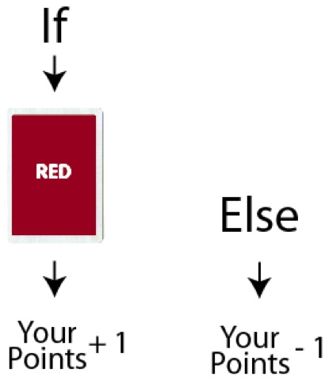

<!--
live preview (once saved to dropbox) is at http://staging.code.org/curriculum/4-5/6-Conditionals/Teacher.  don't share this URL!
-->

<%= partial('curriculum_header', :unitnumber=>1, :unittitle=>'A Bit of Everything', :lesson=>6, :title=> 'Conditionals', :time=>60, :days=>1) %>

[content]

## K-1 Lesson Overview (Discovery, New Learning, Guided Practice, Creative, Assessment -pick one)
This is a class game.  After introducing the idea of conditionals, if-statements, and loops, the class can practice together using a pre-written program, a deck of cards, and luck of the draw.

[summary]
## Teaching Summary
This lesson will introduce conditionals, especially as they pertain to loops and if statements.

### **Getting Started** - 15 minutes

1) Review  
2) Introduce 

### **Activity: Coding with Cards** - 30  minutes  

3) Rules
4) Adjustments
5) Sample Programs

### **Wrap-up** - 5  minutes 
6) Reflection

[/summary]

## Lesson Objectives 

Students will:

  - Gain experience determining the outcome (true or false) of conditionals  
- Evaluate logical statements to determine which branch of a program to follow

# Teaching Guide
## Materials, Resources and Prep

- 1 set of Program Pages per class (This has at least one sample program on it)  
- 1 deck of playing cards 

### For the Teacher

- Separate the face cards from the rest of the cards. Jokers can stay with the numbered cards to use as special events, such as wiping out all points, or letting a team win instantly.  
- Project one of the Program Pages onto the screen with document camera.

## Getting Started (15 min)
### 1)Review 
This review segment is intended to get the class thinking back to the last lesson.  If you are covering these activities out of order, please substitute your own review subjects here.

> **Class Participation Questions**:  
 - What did we do in our last lesson?  
- How is a while block different from an if block?

> **Elbow Partner Discussion**:  
 - Can you think of anything we do in real life that could be described with a while loop? 

### 2) Introduce  
This game has the potential to be something you come back to time and again.  It is infinitely customizable, including adjustments for age, experience, and quantity of students.  This lesson will mainly cover play for grades 3-5, but feel free to adapt as you like while maintaining the spirit of the activity.

To begin, the students will likely need a refresher on conditionals, even though they’ve already seen them in the online Blockly activities.  It can be helpful to start with some real-life inspirational examples:

> “If you all raise your hand, I will clap.  
Otherwise, I will touch my nose.”

Afterward, touch your nose until the whole class is raising their hand, then clap to acknowledge that they have all completed the conditional.

> “What just happened there?”

The students will likely try to do a play-by-play of events, and it will be up to you to guide them toward your intended path.

> “I gave you a ‘condition’ right?  I said, that under one condition I would do one thing, but if that condition wasn’t met, I would do something else. Conditionals are the way computers make decisions.”

Next, you can try another one. This time, throw the “Else” terminology in.

> “If you all put your hands on your desks, I will scratch my head.
Else, I will put my hand on my hip.”

This is similar enough to the first case that they should be able to infer what the “else” is saying, but if they have trouble, go ahead and explain that “else” is very similar to the word “otherwise.”

> “Good job.  Now let’s make this a little more interesting.  I have a stack of playing cards here.  We’re going to play a game.  

> If I draw a red card, I get a point.  
Else, you get a point."

Put the simple statement on the board so you can point to each case as it happens. Draw a few cards from the top of the pile, and add points appropriately.  When the card is red, show them which case you look at (the top one) and when it’s black, point out that it matches the “Else” case.  After a few rounds (or when the students are ahead again) pronounce the game over, and get ready to step it up a notch.

> “Okay, we’re going to use this idea of conditions, or ‘Conditionals’ to play a game.  We call these ‘If Statements’ conditionals, because there is a ‘condition’ placed on them.  Something is either true, or it’s not.  If it’s true, we do the instruction inside the ‘If Statement’.  Otherwise, we do the instruction inside of the ‘Else’.”

Let the class know that they are going to play a game.  The game will last 4 turns on each side. The class will be split into “Left Side” and “Right Side” (if you feel this will be a problem, you can do student vs. teacher and instead of “team.points -=1” you can have “teacher.points +=1”.) They will compete to see who gets the most points.  

Just so we’re all clear about the rules, let’s write them on the board. The code represented below is how conditionals are written in javascript, the world's most widely adopted programming language. In the online activities in this course, we’ve been writing code with Blockly, which uses visual blocks to represent code. The code we’ve been writing in those activities can also be represented in other programming languages. For instance, in our online activities, if you click “Show Code” in the purple header, you can see the blocks on your workspace represented in Javascript. Below is code for the activity we’ll be doing today:  
>
1)  if (card.color == black) {  
2)  	team.points += 1;  
3)  }  
4)  else {  
5)  	team.points -=1;  
6)  }  

You will likely want to go through this format line by line, since it will probably be a new sight to most of the students.

> 1)  This line is your “If Statement.” This is the line that lets you know that “If the color of the card is equal to black, you do THIS.”  Notice how there are two equal signs?  In many programming languages, this is how we say that we’re checking for equality, not assigning something to be equal to. This line ends with an “opening curly brace.” That’s there to let us know that the next line belongs to the “If Statement”.

> 2)  This line literally says “Points plus equals one”. It means that you take whatever number of points that you had, and add one to it. Whatever that equals is your new points value.

> 3)  This is a “closing curly brace.”  It is there to tell you that the “If Statement” has ended. 

> 4)  Here is the start of the “Else” statement.  At the end of this line, you’ll see another opening brace. That means that this is the beginning of the piece that we do if we don’t match the “If Statement.”

> 5)  This is very similar to line 2 but with one difference.  Can anyone spot what it is?  What do you suppose it does?  It means that you take whatever number of points that you had, and subtract one from it. Whatever that equals is your new points value.

> 6)  Finally, in line 7, we have the last “closing curly brace.”  It tells us that the “Else Statement” is done.

Here’s the javascript written next to the same code represented in pseudocode, which is informally-written code that’s easy for people to read. Each line of pseudocode explains what that line of javascript is doing. 

|**Javascript**               |   |**Pseudocode**   |
|-----------------------------|---|---|
|if (card.color == black) {   |&nbsp;&nbsp;&nbsp;&nbsp;&nbsp;&nbsp;&nbsp;&nbsp;&nbsp;| if card’s color is black then   |
|&nbsp;&nbsp;&nbsp;&nbsp;team.points += 1;| |&nbsp;&nbsp;team’s points increase by 1   |
|}                            | |  |
|else {                       | | otherwise   |
|&nbsp;&nbsp;&nbsp;&nbsp;team.points -=1;| |&nbsp;&nbsp;team’s points decrease by 1   |
|}                            | |  |

 
After explaining, it’s good to take a step back and look at the big picture.  What does this actually mean?  Can we put it into actual words?  **Essentially it says that if a person draws a black card, the team gets a point.  Otherwise, the team loses a point.**  Should we get started?

## Activity: Coding with Cards (30 min)

Pick eight volunteers, four from each team, to be the “programmers.” (We’ll assume the game is being played with 20-40 people; but if you have fewer students, check the adjustments at the end of this lesson plan).

Have each of the programmers draw a face card. This isn’t required, but it’s a fun way to choose which team goes first (using the Rules at the end of the lesson plan).  Have one of non-programmer  students come up to grab the numbered cards and pass them out face-down to the seated students. This allows everyone to feel involved even if you only have time for a few rounds.

Send the first programmer to pick a student with a numbered card. That student will hold up his or her card. What color is it?  What line does it match to? What does that do to your team’s points?  

Move to a programmer from the opposite team, and repeat until all programmers have had a turn.  What are the final points?  Which team is the winner?

If the game went quickly enough, choose another program and start again.  If it went **really** well, challenge the class to help you modify the program to provide more options. When you’ve played it through a couple of times, try explaining and adding other features, like “While Loops,” or “Nested Statements.”

### 3) Rules
Choose 8 volunteers (4 from each team) to be the “programmers.”

Have volunteers pick from Royalty cards to see who goes first.  

Play order is as follows:

Queen, King, Jack - (Hearts, Diamonds, Clubs, Spades) for each

> **Example:**  
> > Queen of Hearts  
    Queen of Diamonds  
    Queen of Clubs  
    Queen of Spades  
    King of Hearts  
    King of Diamonds  
    King of Clubs  
    King of Spades  
    Jack of Hearts  
    Jack of Diamonds  
    Jack of Clubs  
    Jack of Spades

### 4) Adjustments
**GRADE**  
> **K-2:** Graphically depicting your “program” may help classes of this age. You’ll likely want to avoid writing programs that look like javascript.  Stick to simple algorithms and change things only after the students are fully used to the way that the rules work. The focus with this age group is teaching the logic more than how to read a program.

> **3-5:** This group should work much the same way as described in the lesson.  Gradually increase complexity of the program.

> **6-8:** Students can work in smaller groups (4-8) and compete against each other.  They can draw cards from a pile, rather than picking students from desks, and increase difficulty of programs as they see fit.  Try encouraging students to create their own programs!

**EXPERIENCE**   
> **Novice:** Try to stick to one conditional at a time. It can be helpful to write the programs as pictures or diagrams rather than javascript.  

> **Intermediate:** Introduce the code written in javascript so students get a taste of what text-based programming looks like. If you’re comfortable with more javascript concepts, consider including object structures like student.card or card.color or work your way into nested statements, and possibly even functions: card.value.timesTwo()

> **Expert:** Spend less time working as a class, and more time working as small groups. Let the students write the program, and give them challenges like:  
- Create a program where drawing a black ace doubles your score
- Make a program where there is a different outcome for odds & evens, as well as black vs red.

**NUMBER OF PLAYERS**
> **1:**  This can be seen as a solitaire-type situation.  Student can draw from a pile, and compare cards to a default solitaire program, or one they have created themselves.  One example would be to have the student follow a program that requires getting to a certain score within a certain number of moves in order to “win.” Another example could have the student play against the “machine,” where points can be accumulated for two different entities and the winner is the one who has the most points at the end of the game.

> **2-6 (even):** This is considered a small group environment.  Students generally move through turns so quickly that having everyone involved by having a card at each desk is more of a distraction than a benefit.  In small groups, split into two teams and have a pile of cards in the center.  Let the students take turns drawing from the central pile. There is no need to pick volunteer “programmers” for this version because all students are picking cards.

> **3-7 (odd):** Play the same as above, but with the addition of a “Program Counter” who keeps score and makes final determination about what lines of code are relevant.

> **8+:** This size works well classroom-style.  If the students are older, have them draw from a pile at the front of the room, rather than choosing a card from someone’s desk.

### 5) Sample Programs

 
**Grades K-3 + / Novice +**

**Grades 4 + / Intermediate +**
> while (card  < 5){  
&nbsp;&nbsp;&nbsp;&nbsp;points ++;  
}  

// This program allows player to choose a card until the card chosen is larger than 4 

// Each time the player gets to choose a card, they get a point, regardless of value  

**Grades 6 + / Beyond Intermediate**

> while (card.value  < 5){  
&nbsp;&nbsp;&nbsp;&nbsp;team.points ++;     
&nbsp;&nbsp;&nbsp;&nbsp;if (card.value == 3){  
&nbsp;&nbsp;&nbsp;&nbsp;&nbsp;&nbsp;&nbsp;&nbsp;team.points = team.points + 2;   
> > if(card.suit  == “clubs”){  
&nbsp;&nbsp;&nbsp;&nbsp;otherTeam.points += 2;    
&nbsp;&nbsp;&nbsp;&nbsp;}   
> > }  

> }

// This program allows player to choose a card until the card chosen is larger than 4 

/* Each time the player gets to choose a card, they get a point, regardless of value,  unless the card is a 3, then they get 2 points, unless the suit of the card is “clubs”, in which case, the other team gets 2 points. */

## Wrap-up (5 min)
### 6) Reflection 

## Extended Learning 

## Vocabulary

**Conditional** - A statement that is either true or false depending on the situation

**If Statement** - A line that determines whether or not you run a certain chunk of code

**Else** - Another way of saying “Otherwise”

**Function** - A piece of code that can be called over and over

**Increment** - To add a certain amount (often 1), once or many times

**Decrement** - To subtract a certain amount (often 1), once or many times

**Nested Statements** - A statement inside another statement

[/content]
