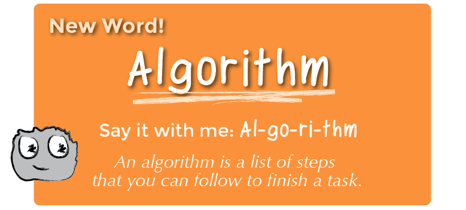

<!--
live preview (once saved to dropbox) is at http://staging.code.org/curriculum/k-1.  don't share this URL!
-->

<%= partial('curriculum_header', :unitnumber=>1, :unittitle=>'K-1', :lesson=>1, :title=> 'Happy Maps', :time=>45, :days=>1) %>

[content]

[together]

## K-1 Lesson Overview
At the root of all computer science is something called an algorithm.  The word “algorithm” may sound like something complicated, but really it’s just a list of instructions that someone can follow to achieve a result.  To provide a solid base for the rest of your students’ computer science education, we’re going to focus on building a secure relationship with algorithms. 

[summary]

## Teaching Summary
### **Getting Started** - 10 minutes

1) [Vocabulary](#Vocab)  
2) [Step-by-Step](#GetStarted)  

### **Activity: Happy Maps** - 20  minutes  

3) [Single-Step Adventure](#Activity1)  

<!-- 
4) [Double-Step Adventure](#Activity2)
--> 

### **Wrap-up** - 5  minutes 
4) [Flash Chat](#WrapUp) - What did we learn?
5) [Vocab-Shmocab](#Shmocab)

### **Assessment** - 10  minutes 
6) [Move the Flurbs](#Assessment)

[/summary]

## Lesson Objectives 
### Students will:
- List steps to move character around a map
- Arrange directions to reach predetermined goal
- Predict where character will land, given a list of steps

[/together]

[together]

# Teaching Guide

## Materials, Resources and Prep
### For the Student
- Student Activity Worksheet: Happy Maps
- Game Pieces: Flurbs, Arrows, and Things 
- Assessment Worksheet: Move the Flurbs
- Scissors
- Glue

### For the Teacher
- Teacher Lesson Guide

[/together]

[together]

## Getting Started (10 min)

###  1) Vocabulary
This lesson has one new and important word: 

[centerIt]

[/centerIt]

**Algorithm** - Say it with me: Al-go-ri-thm  
An algorithm is a list of steps that you can follow to finish a task. 

###  2) Step-by-Step
- Ask your students for directions to the chalkboard.
	- If they start shouting simultaneously, explain that you can only hear one instruction at a time.  Call on students individually if that helps. 
- When you reach the board, ask for instructions to draw a smiley face.
	- Again, request one step at a time.
- Explain that many tasks can be described using a specific list of instructions. That list is called an algorithm. 
- Challenge your students to work together in small groups to come up with algorithms for their single-step and double-step mazes.

[/together]

[tip]

# Teaching Tip
Students can work in pairs to create the adventures, then work in pairs to solve the adventures of others.  If this feels too chaotic you can work together as a class and create the adventure on a document camera, then work together to solve it. 

[/tip]

[together]

## Activities: (20 min)
###  3) [Single-Step Adventure](https://drive.google.com/file/d/0B_6_OvabUXVJaVJMbmx2QzBvNFE/edit?usp=sharing)
- This worksheet helps teach students how to think ahead in order to plan a short route from the Flurb’s start location to the final location, just one square away.
- Print out an activity packet for every group (ideally 2 to 4 students) and cut the Maps apart. Leave the arrow symbols for the students to cut apart.
- Explain the rules to the class, making sure to emphasise the new word "algorithm".

<!-- 
###  4) Double-Step Adventure
- The Double-Step sheet encourages students to take their knowledge just a little bit further as they find algorithms that will lead their Flurbs to their goal which is two or more steps away. 
--> 

[/together]

[together]

## Wrap-up (5 min)
###  4) Flash Chat: What did we learn?
- Did you feel like you were actually telling the Flurb what to do?
- What would it be like to control a robot that way?
- What would you create if it were that easy to tell a computer what to do?

[tip]

# Teaching Tip  
Flash Chat questions are intended to spark big-picture thinking about how the lesson relates to the greater world and the students' greater future.  Use your knowledge of your classroom to decide if you want to discuss these as a class, in groups, or with an elbow-partner.

[/tip]

###  5) Vocab Shmocab
- Which one of these definitions did we learn a word for today?

> "Breaking something into exactly two pieces"  
> "A list of steps that you can follow to finish a task"  
> "The plastic coating on the end of a shoelace" 
>> ...and what is the word that we learned?

[/together]

[together]

## Assessment (10 min)
### 6) [Move the Flurbs](https://drive.google.com/file/d/0B_6_OvabUXVJOVpfMG81Nmpocmc/edit?usp=sharing)
- Hand out the worksheet titled "Move the Flurbs" and allow students to complete the activity independently after the instructions have been well explained. 

[/together]

<!--(this is left in here as an example of how to include an image in Markdown)
 -->

[together]

## Extended Learning 
Use these activities to enhance student learning. They can be used as outside of class activities or other enrichment.

### Create Your Own

- Allow the students to guide you toward solving a problem that you provide one step at a time. Point out that every time they make a step, the rest of the adventure gets easier.
If the students are still excited by the problem, give them a more complicated configuration to solve.

### Flurb Flash

- Cycle quickly through single-step puzzles on your projector. Have the students hold up an arrow card or simply point in the direction that they think the Flurb should move.  

[/together]

[together]

## Connections and Background Information

### ISTE Standards (formerly NETS) Satisfied by this Lesson Include:

- 1.c - Use models and simulation to explore complex systems and issues  
- 2.d - Contribute to project teams to solve problems

### The activities in this lesson support CSTA K-12 Computer Science Standards:
 
- CPP.L1:3.04 - Construct a set of statements to be acted out to accomplish a simple task  
- CPP.L1:3.06 - Gather and organize information using concept mapping tools
- CT.L1:6.01 - Understand and use the basic steps in algorithmic problem-solving  
- CT.L1:6.02 - Develop a simple understanding of an algorithm using computer-free exercises  

### Other standards, including the NGSS, and Common Core Math & Language Arts

- CCLA-K:SL.2 - Confirm understanding of a text by asking or answering questions
- CCLA-1:SL.2 - Ask and answer questions about key details in a text

[/together]

[/content]

<link rel="stylesheet" type="text/css" href="morestyle.css"/>
