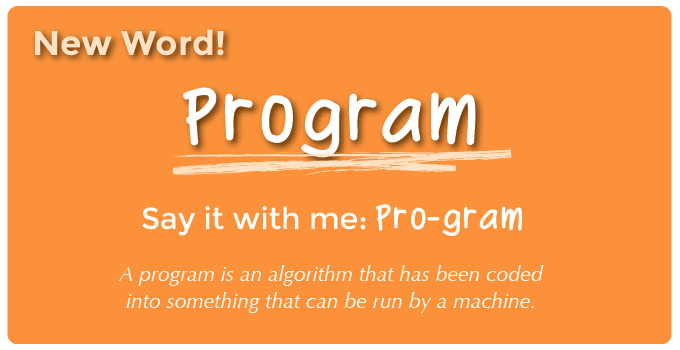

<!--
live preview (once saved to dropbox) is at http://staging.code.org/curriculum/k-1.  don't share this URL!
-->

<%= partial('curriculum_header', :unitnumber=>1, :unittitle=>'K-1', :lesson=>2, :title=> 'Move It, Move It', :time=>50, :days=>1) %>

[content]

[together]

## K-1 Lesson Overview
This lesson will help students realize that in order to give clear instructions, they need a common language. Students will practice controlling one another using a simple combination of hand gestures.  Once they understand the language, they will begin to "program" one another by giving multiple instructions in advance.

[summary]

## Teaching Summary
### **Getting Started** - 15 minutes

1) [Review](#Review)  
2) [Vocabulary](#Vocab)  
3) [Let's Control Ourselves](#GetStarted)  

### **Activity: Move It, Move It** - 20  minutes  

4) [Multi-Step Adventure](#Activity1)  

### **Wrap-up** - 5  minutes 

5) [Flash Chat](#WrapUp) - What did we learn? 
6) [Vocab-Shmocab](#Shmocab)

### **Assessment** - 10  minutes 
7) [Move the Flurbs 2](#Assessment)

[/summary]

## Lesson Objectives 
### Students will:
- Recognize situations where they can create programs to complete tasks
- Predict moves necessary to get teammate from start to finish
- Convert movements into symbolic instructions
- Relate algorithms as programs to teammates 

[/together]

[together]

# Teaching Guide

## Materials, Resources and Prep
### For the Student
- [Multi-Step Student Activity Packet](https://drive.google.com/file/d/0B_6_OvabUXVJUklNOVlxbm5pYTQ/edit?usp=sharing): Move It, Move It
- Assessment Worksheet: [Move the Flurbs 2](https://drive.google.com/file/d/0B_6_OvabUXVJV0xkNl80WTZldXc/edit?usp=sharing)
- Scissors
- Glue

### For the Teacher
- Teacher Lesson Guide
- Print [Multi-Step Student Activity Packet](https://drive.google.com/file/d/0B_6_OvabUXVJUklNOVlxbm5pYTQ/edit?usp=sharing) on Cardstock for each group
- Print Assessment Worksheet: [Move the Flurbs 2](https://drive.google.com/file/d/0B_6_OvabUXVJV0xkNl80WTZldXc/edit?usp=sharing) for each student

[/together]

[together]

## Getting Started (15 min)

###  1) Review
This is a great time to review the last lesson that you went through with your class.  Often, for kindergarten through first grade, this works well as an entire group exercise.

Here are some review ideas based on the previous lesson in this series:

- What did we do last time?

- Does anybody remember the word that we learned in our last lesson?
  - It is a list of steps that you can follow to finish a task...
  - It sounds like a crocodile that can keep a beat...
  - Al-go-...
  

- Can you give me an example of an algorithm?

- What was your favorite part of our last lesson?  

[tip]

# Teaching Tip
Finishing the review by asking about the students' favorite things helps to leave a positive impression of the previous exercise, increasing excitement for the activity that you are about to introduce.

[/tip]

###  2) Vocabulary
This lesson has one new and important word: 

[centerIt]

[/centerIt]

**Program** - Say it with me: Pro-gram  
A program is an algorithm that has been coded into something that can be run by a machine. 

###  3) Let's Control Ourselves
- Ask your students if they remember helping you draw a smiley face last time.
 - Review the instructions by drawing as they guide you one step at a time.
  
- Let them know that you're going to make a small change.
 - Now, I want you to give me two instructions at a time before I move my pen.
  
- Can you do it again, but give me three instructions at a time?
  
- When you give me multiple instructions at a time, you're providing me with an "algorithm" to draw each piece of the smiley face.
  
- Now, suppose we were to have a secret "code" for each of those instructions.  For example, "Draw an Eye" could look like this: (make a large cirlce with your hands). If we had special codes for each of those steps, then our algorithm becomes a program.
  
- We're going to play a game that allows us to program each other...and you'll do it all with your arms!

[/together]

[tip]

# Teaching Tip
Feel free to do an example map with the students as a class before breaking them into groups or even describing the rules (beyond how to react to each of the arm gestures).  Learning through play is often more effective than spouting off all of the rules at this age. 

[/tip]

[together]

## Activity: (20 min)
###  4) [Multi-Step Activity Packet](https://drive.google.com/file/d/0B_6_OvabUXVJUklNOVlxbm5pYTQ/edit?usp=sharing)
- This worksheet helps teach students how to think ahead in multiple steps, as they  plan a short route from their friend's start location to the hidden smiley face, up to three steps away.
- Print out an activity packet for every group (ideally 2 to 4 students) and cut the Map Cards apart. 
- Explain the rules to the class, making sure to emphasise the new word "program".

> **Directions:**

> 1. Decide who will be the Walking Machine and who will be the Controller.  
> 2. Have the Controller set up a grid on the floor made up of pieces of paper as shown on one of the Move It Maps, except with the smiley face upside down, facing the ground.
> 3.  The Walking Machine will start by standing on the page with the compass rose.
> 4.  The Controller will then lead the Walking Machine step-by-step through the paper maze that they created, using the provided arm signals.
> 5.  When the Controller gives the signal to “STOP”, the Walking Machine will flip over the page that they are on.  If that page is a smiley face, then the maze was a success!

- The Controller (and anyone else in the group who is not the Walking Machine) can set up a map made of paper, based on one of the Move It Map cards.

[centerIt]

[/centerIt]

- Remember that the smiley face map page should actually be set facing the ground, so that the Walking Machine cannot easily tell where their final location is.

- The Walking Machine begins by standing on the piece of paper imprinted with the compass rose.

[centerIt]

[/centerIt]

- The Controller uses arm movements to guide the Walking Machine. Controllers should start by giving one direction at a time, allowing the Walking Machine to take a step before they move on to the next direction.  

 - Halfway into the activity, you can encourage your students to Control with two instructions before they allow the Walking Machine to take a step, and then three.  

 - Ideally, by the time the lesson is complete, the students will relay the entire "program" to the Walking Machine before the Walking Machine even takes their first step.

[centerIt]

[/centerIt]

[/together]

[tip]

# Teaching Tip
Note that the rules are not the most important thing here.  Feel free to clarify if the students have questions, but if the students are playing a bit differently than described, you don't need to hold them to the letter of the game.  The crucial bit is that they are moving from immediate instructions to giving two or three instructions before the Walking Machine moves.

[/tip]

[together]

## Wrap-up (5 min)
###  5) Flash Chat: What did we learn?
- In the game we just played, who do you suppose was more like a programmer, and who was more like a computer?
- How could we have given instructions without using our arms?
- What was your favorite part about that game?

###  6) Vocab Shmocab
- Which one of these definitions did we learn a word for today?

> "The fluffy feathers of a baby bird"  
> "The circuit board that controls a robot"  
> "An algorithm that has been coded into something that can be run by a machine" 
>> ...and what is the word that we learned?

[/together]

[together]

## Assessment (10 min)
### 7) [Move the Flurbs 2](https://drive.google.com/file/d/0B_6_OvabUXVJV0xkNl80WTZldXc/edit?usp=sharing)
- Hand out the worksheet titled "Move the Flurbs 2" and allow students to complete the activity independently after the instructions have been well explained. 
- This should feel familiar, thanks to the previous two activities.

[/together]

[together]

## Extended Learning 
Use these activities to enhance student learning. They can be used as outside of class activities or other enrichment.

### X's and O's

- Draw a tic-tac-toe board for the class
- Place a single X and a single O somewhere on the board
- Ask the class if they can get the X to the O using arm gestures as a class. 

### X's, O's, and Arrows

- Similar to the activity above, but have the students write their programs in advance using arrows instead of hand gestures.
 - This can be done in groups. 
 - Groups can share their solutions for the class.

[/together]

[together]

## Connections and Background Information

### ISTE Standards (formerly NETS) Satisfied by this Lesson Include:

- 1.c - Use models and simulation to explore complex systems and issues  
- 2.d - Contribute to project teams to solve problems

### The activities in this lesson support CSTA K-12 Computer Science Standards:
 
- CPP.L1:3.04 - Construct a set of statements to be acted out to accomplish a simple task  
- CPP.L1:3.06 - Gather and organize information using concept mapping tools
- CT.L1:6.01 - Understand and use the basic steps in algorithmic problem-solving  
- CT.L1:6.02 - Develop a simple understanding of an algorithm using computer-free exercises  

### Other standards, including the NGSS, and Common Core Math & Language Arts

- CCLA-K:SL.2 - Confirm understanding of a text by asking or answering questions
- CCLA-1:SL.2 - Ask and answer questions about key details in a text

[/together]

[/content]

<link rel="stylesheet" type="text/css" href="morestyle.css"/>
