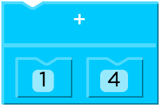
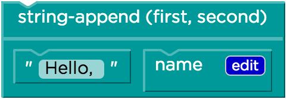
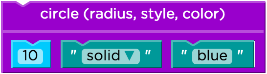
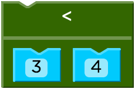

<%
lesson_id = 'alg13'
lesson = DB[:cdo_lessons].where(id_s:lesson_id).first
%>

<%= partial('../docs/_header', :lesson => lesson) %>

[summary]

## Teaching Summary
### **Getting Started**
 
1) [Vocabulary](#Vocab) 
2) [Booleans - True or False?](#GetStarted)  

### **Activity: Booleans 20 Questions**  

3) [Boolean 20 Questions](#Activity1)   

<!--
### **Assessment**
4) [Boolean Assessment](#Assessment)
-->

[/summary]

[together]

# Teaching Guide

## Materials, Resources, and Prep

### For the Teacher
- [Lesson Slide Deck](https://docs.google.com/a/code.org/presentation/d/1lUA5nx8ILAPwjAEl70Hw0ADGflzOtX1L2pIXtNU2B0U/)

### For the Students
- 3 x 5 cards, pens or pencils

[/together]

[together]

## Getting Started

###  1) Vocabulary
This lesson has two new and important words: 

- **Boolean** - a type of data with two values: true and false.
- **Return** - used as a synonym for output of a function.

###  2) Booleans - True or False?

What types of data have we used in our programs so far?

- Can you think of Number values?
- String values? Image values?
- What are some expressions that evaluate to a Number?
- How about the other datatypes?

What would each of the following expressions evaluate to?

 
 
 
 

The last expression, **(3 < 4)**, uses a new function that compares Numbers, returning **true** if 3 is less than 4. What do you think it would return if the numbers were swapped?

The function **<** tests if one number is less than another. Can you think of some other tests?

Functions like **<**, **>** and **=** all consume two Numbers as their Domain, and produce a special value called a Boolean as their Range. Booleans are answers to a yes-or-no question, and Boolean functions are used to perform tests. In a videogame, you might test if a player has walked into a wall, or if their health is equal to zero. A machine in a doctor’s office might use Booleans to test if a patient’s heart rate is above or below a certain level. 

**Boolean values can only be true or false.**
 
[/together]

[together]

## Activities:
###  3) Boolean 20 Questions

Give each student a card and have them answer the following questions on it (feel free to add some of your own)

1. What is your hair color?
2. Do you wear glasses or contacts?
3. What is your favorite number?
4. What is your favorite color?
5. What month were you born?
6. Do you have any siblings?
7. What is the last digit of your phone number?
8. What is something about you that people here don't know and can't tell by looking at you?

Then collect the cards and shuffle them. To play the game, follow these steps:

 - Select a card
 - Say: I’m going to read the answer to #8 but if it is you, don’t say anything.
 - Say: Now everyone stand up and we are going to ask some questions with Boolean answers to help determine who this person is.
 - Begin the following true/false questions.  Preface each one with “If you answer false to the following question, please sit down.”  The person whose card you are reading should always answer true so you will need to change the example questions below.  For this example, the answers were:
 
1. What is your hair color? - **brown**
2. Do you wear glasses or contacts? - **yes**
3. What is your favorite number? - **13**
4. What is your favorite color? - **blue**
5. What month were you born? - **December**
6. Do you have any siblings? - **yes**
7. What is the last digit of your phone number? - **7**

With that example, you might make the following statements:

- My hair color is brown.
- I wear contacts or glasses.  (you only have to answer true to One of these to remain standing)
- My favorite number is greater than 10 and less than 20. (you must answer true to both these.)
- My favorite color is blue or green.
- I was not born in April.
- I have at least one sibling.
- The last digit of my phone number is a prime number.

Because of how numbers 3,4, 5, and 7 were asked it is likely that some people will still be standing.  You will need to revisit these and ask them again in a more narrow fashion such as “My favorite color is blue”.

Play this several times.  Be creative with using _or_s and _and_s.  Remind students that the OR means that either part of the statement being true will result in the entire statement being true.  In English, an “or” is often an “exclusive or” such as “You can have chicken or fish.”  In English, you only get to pick one, but with Boolean logic you could have chicken, fish, or both!!  For the example person above, “I was born in December OR my favorite number is 13” is true.  Note that “I was born in December AND my favorite number is 13” is also true.

Have a student try to act as the quizmaster after several rounds.  If a mistake is made by you, a student quizmaster, or the person whose card you are reading, see if you can analyze where the mistake was made or why the question being asked might not have been clear.

How does this activity connect with our game? In our game, we may need to determine: Is a target too far left or too far right?  If so, then perhaps some action should occur.

[/together]

[together]

<!--
## Assessment 
### 4) Booleans Assessment

Visit [CS in Algebra Stage 13](http://studio.code.org/s/algebra/lessons/13/levels/1) in Code Studio to complete the assessments.
-->

[/together]

<%= partial('../docs/_footer', :lesson => lesson) %>