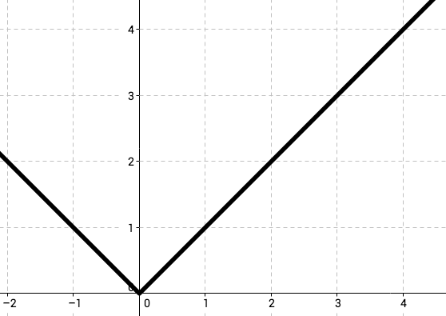

<%
lesson_id = 'alg17'
lesson = DB[:cdo_lessons].where(id_s:lesson_id).first
%>

<%= partial('../docs/_header', :lesson => lesson) %>

[summary]

## Teaching Summary
### **Getting Started**
 
1) [Vocabulary](#Vocab) 
2) [Conditionals](#GetStarted)  

### **Activity: Conditionals and Piecewise Functions**  

3) [Conditionals and Piecewise Functions](#Activity1)   

<!--
### **Assessment**
4) [Conditionals Assessment](#Assessment)
-->

[/summary]

[together]

# Teaching Guide

## Materials, Resources, and Prep

### For the Teacher
- [Lesson Slide Deck](https://docs.google.com/a/code.org/presentation/d/1OnNkpXDU6GZreGRvquQU1qRKbEeH8WTvRU5DhlgI2Hk/)

[/together]

[together]

## Getting Started

###  1) Vocabulary
This lesson has three new and important words: 

- **Clause** - a question and its corresponding answer in a conditional expression
- **Conditional** - a code expression made of questions and answers
- **Piecewise Function** - a function which evaluates the domain before choosing how to create the range

###  2) Conditionals

- We can start this lesson off right away
  - Let the class know that if they can be completely quiet for thirty seconds, you will do something like:
     - Sing an opera song
     - Give five more minutes of recess
     - or Do a handstand
   - Start counting right away.
   - If the students succeed, point out right away that they succeeded, so they *do* get the reward.
   - Otherwise, point out that they were not completely quiet for a full thirty seconds, so they *do not* get the reward.
- Ask the class "What was the *condition* of the reward?"
  - The condition was if you were quiet for 30 seconds
     - If you were, the condition would be true, then you would get the reward.
     - If you weren't, the condition would be false, then the reward would not apply.
  - Can we come up with another conditional?
     - If I say "question," then you raise your hand.
     - If I sneeze, then you say "Gesundheit."
     - What examples can you come up with?

Up to now, all of the functions you’ve seen have done the same thing to their inputs:

- green-triangle always made green triangles, no matter what the size was.
- safe-left? always compared the input coordinate to 0, no matter what that input was.
- update-danger always added or subtracted the same amount

Conditionals let our programs run differently based on the outcome of a condition. Each clause in a conditional evaluates to a boolean value - if that boolean is TRUE, then we run the associated expression, otherwise we check the next clause. We've actually done this before when we played the boolean game! If the boolean question was true for you, you remained standing, and if it was false you sat down.

Let's look at a conditional piece by piece:

    (x > 10)  ->  "That's pretty big"
    (x < 10)  ->  "That's pretty small"
    else      ->  "That's exactly ten"

If we define x = 11, this conditional will first check if x > 10, which returns TRUE, so we get the String "That's pretty big" - and because we found a true condition we don't need to keep looking.

If we define x = 10, then we first check if x > 10 (FALSE), then we check x < 10 (FALSE), so then we hit the _else_ statement, which only returns something if none of the other conditions were true. The _else_ statement should be considered the catch-all response - with that in mind, what's wrong with replying "That's exactly ten"? What if x = "yellow"? If you can state a precise question for a clause, write the precise question instead of else. It would have been better to write the two conditions as (x > 10) and (x <= 10). Explicit questions make it easier to read and maintain programs.

Functions that use conditions are called piecewise functions, because each condition defines a separate piece of the function. Why are piecewise functions useful? Think about the player in your game: you’d like the player to move one way if you hit the "up" key, and another way if you hit the "down" key. Moving up and moving down need two different expressions! Without conditionals, you could only write a function that always moves the player up, or always moves it down, but not both.
     
Now let's play a game.
 
[/together]

[together]

## Activities:
###  3) Conditionals and Piecewise Functions

Living Function Machines - Conditionals:

Explain to the class that they will be playing the role of Function Machines, following a few simple rules:
- Whenever your function is called, the only information you are allowed to take in is what's described in your Domain.
- Your function must return only what is described in your Range.
- You must follow the steps provided in your definition - no magic!

This time, however, everyone will be running the same function. And that function is called 'simon\_says' and it has the following Contract:
simon_says: String -> Movement  
Given a String that describes an action, produce the appropriate movement. If an unknown action is called, lower both hands.

Examples

    simon_says("left hand up")    = RaiseLeftHand
    simon_says("right hand up")   = RaiseRightHand
    simon_says("left hand down")  = LowerLeftHand
    simon_says("right hand down") = LowerRightHand

Definition

    simon_says(action) = cond {
                       "left hand up"     : RaiseLeftHand,
                       "right hand up"    : RaiseRightHand,
                       "left hand down"   : LowerLeftHand,
                       "right hand down"  : LowerRightHand,
                       else               : LowerBothHands }

Review the contract parts:  name, domain, range, parameters (input types), return types (output values)

Say to the class: “Here is what the initial code looks like.  We will add several clauses but the clauses that are there will always be there and the final else action (often called the default result) will always be LowerBothHands

- `simon_says("right hand up")`
- `simon_says("left hand up")` - both hands should be up
- `simon_says("right hand up")` - both hands should still be up
- `simon_says("left hand down")` - left should be down, right should be up
- `simon_says("right hand up")` - left should be down, right should be up
- `simon_says("hokey pokey")` - both hands should be down
- `simon_says("left hand up")` - left hand should be up
- `simon_says("right up")` - trick, there are no matches so the else statement is called

If anyone makes a mistake, they must "reboot" by sitting down and waiting for the next round to start.

Say to the class:  “Now we're going to rewrite our function a little bit - instead of taking a String as its Domain, simon_says will take a Number. Here's what our new function looks like:

    simon_says(action) = cond {
					   (action < 10)					: RaiseLeftHand,
					   (action < 20)					: RaiseRightHand,
					   (action > 20) and (action < 50)	: LowerLeftHand,
					   (action > 50) and (action < 100)	: LowerRightHand,
					   else						        : LowerBothHands }

Continue playing using numbers in the `simon_says` function, such as `simon_says(15)`, which should result in `RaiseRightHand`. As students get comfortable with the new rules, you can throw in some trick questions, such as `simon_says(20)` or `simon_says(50)`, both of which should call the else statement. You can extend this activity in many ways, for example:

- Call the function with a simple expression, such as `simon_says(30 / 2)`
- Add more conditions of your own
- Create multiple functions and divide the class into groups
- Allow students to take over as the 'programmer'

### Connection to Mathematics and Life

There are piecewise functions in mathematics as well.  The absolute value function y = |x| can be re-written as   
y = { -x : x<0 , x : x>0, 0 }  
 
Note that in mathematical terms, the clause for the domain is usually listed second instead of first.  

A data plan on a phone bill might be structured as:

* $40 for less than 5 GB
* $ 8 per GB for 5-10 GB
* $12 per GB for using more than 10GB

This could be graphed with the following piecewise function y = { 40: x<5, 8x: 5 =< x =< 10, 12x: x>10 }

 

Another very common piecewise functions is for taxi cabs.

* $3 for 0 to 2 miles
* $1 for each partial mile after that

 

This could be graphed with the following piecewise function y = { 3: x<2, [[x]]+2: x>=2 } where [[x]] is the greatest integer function or what is often called a floor function in computer languages.  The greatest integer function returns the greatest INTEGER less that the current value.  For instance [[2.9]] is 2 and [[3.1]] is 3.

[/together]

[together]

<!--
## Assessment 
### 4) Conditionals Assessment

Visit [CS in Algebra Stage 17](http://studio.code.org/s/algebra/lessons/17/levels/1) in Code Studio to complete the assessments.
-->

[/together]

<%= partial('../docs/_footer', :lesson => lesson) %>