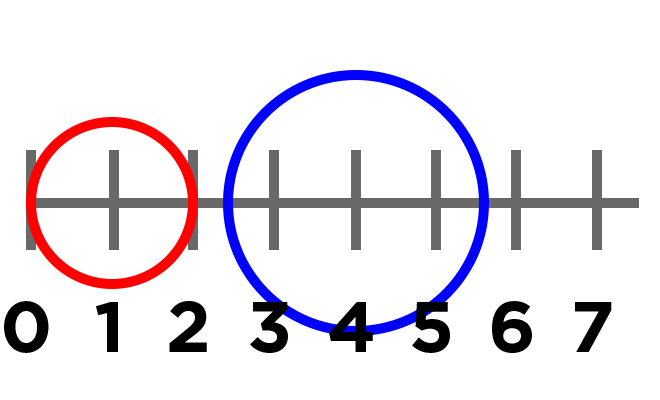
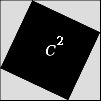

<%
lesson_id = 'alg19'
lesson = DB[:cdo_lessons].where(id_s:lesson_id).first
%>

<%= partial('../docs/_header', :lesson => lesson) %>

[summary]

## Teaching Summary
### **Getting Started**
 
1) [Vocabulary](#Vocab) 
2) [Are they Touching?](#GetStarted)  

### **Activity: Collision Detection**  

3) [Proving Pythagoras](#Activity1)   
4) [Collision Detection](#Activity2)   

<!--
### **Assessment**
5) [Boolean Assessment](#Assessment)
-->

[/summary]

[together]

# Teaching Guide

## Materials, Resources, and Prep
### For the Student
- [Collision Worksheets](../docs/worksheets/collision.pdf)
- [Safe-right? Design Recipe](../docs/worksheets/safe_right.pdf) (in the student workbook)
- [Onscreen? Design Recipe](../docs/worksheets/onscreen.pdf) (in the student workbook)

### For the Teacher
- Language Table (see below)
- Cutouts of Pythagorean Theorem packets ( [1](pythag1.png), [2](pythag2.png) ) - 1 per group of students working together

[/together]

[together]

## Getting Started

###  1) Vocabulary
This lesson has one new and important word: 

- **Hypotenuse** - the side opposite the 90-degree angle in a right triangle

###  2) Are they Touching?

Suppose two objects are moving through space, each one having its own (x,y) coordinates. When do their edges start to overlap? They certainly overlap if their coordinates are identical (x1 = x2, y1 = y2), but what if their coordinates are separated by a small distance? Just how small does that distance need to be before their edges touch?

**Visual aids are key here: be sure to diagram this on the board!**
In one dimension, it’s easy to calculate when two objects overlap. In this example, the red circle has a radius of 1, and the blue circle has a radius of 1.5 The circles will overlap if the distance _between their centers_ is _less than the sum of their radii_ (1 + 1.5 = 2.5). How is the distance between their centers calculated? In this example, their centers are 3 units apart, because 4 − 1 = 3.

[tip]

# Lesson Tip

Would the distance between them change if the circles swapped places? Why or why not?

[/tip]

Work through a number of examples, using a number line on the board and asking students how they calculate the distance between the points. Having students act this out can also work well: draw a number line, have two students stand at different points on the line, using their arms or cutouts to give objects of different sizes. Move students along the number line until they touch, then compute the distance on the number line.

Your game file provides a function called line-length that computes the difference between two points on a number line. Specifically, line-length takes two numbers as input and determines the distance between them

[tip]

# Lesson Tip

What answers would you expect from each of the following two uses of line-length:

- line-length(2, 5)
- line-length(5, 2)

Do you expect the same answer regardless of whether the larger or smaller input goes first?

[/tip]

Unfortunately, line-length can only calculate the distance between points in a single dimension (x or y). How would the distance be calculated between objects moving in 2-dimensions (like your game elements)? **line-length** can calculate the vertical and horizontal lines in the graphic shown here, using the distance between the x-coordinates and the distance between the y-coordinates. Unfortunately, it doesn’t tell us how far apart the two centers are.

Drawing a line from the center of one object to the other creates a right-triangle, with sides A, B and C. A and B are the vertical and horizontal distances, with C being the distance between the two coordinates. **line-length** can be used to calculate A and B, but how can we calculate C?

In a right triangle, the side opposite the 90-degree angle is called the hypotenuse. Thinking back to our collision detection, we know that the objects will collide if the hypotenuse is less than the sum of their radii. Knowing the length of the hypotenuse will be essential to determine when a collision occurs.
 
[/together]

[together]

## Activities:
###  3) Proving Pythagoras

If your students are new to the Pythagorean Theorem, or are in need of a refresher, this activity is an opportunity to strengthen their understanding in a hands-on fashion.

Organize students into small groups of 2 or 3.

- Pass out Pythagorean Proof materials ( [1](pythag1.png), [2](pythag2.png) ) to each group.
- Have students cut out the four triangles and one square on first sheet.
- Explain that, for any right triangle, it is possible to draw a picture where the hypotenuse is used for all four sides of a square.
- Have students lay out their gray triangles onto the white square, as show in this diagram.
- Point out that the square itself has four identical sides of length C, which are the hypotenuses for the triangles. If the area of a square is expressed by _side ∗ side_, then the area of the white space is C2.
- Have students measure the inner square formed by the four hypotenuses (C)

By moving the gray triangles, it is possible to create two rectangles that fit inside the original square. While the space taken up by the triangles has shifted, it hasn’t gotten any bigger or smaller. Likewise, the white space has been broken into two smaller squares, but in total it remains the same size. By using the side-lengths A and B, one can calculate the area of the two squares.

- You may need to explicitly point out that the side-lengths of the triangles can be used as the side-lengths of the squares. 
- Have students measure the area of the smaller square (A)
- Have students measure the area of the larger square (B)
- Ask students to compare the are of square A + square B to the area of square C

The smaller square has an area of A2, and the larger square has an area of B2. Since these squares are just the original square broken up into two pieces, we know that the sum of these areas must be equal to the area of the original square:

## A2 + B2 = C2

###  4) Collision Detection

In this  activity students will:

- Create right triangles on a graph.
- Calculate the hypotenuse by direct measurement and by the Pythagorean Theorem.
- Determine if circles have collided by examining visually.
- Determine if circles have collided by comparing distance and radii.

Detailed instructions are provided on the [Collision Worksheet](../docs/worksheets/collision.pdf).
 
[/together]

[together]

<!--
## Assessment 
### 4) Collision Detection Assessment

Visit [CS in Algebra Stage 19](http://studio.code.org/s/algebra/lessons/19/levels/1) in Code Studio to complete the assessments.
-->

[/together]

<%= partial('../docs/_footer', :lesson => lesson) %>