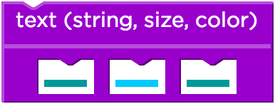

<%
lesson_id = 'alg4'
lesson = DB[:cdo_lessons].where(id_s:lesson_id).first
%>

<%= partial('../docs/_header', :lesson => lesson) %>

[summary]

## Teaching Summary
### **What's in a Contract**
 
1) [Vocabulary](#Vocab) 
2) [What's in a Function](#GetStarted)  

### **Activity: Contracts**  

3) [Reading Contracts](#Activity1) 
4) [Writing Contracts](#Activity2)  

### **Wrap-up**
5) [Keep Up Your Contracts](#WrapUp)  

<!--
### **Assessment**
6) [Contracts Assessment](#Assessment)
-->

[/summary]

[together]

## Lesson Objectives 
### Students will:

- Describe a function in terms of its name, domain, and range
- Create contracts for arithmetic and image-producing functions

# Teaching Guide

## Materials, Resources, and Prep
### For the Student
- [Contract Log](../docs/worksheets/contract_log.pdf)

### For the Teacher
- [Lesson Slide Deck](https://docs.google.com/a/code.org/presentation/d/1SAu2YgSAE9g5NrhJ_c7eWBOAc_EGtXIDQqihvjyHV98)

[/together]

[together]

## Getting Started

###  1) Vocabulary
This lesson has three new and important words: 

- **Contract** - a statement of the name, domain, and range of a function
- **Domain** - the type of data that a function expects
- **Range** - the type of data that a function produces

###  2) What's in a Function

You’ve already seen several functions that take in two Numbers, such as +, and -. Other functions like "star", take in a Number and two Strings. Different functions take in different inputs, and we need a way to keep track of the requirements for each function.

- What does the '+' function do?
  - What does it take as input?
  - What does it return as output?
- How about the 'triangle' function?
- What do these different functions have in common?

Let's look at a simple way to describe any function, it's called a "contract"

- What is a Contract?
  - A formal agreement
  - A description of expected behavior
- What do Contracts tell us?
  - What a function should do
  - What inputs a function needs
  - What a function returns
  
Encourage students to think about contracts in the real world. What purpose do they serve? If a contract is signed, do we expect it to be followed?

Contracts have three distinct parts:

1. Name
2. Domain
3. Range

**The Name of a function briefly describes what the function does.**

**The Domain of a function is the data that the function expects.**

**The Range of a function is the data that the function produces.**

By keeping a list of all the functions in a language, and their Domains, programmers can easily look up how each function is used. However, it’s also important to keep track of what each function produces! For example, a program wouldn’t use "star" if they were trying to produce a Number, because star only produces Images. 

Domains and Ranges help programmers write better code, by preventing silly mistakes and giving themselves hints about what to do next. A programmer who wants to use "star" can look up the Domain and immediately know that the first input has to be a Number (like 100), without having to remember it each time. Instead of writing a single value there, a programmer could write a whole expression, like (25 * 4). We know this code will return an appropriate value (Number) by looking at the Range for *; therefore, the result of * can be used in place of any Number value.

When programmers write down the Domains and Ranges of each function, they write what are called **contracts**, to keep track of what each function needs. 

[/together]

[together]

## Activities:

###  3) Reading Contracts

Let's look at a few example contracts - for each contract we'll identify the Name, Domain, and Range

- +: Number Number -> Number
- 
- triangle: Number String String -> Image
- 
- rotate: Number Image -> Image
- 

###  4) Writing Contracts

Let's see if we can come up with contracts for some of the functions you've already seen. You'll want to make sure that you've got your [contract log](../docs/worksheets/contract_log.pdf), as this is where you'll keep a running document of all contracts you write - both for existing functions and ones of your own creation.

- We'll start with contracts for simple arithmetic functions
- +, -, *, /
 
Those were pretty easy as arithmetic functions only deal in Numbers. When it comes to writing functions that deal with multiple data types, looking at the Evaluation Block can give us some helpful clues.

- The Name of each function is at the top
- There will be a slot for each Domain element
- The color of each slot tells you Domain type
- The color of the whole block tells you Range
- Color codes: Number String Image

[tip]

# Lesson Tip

Common mistakes when students first write down contracts include: writing values (such as "red") instead of types (such as "String") and forgetting arguments. Read your students’ contracts carefully, as they often indicate misconceptions that will persist and affect them later on.

[/tip]

Display each of the following Evaluation Blocks and ask students:

- What is the Name of this function?
- What is the Domain of this function?
- What is the Range of this function?
- Add this function's contract to your reference

 
 
 

[/together]

[together]

## Wrap-up
###  5) Keep up your Contracts

As you continue programming, make sure that you document a contract for every new function you encounter or write.
In the next unit, you’ll learn how to create your own functions to save work in writing expressions (this will turn out to be an essential part of writing a game). You’ll also start customizing your game with images for the elements in your game design.

[/together]

[together]

<!--
## Assessment
### 6) Contract Writing Assessment

Visit [CS in Algebra Stage 4](http://studio.code.org/s/algebra/lessons/4/levels/1) in Code Studio to complete the assessments.
-->

[/together]

<%= partial('../docs/_footer', :lesson => lesson) %>