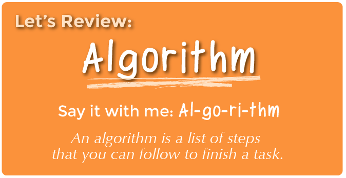

<%= partial('curriculum_header', :title=> 'Real-Life Algorithms: Plant a Seed', :unplugged=>true,:disclaimer=>'Basic lesson time includes activity only. Introductory and Wrap-Up suggestions can be used to delve deeper when time allows.', :time=>20) %>

[content]

## Lesson Overview
In this lesson, students will relate the concept of algorithms back to everyday real-life activities by planting an actual seed. The goal here is to start building the skills to translate real-world situations to online scenarios and vice versa. 

[summary]

## Teaching Summary
### **Getting Started** - 10 minutes

1) [Review](#Review)  
2) [Vocabulary](#Vocab) 
3) [What We Do Daily](#GetStarted)  

### **Activity: Real-Life Algorithms** - 20  minutes  

4) [Real-Life Algorithms: Plant a Seed](#Activity1)  

### **Wrap-up** - 5  minutes 

5) [Flash Chat](#WrapUp) - What did we learn? 

### **Assessment** - 15  minutes 
6) [Daily Algorithms](#Assessment)

[/summary]

[together]

## Lesson Objectives 
### Students will:
- Name various activities that make up their day
- Decompose large activities into a series of smaller events
- Arrange sequential events into their logical order

[/together]

[together]

# Teaching Guide

## Materials, Resources and Prep
### For the Student
- Components for Planting Seeds: Container (such as empty milk carton), potting soil, seed, water
- [Real-Life Algorithms: Plant a Seed Worksheet](/curriculum/course1/6/Activity6-RealLifeAlgorithms.pdf)
- Assessment Worksheet: [Daily Algorithms](/curriculum/course1/6/Assessment6-RealLifeAlg.pdf)
- Scissors
- Glue

### For the Teacher
- Teacher Lesson Guide
- Print one [Real-Life Algorithms: Plant a Seed Worksheet](/curriculum/course1/6/Activity6-RealLifeAlgorithms.pdf) for each student
- Print Assessment Worksheet: [Daily Algorithms](/curriculum/course1/6/Assessment6-RealLifeAlg.pdf) for each student

[/together]

[together]

## Getting Started (10 min)

###  1) Review
This is a great time to review the last lesson that you went through with your class.  You can do this as one large group or have students discuss with an elbow partner.

Here are some questions that you can ask in review:

- What did we do last time?

- What do you wish we had had a chance to do?

- Did you think of any questions after the lesson that you want to ask?

- What was your favorite part of the last lesson?

[tip]

# Lesson Tip
Finishing the review by asking about the students' favorite things helps to leave a positive impression of the previous exercise, increasing excitement for the activity that you are about to introduce.

[/tip]

###  2) Vocabulary
This lesson has one vocabulary word that is important to review: 

[centerIt]

[/centerIt]

**Algorithm** - Say it with me: Al-go-ri-thm  
A list of steps that you can follow to finish a task

###  3) What We Do Daily
- Ask your students what they did to get ready for school this morning.
  - Write their answers on the board
  - If possible, put numbers next to their responses to indicate the order that they happen
     - If students give responses out of order, have them help you put them in some kind of logical order
     - Point out places where order matters and places where it doesn't  
- Introduce students to the idea that it is possible to create algorithms for the things that we do everyday.
  - Give them a couple of examples, such as making breakfast, tying shoes, and brushing teeth.
  
- Let's try doing this with a new and fun activity, like planting a seed!

[/together]

[together]

## Activity: (20 min)
###  4) [Real-Life Algorithms: Plant a Seed](/curriculum/course1/6/Activity6-RealLifeAlgorithms.pdf)

[tip]

# Lesson Tip
You know your classroom best.  As the teacher, decide if you should all do this together, or if students should work in pairs or small groups.

[/tip]

- You can use algorithms to help describe things that people do every day.  In this activity, we will create an algorithm to help each other plant a seed.
 

> **Directions:**

> 1. Cut out the steps for planting a seed from the [provided worksheet](/curriculum/course1/6/Activity6-RealLifeAlgorithms.pdf).
> 2. Work together to choose the six correct steps from the nine total options.
> 3. Glue the six correct steps, in order, onto a separate piece of paper.
> 4. Trade the finished algorithm with another person or group and let them use it to plant their seed!

[/together]

[tip]

# Lesson Tip
If deciding on the correct steps seems too difficult for your students, do that piece together as a class before you break up into teams.

[/tip]

[together]

## Wrap-up (5 min)
###  5) Flash Chat: What did we learn?
- How many of you were able to follow your classmates' algorithms to plant your seeds?
- Did the exercise leave anything out?
  - What would you have added to make the algorithm even better?
  - What if the algorithm had been only one step: "Plant the seed"?
     - Would it have been easier or harder?
     - What if it were forty steps?
- What was your favorite part about that activity?

[/together]

[together]

## Assessment (15 min)
### 6) Assessment Worksheet: [Daily Algorithms](Assessment6-RealLifeAlg.pdf)
- Hand out the worksheet titled "Daily Algorithms" and allow students to complete the activity independently after the instructions have been well explained. 
- This should feel familiar, thanks to the previous activities.

[/together]

[together]

## Extended Learning 
Use these activities to enhance student learning. They can be used as outside of class activities or other enrichment.

### Go Figure

- Break the class up into teams.
- Have each team come up with several steps that they can think of to complete a task.
- Gather teams back together into one big group and have one team share their steps, without letting anyone know what the activity was that they had chosen.
- Allow the rest of the class to try to guess what activity the algorithm is for.

[/together]

[standards]

## Connections and Background Information

### ISTE Standards (formerly NETS)

- 1.a - Apply existing knowledge to generate new ideas, products, or processes.
- 1.c - Use models and simulation to explore complex systems and issues.  
- 2.d - Contribute to project teams to solve problems.
- 4.b - Plan and manage activities to develop a solution or complete a project.
- 6.a - Understand and use technology systems. 

### CSTA K-12 Computer Science Standards
 
- CT.L1:3-03. Understand how to arrange information into useful order without using a computer.
- CT.L1:6-01. Understand and use the basic steps in algorithmic problem-solving.
- CT.L1:6-02. Develop a simple understanding of an algorithm using computer-free exercise.
- CT.L1:6-05. Make a list of sub-problems to consider while addressing a larger problem.
- CPP.L1:3-04. Construct a set of statements to be acted out to accomplish a simple task. 
- CPP.L1:6-05. Construct a program as a set of step-by-step instructions to be acted out (e.g., make a peanut butter and jelly sandwich activity).
- CT.L2-03. Define an algorithm as a sequence of instructions that can be processed by a computer.
- CT.L2-06. Describe and analyze a sequence of instructions being followed.

### NGSS Science and Engineering Practices
- K-LS1-1. Use observations to describe patterns of what plants and animals (including humans) need to survive.

### Common Core Mathematical Practices
- 1. Make sense of problems and persevere in solving them.
- 2. Reason abstractly and quantitatively.
- 3. Construct viable arguments and critique the reasoning of others.
- 6. Attend to precision.
- 7. Look for and make use of structure.
- 8. Look for and express regularity in repeated reasoning.

### Common Core Math Standards

- K.G.A.1 - Describe objects in the environment using names of shapes, and describe the relative positions of these objects using terms such as above, below, beside, in front of, behind, and next to.

### Common Core Language Arts Standards
- SL.K.1 - Participate in collaborative conversations with diverse partners about kindergarten topics and texts with peers and adults in small and larger groups.
- SL.K.2 - Confirm understanding of a text read aloud or information presented orally or through other media by asking and answering questions about key details and requesting clarification if something is not understood.
- SL.K.5 - Add drawings or other visual displays to descriptions as desired to provide additional detail.
- L.K.6 - Use words and phrases acquired through conversations, reading and being read to, and responding to texts.
- SL.1.1 - Participate in collaborative conversations with diverse partners about grade 1 topics and texts with peers and adults in small and larger groups.
- SL.1.2 - Ask and answer questions about key details in a text read aloud or information presented orally or through other media.
- SL.1.5 - Add drawings or other visual displays to descriptions when appropriate to clarify ideas, thoughts, and feelings.
- L.1.6 - Use words and phrases acquired through conversations, reading and being read to, and responding to texts, including using frequently occurring conjunctions to signal simple relationships.
- SL.2.1 - Participate in collaborative conversations with diverse partners about grade 2 topics and texts with peers and adults in small and larger groups.
- SL.2.2 - Recount or describe key ideas or details from a text read aloud or information presented orally or through other media.
- L.2.6 - Use words and phrases acquired through conversations, reading and being read to, and responding to texts, including using adjectives and adverbs to describe.

[/standards]

  

 

[/content]

<link rel="stylesheet" type="text/css" href="../docs/morestyle.css"/>
