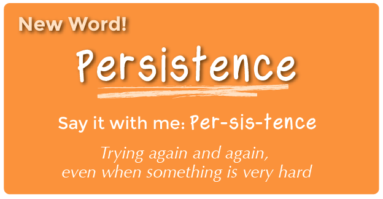

<%= partial('curriculum_header', :title=> 'Building a Foundation', :unplugged=>true,:disclaimer=>'Basic lesson time includes activity only. Introductory and Wrap-Up suggestions can be used to delve deeper when time allows.', :time=>30) %>

[content]

[together]

## Lesson Overview
New and unsolved problems are often pretty hard. If we want to have any chance of making something creative, useful, and clever, then we need to be willing to attack hard problems even if it means failing a few times before we succeed. 

This lesson teaches that failure is not the end of a journey, but a hint for how to succeed.
[summary]

## Teaching Summary
### **Getting Started** - 20 minutes

1) [Review](#Review) 
2) [Vocabulary](#Vocab)  
3) [Try, Try Again](#GetStarted)  

### **Activity: Building a Foundation** - 30  minutes  

4) [Building a Foundation](#Activity1)  

### **Wrap-up** - 5  minutes 
5) [Flash Chat](#WrapUp) - What did we learn?  
6) [Vocab Shmocab](#Shmocab)

[/summary]

## Lesson Objectives 
### Students will:
- Outline steps to complete a structural engineering challenge
- Predict and discuss potential issues in structure creation
- Build a structure based on team plan
- Revise both plan and structure until they satisfy challenge

[/together]

[together]

# Teaching Guide

## Materials, Resources and Prep
### For the Student
- Building Elements
  - Gumdrops and Toothpicks (approx 30 each group) or
  - Marshmallows and Popsicle Sticks (approx 30 each group) or
  - Paper and Tape (approx 10 pieces per group)
- Mini Paper Cup for checking height (1 per group)
- Book for testing strength (1 per group)

### For the Teacher
- Teacher Lesson Guide
- Print [Building a Foundation Packet](/curriculum/course1/9/Activity9-BuildingFoundation.pdf)
- Gather enough building elements for each group
  - You don't have to give any certain amount; just make sure you put some limit on materials.

[/together]

[together]

## Getting Started (20 min)

###  1) Review
This is a great time to review the last lesson that you went through with your class.  You can do this as one large group or have students discuss with an elbow partner.

Here are some questions that you can ask in review:

- What did we do last time?

- What do you wish we had had a chance to do?

- Did you think of any questions after the lesson that you want to ask?

- What was your favorite part of the last lesson?

[tip]

# Lesson Tip
Finishing the review by asking about the students' favorite things helps to leave a positive impression of the previous exercise, increasing excitement for the activity that you are about to introduce.

[/tip]

###  2) Vocabulary
This lesson has one new and important word: 

[centerIt]

[/centerIt]

**Persistence** - Say it with me: Per-sis-tence  
Trying again and again, even when something is very hard

###  3) Try, Try Again

- Does everyone get everything right the first time?
- When I was a baby learning to walk, did I stand up and run off on my first try?
  - Video of [baby learning to scoot, sit, walk](https://www.youtube.com/watch?v=BqQiOOC7_Rs). 

- Sometimes, the best and most useful things to do are the hardest to learn. 
  - It can take a while to learn hard things
  - If you don't do something well at first, does it mean that you never will?
  - Can you think of something that was hard at first, but that you can now do pretty easily?
     - Walking
     - Talking
     - Riding a bike
     
- When you fail at doing something, you get a hint at what went wrong. You just need to look for it. 
  - If your bike tips over, next time you need to work on balance.
  - If you're filling a balloon and it pops, next time you need less air.
- Think of the mistakes as chances to learn how to do something better next time.

[tip]

# Lesson Tip
 
Here are some great resources to prep your class with the concept of persistence before you turn them loose on this project:

- [Mouse Wants a Cracker](https://www.youtube.com/watch?v=jyfyVen4Bdw)
- [Fall 7 Times, Stand Up 8](http://mattandjojang.files.wordpress.com/2012/08/never-give-up.jpg)
- [Never Ever Give Up](http://www.neeny.com/contents/member/xconfig/photos/NeverGiveUp-cf8470.jpg)
- [If You Quit Too Soon](http://ic.pics.livejournal.com/jend0s/20784172/18398/18398_original.jpg)

[/tip]

[/together]

[together]

## Activities: (20 min)
###  4) [Building a Foundation Activity](/curriculum/course1/9/Activity9-BuildingFoundation.pdf)
Have you ever started on a task, then discovered that it was much harder than you thought it would be? Hard tasks can make us want to give up, but if we stick to our goal and keep trying, then we just might make something better than we’ve ever made before!  

In this challenge, we’ll work to construct towers that are strong enough to hold a textbook for at least 10 seconds, using everyday materials.

**Rules:**

> 1) Use only the supplies provided to build a tower.

> 2) The tower can be any shape, but it has to be at least as tall as the paper cup.

> 3) The tower must support the weight of a book for a full 10 seconds.

 

**Directions:**

> 1) Divide students into groups of 3 or 4.

> 2)  Explain the rules of the challenge, given above.

> 3)  Provide each group with limited supplies and make it known that they will get no more.

> 4)  Challenge the class to think ahead to the problem and plan out their method of building their first tower.

> 5)  Encourage students to begin building, then have them alert you when they think they’ve met the challenge described by the rules.

> 6)  Test each structure. Is it taller than the cup? Does it hold a book?

> 7)  If not, have students enter a cycle of planning, fixing, testing, and planning again until the challenge has been met.

> 8) Congratulate the students as they succeed and take pictures of the successful towers (if possible) to upload to the Code.org site!

[tip]

# Lesson Tip  
The planning stage can be difficult for young students.  It may be helpful for you to place some idea "examples" at the front of the room.  Do not announce that they are there. Simply encourage students to take a walk if they get frustrated.  Try to encourage students to locate the tips on their own if at all possible. 

[/tip]

[/together]

[together]

## Wrap-up (5 min)
###  5) Flash Chat: What did we learn?
- Were you proud of what you made?
- Do you think you could make a tower as tall as a chair that could hold a person?
  - How many gumdrops do you think you would need?
- Was there a time that you thought about giving up?
  - How did you get past that feeling?

[tip]

# Lesson Tip  
Flash Chat questions are intended to spark big-picture thinking about how the lesson relates to the greater world and the students' greater future.  Use your knowledge of your classroom to decide if you want to discuss these as a class, in groups, or with an elbow partner.

[/tip]

###  6) Vocab Shmocab
- Which one of these definitions did we learn a word for today?

> "Going around the earth along the full circumference"  
> "Getting help from a large group of people to finish something faster"  
> "Trying again and again, even when something is very hard" 
>> ...and what is the word that we learned?

[/together]

[together]

## Assessment (0 min)
### 7) No Individual Assessment
- The final assessment of this lesson is the result of the previous activity.

[/together]

<!--(this is left in here as an example of how to include an image in Markdown)
 -->

[together]

## Extended Learning 
Use these activities to enhance student learning. They can be used as outside of class activities or other enrichment.

### Try It Again!

- Try doing the same activity with different materials.

[/together]

[standards]

## Connections and Background Information

### ISTE Standards (formerly NETS) 

- 1.b - Create original works as a means of personal or group expression.
- 1.c - Use models and simulation to explore complex systems and issues.  
- 2.d - Contribute to project teams to solve problems.
- 4.b - Plan and manage activities to develop a solution or complete a project.
- 4.d - Use multiple processes and diverse perspectives to explore alternative solutions.
- 6.c - Troubleshoot systems and applications.

### CSTA K-12 Computer Science Standards
- CPP.L1:3-04 - Construct a set of statements to be acted out to accomplish a simple task.  
- CT.L1:6-01 - Understand and use the basic steps in algorithmic problem-solving. 
- CT.L1:6-02 - Develop a simple understanding of an algorithm using computer-free exercises.
- CT.L1:6-05 - Make a list of sub-problems to consider while addressing a larger problem.
- CL.L1:6-03 - Identify ways that teamwork and collaboration can support problem solving and innovation.
- CL.L2-04 - Exhibit dispositions necessary for collaboration: providing useful feedback, integrating feedback, understanding and accepting multiple perspectives, socialization.
 
### NGSS Science and Engineering Practices
- K-2-ETS1-1. Ask questions, make observations, and gather information about a situation people want to change to define a simple problem that can be solved through the development of a new or improved object or tool. 
- K-2-ETS1-2. Develop a simple sketch, drawing, or physical model to illustrate how the shape of an object helps it function as needed to solve a given problem. 
- K-2-ETS1-3. Analyze data from tests of two objects designed to solve the same problem to compare the strengths and weaknesses of how each performs.

### Common Core Mathematical Practices

- 1. Make sense of problems and persevere in solving them.
- 2. Reason abstractly and quantitatively.
- 3. Construct viable arguments and critique the reasoning of others.
- 5. Use appropriate tools strategically.
- 6. Attend to precision.
- 7. Look for and make use of structure.
- 8. Look for and express regularity in repeated reasoning.

### Common Core Math Standards

- K.CC.4 - Understand the relationship between numbers and quantities; connect counting to cardinality.
- K.MD.1 - Describe measurable attributes of objects, such as length or weight. Describe several measurable attributes of a single object.
- K.MD.2 - Directly compare two objects with a measurable attribute in common, to see which object has “more of”/“less of” the attribute, and describe the difference.

### Common Core Language Arts Standards
- SL.K.1 - Participate in collaborative conversations with diverse partners about kindergarten topics and texts with peers and adults in small and larger groups.
- SL.K.2 - Confirm understanding of a text read aloud or information presented orally or through other media by asking and answering questions about key details and requesting clarification if something is not understood.
- SL.K.5 - Add drawings or other visual displays to descriptions as desired to provide additional detail.
- L.K.6 - Use words and phrases acquired through conversations, reading and being read to, and responding to texts.
- SL.1.1 - Participate in collaborative conversations with diverse partners about grade 1 topics and texts with peers and adults in small and larger groups.
- SL.1.2 - Ask and answer questions about key details in a text read aloud or information presented orally or through other media.
- SL.1.5 - Add drawings or other visual displays to descriptions when appropriate to clarify ideas, thoughts, and feelings.
- L.1.6 - Use words and phrases acquired through conversations, reading and being read to, and responding to texts, including using frequently occurring conjunctions to signal simple relationships.
- SL.2.1 - Participate in collaborative conversations with diverse partners about grade 2 topics and texts with peers and adults in small and larger groups.
- SL.2.2 - Recount or describe key ideas or details from a text read aloud or information presented orally or through other media.
- L.2.6 - Use words and phrases acquired through conversations, reading and being read to, and responding to texts, including using adjectives and adverbs to describe.

[/standards]

  

 

[/content]

<link rel="stylesheet" type="text/css" href="../docs/morestyle.css"/>
