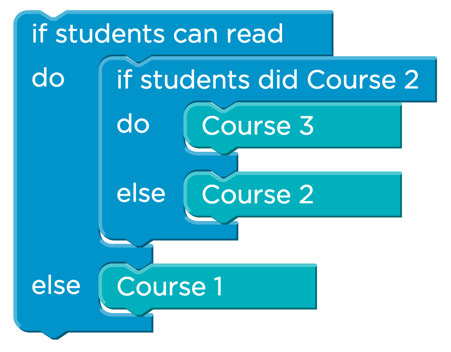

<%= partial('doc_header', :title => 'Curriculum Overview', :disclaimer=>'Code.org K-5 Computer Science') %>

[content]
## Who made this? 

#### Logos go here? ####

We believe that very student should have the opportunity to learn computer science, and the reasons are far more varied than simply having a strong resume. Critical thinking, logic, persistence, and creativity help students excel at problem-solving in all subject areas, no matter what their age.

At Code.org, we recognize that this benefit begins early. That's why we have partnered with **Groups we partnered with** to develop an exciting and engaging curriculum that allows students to explore the limitless world of technology, beginning in elementary school.

## Who is this for?

This curriculum has been developed for use by all K-5 educators. We assume no prior Computer Science knowledge and have provided all of the resources necessary to teach...

Code.org’s K-5 computer science experience consists of three courses:

- Course 1: beginners, early-readers (ages 4-6)
- Course 2: beginners, readers (ages 6+)
- Course 3: prerequisite Course 2 (ages 6+)

The courses are designed to be flexibly implemented. Rather than a rigid pathway based on grade levels, the courses are based on developmental level and prior experience. Teachers and schools can use the course structure to tailor a course sequence to their students’ needs and evolving experience. 

Each experience is a blend of online activities and "unplugged" activities, lessons in which students can learn computing concepts with or without a computer. The online experiences are composed of self-guided and self-paced tutorials, which use scaffolded sets of programming instructions to explore and practice algorithmic thinking. The unplugged lessons take a hands-on, often kinesthetic approach, making use of physical manipulatives to model computational concepts.

Each course consists of 18 to 20 lessons, each lasting about 30-45 minutes. They can be taught at a comfortable pace: 18 consecutive days, 1 day a week for 18 weeks, etc. The content of each course builds conceptually on the previous course, so that a student can progress through all three experiences learning new concepts along the way. 

Code.org’s K-5 curriculum aligns to [CSTA Computer Science Standards](https://csta.acm.org/Curriculum/sub/K12Standards.html) and some lessons also integrate national [Math](http://www.corestandards.org/Math/), [English Language Arts](http://www.corestandards.org/ELA-Literacy/), [Science](http://www.nextgenscience.org/next-generation-science-standards), and [ISTE](http://www.iste.org/STANDARDS) standards.

Across the entire K-5 curriculum, students will develop the skills of a computer scientist through the development of *Computational Thinking Practices*:

- Creativity
- Collaboration
- Communication
- Persistence
- Problem Solving

The use of *Computer Science Themes* scaffolds the development of ideas and recognizes the continual construction of knowledge:

- Algorithms
- Data
- Abstraction
- Computing Practice and Programming (Use of computational tools)
- Computers and Communication Devices (Elements of computing devices and networks)
- Community, Global, and Ethical Impacts

## Course Structure

Our courses are designed to introduce concepts in a spiraling fashion, so we revisit skills repeatedly while delving deeper each time.

## Technology Requirements

We realize that K-12 computing environments can get a bit hairy. We work hard to build an environment that supports all modern web browsers on desktops and tablets, but you'll have have the most success with an up-to-date browser.

## Getting Help

The curriculum is completely free for anyone, anywhere to teach. You can get support by visiting [support.code.org](http://support.code.org). If you'd like to attend a free training on our K-5 Computer Science curriculum, looke **here** for a workshop near you.

[/content]

<link rel="stylesheet" type="text/css" href="../docs/morestyle.css"/>