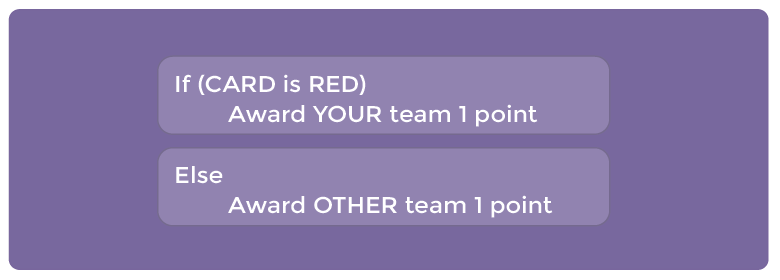
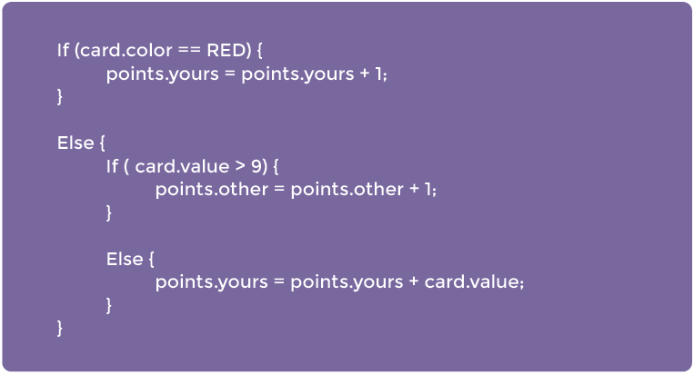

<%= partial('curriculum_header', :title=>'Conditionals with Cards', :unplugged=>true,:disclaimer=>'Basic lesson time includes activity only. Introductory and Wrap-Up suggestions can be used to delve deeper when time allows.', :time=>30) %>

[content]

[together]

## Lesson Overview
We don’t always know ahead of time what things will be like when we run our computer programs.  Different users have different needs, and sometimes you will want to do something based off of one user's need that you don’t want to do with someone else.  That is where conditionals come in. This lesson demonstrates how conditionals can be used to tailor a program to specific information.

[summary]

## Teaching Summary
### **Getting Started** - 15 minutes

1) [Review](#Review)  
2) [Vocabulary](#Vocab)  
3) [On One Condition](#GetStarted)  

### **Activity: Conditionals with Cards** - 30  minutes  

4) [Conditionals with Cards](#Activity1)  

### **Wrap-up** - 10  minutes 
5) [Flash Chat](#WrapUp) - What did we learn?  
6) [Vocab Shmocab](#Shmocab)

### **Assessment** - 5  minutes 
7) [Conditionals with Cards Assessment](#Assessment)

[/summary]

## Lesson Objectives 
### Students will:
- Define circumstances when certain parts of programs should run and when they shouldn't
- Determine whether a conditional is met based on criteria 
- Traverse a program and predict the outcome, given a set of input

[/together]

[together]

# Teaching Guide

## Materials, Resources and Prep
### For the Student
- Playing Cards
- Paper for keeping track of how a program reacts to a card
- Pens & Pencils
- [Conditionals with Cards Assessment](/curriculum/course2/12/Assessment12-Conditionals.pdf)

### For the Teacher
- [Lesson Video](http://youtu.be/IcEL5ibSvTs?list=PL2DhNKNdmOtobJjiTYvpBDZ0xzhXRj11N)
- This Teacher Lesson Guide
- One [Sample Program](/curriculum/course2/12/Activity12-Conditionals.pdf) for the class to look at
- Print one [Conditionals with Cards Assessment](/curriculum/course2/12/Assessment12-Conditionals.pdf) for each student

[/together]

[together]

## Getting Started (20 min)

###  1) Review
This is a great time to review the last lesson that you went through with your class.  You can do this as one large group or have students discuss with an elbow partner.

Here are some questions that you can ask in review:

- What did we do last time?

- What do you wish we had had a chance to do?

- Did you think of any questions after the lesson that you want to ask?

- What was your favorite part of the last lesson?

[tip]

# Lesson Tip
Finishing the review by asking about the students' favorite things helps to leave a positive impression of the previous exercise, increasing excitement for the activity that you are about to introduce.

[/tip]

###  2) Vocabulary
This lesson has one new and important word: 

[centerIt]

[/centerIt]

**Conditionals** - Say it with me: Con-di-shun-uls  
Statements that only run under certain conditions

###  3) On One Condition
- We can start this lesson off right away
  - Let the class know that if they can be completely quiet for thirty seconds, you will do something like:
     - Sing an opera song
     - Give five more minutes of recess
     - or Do a handstand
   - Start counting right away.
   - If the students succeed, point out right away that they succeeded, so they *do* get the reward.
   - Otherwise, point out that they were not completely quiet for a full thirty seconds, so they *do not* get the reward.
- Ask the class "What was the *condition* of the reward?"
  - The condition was *IF* you were quiet for 30 seconds
     - If you were, the condition would be true, and you would get the reward.
     - If you weren't, the condition would be false, so the reward woud not apply.
  - Can we come up with another conditional?
     - If you can guess my age correctly, the class can give you applause.
     - If I know an answer, I can raise my hand.
     - What examples can you come up with?
- Sometimes, we want to have an extra condition, in case the "IF" statement is not true.
  - This extra condition is called an "ELSE" statement
  - When the "IF" condition isn't met, we can look at the "ELSE" for what to do
     - Example: IF I draw a 7, everybody claps. Or ELSE, everyone says "Awwwwwwe."
     - Let's try it. (Draw a card and see if your class reacts appropriately.)
  - Ask the class to analyze what just happened. 
     - What was the IF?
     - What was the ELSE?
     - Which condition was met?
  - Believe it or not, we have even one more option.
     - What if I wanted you to clap if I draw a 7, or else if I draw something less than seven you say "YAY," or else you say "Awwwwwwwe"?
         - This is why we have the terms If, Else If, and Else.
         - If is the first condition
         - Else-if gets looked at only if the "If" isn't true.
         - Else gets looked at only if nothing before it is true.
     
Now let's play a game.

[/together]

[together]

## Activities: (20 min)
###  4) [Conditionals with Cards](/curriculum/course2/12/Activity12-Conditionals.pdf)

**Directions:**

> 1) Create a few programs with your class that depend on things like a card's suit, color, or value to award or subtract points. You can write the program as an algorithm, pseudocode, or actual code.

Here is a sample algorithm:

Here is a sample of the same program in pseudocode:

> 2)  Decide how you want to split your class into teams.

> 3)  Each team should have a pile of cards (at least as many cards as team members) nearby.

> 4)  Put one of your “Programs” up on the board for all to see.

> 5)  Have the teams take turns drawing cards and following the program to see how many points they score in each round.

> 6)  Play several times with several different programs to help the students really understand conditionals.

  

Once the class has had some practice, you can encourage students to **nest** conditionals inside one another:

Here is the same program in pseudocode:

[/together]

[together]

## Wrap-up (5 min)
###  5) Flash Chat: What did we learn?
- If you were going to code this up in Blocky, what would you need to add around your conditionals to let the code run more than one time?
- What other things do you do during the day under certain conditions?
- If you are supposed to do something when the value of a card is more than 5, and you draw a 5, do you meet that condition?
- Notice that conditions are either "True" or "False."  There is no assessment of a condition that evaluates to "Banana."
- When you need to meet several combinations of conditions, we can use something called "nested conditionals." 
  - What do you think that means? 
  - Can you give an example of where we saw that during the game?
- What part of that game did you like the best?

[tip]

# Lesson Tip  
Flash Chat questions are intended to spark big-picture thinking about how the lesson relates to the greater world and the students' greater future.  Use your knowledge of your classroom to decide if you want to discuss these as a class, in groups, or with an elbow partner.

[/tip]

###  6) Vocab Shmocab
- Which one of these definitions did we learn a word for today?

> "Adding additional space to the beginning of a line of text"  
> "A combination of yellow and green"  
> "Statements that only run under certain conditions" 
>> ...and what is the word that we learned?

[/together]

[together]

## Assessment (5 min)
### 7) [Conditionals with Cards Assessment](/curriculum/course2/12/Assessment12-Conditionals.pdf)
- Hand out the assessment worksheet and allow students to complete the activity independently after the instructions have been well explained. 
- This should feel familiar, thanks to the previous activities.

[/together]

<!--(this is left in here as an example of how to include an image in Markdown)
 -->

[together]

## Extended Learning 
Use these activities to enhance student learning. They can be used as outside of class activities or other enrichment.

### True/False Tag

- Line students up as if to play [Red Light / Green Light](http://www.gameskidsplay.net/games/sensing_games/rl_gl.htm).
- Select one person to stand in front as the Caller.
- The Caller chooses a condition and asks everyone who meets that condition to take a step forward.
  - If you have a red belt, step forward.
  - If you are wearing sandals, take a step forward.
- Try switching it up by saying things like "If you are *not* blonde, step forward."

### Nesting

- Break students up into pairs or small groups.
- Have them write if statements for playing cards on strips of paper, such as:
  - If the suit is clubs
  - If the color is red
- Have students create similar strips for outcomes.
  - Add one point
  - Subtract one point
- Once that's done, have students choose three of each type of strip and three playing cards, paying attention to the order selected.
- Using three pieces of paper, have students write three different programs using only the sets of strips that they selected, in any order.
  - Encourage students to put some if statements inside other if statements.
- Now, students should run through all three programs using the cards that they drew, in the same order for each program.  
  - Did any two programs return the same answer?
  - Did any return something different?

[/together]

[standards]

## Connections and Background Information

### ISTE Standards (formerly NETS) 
- 1.a - Apply existing knowledge to generate new ideas, products, or processes.
- 1.c - Use models and simulation to explore complex systems and issues.  
- 2.d - Contribute to project teams to solve problems.
- 4.b - Plan and manage activities to develop a solution or complete a project.
- 6.a - Understand and use technology systems.

### CSTA K-12 Computer Science Standards

- CT.L1:3-03. Understand how to arrange information into useful order without using a computer. 
- CT.L1:6-01. Understand and use the basic steps in algorithmic problem-solving.
- CT.L1:6-02. Develop a simple understanding of an algorithm using computer-free exercise.
- CT.L1:6-05.  Make a list of sub-problems to consider while addressing a larger problem.
- CPP.L1.3-04. Construct a set of statements to be acted out to accomplish a simple task.
- CPP.L1:6-05. Construct a program as a set of step-by-step instructions to be acted out.
- CPP.L1.3-04. Construct a set of statements to be acted out to accomplish a simple task.
- CPP.L1:6-05. Construct a program as a set of step-by-step instructions to be acted out.
- CT.L2-03. Define an algorithm as a sequence of instructions that can be processed by a computer.
- CT.L2-06. Describe and analyze a sequence of instructions being followed.
- CT.L3A-03. Explain how sequence, selection, iteration, and recursion are building blocks of algorithms.

### NGSS Science and Engineering Practices
 
- 3-5-ETS1-2 - Generate and compare multiple possible solutions to a problem based on how well each is likely to meet the criteria and constraints of the problem. 

### Common Core Mathematical Practices
 
- 1. Make sense of problems and persevere in solving them.
- 2. Reason abstractly and quantitatively.
- 4. Model with mathematics.
- 6. Attend to precision.
- 7. Look for and make use of structure.
- 8. Look for and express regularity in repeated reasoning.  

### Common Core Math Standards
- 1.MD.4. - Organize, represent, and interpret data with up to three categories; ask and answer questions about the total number of data points, how many in each category, and how many more or less are in one category than in another.

### Common Core Language Arts Standards

- SL.1.1 - Participate in collaborative conversations with diverse partners about grade 1 topics and texts with peers and adults in small and larger groups
- SL.1.2 - Ask and answer questions about key details in a text read aloud or information presented orally or through other media.
- L.1.6 - Use words and phrases acquired through conversations, reading and being read to, and responding to texts, including using frequently occurring conjunctions to signal simple relationships.
- SL.2.1 - Participate in collaborative conversations with diverse partners about grade 2 topics and texts with peers and adults in small and larger groups.
- SL.2.2 - Recount or describe key ideas or details from a text read aloud or information presented orally or through other media.
- L.2.6 - Use words and phrases acquired through conversations, reading and being read to, and responding to texts, including using adjectives and adverbs to describe.
- SL.3.1 - Engage effectively in a range of collaborative discussions (one-on-one, in groups, and teacher-led) with diverse partners on grade 3 topics and texts, building on others' ideas and expressing their own clearly.
- SL.3.3 - Ask and answer questions about information from a speaker, offering appropriate elaboration and detail.
- L.3.6 - Acquire and use accurately grade-appropriate conversational, general academic, and domain-specific words and phrases, including those that signal spatial and temporal relationships.

[/standards]

[/content]

<link rel="stylesheet" type="text/css" href="../docs/morestyle.css"/>
