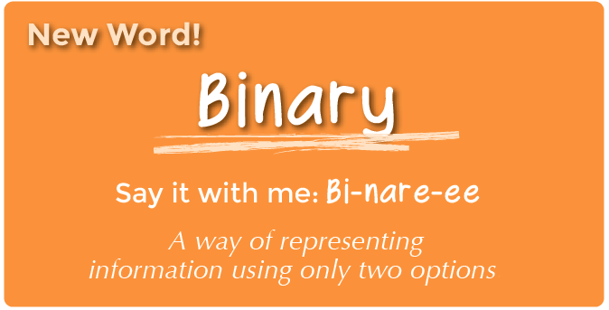
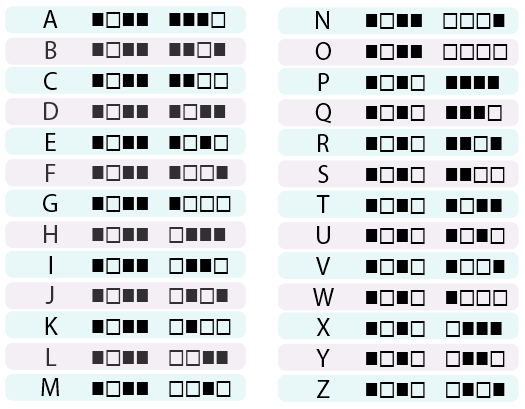

<%= partial('curriculum_header', :title=> 'Binary Bracelets', :unplugged=>true,:disclaimer=>'Basic lesson time includes activity only. Introductory and Wrap-Up suggestions can be used to delve deeper when time allows.', :time=>15) %>

[content]

## Lesson Overview
Binary is extremely important to the computer world. The majority of computers today store all sorts of information in binary form.  This lesson helps to demonstrate how it is possible to take something that we know and translate it into a series of ons and offs.

[summary]

## Teaching Summary
### **Getting Started** - 15 minutes

1) [Review](#Review)  
2) [Vocabulary](#Vocab) 
3) [Off and On](#GetStarted)  

### **Activity: Binary Bracelets** - 15  minutes  

4) [Binary Bracelets](#Activity1)  

### **Wrap-up** - 5  minutes 

5) [Flash Chat](#WrapUp) - What did we learn? 

### **Assessment** - 10  minutes 
6) [Binary Assessments](#Assessment)

[/summary]

[together]

## Lesson Objectives 
### Students will:
- Encode letters into binary
- Decode binary back to letters
- Relate the idea of storing initials on a bracelet to the idea of storing information in a computer

[/together]

[together]

# Teaching Guide

## Materials, Resources and Prep
### For the Student
- [Binary Bracelet Worksheet](/curriculum/course2/14/Activity14-BinaryBracelets.pdf)
- [Binary Assessment](/curriculum/course2/14/Assessment14-BinaryBracelets.pdf)
- Pens and Pencils
- Scissors

### For the Teacher
- This Teacher Lesson Guide
- [Binary Bracelet Worksheet](/curriculum/course2/14/Activity14-BinaryBracelets.pdf)
- [Binary Assessment](/curriculum/course2/14/Assessment14-BinaryBracelets.pdf)
- Computer for opening or images of an open computer
- Optional: Write a short message on the board in binary

[/together]

[together]

## Getting Started (15 min)

###  1) Review
This is a great time to review the last lesson that you went through with your class.  We suggest you alternate between asking questions of the whole class and having students talk about their answers in small groups.

Here are some questions that you can ask in review:

- What did we do last time?

- What do you wish we had had a chance to do?

- Did you think of any questions after the lesson that you want to ask?

- What was your favorite part of the last lesson?

[tip]

# Lesson Tip
Finishing the review by asking about the students' favorite things helps to leave a positive impression of the previous exercise, increasing excitement for the activity that you are about to introduce.

[/tip]

###  2) Vocabulary
This lesson has one new and important word: 

[centerIt]

[/centerIt]

**Binary** - Say it with me: Bi-nare-ee  
A way of representing information using only two options.

###  3) Off and On
- If you've written a short message on the board in binary, call the students' attention to it and ask if anyone knows what it is or what it means.
  - Put the message aside and move on to prepping for the activity.
- You can start by asking the class if they have ever seen inside a computer.
  - What's in there?
  - This is a good place to actually show them the inside of a computer (or pictures of the inside of a computer).
- Wires carry information through the machine in the form of electricity.
  - The two options that a computer uses with respect to this electrical information are "off" and "on."
     - When computers represent information using only two options, it's called "Binary."
  - That theme of two options doesn't stop when the information gets to its destination.
- Computers also *store* information using binary.
  - Binary isn't always off and on.
     - Hard Disk Drives store information using magnetic positive and magnetic negative.
     - DVDs store information as either reflective or non-reflective.
  - How do you suppose we can convert the things we store in a computer into binary?
     - Let's start with letters.
       - Use the [Binary Decoder Key](/curriculum/course2/14/Activity14-BinaryBracelets.pdf) to show how a computer might represent capital letters.
          - **This is a good time to mention that each spot where you have a binary option is called a "binary digit" or "bit" for short.**
          - **Ask if anyone knows what a grouping of eight bits is called** (it's a byte.)
          - **Fun fact: A grouping of four bits is called a nibble.**
       - Go over a few examples of converting letters into binary, then back.
       - Afterward, write an encoded letter and give the class a few seconds to figure out what it is. 
       - When the class can figure out your encoded letters on their own, you can move on to the activity.
  

[/together]

[together]

## Activity: (20 min)
###  4) [Binary Bracelet Worksheet](/curriculum/course2/14/Activity14-BinaryBracelets.pdf)

[tip]

# Lesson Tip
You know your classroom best.  As the teacher, decide if students should do this individually or if students should work in pairs or small groups.

You **do not** need to cover the whole of binary, including counting and converting numbers back and forth from decimal.  This lesson is intended to be a fun introduction to how computers store information, not a frustrating lesson in bases.

[/tip]

> **Directions:**

> 1. Find the first letter of your first name in the Binary Decoder Key. 

> 2.  Fill in the squares of the provided bracelet to match the pattern of the squares next to the letter that you selected.

> 3.  Cut the bracelet out.

> 4.  Tape the bracelet around your wrist to wear it!

> 5.  Share your bracelet with your classmates to see if they can figure out your letter. 

[/together]

[tip]

# Lesson Tip
If your class has extra budget for materials, try doing this exercise using thread (or pipe cleaners) and beads to create the binary bracelets instead of pen and paper. You can provide any combination of two colors in beads to the students, but black and white tend to be easiest, given the way that the key is done.

[/tip]

After the activity, revisit the message that was on the board and see if your class can decypher it using what they've learned.

  

[together]

## Wrap-up (5 min)
###  5) Flash Chat: What did we learn?
- What else do you think is represented as binary inside of a computer?
- How else might you represent binary instead of boxes that are filled or not filled?
- What was your favorite part about that activity?

[/together]

[together]

## Assessment (15 min)
### 7) [Binary Assessment](/curriculum/course2/14/Assessment14-BinaryBracelets.pdf)
- Hand out the assessment worksheet and allow students to complete the activity independently after the instructions have been well explained. 
- This should feel familiar, thanks to the previous activities.

[/together]

[together]

## Extended Learning 
Use these activities to enhance student learning. They can be used as outside of class activities or other enrichment.

### Binary Images

- There are several great resources on the web for taking this activity to the next level. 
- If your students are interested in how images (or even music) can be represented as binary, you can find more details in Thinkersmith's [Binary Baubles](http://code.org/files/CSEDbinary.pdf).

[/together]

[standards]

## Connections and Background Information

### ISTE Standards (formerly NETS) 

- 1.a - Apply existing knowledge to generate new ideas, products, or processes.
- 1.c - Use models and simulation to explore complex systems and issues.   
- 2.d - Contribute to project teams to solve problems. 
- 4.b - Plan and manage activities to develop a solution or complete a project.
- 6.a - Understand and use technology systems.
- 6.d - Transfer current knowledge to learning of new technologies.  

### CSTA K-12 Computer Science Standards

- CT.L1:3-03. Understand how to arrange information into useful order without using a computer.
- CT.L1:6-03. Demonstrate how a string of bits can be used to represent alphanumeric information.
- CT.L1:3-05. Demonstrate how 0s and 1s can be used to represent information.
- CT.L2-07. Represent data in a variety of ways: text, sounds, pictures, numbers.
- CT.L2-08. Use visual representations of problem states, structures, and data.

### NGSS Science and Engineering Practices

 - K-2-PS3-2. Use tools and materials provided to design and build a device that solves a specific problem or a solution to a specific problem.
 - K-2-ETS1-1 - Ask questions, make observations, and gather information about a situation people want to change to define a simple problem that can be solved through the development of a new or improved object or tool. 
 

### Common Core Mathematical Practices
 
- 1. Make sense of problems and persevere in solving them.
- 2. Reason abstractly and quantitatively.
- 4. Model with mathematics.
- 6. Attend to precision.
- 7. Look for and make use of structure.
- 8. Look for and express regularity in repeated reasoning.

### Common Core Language Arts Standards

- SL.1.1 - Participate in collaborative conversations with diverse partners about grade 1 topics and texts with peers and adults in small and larger groups
- SL.1.2 - Ask and answer questions about key details in a text read aloud or information presented orally or through other media.
- L.1.6 - Use words and phrases acquired through conversations, reading and being read to, and responding to texts, including using frequently occurring conjunctions to signal simple relationships.
- SL.2.1 - Participate in collaborative conversations with diverse partners about grade 2 topics and texts with peers and adults in small and larger groups.
- SL.2.2 - Recount or describe key ideas or details from a text read aloud or information presented orally or through other media.
- L.2.6 - Use words and phrases acquired through conversations, reading and being read to, and responding to texts, including using adjectives and adverbs to describe.
- SL.3.1 - Engage effectively in a range of collaborative discussions (one-on-one, in groups, and teacher-led) with diverse partners on grade 3 topics and texts, building on others' ideas and expressing their own clearly.
- SL.3.3 - Ask and answer questions about information from a speaker, offering appropriate elaboration and detail.
- L.3.6 - Acquire and use accurately grade-appropriate conversational, general academic, and domain-specific words and phrases, including those that signal spatial and temporal relationships.

[/standards]

  

 

[/content]

<link rel="stylesheet" type="text/css" href="../docs/morestyle.css"/>
