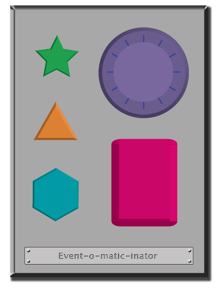

<%= partial('curriculum_header', :title=> 'The Big Event', :unplugged=>true,:disclaimer=>'Basic lesson time includes activity only. Introductory and Wrap-Up suggestions can be used to delve deeper when time allows.', :time=>15) %>

[content]

## K-1 Lesson Overview
Events are a great way to add variety to a pre-written algorithm. Sometimes you want your program to be able to respond to the user exactly when the user wants it to. That is what events are for.

[summary]

## Teaching Summary
### **Getting Started** - 15 minutes

1) [Review](#Review)  
2) [Vocabulary](#Vocab) 
3) [A Series of Events](#GetStarted)  

### **Activity: Events** - 15  minutes  

4) [The Big Event](#Activity1)

### **Wrap-up** - 5  minutes 

5) [Flash Chat](#WrapUp) - What did we learn? 

### **Assessment** - 10  minutes 
6) [The Big Event Assessment](#Assessment)

[/summary]

[together]

## Lesson Objectives 
### Students will:
- Repeat commands given by an instructor
- Recognize actions of the teacher as signals to initiate commands
- Practice differentiating pre-defined actions and event-driven ones

[/together]

[together]

# Teaching Guide

## Materials, Resources and Prep
### For the Student

- Assessment Worksheet: [The Big Event Assessment](Assessment15-TheBigEvent.pdf)
- Pens/Pencils/Markers

### For the Teacher
- Teacher Lesson Guide
- Print one [The Big Event Activity Worksheet](/curriculum/course2/15/Activity15-TheBigEvent.pdf) and Event Controller
- Print Assessment Worksheet: [The Big Event Assessment](Assessment15-TheBigEvent.pdf) for each student

[/together]

[together]

## Getting Started (15 min)

###  1) Review
This is a great time to review the last lesson that you went through with your class.  We suggest you alternate between asking questions of the whole class and having students talk about their answers in small groups.

Here are some questions that you can ask in review:

- What did we do last time?

- What do you wish we had had a chance to do?

- Did you think of any questions after the lesson that you want to ask?

- What was your favorite part of the last lesson?

[tip]

# Lesson Tip
Finishing the review by asking about the students' favorite things helps to leave a positive impression of the previous exercise, increasing excitement for the activity that you are about to introduce.

[/tip]

###  2) Vocabulary
This lesson has one new and important vocabulary word: 

[centerIt]

[/centerIt]

**Event** - Say it with me: E-vent  
An event is an action that causes something to happen.

[/together]

###  3) A Series of Events

- Prep your class to answer a question:
  -  "I'm going to ask you a question.  I want you to raise your hand if you want me to call on you for the answer."
  
  - Ask a simple question that most of your students should be able to answer, such as:
     - How many thumbs do I have?
     - What is bigger, a bird or a horse?
  
  - Call on a student who has their hand raised and let them give their answer.
  - Upon finishing that display, ask the class how you knew that the student wanted you to call on them.
     - Your class will likely mention the raising of the hand.
  - Explain to everyone that when students raise their hand, it is an "event" that causes you to know that they want to be called on.   
  
- Ask the class if they can think of any other events that give signals.
  - You may need to remind them that you're not talking about an event like a birthday party or a field trip.
  - If they have trouble, you can remind them that an event is an action that causes something to happen.
     - What about an alarm clock going off? What does that make happen?
     - What about pressing "Start" on the microwave? What does that do?
     - What about pressing the power button on your tv remote?
     
- Today, we're going to practice changing programs by introducing events.

[together]

## Activity: (15 min)
###  4) [The Big Event](/curriculum/course2/15/Activity15-TheBigEvent.pdf)

- Do you remember guiding your friends to fill in an image of squares in Graph Paper Programming?
  - In that exercise, you knew in advance exactly what you wanted your friends to draw, so you could make a program that took them from start to finish without any interruptions.
  - In most real programs, we can't do that because we want to have options, depending on what the user needs.  
     - Say that I only want my character to move when my finger is on the screen of my phone.  I would need to program the character to *only* move when I put my finger on the screen of my phone.
     - Putting my finger on the screen would then become an "event" that tells my character to move.

In earlier lessons, we created algorithms that allowed us to control a friend or Flurb for several steps at a time. It was fun and useful, but what happens when you don’t know everything that you want your friend to do in advance? This is where events come in!

[tip]

# Lesson Tip

If your students seem confused, talk about their favorite games and all of the ways that they let the characters know what they're supposed to do. Point out how the game would be really boring if it ran from start to finish without any events required.

[/tip]

> **Directions:**

> 1.  Project the Event Controller onto your classroom screen.

[centerIt]

[/centerIt]

> 2. Decide with your class what each button does. We suggest:
  * Pink Button -> Say “Wooooo!”
  * Teal Button -> “Yeah!”
  * Purple Dial -> “Boom!”
  * Green Button -> Clap
  * Orange Dial -> Stomp
> 3. Practice tapping the buttons on the overhead and having your class react.
> 4. Add some button sequences into the mix and have the students try to keep up with their sounds.
> 5. Let your class know that every time you push a button, it is an “event” that lets them know what they are expected to do next.
> 6. Get the class started on a planned task before interrupting them again with the buttons. We suggest:
  * Counting to 10
  * Singing “Old MacDonald”
> 7. Once their plan is underway, interject button presses sporadically. 
> 8. Continue the blend until they understand the difference between actions that are guided by a plan and those that are event driven. 
  

[/together]

[together]

## Wrap-up (10 min)
###  5) Flash Chat: What did we learn?
- Why do we need to be able to handle events in a program?
- What are some other kinds of events that you can think of?

[/together]

[together]

## Assessment (10 min)
### 7) Assessment Worksheet: [Controlling by Events Assessment](Assessment15-TheBigEvent.pdf)
- Hand out the assessment worksheet and allow students to complete the activity independently after the instructions have been well explained. 
- This should feel familiar, thanks to the previous activities.

[/together]

[together]

## Extended Learning 
Use these activities to enhance student learning. They can be used as outside of class activities or other enrichment.

### One Person's Event is Another One's Reaction

- Assign each student an event to watch out for, and an appropriate reaction to that event.  Chain the actions so that each child's reaction becomes an event that triggers the reaction of another student.  Keep assigning until everyone has something to do and everyone makes someone react. 

### Eventopalooza

- Break the class up into groups. Using the Events Controller, assign each group a different reaction to the same button. Do this for all three buttons, then watch the chaos! 

[/together]

[standards]

## Connections and Background Information

### ISTE Standards (formerly NETS) 

- 1.c - Use models and simulation to explore complex systems and issues.   
- 4.b - Plan and manage activities to develop a solution or complete a project.
- 6.a - Understand and use technology systems.  
  

### CSTA K-12 Computer Science Standards
 
- CPP.L1:3-04 - Construct a set of statements to be acted out to accomplish a simple task.  
- CT.L1:6-02 - Develop a simple understanding of an algorithm using computer-free exercises.  
- CT.L1:6-05 - Make a list of sub-problems to consider while addressing a larger problem.
- CT.L1:6-01 - Understand and use the basic steps in algorithmic problem-solving. 
- CT.L2-06 - Describe and analyze a sequence of instructions being followed.

### NGSS Science and Engineering Practices
- K-2-ETS1-1. Ask questions, make observations, and gather information about a situation people want to change to define a simple problem that can be solved through the development of a new or improved object or tool. 

### Common Core Mathematical Practices
 
- 1. Make sense of problems and persevere in solving them.
- 2. Reason abstractly and quantitatively.
- 6. Attend to precision.
- 7. Look for and make use of structure.
- 8. Look for and express regularity in repeated reasoning.  

### Common Core Language Arts Standards
- SL.1.1 - Participate in collaborative conversations with diverse partners about grade 1 topics and texts with peers and adults in small and larger groups
- SL.1.2 - Ask and answer questions about key details in a text read aloud or information presented orally or through other media.
- L.1.6 - Use words and phrases acquired through conversations, reading and being read to, and responding to texts, including using frequently occurring conjunctions to signal simple relationships.
- SL.2.1 - Participate in collaborative conversations with diverse partners about grade 2 topics and texts with peers and adults in small and larger groups.
- SL.2.2 - Recount or describe key ideas or details from a text read aloud or information presented orally or through other media.
- L.2.6 - Use words and phrases acquired through conversations, reading and being read to, and responding to texts, including using adjectives and adverbs to describe.
- SL.3.1 - Engage effectively in a range of collaborative discussions (one-on-one, in groups, and teacher-led) with diverse partners on grade 3 topics and texts, building on others' ideas and expressing their own clearly.
- SL.3.3 - Ask and answer questions about information from a speaker, offering appropriate elaboration and detail.
- L.3.6 - Acquire and use accurately grade-appropriate conversational, general academic, and domain-specific words and phrases, including those that signal spatial and temporal relationships.

[/standards]

  

 

[/content]

<link rel="stylesheet" type="text/css" href="../docs/morestyle.css"/>
