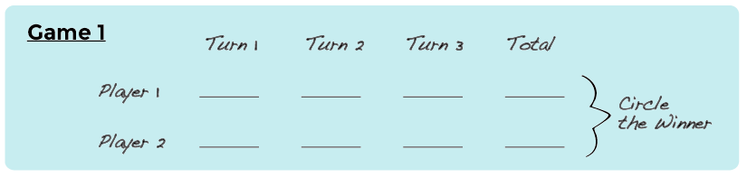

<%= partial('curriculum_header', :title=> 'Dice Race', :unplugged=>true,:disclaimer=>'Basic lesson time includes activity only. Introductory and Wrap-Up suggestions can be used to delve deeper when time allows.', :time=>20) %>

[content]

## Lesson Overview
In this lesson, students will relate the concept of algorithms back to everyday real-life activities by playing the Dice Race game. The goal here is to start building the skills to translate real-world situations to online scenarios and vice versa. 

[summary]

## Teaching Summary
### **Getting Started** - 15 minutes

1) [Review](#Review)  
2) [Vocabulary](#Vocab) 
3) [What We Do Daily](#GetStarted)  

### **Activity: Real-Life Algorithms** - 20  minutes  

4) [Real-Life Algorithms](#Activity1): Dice Race  

### **Wrap-up** - 5  minutes 

5) [Flash Chat](#WrapUp) - What did we learn? 

### **Assessment** - 10  minutes 
6) [Daily Algorithms](#Assessment)

[/summary]

[together]

## Lesson Objectives 
### Students will:
- Name various activities that make up their day
- Decompose large activities into a series of smaller events
- Arrange sequential events into their logical order

[/together]

[together]

# Teaching Guide

## Materials, Resources and Prep
### For the Student

- Dice (1 per pair)
- Pens/Pencils/Markers
- [Real-Life Algorithms Worksheet](/curriculum/course3/10/Activity10-DiceRace.pdf): Dice Race
- Assessment Worksheet: [Daily Algorithms](/curriculum/course3/10/Assessment10-DiceRace.pdf)

### For the Teacher
- Teacher Lesson Guide
- Print one [Real-Life Algorithms Worksheet](/curriculum/course3/10/Activity10-DiceRace.pdf) per group 
- Print one Assessment Worksheet: [Daily Algorithms](/curriculum/course3/10/Assessment10-DiceRace.pdf) per student

[/together]

[together]

## Getting Started (15 min)

###  1) Review
This is a great time to review the last lesson that you went through with your class.  We suggest you alternate between asking questions of the whole class and having students talk about their answers in small groups.

Here are some questions that you can ask in review:

- What did we do last time?
- What do you wish we had had a chance to do?
- Did you think of any questions after the lesson that you want to ask?
- What was your favorite part of the last lesson?

[tip]

# Lesson Tip
Finishing the review by asking about the students' favorite things helps to leave a positive impression of the previous exercise, increasing excitement for the activity that you are about to introduce.

[/tip]

###  2) Vocabulary
This lesson has one vocabulary word that is important to review: 

[centerIt]

[/centerIt]

**Algorithm** - Say it with me: Al-go-ri-thm  
A list of steps that you can follow to finish a task 

###  3) What We Do Daily
- Ask your students what they did to get ready for school this morning.
  - Write their answers on the board.
  - If possible, put numbers next to their responses to indicate the order that they happen.
     - If students give responses out of order, have them help you put them in some kind of logical order.
     - Point out places where order matters and places where it doesn't.  
- Introduce students to the idea that it is possible to create algorithms for the things that we do everyday.
  - Give them a couple of examples, such as making breakfast, brushing teeth, planting a flower, and making paper airplanes.
- Computers need algorithms and programs to show them how to do even simple things that we can do without thinking about them. 
  - It can be challenging to describe something that comes naturally in enough detail for a computer to replicate. 
  
- Let's try doing this with a new and fun activity, like playing the Dice Race Game!

[/together]

[together]

## Activity: (20 min)
###  4) [Real-Life Algorithm Worksheet](/curriculum/course3/10/Activity10-DiceRace.pdf): Dice Race

[tip]

# Lesson Tip
You know your classroom best.  As the teacher, decide if students should do this in pairs or small groups.

[/tip]

- You can use algorithms to help describe things that people do every day.  In this activity, we will create an algorithm to describe how we play the Dice Race Game.
- The hardest part about getting a problem ready for a computer can be figuring out how to describe real-life activities. We’re going to get some practice by playing and describing the Dice Race game. 
 

> **Directions:**

> 1. Read the rules below.
> 2. Play a couple rounds of the Dice Race game. 
>   - As you’re playing, think about how you would describe everything that you’re doing. 
>   - What would it look like from the computer’s point of view?

> **Rules:**

> 1. Set each player’s score to 0
> 2. Have the first player roll
> 3. Add points from that roll to player one’s total score
> 4. Have the next player roll
> 5. Add points from that roll to player two’s total score
> 6. Each player should go again two more times
> 7. Check each player’s total score to see who has the most points
> 8. Declare Winner

[centerIt]

[/centerIt]

[/together]

[tip]

# Lesson Tip

Help the students see the game from a computer's point of view.  If they need to roll the dice, then the computer needs to provide dice.  If the student needs to play three turns, then the computer needs to loop through the steps multiple times.

[/tip]

[together]

## Wrap-up (5 min)
###  5) Flash Chat: What did we learn?
- How many of you were able to follow your classmates' algorithms to play the Dice Race Game?
- What's the difference between an algorithm and a program?
  - An algorithm is the thinking behind what needs to happen, while the program is the actual instruction set that makes it happen.
  - An algorithm has to be translated into a program before a computer can run it.
- Did the exercise leave anything out?
  - What would you have added to make the algorithm even better?
  - What if the algorithm had been only one step: "Play Dice Race"?
     - Would it have been easier or harder?
     - What if it were forty steps?
- What was your favorite part about that activity?

[/together]

[together]

## Assessment (15 min)
### 6) Assessment Worksheet: [Daily Algorithms](/curriculum/course3/10/Assessment10-DiceRace.pdf)
- Hand out the assessment worksheet and allow students to complete the activity independently after the instructions have been well explained. 
- This should feel familiar, thanks to the previous activities.

[/together]

[together]

## Extended Learning 
Use these activities to enhance student learning. They can be used as outside of class activities or other enrichment.

### Go Figure

- Break the class up into teams.
- Have each team come up with several steps that they can think of to complete a task.
- Gather teams back together into one big group and have one team share their steps, without letting anyone know what the activity was that they had chosen.
- Allow the rest of the class to try to guess what activity the algorithm is for.

[/together]

[standards]

## Connections and Background Information

### ISTE Standards (formerly NETS) 

- 1.a - Apply existing knowledge to generate new ideas, products, or processes.
- 1.c - Use models and simulation to explore complex systems and issues.   
- 2.d - Contribute to project teams to solve problems.  
- 4.b - Plan and manage activities to develop a solution or complete a project.
- 4.d - Use multiple processes and diverse perspectives to explore alternative solutions.
- 6.a - Understand and use technology systems.

### CSTA K-12 Computer Science Standards

- CD1:6-06. Recognize that computers model intelligent behavior.
- CPP.L1:6-05. Construct a program as a set of step-by-step instructions to be acted out.
- CT.L1:6-02. Develop a simple understanding of an algorithm using computer-free exercises.
- CT.L2-01. Use the basic steps in algorithmic problem solving to design solutions.
- CT.L2-06. Describe and analyze a sequence of instructions being followed.
- CT.L2-12. Use abstraction to decompose a problem into sub-problems.

### NGSS Science and Engineering Practices

- 3-5-ETS1-2. Generate and compare multiple possible solutions to a problem based on how well each is likely to meet the criteria and constraints of the problem. 

### Common Core Mathematical Practices
 
- 1. Make sense of problems and persevere in solving them.
- 2. Reason abstractly and quantitatively.
- 4. Model with mathematics.
- 6. Attend to precision.
- 7. Look for and make use of structure.
- 8. Look for and express regularity in repeated reasoning.

### Common Core Math Standards
 
- 4.NBT.B.4 - Fluently add and subtract multi-digit whole numbers using the standard algorithm.

### Common Core Language Arts Standards

- SL.3.1 - Engage effectively in a range of collaborative discussions (one-on-one, in groups, and teacher-led) with diverse partners on grade 3 topics and texts, building on others' ideas and expressing their own clearly.
- SL.3.3 - Ask and answer questions about information from a speaker, offering appropriate elaboration and detail.
- L.3.6 - Acquire and use accurately grade-appropriate conversational, general academic, and domain-specific words and phrases, including those that signal spatial and temporal relationships.
- SL.4.1 - Engage effectively in a range of collaborative discussions (one-on-one, in groups, and teacher-led) with diverse partners on grade 4 topics and texts, building on others' ideas and expressing their own clearly.
- L.4.6 - Acquire and use accurately grade-appropriate general academic and domain-specific words and phrases, including those that signal precise actions, emotions, or states of being and that are basic to a particular topic.
- SL.5.1 - Engage effectively in a range of collaborative discussions (one-on-one, in groups, and teacher-led) with diverse partners on grade 5 topics and texts, building on others' ideas and expressing their own clearly.
- L.5.6 - Acquire and use accurately grade-appropriate general academic and domain-specific words and phrases, including those that signal contrast, addition, and other logical relationships.

[/standards]

  

 

[/content]

<link rel="stylesheet" type="text/css" href="../docs/morestyle.css"/>
