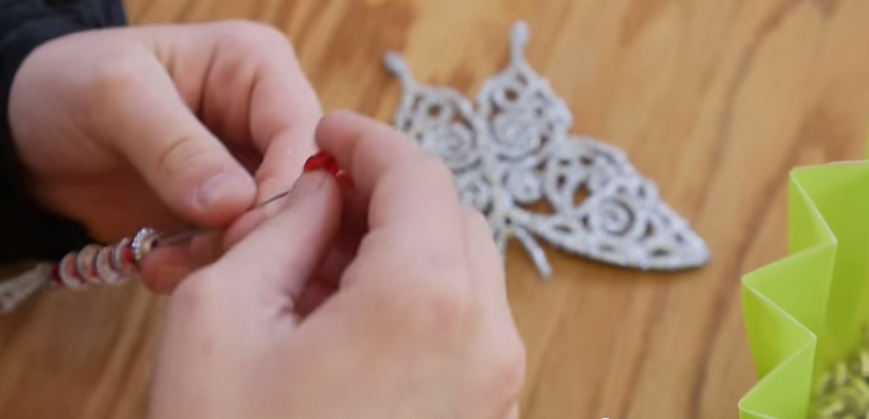
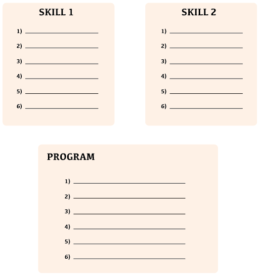
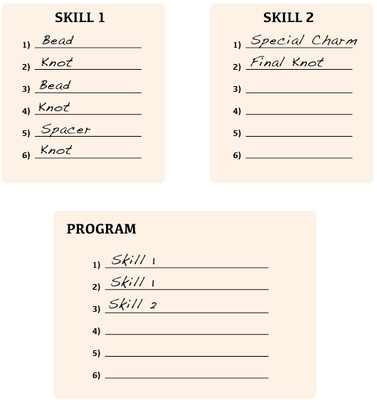
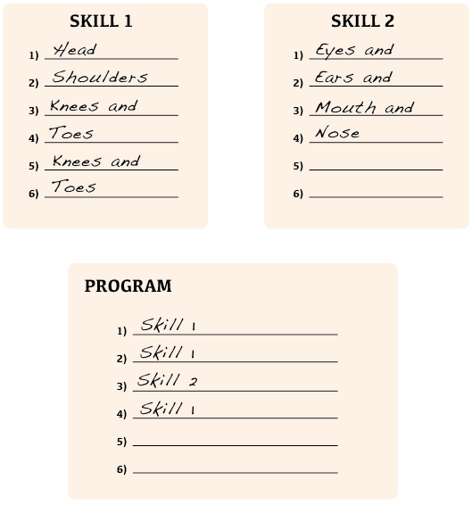

<%= partial('curriculum_header', :unplugged=>true, :title=> 'Functional Suncatchers',:disclaimer=>'Basic lesson time includes activity only. Introductory and Wrap-Up suggestions can be used to delve deeper when time allows.', :time=>20) %>

[content]

[together]

## Lesson Overview
In this lesson, students will make a suncatcher out of string, beads, and a special charm. The students will follow a series of repetitive steps, then be asked to identify certain sets of “skills” that are duplicated several times. Once those skills are defined, they will be called from a main program and the whole beautiful process of creation will be recorded on a single sheet of paper.
The final program will be geared toward the entire class, whatever their type of string, beads, and charms. To effectively allow for this, students will need to “abstract out” the details of their specific materials and create vague terms for an individual’s supplies. This use of generic placeholders is a wonderful introduction to variables.

[summary]

## Teaching Summary
### **Getting Started** - 15 minutes

1) [Review](#Review)  
2) [Vocabulary](#Vocab)  
3) [See My Suncatcher](#GetStarted)  

### **Activity: Fun-ctional Suncatchers** - 20  minutes  

4) [Functional Suncatcher Instructions](#Activity1)  

### **Wrap-up** - 10  minutes 
5) [Flash Chat](#WrapUp) - What did we learn?  
6) [Vocab Shmocab](#Shmocab)

### **Assessment** - 5  minutes 
7) [Functional Skills Assessment](#Assessment)

[/summary]

## Lesson Objectives 
### Students will:
- Learn to find patterns in processes
- Think about an artistic task in a different way
- Interpret symbols as they relate to physical manipulatives

[/together]

[together]

# Teaching Guide

## Materials, Resources and Prep
### For the Student
- One foot of string, thread, or fishing line per student
- 2-4 beads per student
- 2-4 other accessories (buttons, hoops, spacers) per student
- One special bead, prism, button, or student-made sun charm per student
- Pens, Pencils, & Scissors
- One [Skills Sheet](Activity4-FunctionalSuncatchers.pdf) per group
- [Fun-ctional Skills Assessment](Assessment4-FunctionalSkills.pdf) for each student

### For the Teacher
- This Teacher Lesson Guide
- Print one [Skills Sheet](Activity4-FunctionalSuncatchers.pdf) per group
- Print one [Fun-ctional Skills Assessment](Assessment4-FunctionalSkills.pdf) for each student
- Gather a variety of beading supplies as described above. (These can easily be found at craft warehouses, dollar stores, or even online.)

[/together]

[together]

## Getting Started (15 min)

###  1) Review
This is a great time to review the last lesson that you went through with your class.  We suggest you alternate between asking questions of the whole class and having students talk about their answers in small groups.

Here are some questions that you can ask in review:

- What did we do last time?

- What do you wish we had had a chance to do?

- Did you think of any questions after the lesson that you want to ask?

- What was your favorite part of the last lesson?

[tip]

# Lesson Tip
Finishing the review by asking about the students' favorite things helps to leave a positive impression of the previous exercise, increasing excitement for the activity that you are about to introduce.

[/tip]

###  2) Vocabulary
This lesson has two new and important words: 

[centerIt]

[/centerIt]

**Function** - Say it with me: Func-shun  
A piece of code that you can easily call over and over again

**Variable** - Say it with me: Vayr-ee-ah-buhl  
A placeholder for a piece of information that can change

###  3) See My Suncatcher
Begin by holding up your example suncatcher. 

- Let the class know that we will be making these today. 
- Their materials may be slightly different than yours, but the steps will be pretty much the same. 
  - Pointing to your bead, you can tell them that their beads may be shaped differently, or might even be a different color, but you will use the word “bead” to mean whatever it is that they ended up with.
  - Similarly, their spacers may be a different size, different texture, or maybe a different material altogether, but you will use the word “spacer” to refer to those things. 
  - Finally, we will all have a “special charm.” It could be a large bead, a handmade ornament, or even a random item from the room, but in all cases, we will just call it a “special charm.”
  - As you share those terms, feel free to write the associated words on the board. If you want to set them equal to the items you discussed, that works well, also.
  
> Example:
>> Bead = “Whatever style, color, or kind of bead that you have been given”

>> Spacer = “A long item that is not a bead”

>> Special Charm = “The crystal prism, or large glass sphere”

Now you can move in to discussing how you made your sparkling piece of art. 

[/together]

[together]

## Activities: (20 min)
###  4) [Functional Suncatcher Instructions](Activity4-FunctionalSuncatchers.pdf)

- Show the students an example suncatcher
  - It’s made to hang from the rearview mirror of a car, but it can also dangle from a window or a backpack zipper. 
  - Let them know that they are going to make these today, and in the process, learn about programs, variables and functions.

**Steps:**

> 1) Explain to the class how the suncatcher is made.

> - "First, I put a bead on the string, then I tied a knot. I put another bead on a string, and tied another knot. Then, I put a spacer on the string and tied another knot. After that, I did it all again. I put a bead on the string, then I tied a knot. I put another bead on a string, and tied another knot. Then, I put a spacer on the string and tied another knot.
Finally, I put on the special charm, and tied one last knot."

> 2) Acknowledge that the routine takes quite a few steps, so you will provide them a sing-songy way to remember the order.

> - "Bead, knot, bead, knot, spacer, knot. 
(It helps to have a bit of a rhythm with the words as you go through.) 
Bead, knot, bead, knot, spacer, knot. 
Special charm, final knot.” 

> 3) Indicate that you’re going to write the steps down to this program, so that everyone has the 
directions in front of them. 

> - Use the provided "Skills Sheet" and begin to write the steps in the "Program" area as the class shouts out instructions. Write one instruction per line.
  1. Bead
  2. Knot
  3. Bead
  4. Knot
  5. Spacer
  6. Knot
- By now, the class should be noticing an issue. 
  - If they don’t, you can lead them to it. 
     - How many instructions do we have left to go through? 
     - How many lines do we have left? 
     - What should we do?

> 4) Hand out the Skills Sheet to everyone. 

> - Point out that there are two “extra” sections where they can combine steps so that you can write one name to call them all. 
  - For instance, everything that you put into the top section, you can call all at once by calling “Skill 1”; this is a function.
  - Challenge the class to fill out their sheet in a way that makes sense and allows them to fit the entire sequence under the “Program” list in some way. 
  - Give them about five minutes to complete their sheet (more for younger students) then listen to their suggestions. 
     - There will likely be groups that need to have the process explained one-on-one. 
         - Ask them what they would do if they had to repeat the sequence a thousand times or more.
  - How many different ways did the class fill out the same sheet to make the same suncatcher?

> 5) Once you have reviewed all of the groups' solutions, hand out supplies to the students.

> - Point out that different people in the class may have different supplies, and they may all be different than the ones you used.
  - Ask if that should stop them from following the program.
     - Why not?
  - We can treat the words (Bead, Spacer, Knot, etc.) as "placeholders" for whatever items we are using that fit those descriptions.
  - These are called **variables**

> 6) Let the students get started on their suncatchers!

[/together]

[together]

## Wrap-up (5 min)
###  5) Flash Chat: What did we learn?
- What items did you use that could have been "variable" from person to person?
- How important do you think it was to have groups of skills that we could call for this lesson?
- What if we had done each set of steps 100 times instead of only twice?
- Can you think of anything else that we could group together once and call easily over and over again?
  - What about the chorus of a song?

[tip]

# Lesson Tip  
Flash Chat questions are intended to spark big-picture thinking about how the lesson relates to the greater world and the students' greater future.  Use your knowledge of your classroom to decide if you want to discuss these as a class, in groups, or with an elbow partner.

[/tip]

###  6) Vocab Shmocab
- Which one of these definitions did we learn a word for today?

> "To pull on something suddenly"  
> "A piece of code that you can easily call over and over again"  
> "Someone who creates something that no one else has ever made" 
>> ...and what is the word that we learned?

[/together]

[together]

## Assessment (5 min)
### 7) [Functional Skills Assessment](Assessment4-FunctionalSkills.pdf)
- Hand out the assessment worksheet and allow students to complete the activity independently after the instructions have been well explained. 
- This should feel familiar, thanks to the previous activities.

[/together]

<!--(this is left in here as an example of how to include an image in Markdown)
 -->

[together]

## Extended Learning 
Use these activities to enhance student learning. They can be used as outside of class activities or other enrichment.

### Functions with Song

- Did you know that the same concepts from above can be used to represent several different things?  
  - Try using the [Skills Sheet](Activity4-FunctionalSuncatchers.pdf) to represent a song, like "Head, Shoulders, Knees, and Toes."
  

 

[/together]

[standards]

## Connections and Background Information

### ISTE Standards (formerly NETS) 

- 1.a - Apply existing knowledge to generate new ideas, products, or processes.
- 1.c - Use models and simulation to explore complex systems and issues.  
- 2.d - Contribute to project teams to solve problems.  
- 4.b - Plan and manage activities to develop a solution or complete a project.
- 4.c - Collect and analyze data to identify solutions and/or make informed decisions.
- 6.a - Understand and use technology systems.
- 6.d - Transfer current knowledge to learning of new technologies.   

### CSTA K-12 Computer Science Standards

- CPP.L1:6-05. Construct a program as a set of step-by-step instructions to be acted out.
- CT.L2-01. Use the basic steps in algorithmic problem solving to design solutions. 
- CT.L2-06. Describe and analyze a sequence of instructions being followed.
- CT.L2-07. Represent data in a variety of ways: text, sounds, pictures, numbers.
- CT.L2-08. Use visual representations of problem states, structures, and data.
- CT.L2-12. Use abstraction to decompose a problem into sub problems.
- CT.L3A-03. Explain how sequence, selection, iteration, and recursion are building blocks of algorithms.

### NGSS Science and Engineering Practices

- 3-5-ETS1-2. Generate and compare multiple possible solutions to a problem based on how well each is likely to meet the criteria and constraints of the problem. 

### Common Core Mathematical Practices
 
- 1. Make sense of problems and persevere in solving them.
- 2. Reason abstractly and quantitatively.
- 5. Use appropriate tools strategically.
- 6. Attend to precision.
- 7. Look for and make use of structure.
- 8. Look for and express regularity in repeated reasoning. 

### Common Core Language Arts Standards
- SL.3.1 - Engage effectively in a range of collaborative discussions (one-on-one, in groups, and teacher-led) with diverse partners on grade 3 topics and texts, building on others' ideas and expressing their own clearly.
- SL.3.3 - Ask and answer questions about information from a speaker, offering appropriate elaboration and detail.
- L.3.6 - Acquire and use accurately grade-appropriate conversational, general academic, and domain-specific words and phrases, including those that signal spatial and temporal relationships.
- SL.4.1 - Engage effectively in a range of collaborative discussions (one-on-one, in groups, and teacher-led) with diverse partners on grade 4 topics and texts, building on others' ideas and expressing their own clearly.
- L.4.6 - Acquire and use accurately grade-appropriate general academic and domain-specific words and phrases, including those that signal precise actions, emotions, or states of being and that are basic to a particular topic.
- SL.5.1 - Engage effectively in a range of collaborative discussions (one-on-one, in groups, and teacher-led) with diverse partners on grade 5 topics and texts, building on others' ideas and expressing their own clearly.
- L.5.6 - Acquire and use accurately grade-appropriate general academic and domain-specific words and phrases, including those that signal contrast, addition, and other logical relationships

[/standards]

[/content]

<link rel="stylesheet" type="text/css" href="../docs/morestyle.css"/>
