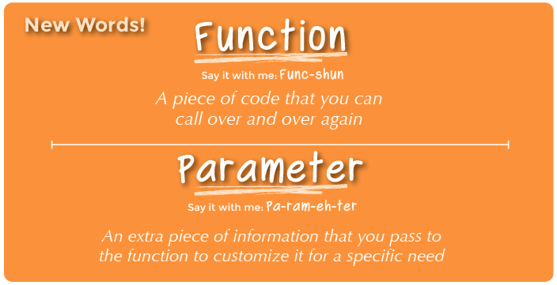
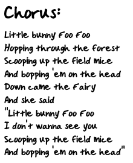
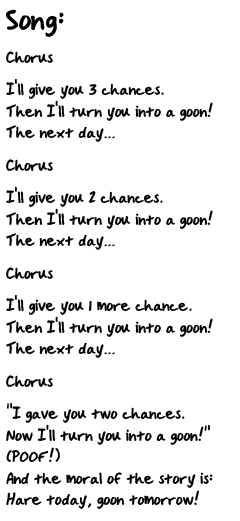

<!--
live preview (once saved to dropbox) is at http://staging.code.org/curriculum/4-5.  don't share this URL!
-->

<%= partial('curriculum_header', :title=> 'Songwriting with Parameters', :unplugged=>true,:disclaimer=>'Basic lesson time includes activity only. Introductory and Wrap-Up suggestions can be used to delve deeper when time allows.', :time=>20) %>

[content]

[together]

## Lesson Overview
One of the most magnificent structures in the computer science world is the function.  Functions (sometimes called procedures) are mini programs that you can use over and over inside of your bigger program. This lesson will help students intuitively understand why combining chunks of code into functions is such a helpful practice.  

[summary]

## Teaching Summary
### **Getting Started** - 20 minutes

1) [Review](#Review)  
2) [Vocabulary](#Vocab)  
3) [Sing a Song](#GetStarted)  

### **Activity: Songwriting with Parameters** - 20  minutes  

4) [Songwriting with Parameters](#Activity1)  

### **Wrap-up** - 5  minutes 
5) [Flash Chat](#WrapUp) - What did we learn?  
6) [Vocab-Shmocab](#Shmocab)

### **Assessment** - 10  minutes 
7) [Songwriting Assessment](#Assessment)

[/summary]

## Lesson Objectives 
### Students will:
- Locate repeating phrases inside song lyrics

- Identify sections of a song to pull into a function (chorus)
- Modify functions to accept parameters
- Describe how functions and parameters can make programs easier to write

[/together]

[together]

# Teaching Guide

## Materials, Resources and Prep
### For the Student
- [Songwriting Worksheets](Activity13-Songwriting.pdf)
- Pens & Pencils
- One [Songwriting Assessment](Assessment13-Songwriting.pdf) for each student. 

### For the Teacher
- This Teacher Lesson Guide
- Print several [Songwriting Worksheets](Activity13-Songwriting.pdf) for each group
- Print one [Songwriting Assessment](Assessment13-Songwriting.pdf) for each student. 
- Access to the internet, or pre-downloaded songs and lyrics for activity

[/together]

[together]

## Getting Started (20 min)

###  1) Review
This is a great time to review the last lesson that you went through with your class.  We suggest you alternate between asking questions of the whole class and having students talk about their answers in small groups.

Here are some questions that you can ask in review:

- What did we do last time?

- What do you wish we would have had a chance to do?

- Did you think of any questions after the lesson that you want to ask?

- What was your favorite part of the last lesson?  

[tip]

# Lesson Tip
Finishing the review by asking about the students' favorite things helps to leave a positive impression of the previous exercise, increasing excitement for the activity that you are about to introduce.

[/tip]

###  2) Vocabulary
This lesson has two new and important words: 

[centerIt]

[/centerIt]

**Function** - Say it with me: Func-shun  
A piece of code that you can call over and over again

**Parameter** - Say it with me: Pa-ram-eh-ter  
An extra piece of information that you pass to the function to customize it for a specific need

###  3) Sing a Song
- Let the class know that today is song day!
- We're going to learn a song together. 
   - Start with a simple song either written out or projected on the screen
   - Point to the chorus and be sure that the class knows how it goes before you begin on the rest of the song
   - Blast through the song, singing it with them in the beginning, then see what happens when you get to the part where it calls the chorus
   
   
   
   
   
   - It's quite likely that the majority of the class will sing the lyrics for the chorus when you point to that bit.
      - Stop the song once that happens, and explicitly highlight what just happened
          - You defined the chorus
          - You called the chorus
          - They sang the chorus
   - Ask the class why they suppose you only wrote the chorus once at the top of the paper instead of writing it over and over in each place where it is supposed to be sung.
      - What are other benefits of only writing the chorus once when you sing it many times?
      
Now, imagine that this song is a computer program. Defining a title (like "chorus") for a little piece of code that you use over and over again is called creating a *function*.  This is helpful to computer scientists for the some of the same reasons that it is helpful to songwriters.
- It saves time not having to write all the code over and over in the program
- If you make a mistake, you only have to change it one place
- The program feels less complicated with the repeating pieces defined just once at the top

What about songs where the chorus isn't exactly the same every time?  You can still use a chorus, but you have to have a way to let the singer know what special words you will use for each verse.
  
- These special words are called parameters.
- In programming, parameters are passed as special instructions to functions like this:

>> chorus(parameter1, parameter2)
      
Feel like this is starting to get complicated? Don't worry. We're going to play with songs a little more to try to really understand how this technique is used!

[tip]

# Lesson Tip  
To add more interest, you can look up the lyrics for some popular songs on the Internet. Show the students that the standard for repeating lyrics is to define the chorus at the top and call it from within the body of the song.

[/tip]

[/together]

[together]

## Activities: (20 min)
###  4) [Songwriting](Activity13-Songwriting.pdf)

- A fantastic way to compare functions to something we see in our everyday lives is to look at songs.  Songs often have certain groups of lyrics that repeat over and over. We call that a chorus. 

**Directions:**

> 1) Divide into groups of 4, 5, or 6.

> 2) Give each group several copies of the Songwriting Worksheet 

> 3)  Play a short song for the class that contains a clear chorus that does not change from verse to verse.

> 4)  Challenge the class to identify (and write down) the chorus.

> 5)  Compare results from each group. Did everyone get the same thing?

> 6)  Try the activity again, but this time with a song that changes during each repetition of the chorus.  Good examples are: Old MacDonald, Baby Bumblebee, or The Hokey Pokey

- Can the students identify a chorus when some words change?
- How might they use the same idea of calling a chorus when the chorus is different from verse to verse?
- These changing words and phrases are called “parameters” and you can pass them into the chorus like this:  chorus(cow, moo)
- Play this game over and over until the class has little trouble identifying the choruses.

It is often easier just to have the class listen to (or watch) the song, then vote on what the chorus is by singing it together, rather than writing the whole thing down. If you choose this method, consider having the class do a written chorus for the final song selection to be sure that the visual learners get proper reinforcement.  

[tip]

# Lesson Tip  
It's most exciting for students to do this lesson with popular music from the radio, but if you're having a hard time finding appropriate songs where the lyrics repeat exactly, here are a few timeless options:

- [5 Little Monkeys](https://www.youtube.com/watch?v=b0NHrFNZWh0)
- [Old MacDonald](https://www.youtube.com/watch?v=1oVoT9CnjK0)
- [Hokey Pokey](https://www.youtube.com/watch?v=iZinb6rVozc)
- [BINGO](https://www.youtube.com/watch?v=9mmF8zOlh_g)
- [Baby Bumble Bee](https://www.youtube.com/watch?v=_Oevibw69Ac)

[/tip]

[/together]

[together]

## Wrap-up (5 min)
###  5) Flash Chat: What did we learn?
- Would you rather write lyrics over and over again or define a chorus?
- Do you think it's possible to make multiple choruses for the same song?
- Does it make sense to make a new chorus for every time it's needed in a song?

[tip]

# Lesson Tip  
Flash Chat questions are intended to spark big-picture thinking about how the lesson relates to the greater world and the students' greater future.  Use your knowledge of your classroom to decide if you want to discuss these as a class, in groups, or with an elbow partner.

[/tip]

###  6) Vocab Shmocab
- Which one of these definitions did we learn a word for today?

> "A piece of code that you can call over and over again"  
> "A small shard of wood"  
> "Getting help from a large group of people to finish something faster" 
>> ...and what is the word that we learned?

- What about parameters?  
  - Why do we use them?
  - Can you pass more than one parameter to a chorus function?
  - Can you pass more than two?

[/together]

[together]

## Assessment (5 min)
### 7) [Songwriting Assessment](Assessment13-Songwriting.pdf)
- Hand out the assessment worksheet and allow students to complete the activity independently after the instructions have been well explained. 
- This should feel familiar, thanks to the previous activities.

[/together]

<!--(this is left in here as an example of how to include an image in Markdown)
 -->

[together]

## Extended Learning 
Use these activities to enhance student learning. They can be used as outside of class activities or other enrichment.

### Create Your Song

- Start by creating a chorus together, then repeat it between verses of a song that you develop around it.
- Make a change to the chorus, and ponder how much easier it is to change in just one place.
- Change the chorus again, making it much longer than it was originally.
- Add a second chorus and alternate between them in your verses.  
- Add parameters to one of your choruses and see how many more options you have.  

### Songwriting a Program

- What if we acted out songs instead of singing them?  All of the sudden, our chorus would be a function of repeated actions, rather than words.
- Use the concepts of the arrows from the [Graph Paper Programming](https://drive.google.com/file/d/0B_6_OvabUXVJSHoxZHNhLU9fanc/edit?usp=sharing) lesson and create a program with lots of repeating instructions.  
  - Circle those repeating actions so that the class can see where they are.
  - Define a function called "Chorus" above the program.
  - Cross out everywhere the repeating actions appear in the program and write "Chorus" instead.
- Repeat until the class can go through this process fairly undirected.
- Can you figure out how to pass parameters in this exercise?

[/together]

[together]

## Connections and Background Information

### ISTE Standards (formerly NETS)

- 1a. Apply existing knowledge to generate new ideas, products, or processes
- 1c. Use models and simulation to explore complex systems and issues
- 2a. Interact, collaborate, and publish with peers, experts, or others employing a variety of digital environments and media
- 2d. Contribute to project teams to solve problems
- 4b. Plan and manage activities to develop a solution or complete a project
- 4d. Use multiple processes and diverse perspectives to explore alternative solutions

### CSTA K-12 Computer Science Standards

- CL.L1:3-02 Work cooperatively and collaboratively with peers teachers, and others using technology
- CT.L2-01 Use the basic steps in algorithmic problem solving to design solutions
- CT.L2-06 Describe and analyze a sequence of instructions being followed
- CT.L2-07 Represent data in a variety of ways: text, sounds, pictures, numbers
- CT.L2-08 Use visual representations of problem states, structures, and data
- CT.L2-12 Use abstraction to decompose a problem into sub problems
- CT.L2-14 Examine connections between elements of mathematics and computer science including binary numbers, logic, sets, and functions
- CT.L3A-01 Use predefined functions and parameters, classes and methods to divide a complex problem into simpler parts
- CT.L3A-03 Explain how sequence, selection, iteration, and recursion are building blocks of algorithms
- CPP.L1:6-05 Construct a program as a set of step-by-step instructions to be acted out

### NGSS Science and Engineering Practices

- 3-5-ETS1-2 Generate and compare multiple possible solutions to a problem based on how well each is likely to meet the criteria and constraints of the problem

### Common Core Mathematical Practices

- 1. Make sense of problems and persevere in solving them
- 2. Reason abstractly and quantitatively
- 3. Construct viable arguments and critique the reasoning of others
- 6. Attend to precision
- 7. Look for and make use of structure
- 8. Look for and express regularity in repeated reasoning

### Common Core Language Arts Standards

- SL.3.1.D Explain their own ideas and understanding in light of the discussion
- SL.3.3 Ask and answer questions about information from a speaker, offering appropriate elaboration and detail
- RI.3.1 Ask and answer questions to demonstrate understanding of a text, referring explicitly to the text as the basis for the answers
- L.3.6 Acquire and use accurately grade-appropriate conversational, general academic, and domain-specific words and phrases, including those that signal spatial and temporal relationships
- L.4.6 Acquire and use accurately grade-appropriate general academic and domain-specific words and phrases, including those that signal precise actions, emotions, or states of being and that are basic to a particular topic
- L.5.6 Acquire and use accurately grade-appropriate general academic and domain-specific words and phrases, including those that signal contrast, addition, and other logical relationships

[/together]

[/content]

<link rel="stylesheet" type="text/css" href="../docs/morestyle.css"/>
