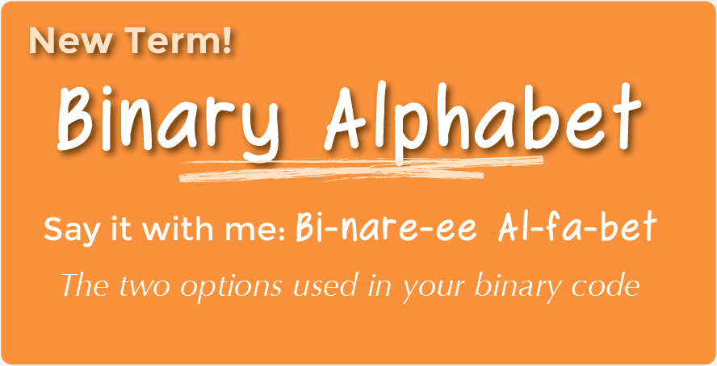
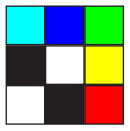

<!--
Live preview (once saved to dropbox) is at http://staging.code.org/curriculum/course4 Don't share this URL!
-->

<%= partial('curriculum_header', :title=> 'Binary Images', :unplugged=>true,:disclaimer=>'Basic lesson time includes activity only. Introductory and Wrap-Up suggestions can be used to delve deeper when time allows.', :time=>20) %>

[content]

## Lesson Overview
Though many people think of binary as strictly zeros and ones, our previous courses taught students that information can be represented in a variety of binary options.  This lesson takes that concept one step further as it illustrates how a computer can store even more complex information (such as images and colors) in binary, as well.

[summary]

## Teaching Summary 

### **Getting Started** - 10 minutes

1) [Review](#Review)  
2) [Vocabulary](#Vocab)  
3) [Binary in Review](#GetStarted)  

### **Activity: Binary Images** - 20  minutes  

4) [Binary Images](#Activity1)

### **Wrap-up** - 10  minutes 

5) [Flash Chat: What did we learn?](#FlashChat) 
6) [Vocab-Shmocab](#Shmocab)

### **Assessment** - 10  minutes 

7) [Binary Images Assessment](#Assessment)

[/summary]

## Lesson Objectives 

Students will:

- Identify methods for encoding images into binary
- Relate images to a peer using binary encoding
- Reproduce an image, based on binary code

# Teaching Guide
## Materials, Resources and Prep

### For the Student

- One [Binary Images Worksheet](Activity17-BinaryImages.pdf) per pair
- One [Binary Image Assessment Worksheet](Assessment17-BinaryImages.pdf) per student
- Blank Paper, pens, pencils
- Other trinkets that can display opposites, such as: Playing Cards, checkers, coin, etc.  (Optional)

### For the Teacher

- Teacher guide
- Print one [Binary Images Worksheet](Activity17-BinaryImages.pdf) per pair
- Print one [Binary Image Assessment Worksheet](Assessment17-BinaryImages.pdf) per student 
- Gather groupings of items that can show opposites for students to use when coming up with their own binary encodings (Optional)

## Getting Started (10 min) 

###  1) Review
This is a great time to review the last lesson that you went through with your class.  We suggest you alternate between asking questions of the whole class and having students talk about their answers in small groups.

Here are some questions that you can ask in review:

- What did we do last time?

- What do you wish we would have had a chance to do?

- Did you think of any questions after the lesson that you want to ask?

- What was your favorite part of the last lesson??  

[tip]

# Lesson Tip
Finishing the review by asking about the students' favorite things helps to leave a positive impression of the previous exercise, increasing excitement for the activity that you are about to introduce.

[/tip]

###  2) Vocabulary
This lesson has one important word to review and one new term: 

[centerIt]

[/centerIt]

**Binary** - Say it with me: Bi-nare-ee  
A way of representing information using only two options

[centerIt]

[/centerIt]

**Binary Alphabet** - Say it with me: Bi-nare-ee Al-fa-bet  
The two options used in your binary code

### 3) Binary in Review

See if your class remembers the [Binary Bracelets](../../course2/14/Activity14-BinaryBracelets.pdf) lesson from course 2. 

> "Do you remember how we used off and on to represent letters?"

You may want to do an example with them using a letter or two to refresh their memory.

> "What other ways could we have represented those letters? What if we couldn't use on and off?"

Encourage your class to come up with some other sets of opposites to represent the same letters that you just did.

> "Those are great suggestions. Let's use one of them to code a new letter."

Once you code up another letter or two, begin a though exercise.

> "How could we use that same binary alphabet to encode a picture?"

The students may have no idea what you're talking about. That's okay. You can lead them to the answer step-by step.

What if we had a picture like this, where there's only two different options for each square, black or white.

How might we encode this so that someone else could recreate the picture without seeing it?

- Some students might harken back to the [Graph Paper Programming](../../course2/1/Activity1-GraphPaperProgramming.pdf) lesson. While there could be a lot of similarities, let them know that this is different enough that they should not use that lesson to guide this one

You may hear suggestions like: "Say 'white, black, white, black'."

> "That's a great suggestion!  Now I'm going to break you up into pairs.  Work with your teammate to decide on a binary alphabet."

Decide whether you want your pairs to share their encodings with the other groups ahead of time, and tell them if they will be creating a key, or keeping their methods secret.

> "Now, let's encode some images, just like a computer would!"

## Activity: [Binary Images](Activity17-BinaryImages.pdf) (20 min)

### 4) Binary Images

Now it's the students' turn!

**Directions:**

> 1) Divide students into pairs.  
> 2) Have them choose an image with their partner.  
> 3) Encourage them to figure out what their binary alphabet is going to be.  
> 4) Have them encode their image using their new binary alphabet.  
> 5) Instruct students to trade encodings with another team and see if they can figure out which picture the other worked on.  
> 6) Choose a Level  
>    - Easy: Let the other team know what your encoding method was  
>    - Tough: Have the other team guess your encoding method.  

## Wrap-up (10 min)
### 5) Flash Chat: What did we learn? 

- What did we learn today?
- What kind of binary alphabet did you create? 
- Can you think of how you could encode an image using only your fingers?
- Do you think you could create a binary alphabet out of sounds?

### 6) Vocab Shmocab
You can choose to do these as a class, or have the students discuss with an elbow partner and share.

- Do you remember the definition of the term "binary alphabet"?

> "The two options used in your binary code" 
> "A three sided polygon" 
> "A number larger than zero" 

## Assessment (10 min)
### 7) [Binary Image Assessment Worksheet](Assessment17-BinaryImages.pdf)   

## Extended Learning 
Use these activities to enhance student learning. They can be used as outside of class activities or other enrichment.

### Storing Color Images

- If your class really gets the idea behind storing binary images, they may want to know how to do color images.
 - First, you'll need to discuss how color works using binary (as in [Binary Baubles](http://code.org/files/CSEDbinary.pdf), page 21).
 - Then, introduce some images that use combinations of those colors
  
- Encourage your students to come up with ways to code these color images. 

### Hexadecimal

- Take the idea of color one step further to introduce [hexadecimal color codes](http://www.mathsisfun.com/hexadecimal-decimal-colors.html).

## Connections and Background Information

### ISTE Standards (formerly NETS) Satisfied by this Lesson Include:

- 1c. Use models and simulations to explore complex systems and issues
- 2d. Contribute to project teams to produce original works or solve problems
- 4b. Plan and manage activities to develop a solution or complete a project
- 4d. Use multiple processes and diverse perspectives to explore alternative solutions
- 6d. Transfer current knowledge to learning new technologies

### The activities in this lesson support CSTA K-12 Computer Science Standards:

- CL.L1:3-02 Work cooperatively and collaboratively with peers teachers, and others using technology
- CT.L1:6-01 Understand and use the basic steps in algorithmic problem-solving
- CL.L2-03  Collaborate with peers, experts, and others using collaborative practices such as pair programming, working in project teams, and participating in group active learning activities
- CT.L2-06 Describe and analyze a sequence of instructions beign followed
- CT.L2-07 Represent data in a variety of ways: text, sounds, pictures, numbers
- CT.L2-14 Examine connections between elements of mathematics and computer science including binary numbers, logic, sets, and functions
- CT.L3A-05 Describe the relationsship between binary and hexademinal representations
- CT.L3B-07 Discus the interpretation of binary sequences in a variety of forms
- CT.L1:6-02 Develop a simple understanding of an algorithm using computer-free exercises

### Next-Gen Science Standards

- 3-5-ETS1-2 Generate and compare multiple possible solutions to a problem based on how well each is likely to meet the criteria and constraints of the problem

### Common Core Mathematical Practices

- 1. Make sense of problems and persevere in solving them
- 2. Reason abstractly and quantitatively
- 4. Model with mathematics
- 6. Attend to precision
- 7. Look for and make use of structure
- 8. Look for and express regularity in repeated reasoning

### Common Core Math Standards

- 4.OA.C.5 Generate a number or shape pattern that follows a given rule. Identify apparent features of the pattern that were not explicit in the rule itself

### Common Core Language Arts Standards

- L.3.6 Acquire and use accurately grade-appropriate conversational, general academic, and domain-specific words and phrases, including those that signal spatial and temporal relationships
- L.4.6 Acquire and use accurately grade-appropriate general academic and domain-specific words and phrases, including those that signal precise actions, emotions, or states of being and that are basic to a particular topic
- L.5.6 Acquire and use accurately grade-appropriate general academic and domain-specific words and phrases, including those that signal contrast, addition, and other logical relationships

[/together]

[/content]

<link rel="stylesheet" type="text/css" href="../docs/morestyle.css"/>