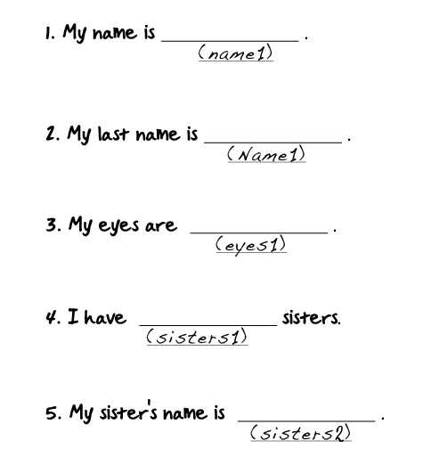

<!--
Live preview (once saved to dropbox) is at http://staging.code.org/curriculum/course4 Don't share this URL!
-->

<%= partial('curriculum_header', :title=> 'Envelope Variables', :unplugged=>true,:disclaimer=>'Basic lesson time includes activity only. Introductory and Wrap-Up suggestions can be used to delve deeper when time allows.', :time=>20) %>

[content]

## Lesson Overview
Variables allow for a lot of freedom in computer science.  This lesson helps to explain what variables are and how we can use them in many different ways. Use this activity before (or in conjunction with) the lesson on abstraction to really hit the idea home.

[summary]

## Teaching Summary 

### **Getting Started** - 10 minutes

1) [Review](#Review)  
2) [Vocabulary](#Vocab)  
3) [Introducing Variables](#GetStarted)  

### **Activity: Envelope Variables** - 20  minutes  

4) [Envelope Variables](#Activity1)

### **Wrap-up** - 10  minutes 

5) [Flash Chat: What did we learn?](#FlashChat) 
6) [Vocab-Shmocab](#Shmocab)

### **Assessment** - 10  minutes 

7) [Variables Assessment](#Assessment)

[/summary]

## Lesson Objectives 

Students will:

- Identify variables and determine their values
- Define and call variables in the context of real-life activities
- Create situations which require the use of variables
- Utilize teamwork to enrich creative game play

# Teaching Guide
## Materials, Resources and Prep

### For the Student

- Blank Paper
- 6 envelopes per group, labeled with the names (name1, name2, Name1, eyes1, sisters1, sisters2)
- 1 [Envelope Variables Worksheet](Activity4-Variables.pdf) per group
- Pens/Pencils/Markers
- [Variables Assessment Worksheet](Assessment4-Variables.pdf)

### For the Teacher

- Prepare your variable presentation by writing variable names on the back of envelopes and stuffing them with appropriate values
- Print one [Envelope Variables Worksheet](Activity4-Variables.pdf) per student
- Print one [Variables Assessment Worksheet](Assessment4-Variables.pdf)
- Provide students with envelopes (details above), paper, pens & pencils

## Getting Started (10 min) 

###  1) Review
This is a great time to review the last lesson that you went through with your class.  We suggest you alternate between asking questions of the whole class and having students talk about their answers in small groups.

Here are some questions that you can ask in review:

- What did we do last time?

- What do you wish we would have had a chance to do?

- Did you think of any questions after the lesson that you want to ask?

- What was your favorite part of the last lesson??  

[tip]

# Lesson Tip
Finishing the review by asking about the students' favorite things helps to leave a positive impression of the previous exercise, increasing excitement for the activity that you are about to introduce.

[/tip]

###  2) Vocabulary
This lesson has one important word to review: 

[centerIt]

[/centerIt]

**Variable** - Say it with me: Vayr-ee-ah-buhl  
A placeholder for a piece of information that can change

### 3) Introducing Variables

On the board (or under your document camera) write the sentence:

>> "Hello, my name is <u> name1</u> ."

In your hand, you should hold three envelopes.  One labeled "name1", another labeled "name2", and another with an imperfect variation of name1 -- such as "Name1".

- Be sure that only the envelope called "name1" has your correct name in it (ideally the name that you expect the class to identify for you).

Call attention to the board and inquire:

>> "If this sentence on the board is for me, what should go into the blank called 'name1'?"

Let the students register their guess, then have someone come check the envelope.  Be sure that they pick the envelope from the three (this can make for a fun and interesting extra bit to the lesson if they should happen to choose the 'Name1' envelope and see a word like "Monkey".)  You can use that as an opportunity to introduce the fact that, for this game, capitalization matters.

Next, ask:

>> - "Does this sentence only work for me?"

>> - "How could I get it to work for someone else in the class?"

Hopefully the students will recognize that they just need to put a new name in the envelope.  If they don't get that idea right away, help guide them to that answer.  You will want to be very specific about which envelope that name needs to go into.

- Feel free to do multiple examples using different envelopes. 
- Work your way up to using two or more envelopes in one sentence.
  - Have fun with it. Incorporate students. You can do first and last names, ages, or even positive qualities about individuals.
  

## Activity: [Envelope Variables](Activity4-Variables.pdf) (20 min)
### 4) Envelope Variables

Now it's the students' turn!

Once the students understand how the envelopes relate to the sentences, challenge the students to create their own sentences that can work for anyone in the group as long as they change what goes into the envelope.

Give the students some [sample sentence templates](Activity4-Variables.pdf) to begin with.

**Directions:**

> 1) Divide students into groups of 2-4.

> 2) Have groups assign a sentence to each person.

> 3) Each student will out a slip of paper to put inside of their envelope “variable” to fill in the blank from their sentence. 

> 4) Once everyone has an answer in their envelope, students will throw the envelopes into the middle of the table. 

> 5) Starting with question 1, students will try to guess the value of every team member’s variable, then pull the envelope with that variable name to see if they were right.

> 6) Once all filled envelopes have been revealed, students should switch questions and start again.

If they finish early, encourage students to come up with their own templates to share with the class.

## Wrap-up (10 min)
### 5) Flash Chat: What did we learn? 

- What did we learn today?
- Can you think of anywhere that you have seen variables before? 
- There is at least one variable at the top of most homework hand outs? Can you think of what it could be?

### 6) Vocab Shmocab
You can choose to do these as a class, or have the students discuss with an elbow partner and share.

- Do you remember the definition of the word "variable"?

> "A four sided parallelogram" 
> "A placeholder for a piece of information that can change" 
> "The wheels on the bottom of chair legs" 

## Assessment (10 min)
### 7) [Variables Assessment Worksheet](Assessment4-Variables.pdf)   

## Extended Learning 
Use these activities to enhance student learning. They can be used as outside of class activities or other enrichment.

### What's in the box?

- Draw boxes on a piece of paper with simple mathmatic operators between them.
  - For instance  |_ + _| = |_|
- Have similar size squares with numbers between 1 & 20.
- Ask one student to come create a true equation, using the numbers provided.
- Once the student has finished (and the class verifies the equation) exchange one of the numbers with another one, then remove a second number entirely.
  - Tell the students that there is a hidden number in the empty box that makes that equation true again.
  - What number is in the box?
- Play this game over and over again until you can remove the number from any location and the students can figure out what it is supposed to be.

## Connections and Background Information

### ISTE Standards (formerly NETS) Satisfied by this Lesson Include:

- 1c. Use models and simulations to explore complex systems and issues
- 2d. Contribute to project teams to produce original works or solve problems
- 4b. Plan and manage activities to develop a solution or complete a project
- 6c. Troubleshoot systems and applications

### The activities in this lesson support CSTA K-12 Computer Science Standards:
 
- CT.L1:6.01 - Understand and use the basic steps in algorithmic problem-solving  
- CT.L1:6.02 - Develop a simple understanding of an algorithm using computer-free exercises   
- CPP.L1:6.05 - Construct a program as a set of step-by-step instructions to be acted out

### Other standards, including the NGSS, and Common Core Math & Language Arts

- CCLA-K:SL.2 - Confirm understanding of a text by asking or answering questions
- CCLA-1:SL.2 - Ask and answer questions about key details in a text

[/together]

[/content]

<link rel="stylesheet" type="text/css" href="morestyle.css"/>