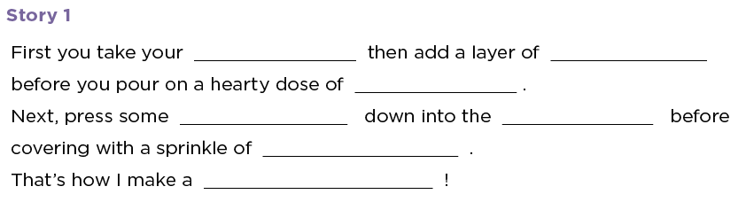

<!--
Live preview (once saved to dropbox) is at http://staging.code.org/curriculum/course4 Don't share this URL!
-->

<%= partial('curriculum_header', :title=> 'Abstraction with Mad Glibs', :unplugged=>true,:disclaimer=>'Basic lesson time includes activity only. Introductory and Wrap-Up suggestions can be used to delve deeper when time allows.', :time=>20) %>

[content]

## Lesson Overview
Abstraction is one of the most important skills for a computer scientist to understand.  This activity will have your students analyzing stories for differences so that they can abstract them away. Those abstracted stories become templates for fun and crazy new ones. 

[summary]

## Teaching Summary 

### **Getting Started** - 10 minutes

1) [Review](#Review)  
2) [Vocabulary](#Vocab)  
3) [An Abstract Reminder](#GetStarted)  

### **Activity: Mad Glibs** - 20  minutes  

4) [Mad Glibs](#Activity1)

### **Wrap-up** - 10  minutes 

5) [Flash Chat: What did we learn?](#FlashChat) 
6) [Vocab-Shmocab](#Shmocab)

### **Assessment** - 10  minutes 

7) [Abstraction Assessment](#Assessment)

[/summary]

## Lesson Objectives 

Students will:

- Have the chance to internalize the idea of “abstraction”
- Combine writing and abstraction to test their own creativity
- Analyze their day to find differences that they can turn into similarities

# Teaching Guide
## Materials, Resources and Prep

### For the Student

- [Mad Glibs Abstraction Worksheet](Activity6-MadGlibs.pdf)
- [Abstraction Assessment Worksheet](Assessment6-MadGlibs.pdf)
- Pens/Pencils

### For the Teacher

- Print one [Mad Glibs Abstraction Worksheet](Activity6-MadGlibs.pdf) per student
- Print one [Abstraction Assessment Worksheet](Assessment6-MadGlibs.pdf)
- Provide student with paper, pens & pencils

## Getting Started (10 min) 

###  1) Review
This is a great time to review the last lesson that you went through with your class.  We suggest you alternate between asking questions of the whole class and having students talk about their answers in small groups.

Here are some questions that you can ask in review:

- What did we do last time?

- What do you wish we would have had a chance to do?

- Did you think of any questions after the lesson that you want to ask?

- What was your favorite part of the last lesson??  

[tip]

# Lesson Tip
Finishing the review by asking about the students' favorite things helps to leave a positive impression of the previous exercise, increasing excitement for the activity that you are about to introduce.

[/tip]

###  2) Vocabulary
This lesson has one important word to review: 

[centerIt]

[/centerIt]

**Abstraction** - Say it with me: Ab-strac-shun  
Pulling out specific differences to make one solution work for multiple problems

### 3) An Abstract Reminder
When you finish your review, try taking your class by surprise.

>> “So, what did you have for waffles this morning?”

Your students might look perplexed?

>> “No one? Okay, what did you have for toast yesterday?”

You may start to get some hands raising, and people eager to share and agree because they want to relate, but possibly not because they understand.

>> “See what I was doing there? I identified my experience in a very specific manner, and that made it harder for everyone else to relate to. What could I have said that more people would have understood?”

At some point, they’ll start to come up with the idea of using “breakfast” in place of the actual food that was consumed.

>> “In a way, the word ‘breakfast’ is like a variable that we use to hold a space for whatever it is we ate this morning. By taking the specific word out and replacing the space it leaves with ‘breakfast,’ we are using abstraction to make something work for multiple people.”

Ask the class to give you some examples of other places that they may naturally use abstraction to allow more people to understand them. The idea of lunch and dinner will most-likely come up. Is there anything *not* food related?

## Activity: Mad Glibs (20 min)
### 4) [Mad Glibs Abstraction Worksheet](Activity6-MadGlibs.pdf)
The next step is to pass out a “fill-in-the-blank” story (see the [Mad Glibs Abstraction Worksheet](Activity6-MadGlibs.pdf) for a copy to print out) . Let them know that this started as a specific story about one thing, but we used abstraction to turn some of the specific words into blanks, and now the story can be about lots of things. Ask them what they can make their story about.

## Wrap-up (10 min)
### 5) Flash Chat: What did we learn? 

- What did we learn today?
- How might you be able to use abstraction when describing things outside? 
- Can you think of ways to use abstraction when talking about animals?

### 6) Vocab Shmocab
You can choose to do these as a class, or have the students discuss with an elbow partner and share.

- Do you remember the definition of the word "abstraction"?

> "A list of steps that you can follow to finish a task" 
> "An object that looks like a triangle from one direction and a circle from another" 
> "Pulling out specific differences to make one solution work for multiple problems" 

## Assessment (10 min)
### 7) [Abstraction Assessment Worksheet](Assessment6-MadGlibs.pdf)   

## Extended Learning 
Use these activities to enhance student learning. They can be used as outside of class activities or other enrichment.

### Mad Drawing

- Challenge the students to use these same ideas to make puzzles out of drawings. 
  - Have the students fold two pieces of paper in half three times and re-open them to lay them flat.   
  - On one of those pieces, have them make a drawing where they leave one of the resulting rectangles blank.
  - Have them cut the other folded piece along the creases to wind up with eight rectangle shapes.
      - Encourage the students to make different drawings on all eight rectangles that belivably complete their original drawing.
- Be sure to allow students time to share.

### Prep for Songwriting with Parameters

- Can students find songs where there are phrases that repeat, except for one or two words that change? 
  - Using "Old MacDonald" or "Five Little Monkeys" will prepare the students nicely for an activity that is coming up.   

## Connections and Background Information

### ISTE Standards (formerly NETS) Satisfied by this Lesson Include:

- 1c. Use models and simulations to explore complex systems and issues
- 2d. Contribute to project teams to produce original works or solve problems
- 4b. Plan and manage activities to develop a solution or complete a project
- 6c. Troubleshoot systems and applications

### The activities in this lesson support CSTA K-12 Computer Science Standards:
 
- CT.L1:6.01 - Understand and use the basic steps in algorithmic problem-solving  
- CT.L1:6.02 - Develop a simple understanding of an algorithm using computer-free exercises   
- CPP.L1:6.05 - Construct a program as a set of step-by-step instructions to be acted out

### Other standards, including the NGSS, and Common Core Math & Language Arts

- CCLA-K:SL.2 - Confirm understanding of a text by asking or answering questions
- CCLA-1:SL.2 - Ask and answer questions about key details in a text

[/together]

[/content]

<link rel="stylesheet" type="text/css" href="morestyle.css"/>