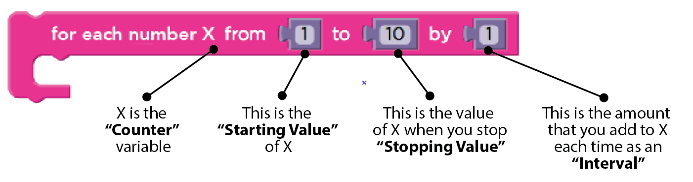

<!--
live preview (once saved to dropbox) is at http://staging.code.org/curriculum/course3/.  Don't share this URL!
-->

<%= partial('curriculum_header', :unplugged=>true, :disclaimer=>'Basic lesson time includes activity only. Introductory and Wrap-Up suggestions can be used to delve deeper when time allows.', :title=> 'For Loop Fun', :time=>25) %>

[content]

[together]

## Lesson Overview
We know that loops allow us to do things over and over again, but now we’re going to learn how to use loops with extra structure built right in. 
  

[summary]

## Teaching Summary
### **Getting Started** - 15 minutes

1) [Review](#Review)  
2) [Vocabulary](#Vocab)  
3) [For One and All](#GetStarted)  

### **Activity: For Loop Fun** - 25  minutes  

4) [For Loop Fun](#Activity1)  

### **Wrap-up** - 10  minutes 
5) [Flash Chat](#WrapUp) - What did we learn?  
6) [Vocab-Shmocab](#Shmocab)

### **Assessment** - 5  minutes 
7) [Conditionals with Cards Assessment](#Assessment)

[/summary]

## Lesson Objectives 
### Students will:
- Determine starting value, stopping value, and interval of "for loop" 
- Illustrate the counter values hit each time through a for loop during runtime

[/together]

[together]

# Teaching Guide

## Materials, Resources and Prep
### For the Student
- Dice (3 per pair of students)
- Pens & Pencils
- [For Loop Fun Worksheet](Activity8-ForLoopFun.pdf)
- [For Loop Fun Assessment](ForLoopAssessment.pdf)

### For the Teacher
- This Teacher Lesson Guide
- Print one [For Loop Fun Worksheet](Activity8-ForLoopFun.pdf) per group
- Print one [For Loop Fun Assessment](ForLoopAssessment.pdf) for each student

[/together]

[together]

## Getting Started (20 min)

###  1) Review
This is a great time to review the last lesson that you went through with your class.  We suggest you alternate between asking questions of the whole class and having students talk about their answers in small groups.

Here are some questions that you can ask in review:

- What did we do last time?

- What do you wish we would have had a chance to do?

- Did you think of any questions after the lesson that you want to ask?

- What was your favorite part of the last lesson??  

[tip]

# Lesson Tip
Finishing the review by asking about the students' favorite things helps to leave a positive impression of the previous exercise, increasing excitement for the activity that you are about to introduce.

[/tip]

###  2) Vocabulary
This lesson has one new and important word: 

[centerIt]

[/centerIt]

**For Loop** - Say it with me: For-Loop  
Loops that have a predetermined beginning, end, and increment (step interval)

###  3) For One and All
- If you did the original loops lesson (remember The Iteration?) you can call back to the usefulness of loops in general
- Point out that there are certain loops that happen very frequently, for example, loops where you need to keep track of how many times you have been through
  - Sometimes, you don't want to start with one
  - Sometimes, you don't want to count by ones
  - For Loops give you a powerful way to keep a counter that starts when you want, ends when you want, and increases by whatever size step that you want
  
Here, you can jump right into a sample of the game

[/together]

[together]

## Activities: (20 min)
###  4) [For Loop Fun](Activity8-ForLoopFun.pdf)

Sometimes we want to repeat things a certain number of times, but we want to keep track of values as we do. This is where a “for loop” comes in handy.   When you use a for loop, you know right from the start what your beginning value is, what your ending value is, and how much the value changes each time through the loop.

**Directions:**

> 1) Divide students into pairs

> 2)  To start the round, each student rolls three times:  
      - One die to determine the starting value of X  
	  - Three dice to determine the stopping value for X  
	  - One die to determine the step interval of X each time through  

> 3)  Use one of the provided number lines to trace the for loop that they’ve made  
	  - Start at the starting value of X  
	  - Count down the number line, circling the numbers at the rolled interval  
	  - Stop when you get to the predetermined stopping value  

> 4)  Add all of the circled values to your score, then let the other player take a turn

> 5)  Best 2 out of 3 wins

[tip]

# Lesson Tip  
When you play this game, it's as if you're running through a loop like this

for (x=startValue; x <= stopValue; x = x + interval){  
	circle currentXvalue;  
	add currentXvalue to roundScore;  
}

It may be difficult for young students to understand this written in pseudocode, but it may be helpful to have you explain out loud (and perhaps with a diagram) what they will be using as the content of a for loop.

[/tip]

[/together]

[together]

## Wrap-up (5 min)
###  5) Flash Chat: What did we learn?
- What would your interval need to be if you wanted to count from 4 to 13 by threes?
- What kinds of things do you think you could do with a for loop?
- Can you reproduce a normal loop using a for loop? 
  - What would you need to do?

[tip]

# Lesson Tip  
Flash Chat questions are intended to spark big-picture thinking about how the lesson relates to the greater world and the students' greater future.  Use your knowledge of your classroom to decide if you want to discuss these as a class, in groups, or with an elbow-partner.

[/tip]

###  6) Vocab Shmocab
- Which one of these definitions did we learn a word for today?

> "Doing something more than once the exact same way"  
> "Loops that have a predetermined beginning, end, and increment."  
> "Statements that only run under certain conditions" 
>> ...and what is the word that we learned?

[/together]

[together]

## Assessment (5 min)
### 7) [For Loop Fun Assessment](ForLoopAssessment.pdf)
- Hand out the assessment worksheet and allow students to complete the activity independently after the instructions have been well explained. 
- This should feel familiar, thanks to the previous activities.

[/together]

<!--(this is left in here as an example of how to include an image in Markdown)
 -->

[together]

## Extended Learning 
Use these activities to enhance student learning. They can be used as outside of class activities or other enrichment.

### Run it Backward

- Try this activity again, but this time have the start number be selected using three dice, and the stop number with only one.  Make sure to have a *negative* increment!

### Hop Scotch

- Using chalk, draw a hop scotch diagram outside on the blacktop
  - Number the squares from bottom to top
  - Have students give each other a start square, stop square, and how many at a time they need to jump
  - When the jumper is done, have them write down the loop they just performed
  - Start adding additional activities to be done at each square, this will add complexity to the written portion, as well

[/together]

[together]

## Connections and Background Information

### ISTE Standards (formerly NETS) Satisfied by this Lesson Include:

- 1c. Use models and simulation to explore complex systems and issues
- 2d. Contribute to project teams to solve problems

### The activities in this lesson support CSTA K-12 Computer Science Standards:

- CL.L1:3-02 Work cooperatively and collaboratively with peers teachers, and others using technology
- CT.L1:6-01 Understand and use the basic steps in algorithmic problem-solving
- CT.L1:6-02 Develop a simple understanding of an algorithm using computer-free exercises
- CT.L2-01 Use the basic steps in algorithmic problem solving to design solutions
- CT.L2-12 Use abstraction to decompose a problem into sub-problems
- CT.L2-14 Examine connections between elements of mathematics and computer science including binary numbers, logic, sets, and functions
- CT.L3A-03 Explain how sequence, selection, iteration, and recursion are building blocks of algorithms

### Next-Gen Science Standards

- 3-5-ETS1-2 Generate and compare multiple possible solutions to a problem based on how well each is likely to meet the criteria and constraints of the problem

### Common Core Mathematical Practices

- 1. Make sense of problems and persevere in solving them
- 2. Reason abstractly and quantitatively.
- 4. Model with mathematics
- 6. Attend to precision
- 7. Look for and make use of structure
- 8. Look for and express regularity in repeated reasoning

### Common Core Math Standards

- 4.OA.C.5 Generate a number or shape pattern that follows a given rule. Identify apparent features of the pattern that were not explicit in the rule itself

### Common Core Language Arts Standards

- L.3.6 Acquire and use accurately grade-appropriate conversational, general academic, and domain-specific words and phrases, including those that signal spatial and temporal relationships
- L.4.6 Acquire and use accurately grade-appropriate general academic and domain-specific words and phrases, including those that signal precise actions, emotions, or states of being and that are basic to a particular topic
- L.5.6 Acquire and use accurately grade-appropriate general academic and domain-specific words and phrases, including those that signal contrast, addition, and other logical relationships

[/together]

[/content]

<link rel="stylesheet" type="text/css" href="../docs/morestyle.css"/>
