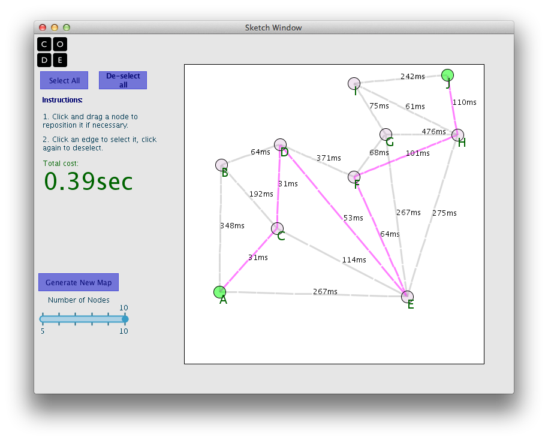

<%= partial('curriculum_header', :unitnumber=>2, :unittitle=>'Algorithms', :lesson=>10, :title=> 'Graph Algorithms - Shortest Path', :time=>50, :days=>1) %>

[content]

## Lesson Overview (New Learning)

In this lesson, students continue to explore graph representations of maps and networks and are asked to think about the kinds of problems that can be solved with graphs. Students will explore the Single Source Shortest Path problem with a widget. The final project in this lesson is to write an algorithm for the Single Source Shortest Path problem.

[summary]

## Teaching Summary
### **Getting Started** - 10 minutes

1) Think-Draw-Pair-Share-Apply: Imagine that you are making a graph that represented paths between locations in your school.

### **Activity: Shortest Path Algorithms** - 20 minutes  

2) Understand the problem.
3) Work collaboratively to solve the problem.
4) Algorithm exchange.

### **Wrap-up and Reflection** - 20 minutes
5) Share algorithms.
6) Present Djikstra's algorithm. 

[/summary]

## Lesson Objectives 
The students will...

- Demonstrate...
- Explain ...

# Teaching Guide
## Materials, Resources and Prep
### For the Student
- Journal
- Shortest Path widget: [Shortest Path Widget](resources/shortestPath.jar) (coming: executable jar file)

### For the Teacher
- [*Teacher presentation Graphing Algorithms: Part 2- Djikstra's Algorithm](resources/....) Under development
- Prepare to use the Shortest Path widget: [Shortest Path Widget](resources/shortestPath.jar) (coming: executable jar file)

## Getting Started (10 min)
### 1) Think-Draw-Pair-Share-Apply
- Think: Imagine that you are making a graph that represented paths between locations in your school. What would the nodes represent?  What kind of cost might you label an edge with? Draw a representative picture of a graph of a small portion of the school in your journal (do not diagram the whole school).  

[tip]

# Teaching Tip
Students might need to be reminded here that there is no right answer.  A graph is an abstract representation of information and connections between the information. There are many creative ways you might represent a graph of the school with nodes and edges. If students need more prompting suggest that they think of cost or weight to assign to an edge that is something other than simply distance.

[/tip]

- Pair: After a few minutes, ask students to share their graphs with elbow partners.

- Share: Ask for volunteers to share interesting ideas for how to graph the school.
	- Discuss a few to make sure everyone understands that there are many different ways to represent a school with a graph.
	
- Apply: Ask what kinds of problems a graph of the school might be used to solve.
	- Try to tease out some version of a shortest path problem (e.g. the shortest distance between two points, the fastest way to get somewhere, the lowest total cost between two points). 
	- Finally ask: why do you think we are studying graphs and graph algorithms in this class?
	- The short answer is: The Internet. Problems that appear on the internet are frequently described as graph problems and there are many insights about how things work that can be gleaned from looking at graph algorithms. Today students will learn about the Single Source Shortest Path algorithm.

## Activity: Shortest Path Algorithms (25 min)
### 2) Understand the problem.  
- Finding the shortest path between two points on a graph is a very important problem to solve.
- This is especially true on the internet since every computer is not directly connected to every other computer -- information must travel between computers to reach its final destination.  
- The Shortest Path Widget shows a graph of inter-connected computers.  The weight given to each edge is the amount of time in milliseconds it takes for a single bit to travel from one node to its neighbor.
- The students' task is to come up with an algorithm for finding the shortest path between two nodes.
- Students will work with a partner using the widget to experiment.
- Here is an example that also shows how the shortest path does not necessarily use the least number of edges:

- ***BEFORE***

- ***AFTER***

### 3) Work collaboratively to solve the problem.
- Instruct the students:
 - Work with a partner to use the Shortest Path widget: [Shortest Path Widget](resources/shortestPath.jar) (coming: executable jar file)
 - Try a variety of maps with different numbers of nodes to find the shortest paths.
- REMIND students that their task includes developing a theory about how to find the shortest path that they can communicate as an algorithm
- **NOTE:** The widget does not indicate if the shortest path has been found. Students should work to confirm that they have found the shortest path and assure themselves that the algorithm they are developing produces it.

[tip]

#Teaching Tip
An important part of this lesson (and all of the lessons in this unit) is to develop students skills in articulating and describing complicated processes. That, in essence, is the work of developing an algorithm. A shortest path algorithm is fairly difficult to describe so this will be a real challenge.

[/tip]

### 4) Algorithm exchange
 - Once two pairs of students have written out their algorithm they should exchange it with another group to test it out 
 - pairs should collaborate to discuss correctness and efficiency.

## Wrap-up and reflection(15 min)
### 5) Share algorithms
- Ask for a pair to volunteer to read their algorithm to the class
- Have students follow along in the widget to see if it works.

### 6) Present Djikstra's algorithm 
- Djikstra's algorithm is a well-known algorithm for finding the shortest path (which probably involves more steps and work than students were prepared for) which is presented in the context of the widget for this lesson.
- The steps and other details are included in the [*Teacher presentation Graphing Algorithms: Part 2- Djikstra's Algorithm](resources/....) Under development

**Algorithm**  
SETUP: Have a blank version of the graph in which you can write numbers in the nodes to record the distance from the source.

0. Record the number ∞ in every node in the graph
1. Let V be the starting node.
2. Record the number 0 in V.
3. Mark V as "DONE" - we will never consider it again.
3. For every neighboring node N of V.
4. __Let c be the (cost of the edge connecting N and V) + (the value stored in V).
5. __if c is less than the value currently stored in N, replace the value in N with c.
6. Let V be the node in the graph that has the least cost recorded in it so far and is not yet DONE.
7. If V is the ending node STOP;
8. else go to line 3

Guide students to trace this algorithm to see if they can follow it.

- Assign these questions as homework:

 - Why does Djikstra's algorithm work?
 - How long does it take to run?
 - If it were to be executed on a very large graph, would it finish in a reasonable amount of time? 

[tip]
# Teaching Tip
As an option, you can assign Djikstra's algorithm as homework for students to trace and explore on their own and answer the questions.

[/tip]

## Extended Learning 

### Arguing Djikstra's Algorithm

- Imagine that a friend doubts that Djikstra's algorithm *always* finds the shortest path. The friend tells you that he hasn't found an example that doesn't work yet, but he's looking for one.  Since you cannot produce a book of every possible graph in the universe, how might you convince your friend that Djikstra's algorithm DOES find the shortest path. Write your argument and proof in a brief paragraph similar to a legal brief. Video record your argument. Call witnesses.

## Assessment Questions

- TBD

## Connections and Background Information
### CS Principles Learning Objectives

TBD 

### Other standards 

*CSTA K-12 Computer Science Standards*

 - TBD

*Common Core State Standards for Mathematical Practice*
  
- TBD  

[/content]