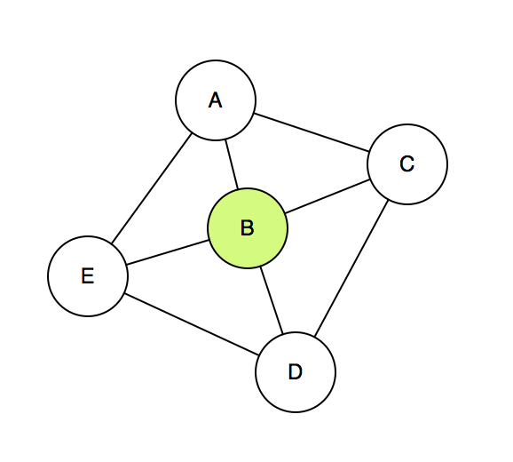
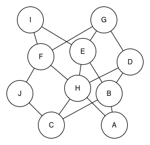
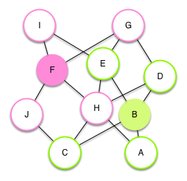

<%= partial('curriculum_header', :unitnumber=>2, :unittitle=>'Algorithms', :lesson=>14, :title=> 'Social Network Cliques and Connectors', :time=>50, :days=>1) %>

[content]

## Lesson Overview (Discovery)

In this lesson students explore another NP hard problem known as the 'Vertex Cover' problem. The problem exists in the context of social network 'cliques' and involves finding the people in a social network who are the true 'connectors.' It is sometimes called the the ice cream truck problem.
What's fascinating about the clique problem is that is very hard (as students will discover) to discover the cliques in a network. But it is trivially easy to construct such a network. This makes it very different from the map coloring problem. It is potentially useful because a map that can be constructed with a known solution very easily but is NP hard to solve, lays the foundation for the idea of a 'one-way' function that can be used in encryption and security in the lessons that follow.
	

[summary]

## Teaching Summary
### **Getting Started** - 10 minutes
1) Recall the map coloring problem. 

### **Activity: The Cliques in Social Networks Problem** - 25 minutes  
2) Understanding the problem.  
3) Find the connectors with the True Connectors Widget.  
4) Write an algorithm for finding the true connectors.

### **Wrap up** - 15 minutes
5) Share algorithms.  
6) Define "hard" problems for computers.

[/summary]

## Lesson Objectives 
The students will... 

- Demonstrate...
- Explain ...

# Teaching Guide
## Materials, Resources and Prep
### For the Student
- Journal
- [True Connectors Widget](resources/...) (Under development)

### For the Teacher
- Prepare to use the [True Connectors Widget](resources/...) (Under development)

## Getting Started (10 min)
### 1) Recall the map coloring problem.
- Instruct students to reflect in their journals: What made the map coloring problem hard?
- Invite students to share their experiences.

## Activity: The Cliques in Social Networks Problem (25 min)
### 2) Understanding the problem.

- You can make a graph of a social network where each node represents a person and an edge between them means that they are "friends".
- In a social network some people are more "connected" than others - where being "connected" means that you are only one degree of separation away from another person.

**The Scenario:**
Imagine that we want to start a viral video campaign and we need to know who the most connected people are so that it will spread fast. We can't just send it to some people and hope for the best. Promoting the campaign takes time and money. We want to spend our time and money to promote the video only on the true connectors, so we need to find out who they are. Let a "true connector" be someone who is one degree of separation away from another person (i.e. they are friends with that person) such that it covers the most people possible.

- For example, in this diagram:

- Person B is the true connector, because she is friends with everybody else in the graph.  If she promotes the viral video to her friends it will reach everyone.  If we gave the video to anybody else in the graph it would miss some people.

- This one is harder to see who the true connectors are:

- But there are two "true connectors" shown here:

- Person B and F are the "true connectors" here.  If we had chosen any other two people, someone would have been more than one degree away.  
- So the official problem statement is: *given a graph showing a social network, find the minimum number of true connectors in the graph*.

  
[tip]

# Teaching Tip
This as the Ice Cream Truck problem from CS Unplugged situated in a different context.

[/tip]

### 2) Find the connectors with the True Connectors Widget.
- Point students at the [True Connectors Widget](resources/...) (Under development) and instruct them begin experimenting with the problem.
- As students work, encourage them to be thinking about what factors are going into their decisions to find connectors. Can they express it as an algorithm?

### 3) Write an algorithm for finding the true connectors.
- Guide students to write or sketch a process for finding the true connectors in a network.
- Exchange algorithms and test, if possible.

[tip]

# Teaching Tip
Students might be onto the fact that this is another computationally hard problem. That's okay because that is what they are supposed find out. There is  an algorithm for finding the true connectors, it just takes a long time to run.

[/tip]

## Wrap-up (15 min)
### 4) Share algorithms. 
- Journal: would this problem be easier if the problem were to find exactly K number of connectors in the graph?  How so?
- What is an algorithm for finding the minimum number of connectors?
	- The answer here is that there is no way other than to try every single possible combination of every single possible node in the graph. 
	- Assume that the graph has one true connector.  For every node V in the graph, try V as the connector to see if it covers all the other nodes. If it does, stop. If it doesn't...
	- Assume that the graph has two true connectors.  For every possible pair of nodes V, W in the graph, see if V and W connect all the other nodes, and so on. 
- Analyze: how many possibilities?
- Remark that the only known way to find the minimum number of connectors is to literally try every single possible combination of possible connectors.  If there are N nodes in the graph that works out to N! possible combinations.  Even for a small graph this could take a very long time. 
- Give example with actual numbers. For a graph with only 25 nodes, if we can try one combination every millisecond (i.e. 1000 combinations per second), it would still take about 400 trillion years to try only 25 combinations!  Even if we could do 1 million combinations per second...it would still take 400 billion years.

- BAKER NOTE: this can be visualized in a graphical way pretty easily to show how to count all the combinations.  Possibly a video here.

### 5) Define "hard" problems for computers.
- A problem like this (and the map coloring problem) is "hard" for a computer because the sheer number of things that need to be tried out are not reasonable.  
- And the only known algorithm is try every possible combination.

## Extended Learning 

### title

- TBD

## Assessment Questions

- TBD

## Connections and Background Information
### CS Principles Learning Objectives

TBD 

### Other standards 
*CSTA K-12 Computer Science Standards*

 - TBD

*Common Core State Standards for Mathematical Practice*
  
- TBD  

[/content]