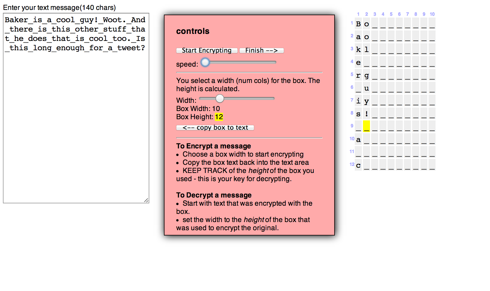

<%= partial('curriculum_header', :unitnumber=>2, :unittitle=>'Algorithms', :lesson=>15, :title=> 'Sending Passwords Over the Internet', :time=>50, :days=>1) %>

[content]

## Lesson Overview (New Learning) (Under development)

In this lesson, students explore the concept of passwords as used on computers.  Many websites insist that users have passwords and that those passwords follow certain rules. Questions users might ask: Why are these rules necessary? How are passwords kept secure?  What happens to a password when you type it and send it over the Internet? 

The activity in this lesson presents the problems and difficulties of passwords in the Internet age. Students are asked to explore (and crack) simple 'classic' encryption techniques such as the Caesar substitution cipher and the 'box' transposition cipher. The idea of 'locks' and 'keys' are explored.

### BAKER NOTE
- I think that this lesson should really be moved to unit 1 with an introductory programming exercise that employs our programming tool, not necessarily to DO the encryption, but to make a web page that collects a password and sends it over the web.
- This fits better with what's going on in that unit
- Students could grapple with the idea of plain-text passwords and using a one-way hash function to hide it.  Students could make a simple web page that allows their friends access by hardcoding the ciphered passwords.  
- So, that's not really so much an encryption algorithm (another reason to move it to unit 1) but it would lay the ground work for talking about encryption algorithms later.
- So I'm going to start the next lesson assuming this has been done. 
- What follows below is only a cursory sketch

[summary]

## Teaching Summary
### **Getting Started** - XX minutes

1. Journal: 

### **Activity** - XX minutes  

2. 

### **Wrap up** - XX minutes
3. 

[/summary]

## Lesson Objectives 
The students will...

- Demonstrate...
- Explain ...

# Teaching Guide
## Materials, Resources and Prep
### For the Student
- Journal
- [Box Cipher Widget](resources/boxCipher/html)
- [Interactive Vigenere Cipher Widget](resources/vigenereCipher.html)

### For the Teacher
- Prep for using [Interactive Vigenere Cipher Widget](resources/vigenereCipher.html)
- Prep for using [Box Cipher Widget](resources/boxCipher/html)

## Getting Started (5 min)
### 1) Journal prompt

- Journal: why do you think some websites require you to have a username and password?
- Discuss
	- Personalization
	- Security/privacy
	- Tracking 
- Pivot to the security issue   

## Activity: Sending Passwords over the internet (40 mins)
- Introduce concept of Bob, Alice and Eve
- Bob is trying to send a message to Alice over the internet
- Eve is parked in the middle and can see everything Bob and Alice send to each other
- How can Bob and Alice communicate in secret
- Concept of "Lock" and encryption algorithm and "key" input into algorithm that can decode the message
- Use the [Box Cipher Widget](resources/boxCipher/html) to experiment with a transposition cipher encrypting text messages.
- 
- This might make more sense as a Vignere Cipher
- Here is a [Interactive Vigenere Cipher Widget](resources/vigenereCipher.html)

## Extended Learning 

### title

- TBD

## Assessment Questions

- TBD

## Connections and Background Information
### CS Principles Learning Objectives

TBD 

### Other standards 

*CSTA K-12 Computer Science Standards*

 - TBD

*Common Core State Standards for Mathematical Practice*
  
- TBD  

[/content]