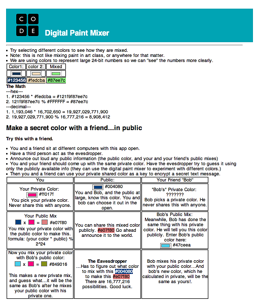

<%= partial('curriculum_header', :unitnumber=>2, :unittitle=>'Algorithms', :lesson=>15, :title=> 'Passwords and Public Keys', :time=>100, :days=>2) %>

[content]

## Lesson Overview (New Learning)

In this lesson, students are reminded of the idea of a one-way function from the Social Network Coverage problem and are introduced to the concept of a hash function as a one-way function that can be used to encrypt a password for secure transfer over the Internet. Students invent their own hash function and use it to keep a database of their friends' passwords. The security of such a password file is considered. It helps explain why a system administrator can never tell you your password, but why you can change it as long as you know the old one.

[summary]

## Teaching Summary
### **Getting Started** - 10 minutes
1) Recall learning on "hard" problems.

### **Activity: Exploring Encryption** - 30 minutes
2) Demonstrate One-Way Functions.
3) One-Way functions with math/numbers.
4) Mixing colors to make a shared key private.

### **Wrap up** - 10 minutes
5) Reflect on encryption schemes.

[/summary]

## Lesson Objectives 
The students will... 

- Demonstrate...
- Explain ...

# Teaching Guide
## Materials, Resources and Prep
### For the Student
- Journal
- [Digital Paint Mixing App](resources/colorKeyExchange.html)

### For the Teacher
- Prepare to use the [Digital Paint Mixing App](resources/colorKeyExchange.html)

## Getting Started (10 min)
### 1) Recall learning on "hard" problems.
- Recall & discuss: What do the TSP, Map Coloring, and Social Network Problems have in common?
	- A: Solving them takes an unreasonable amount of time because of the sheer number of possibilities. 
- Why is it important to understand/study these problems?
	- Important to understand what computers can't do or what they are bad at so that we don't suggest a solution to a problem for a real-life  problem that is unreasonable to solve (See: satellite missile defense system)
	- The fact that these problems are hard to solve is used to provide security in many contexts: i.e. if "cracking the code" or "breaking in" involves solving these "hard" problems, then we have a reasonable assurance of security.

## Activity: Exploring Encryption (25 min)	
### 2) Demonstrate One-Way Functions.
- Recall that one feature of the TSP was that we have no way to know the answer to the problem without running the algorithm to completion which takes too long.
- In other words we cannot construct a map in such a way that we know the answer that isn't also easy to solve.  And with a sufficiently large number of nodes, we can't keep track of it anyway.
- This is NOT true for the social networking problem.
	- It turns out we can very quickly construct a graph that represents the social network problem so that we know the answer but it is still hard to solve. Here's how:
	- [insert diagram to steps of construction]
	1. Make "connector nodes" with satellite nodes
	2. Connect satellite nodes
	3. Obscure connector nodes
- We call this a one-way function because it is easy to compute and build a map that is **virtually impossible to solve**.
- We can use this idea to "lock" information. The "key" becomes knowing which nodes are the social connectors which we know is hard to crack.
- Aside: There actually is a way to use the social network map to encrypt a number and send it.  It is mentioned in CS-Unplugged, but it is a little cumbersome to do kinesthetically. We will move on to show another technique.

### 3) One-Way functions with math/numbers.
Use a POGIL-style worksheet (or web widget with levels) that enables students to experiment with various concepts.  

- Prime factorization is hard in the same way TSP is hard (too many possibilities)
	- Multiplying prime numbers provides a type of one-way function - but there are clues based on the size of the number and number of digits
	- Modulo provides a way to obscure values. Using a prime ensures distribution across the number line.
	- Thus, if you have primes P1, P2, and P3.  (P1*P2)%P3 = N.  Even if you know P3 it is actually impossible to know what the original product was, and even if you did, it would be really hard to figure out which primes went into it.  
	
How can we use this?   

- It means that if we can encrypt numbers using this scheme, someone who intercepts the message would have to solve a very hard problem to crack the message.
- Better, we can use this strategy for two independent parties, to come up with a shared key without meeting ahead of time, or communicating in secret.
- NOTE: all this really means is that two people can compute the same number using only publicly available information in such a way that an eavesdropper couldn't.
		
### 4) Mixing colors to make a shared key private.
- Introduce mixing colors as metaphor for a one way function.
- Use the [Digital Paint Mixing App](http://cs.ucls.uchicago.edu/~bfranke/codeDotOrg/Unit2/colorKeyExchange.html) to demonstrate. 

  

- Check student understanding that they understand how the colors are being calculated.
	- Note that using colors really just let's us "see" large 24-bit numbers.
	- We're not really mixing colors. We're multiplying large numbers and modding by the 24-bit color range.

- Demonstrate the creation of a shared private key.	**Scenario:**  
  
 - I have a private paint color that I never share with anyone.
 - There is a public can of paint that anyone can take from.
 - If I mix my private paint with the public paint, it's very hard to determine what my original paint color was.

- Instruct students to experiment with exchanging keys and eavesdropping by trying the experiment described in the widget.

## Wrap-up (10 min)
### 5) Reflect on encryption schemes.
- Reflect back to when we used the [Box Cipher Widget](resources/boxCipher/html) to encrypt text messages in Lesson 15. (Baker note: should change that to vignere cipher - makes more sense with these keys)
- Recall that in order to use that encryption scheme, you and a partner had to agree on a secret numeric key so you know what box size to use and/or how many times to run it through the box.
- Instruct students to respond in their journal: Describe an algorithm that uses this public key exchange procedure combined with the box cipher to make an encryption scheme that would be very difficult to crack.
	- An interesting example is to generate a new private key for each run through the box cipher. Generate 10 different keys. That way the eavesdropper has to crack 10 different numbers in order to reconstruct the word.

## Extended Learning 

### title

- TBD

## Assessment Questions

- TBD

## Connections and Background Information
### CS Principles Learning Objectives

TBD 

### Other standards 

*CSTA K-12 Computer Science Standards*

 - TBD

*Common Core State Standards for Mathematical Practice*
  
- TBD  

[/content]