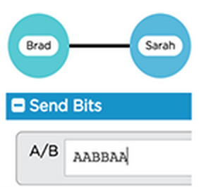
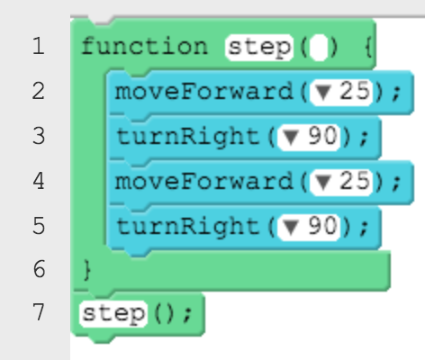
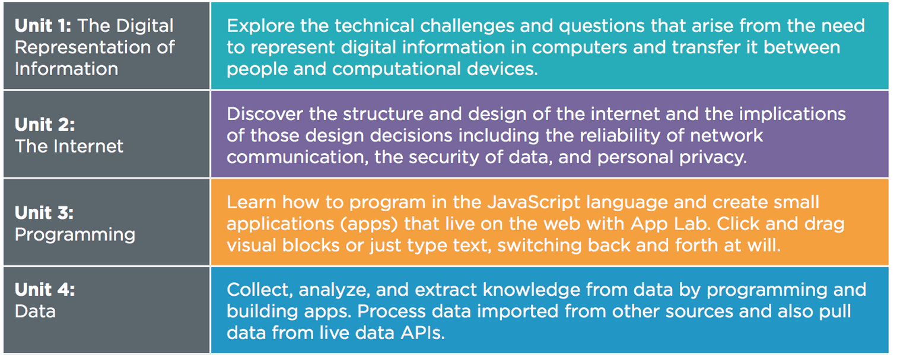

<%= partial('doc_header', :title => 'Computer Science Principles', :disclaimer=>'Code Studio') %>

[content]

Software and technology are everywhere - in our computers, in our pockets, in our cars, and used in banking, communications, entertainment, transportation, and science. But very few kids are learning how to actually create technology - games, apps and programs. Even fewer US schools teach computer science. Women are underrepresented in this field, and so are black and Hispanic Americans. Computer science is foundational for every student, whether they want to pursue a career in software, or to be a more well rounded citizen in the 21st century. That’s why we’re proud to introduce classrooms to some of the basics of computer science using Code Studio, an online learning platform by Code.org.

### What is Code Studio?
Code Studio is a fun, creative platform for learning basic coding and computer science! Using a blended learning model, your children are learning with a mix of online activities (on the computer) and “unplugged” classroom activities that use no computer at all.

This format helps nurture creativity, problem solving, collaboration, and logic through interactive tutorials, featuring short video lectures and game-like puzzles.

### What is Computer Science Principles?
Code.org's year-long, high school Computer Science Principles course is designed to be far more than a traditional introduction to programming - it is a rigorous, engaging, and approachable course that explores many of the big, foundational ideas of computing so that all students understand how these concepts are transforming the world we live in.

#### Students will study many "Big Ideas" of computing:

### With an online course, students are able to benefit from a truly modern educational experience. For example, Code Studio is able to:
* Make tutorials smarter and more personalized
* Use data to identify where students get stumped and improve puzzles
* Use smart hints to guide students with custom answers to common mistakes

### Student login - for access outside the classroom
Because this is an online course, students can log in from outside the classroom - from a computer or tablet at home, or in the library.  For our classroom to participate in this course, students have created Code Studio accounts.

## Protecting student privacy
Code.org assigns the utmost importance to student safety and security and has designed Code Studio to maximize student privacy. The list below summarizes what student data is stored and protected by Code.org, and how it is used.
 
You can find further details at [https://code.org/privacy](https://code.org/privacy).

### Data that is required for participation in the course:
* Student display name (e.g. “John S” or “Cool coder”)
* Student email (to allow password-reset)
* Age (to protect the privacy of the youngest learners)
* Login date/time and other technical information (for debugging purposes)
* Progress in the course, including code written to solve programming activities, and written responses to educational prompts (to display reports for students and teachers)
* For exploring concepts related to sending messages across the Internet, students will use a tool called the "Internet Simulator." Messages created in this tool can only be sent to other students within
the classroom section.

### Optional data:
* Gender (to summarize aggregate participation by females and males)
* As part of “App Lab,” the in-browser programming tool used in this course, students can optionally upload custom photos, sound, and videos to use within the apps that they create.

For more information on Code.org and Code Studio, visit [https://code.org](https://code.org).

[/content]

<link rel="stylesheet" type="text/css" href="../morestyle.css"/>
