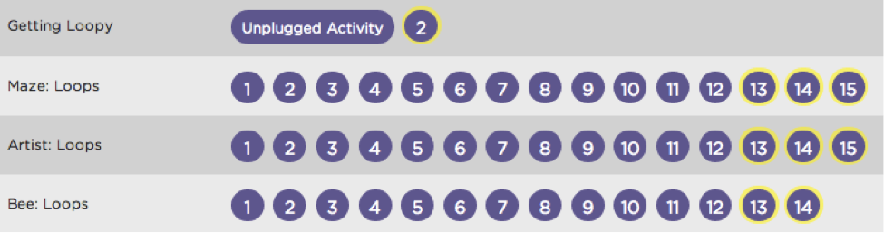

<%= partial('doc_header', :title => 'Implementation Tips', :disclaimer => 'K-5 Curriculum: Courses 1, 2, 3') %>

[content]

This document offers suggestions for implementing an individual K-5 course in an elementary school classroom, as well as planning the rollout of all three K-5 courses as a pathway across elementary school grade levels.

## Scheduling the Lessons

Where do you teach the courses? Use an existing "special" like media (library) or art. Or use a pre-existing computer lab period and split the online and unplugged lessons between the computer lab teacher and the grade level teachers respectively. 

Whether you are a grade level teacher or a specialist (media, art, technology), the K-5 courses are designed to be flexibly implemented. While each course is set up to run as one lesson per week for a semester (half-year), they can alternatively be run as contiguous lessons for about a month or one lesson every two weeks for a year. Lessons are meant to be completed in order and can range from as little as 20 minutes to more than 45 minutes if extension activities are included.

[tip]

# Unplugged Lessons

You can choose to do an entire unplugged lesson, which includes a Getting Started section, Activity, and Wrap-up, and lasts for about 35-45 minutes, or just choose to do the main activity, which usually lasts for 20-25 minutes.

[/tip]
 

## Computers in the Classroom

Here are implementation tips for three common computer use situations in an elementary school classroom: 

- Laptop cart
    - Where the grade level teacher leads the class: Increase collaboration by encouraging students to help one another before asking you a question, so that you can attend to the students who are in need of the most help. 
- Computer lab
    - Where a media specialist or computer lab teacher leads the class: Split the teaching load by having the computer lab teacher run all of the online puzzle tutorial lessons while you run all of the unplugged lessons in your classroom.
- Computers in the classroom (usually 2 to 6)
    - Use a “centers” approach by mixing an unplugged activity station with a computer-based online puzzle station. In larger classes, you may want to split up components of the unplugged activity into separate stations and use pair programming at the computer station if there aren’t enough computers. 

[tip]

# Pair Programming

Show the [pair programming video](http://youtu.be/vgkahOzFH2Q) featuring the do’s and don’ts of working collaboratively at a computer.

[/tip]

## Conceptual Chunks

The unplugged lessons and online puzzle tutorials are chunked together by shared concepts, where the unplugged lesson serves as a fun and gentle introduction to a computing concept that is further explored through coding exercises. This allows courses to be separated into chunks of lessons that can be taught within a time period, like a week, as a sub-unit. 

See this example from *Course 2* in which the unplugged lesson, Getting Loopy, precedes three online puzzle stages.

## Rollout

For schools that desire to implement all three courses, the course a student takes depends on their developmental level as well as their experience. While Code.org continues to publish more courses, teachers should strive to introduce material from our third-party partners to create a full pathway. Below is an example of what the first three years of a rollout may look like across grade levels.

[rollout-table]

|        |    K     |    1     |    2     |    3     |                  4                  |                  5                  |
|--------|----------|----------|----------|----------|-------------------------------------|-------------------------------------|
| Year 1 | Course 1 | Course 1 | Course 2 | Course 2 | Course 2                            | Course 2                            |
| Year 2 | Course 1 | Course 2 | Course 2 | Course 3 | Course 3                            | Course 3                            |
| Year 3 | Course 1 | Course 2 | Course 3 | Course 3 | See code.org for 3rd party material | See code.org for 3rd party material |

[/rollout-table]

[/content]

<link rel="stylesheet" type="text/css" href="morestyle.css"/>