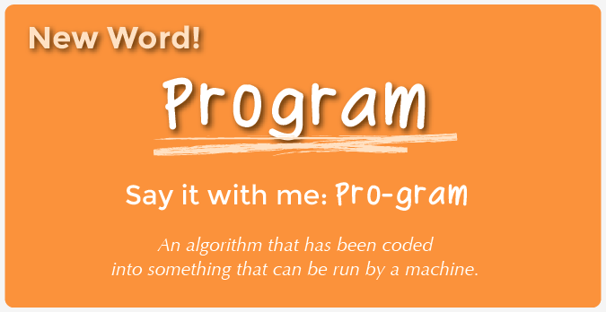

<%= partial('curriculum_header', :title=> 'The Drawing Machine', :lesson=>1, :unplugged=>true,:disclaimer=>'Basic lesson time includes activity only. Introductory and Wrap-Up suggestions can be used to delve deeper when time allows.', :time=>10) %>

[content]

[together]

## Lesson Overview 
This brief lesson will help prepare students to program Anna and Elsa in the Hour of Code activity. Students will "program" one another to draw shapes using a sequence of simple instructions. As students progress through the Hour of Code online, encourage them to refer back to this activity as they think about how to program Anna and Elsa.

[summary]

## Teaching Summary
### **Getting Started**

1) [Vocabulary](#Vocab)  
2) [Let's Control Ourselves](#GetStarted)  

### **Activity: The Drawing Machine**

3) [The Drawing Machine](#Activity1)  

### **Wrap-up**

4) [Flash Chat](#WrapUp) - Taking it online

[/summary]

## Lesson Objectives 
### Students will:
- Recognize situations where they can create programs to complete tasks
- Predict moves necessary to draw a shape
- Convert movements into written instructions
- Relate algorithms as programs to teammates 

[/together]

[together]

# Teaching Guide

## Materials, Resources and Prep

### For the Teacher
- Teacher Lesson Guide
- Print one or more sets of [Drawing Machine Commands](drawing_commands.pdf) for students
- (optional) Print sets of [Additional Drawing Commands](more_drawing_commands.pdf)
- Print one [Marker Template](marker_template.pdf), cut it out and tape it to a whiteboard marker
- Print or display on overhead [Angles Reference](visualizing_angles.pdf)
- Print or display on overhead [Shapes to Draw](drawing_shapes.pdf)

[/together]

[together]

## Getting Started

###  1) Vocabulary
This lesson has one new and important word: 

[centerIt]

[/centerIt]

**Program** - Say it with me: Pro-gram  
An algorithm that has been coded into something that can be run by a machine. 

###  2) Let's Control Ourselves

- Ask students to think of a time when they've explained how to do something complicated to another person.
- When we explain how to do a complex task, how do we make sure the person understands?
    - Break it up into smaller steps.
    - Make sure the steps are in the right order.
    - Be specific.
- Programming a computer is a lot like giving directions to a person, except that computers aren't as smart as we are.
- When you get confusing instructions, what do you do?
    - Take a guess at what was meant.
    - Ask for clarification.
    - Observe other people following the instructions.
- You probably have lots of other techniques for filling in the gaps that you're not even aware of.
- Computers don't know how to work with poor instructions, so before we start programming, we're going to practice giving good instructions.

[/together]

[tip]

# Lesson Tip
The student being "programmed" will often try to help the programmers by doing what they think was intended, even when the instructions weren't right. Make sure that the students are only doing _exactly_ what they've been programmed to do. You may want to model this behavior be allowing the class to "program" you first.

[/tip]

[together]

## Activity:
###  3) [The Drawing Machine](drawing_commands.pdf)

> **Directions for Class:**

> 1. Select one student to be the Drawing Machine.
> 2. Divide the [drawing commands](drawing_commands.pdf) up among students.
> 3. The Drawing Machine will start by standing at the whiteboard with a marker that has the [marker template](marker_template.pdf) attached.
> 4. Give the class one of the [shapes to draw](drawing_shapes.pdf); it should not be shared with the Drawing Machine.
> 5. Using the [drawing commands](drawing_commands.pdf) students will come up with a sequence of instructions for the Drawing Machine.
> 6. When the class is ready, they will give the instructions to the Drawing Machine to execute.
> 7. Repeat with additional images, allowing other students to be the Drawing Machine.

Experiment with different ways for students to give their instructions:

- Verbally give each instruction, waiting for the Drawing Machine to execute each step before providing the next.
- Write all instructions down on a piece of paper.
- Lay the instruction sheets down in the proper order.

If students struggle with figuring out which angles to use, you can give them this [angles reference sheet](visualizing_angles.pdf) to help.

[together]

[tip]

# Lesson Tip

Understanding that the instructions are executed from the marker's point of view is essential to programming it. For example, turning left or right is done relative to current direction the marker is pointing (as seen by the purple triangle on the [marker template](marker_template.pdf)). Encourage students to get up and use their bodies as they figure out the programs.

[/tip]

[/together]

[together]

## Wrap-up
###  4) Flash Chat: Taking it online

- In the game we just played, who do you suppose was more like a programmer, and who was more like a computer?
- What was the most challenging part of writing the instructions?
- When you go to do the [Hour of Code](http://hourofcode.com/) remember the techniques you used to write good instructions. If you get stuck:
    - Act out what you want Anna or Elsa to do
    - Describe using plain English how they should move
    - Make sure you are giving instructions in the right order and relative to where they're facing
    
[/together]

[together]

## Extended Learning 

If you'd like to extend this activity:

- Ask students to come up with new shapes or drawings to write instructions for.
- Add [more drawing commands](more_drawing_commands.pdf) to your library of instructions, or even make some of your own.
- Have students program each other to do other activities, like navigating the hallways, building a block tower, or making a sandwich.

<link rel="stylesheet" type="text/css" href="morestyle.css"/>
