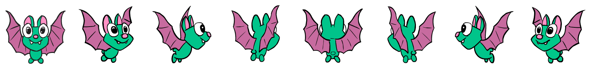

<%= partial('curriculum_header', :unittitle=> 'MSM', :lesson=> 10, :unplugged=>false, :title=> 'Play Lab: Design Recipe',:disclaimer=>'Basic lesson time includes activity only. Introductory and Wrap-Up suggestions can be used to delve deeper when time allows.', :time=>('30-60')) %>

[content]

[together]

## Lesson Overview

Moving on from the simple functions students created in Eval, students will use the Design Recipe to write functions that solve word problems.

[summary]

## Teaching Summary
### **Getting Started**
 
1) [Introduction](#GetStarted)  

### **Activity: Play Lab Design Recipe**  

2) [Online Puzzles](#Activity1)

[/summary]

## Lesson Objectives 
### Students will:

- Design functions to solve word problems
- Use the Design Recipe to write contracts, test cases, and function definitions

[/together]

[together]

# Teaching Guide

## Getting Started

###  1) Introduction

Functions are a key part of animation in computer programs. A function that draws a static picture of a bat, for example, can place the bat at a different location based on the input. When that input changes slightly based on time or user-interaction, the bat will appear to move. This is similar to the way that flip-book animations work, in which each page draws a static image that has changed by a small amount. When the pages are displayed quickly, the images appear to change smoothly.

Putting these images together, we arrive at an animation of the bat turning around.

[/together]

[together]

## Activity: Play Lab Design Recipe
###  2) Online Puzzles

In this stage you'll write functions that manipulate images to create animations. Head to [MSM stage 10](http://studio.code.org/s/msm/stage/10/puzzle/1) in Code Studio to get started programming.

[/together]

[standards]

## Connections and Background Information

[/standards]

[/content]

<link rel="stylesheet" type="text/css" href="../docs/morestyle.css"/>
